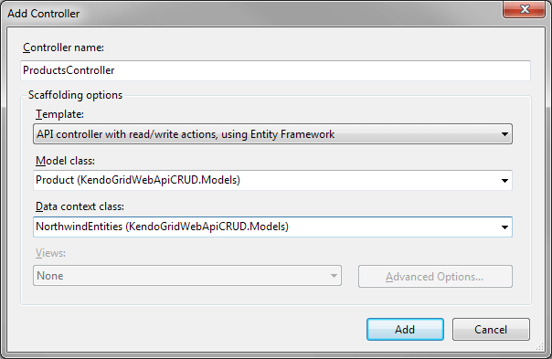
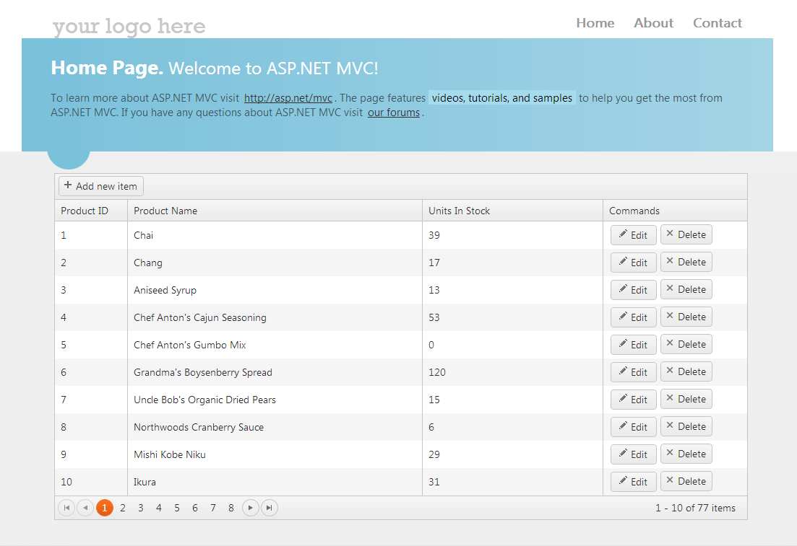

# WebAPI Editing

You can implement the CRUD (Create, Read, Update, Destroy) data operations and a [WebAPI](http://www.asp.net/web-api) controller for the Telerik UI Grid for {{ site.framework }}.

For runnable examples, refer to the [demos on editing of the Grid](https://demos.telerik.com/{{ site.platform }}/grid/webapi).

> Defining a Schema.Model.Id is mandatory for the proper execution of the Update, Create and Destroy of the Grid.


1. Create a new ASP.NET MVC 4 application. If you have installed the [Telerik UI for ASP.NET MVC Visual Studio Extensions](), create a Telerik UI for ASP.NET MVC Web application. Name the application `KendoGridWebApiCRUD`. If you decided not to use the Telerik UI for ASP.NET MVC Visual Studio Extensions, follow the steps from the [introductory article]() to add Telerik UI for ASP.NET MVC to the application.
1. Add a new `Entity Framework Data Model`. Right-click the `~/Models` folder in the solution explorer and pick **Add** > **New Item**. Choose **Data** > **ADO.NET Entity Data Model** in the **Add New Item** dialog. Name the model `Northwind.edmx` and click **Next**. This starts the **Entity Data Model Wizard**.

    

1. Select **Generate from database** and click **Next**. Configure a connection to the Northwind database. Click **Next**.
1. Select the **Products** table. Leave all other options as they are set by default. Click **Finish** to create the Entity Framework model.

    

1. Right click the `Controllers` folder in Visual Studio solution explorer. Select **Add** > **Controller**.
1. Set **ProductsController** as **Controller name**. Select **API controller with read/write actions, using Entity Framework** as **Template**. Select **Product (KendoGridWebApiCRUD.Models)** as **Model class** and **NorthwindEntities (KendoGridWebApiCRUD.Models)** as **Data context class**. Click **Add** to create the WebAPI controller.

    

1. Add a new class to the `~/Models` folder. The following example uses the `ProductViewModel` name.

        public class ProductViewModel
        {
            public int ProductID { get; set; }
            // The ProductName property is required.
            [Required]
            public string ProductName { get; set; }
            // Use the Integer editor template for the UnitsInStock property.
            [UIHint("Integer")]
            public short? UnitsInStock { get; set; }
        }


1. Open `Controllers/ProductsController.cs`.
1. Update the `Get` method as demonstrated by The following example.
        
        public DataSourceResult Get([System.Web.Http.ModelBinding.ModelBinder(typeof    (WebApiDataSourceRequestModelBinder))DataSourceRequest request)
        public DataSourceResult Get([DataSourceRequest]DataSourceRequest request)
        {
            return db.Products.ToDataSourceResult(request);
        }

1. Update the `Post` method as demonstrated in The following example.
        
        public HttpResponseMessage Post(Product product)
        {
            if (ModelState.IsValid)
            {
                db.Products.Add(product);
                db.SaveChanges();

                DataSourceResult result = new DataSourceResult
                {
                    Data = new[] { product },
                    Total = 1
                };
                HttpResponseMessage response = Request.CreateResponse(HttpStatusCode.Created, result);
                response.Headers.Location = new Uri(Url.Link("DefaultApi", new { id = product.ProductID }));
                return response;
            }
            else
            {
                return Request.CreateErrorResponse(HttpStatusCode.BadRequest, ModelState);
            }
        }
        [HttpPost]
        public IActionResult Post(ProductViewModel product)
        {
			if (!ModelState.IsValid)
			{
				return BadRequest(ModelState.Values.SelectMany(v => v.Errors).Select(error => error.ErrorMessage));
            }

			service.Create(product);

			return new ObjectResult(new DataSourceResult { Data = new[] { product }, Total = 1 });
		}

1. In the view, configure the Grid to use the Products WebAPI controller.
  
        @(Html.Kendo().Grid<KendoGridWebApiCRUD.Models.Product>()
            .Name("grid")
            .Columns(columns =>
            {
                columns.Bound(product => product.ProductID).Width(100);
                columns.Bound(product => product.ProductName);
                columns.Bound(product => product.UnitsInStock).Width(250);
                columns.Command(commands =>
                {
                    commands.Edit(); // The "edit" command will edit and update data items.
                    commands.Destroy(); // The "destroy" command removes data items.
                }).Title("Commands").Width(200);
            })
            .ToolBar(toolbar => toolbar.Create()) // The "create" command adds new data items.
            .Editable(editable => editable.Mode(GridEditMode.InLine)) // Use inline edit mode.
            .DataSource(dataSource => dataSource
                .WebApi()
                .Model(model =>
                {
                    model.Id(product => product.ProductID); // Specify the property which is the    unique identifier of the model.
                    model.Field(product => product.ProductID).Editable(false); // Make the  ProductID property not editable.
                })
                
                .Read(read => read.Url(Url.HttpRouteUrl("DefaultApi", new { controller = "Product" }    )))
                .Create(create => create.Url(Url.HttpRouteUrl("DefaultApi", new { controller =  "Product" })))
                .Update(update => update.Url(Url.HttpRouteUrl("DefaultApi", new { controller =  "Product", id = "{0}" })))
                .Destroy(destroy => destroy.Url(Url.HttpRouteUrl("DefaultApi", new { controller =   "Product", id = "{0}" })))
                
                .Read(read => read.Action("Get", "Product"))
	    		.Create(create => create.Action("Post", "Product"))
	    		.Update(update => update.Action("Put", "Product", new { id = "{0}"} ))
	    		.Destroy(destroy => destroy.Action("DELETE", "Product", new { id = "{0}" }))	
                
            )
            .Pageable()
        )

1. Build and run the application.

    
    
    

## See Also

* [Editing Approaches by the Grid HtmlHelper for ASP.NET MVC (Demos)](https://demos.telerik.com/{{ site.platform }}/grid/editing)
* [Server-Side API](/api/grid)
