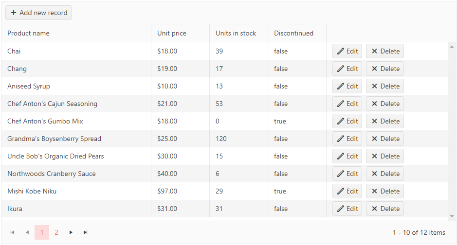

# Getting Started with the Grid

This tutorial explains how to set up the Telerik UI for {{ site.framework }} Grid and highlights the major steps in the configuration of the component.

After completing this guide, you will achieve the following results:

 

@[template](/_contentTemplates/core/getting-started-prerequisites.md#component-gs-prerequisites)

## 1. Prepare the CSHTML File

@[template](/_contentTemplates/core/getting-started-directives.md#gs-adding-directives)

Optionally, you can structure the document by adding the desired HTML elements like headings, divs, paragraphs, and others.

## 2. Declare the View Model

Declare the `ProductViewModel` view model.

```C#
public class ProductViewModel
{
    public int ProductID
    {
        get;
        set;
    }

    [Required]
    [DisplayName("Product name")]
    public string ProductName
    {
        get;
        set;
    }

    [DisplayName("Unit price")]
    [DataType(DataType.Currency)]
    [Range(0, int.MaxValue)]
    public decimal UnitPrice
    {
        get;
        set;
    }

    [DisplayName("Units in stock")]
    [DataType("Integer")]
    [Range(0, int.MaxValue)]
    public int UnitsInStock
    {
        get;
        set;
    }

    public bool Discontinued
    {
        get;
        set;
    }

    [DataType("Integer")]
    public int UnitsOnOrder
    {
        get;
        set;
    }
}
```

## 3. Initialize the Grid

Use the Grid HtmlHelper or TagHelper to add the component to a page and set some of its options.

* Use the `Name()` configuration method to assign a name to the instance of the helper&mdash;this is mandatory as its value is used for the id and the name attributes of the Grid element.
* Add the `DataSource()` configuration option and set the end points for the [CRUD operations]().  
* [Configure the columns]() of the Grid by binding them to the fields of the `ProductViewModel`.
* Enable additional features of the Grid, such as [paging](), [sorting](), and [scrolling]().

```HtmlHelper
@using Kendo.Mvc.UI

<p class="title">Products</p>
@(Html.Kendo().Grid<MyTelerikMvcApp.Models.ProductViewModel>()
	.Name("grid")
	.Columns(columns =>
	{
		columns.Bound(p => p.ProductName);
		columns.Bound(p => p.UnitPrice).Width(120);
		columns.Bound(p => p.UnitsInStock).Width(120);
		columns.Bound(p => p.Discontinued).Width(120);
		columns.Command(command => { command.Edit(); command.Destroy(); }).Width(250);
	})
	.ToolBar(toolbar => toolbar.Create())
	.Editable(editable => editable.Mode(GridEditMode.InLine))
	.Pageable()
	.Sortable()
	.Scrollable()
	.HtmlAttributes(new { style = "height:500px;" })
	.DataSource(dataSource => dataSource
		.Ajax()
		.PageSize(10)
		.Model(model => model.Id(p => p.ProductID))
		.Read(read => read.Action("Grid_Read", "Home"))
		.Create(update => update.Action("Grid_Create", "Home"))
		.Update(update => update.Action("Grid_Update", "Home"))
		.Destroy(update => update.Action("Grid_Destroy", "Home"))
	)
)
```

```TagHelper
@addTagHelper *, Kendo.Mvc

<p class="title">Products</p>
<kendo-grid name="grid" height="500">
	<datasource type="DataSourceTagHelperType.Ajax" page-size="10">
		<schema data="Data" total="Total">
			<model id="ProductID">
				<fields>
					<field name="ProductID" type="number" editable="false"></field>
					<field name="ProductName" type="string"></field>
					<field name="UnitPrice" type="number"></field>
					<field name="UnitsInStock" type="number"></field>
					<field name="Discontinued" type="boolean"></field>
				</fields>
			</model>
		</schema>
		<transport>
			<read url="@Url.Action("Grid_Read", "Home")" />
			<create url="@Url.Action("Grid_Create", "Home")" />
			<update url="@Url.Action("Grid_Update", "Home")" />
			<destroy url="@Url.Action("Grid_Destroy", "Home")" />
		</transport>
	</datasource>
	<columns>
		<column field="ProductName" />
		<column field="UnitPrice" width="120" />
		<column field="UnitsInStock" width="120" />
		<column field="Discontinued" width="120" />
		<column width="250">
			<commands>
				<column-command text="Edit" name="edit"></column-command>
				<column-command text="Delete" name="destroy"></column-command>
			</commands>
		</column>
	</columns>
	<toolbar>
		<toolbar-button name="create"></toolbar-button>
	</toolbar>
	<editable mode="inline" />
	<pageable enabled="true" />
	<sortable enabled="true" />
	<scrollable enabled="true" />
</kendo-grid>
```


## 4. Declare the CRUD Actions

In the `Home` controller, declare the CRUD actions. Use the names of the actions you set in the DataSource configuration in the previous step. 

```Controller
public ActionResult Index()
{
    return View();
}

private List<ProductViewModel> products = new List<ProductViewModel> {
    new ProductViewModel { ProductID = 1, ProductName = "Chai", UnitPrice = 18, UnitsInStock = 39, Discontinued = false },
    new ProductViewModel { ProductID = 2, ProductName = "Chang", UnitPrice = 19, UnitsInStock = 17, Discontinued = false },
    new ProductViewModel { ProductID = 3, ProductName = "Aniseed Syrup", UnitPrice = 10, UnitsInStock = 13, Discontinued = false },
    new ProductViewModel { ProductID = 4, ProductName = "Chef Anton's Cajun Seasoning", UnitPrice = 21, UnitsInStock = 53, Discontinued = false },
    new ProductViewModel { ProductID = 5, ProductName = "Chef Anton's Gumbo Mix", UnitPrice = 18, UnitsInStock = 0, Discontinued = true },
    new ProductViewModel { ProductID = 6, ProductName = "Grandma's Boysenberry Spread", UnitPrice = 25, UnitsInStock = 120, Discontinued = false },
    new ProductViewModel { ProductID = 7, ProductName = "Uncle Bob's Organic Dried Pears", UnitPrice = 30, UnitsInStock = 15, Discontinued = false },
    new ProductViewModel { ProductID = 8, ProductName = "Northwoods Cranberry Sauce", UnitPrice = 40, UnitsInStock = 6, Discontinued = false },
    new ProductViewModel { ProductID = 9, ProductName = "Mishi Kobe Niku", UnitPrice = 97, UnitsInStock = 29, Discontinued = true },
    new ProductViewModel { ProductID = 10, ProductName = "Ikura", UnitPrice = 31, UnitsInStock = 31, Discontinued = false },
    new ProductViewModel { ProductID = 11, ProductName = "Queso Cabrales", UnitPrice = 21, UnitsInStock = 22, Discontinued = false },
    new ProductViewModel { ProductID = 12, ProductName = "Queso Manchego La Pastora", UnitPrice = 38, UnitsInStock = 86, Discontinued = false },
};

public JsonResult Grid_Read([DataSourceRequest] DataSourceRequest request)
{
    return Json(products.ToDataSourceResult(request));
}

public virtual JsonResult Grid_Destroy([DataSourceRequest] DataSourceRequest request, ProductViewModel product)
{
    if (ModelState.IsValid)
    {
        products.Remove(products.Where(x => x.ProductID == product.ProductID).FirstOrDefault());
    }

    return Json(new[] { product }.ToDataSourceResult(request, ModelState));
}

public virtual JsonResult Grid_Create([DataSourceRequest] DataSourceRequest request, ProductViewModel product)
{
    if (ModelState.IsValid)
    {
        product.ProductID = ++products.LastOrDefault().ProductID;
        products.Add(product);
    }

    return Json(new[] { product }.ToDataSourceResult(request, ModelState));
}

public virtual JsonResult Grid_Update([DataSourceRequest] DataSourceRequest request, ProductViewModel product)
{
    if (ModelState.IsValid)
    {
        var productToUpdate = products.Where(x => x.ProductID == product.ProductID).FirstOrDefault();
        if (productToUpdate != null)
        {
            productToUpdate = product;
        }
    }

    return Json(new[] { product }.ToDataSourceResult(request, ModelState));
}
```

## 5. Handle a Grid Event

The Grid exposes different client-side events that you can handle and use to customize the component's functions. In this tutorial, you will use the `Edit` event to apply custom background color to the edited record. Attach a handler in the declaration of the Grid and declare the `onEdit` JavaScript function.

```HtmlHelper
@using Kendo.Mvc.UI

<p class="title">Products</p>
@(Html.Kendo().Grid<MyTelerikMvcApp.Models.ProductViewModel>()
	.Name("grid")
	.Columns(columns =>
	{
		columns.Bound(p => p.ProductName);
		columns.Bound(p => p.UnitPrice).Width(120);
		columns.Bound(p => p.UnitsInStock).Width(120);
		columns.Bound(p => p.Discontinued).Width(120);
		columns.Command(command => { command.Edit(); command.Destroy(); }).Width(250);
	})
	.ToolBar(toolbar => toolbar.Create())
	.Editable(editable => editable.Mode(GridEditMode.InLine))
	.Pageable()
	.Sortable()
	.Scrollable()
	.HtmlAttributes(new { style = "height:500px;" })
	.Events(events => events
		.Edit("onEdit")
	)
	.DataSource(dataSource => dataSource
		.Ajax()
		.PageSize(10)
		.Model(model => model.Id(p => p.ProductID))
		.Read(read => read.Action("Grid_Read", "Home"))
		.Create(update => update.Action("Grid_Create", "Home"))
		.Update(update => update.Action("Grid_Update", "Home"))
		.Destroy(update => update.Action("Grid_Destroy", "Home"))
	)
)

<script>	
	function onEdit(e) {
		var container = e.container;
		container.css("background-color", "#90EE90");
	}
</script>
```

```TagHelper
@addTagHelper *, Kendo.Mvc

<p class="title">Products</p>
<kendo-grid name="grid" height="500" on-edit="onEdit">
	<datasource type="DataSourceTagHelperType.Ajax" page-size="10">
		<schema data="Data" total="Total">
			<model id="ProductID">
				<fields>
					<field name="ProductID" type="number" editable="false"></field>
					<field name="ProductName" type="string"></field>
					<field name="UnitPrice" type="number"></field>
					<field name="UnitsInStock" type="number"></field>
					<field name="Discontinued" type="boolean"></field>
				</fields>
			</model>
		</schema>
		<transport>
			<read url="@Url.Action("Grid_Read", "Home")" />
			<create url="@Url.Action("Grid_Create", "Home")" />
			<update url="@Url.Action("Grid_Update", "Home")" />
			<destroy url="@Url.Action("Grid_Destroy", "Home")" />
		</transport>
	</datasource>
	<columns>
		<column field="ProductName" />
		<column field="UnitPrice" width="120" />
		<column field="UnitsInStock" width="120" />
		<column field="Discontinued" width="120" />
		<column width="250">
			<commands>
				<column-command text="Edit" name="edit"></column-command>
				<column-command text="Delete" name="destroy"></column-command>
			</commands>
		</column>
	</columns>
	<toolbar>
		<toolbar-button name="create"></toolbar-button>
	</toolbar>
	<editable mode="inline" />
	<pageable enabled="true" />
	<sortable enabled="true" />
	<scrollable enabled="true" />
</kendo-grid>

<script>	
	function onEdit(e) {
		var container = e.container;
		container.css("background-color", "#90EE90");
	}
</script>
```


## (Optional) Reference Existing Grid Instances

Referencing existing instances allows you to build on top of their configuration. To reference an existing Grid instance, use the [`jQuery.data()`](http://api.jquery.com/jQuery.data/) method:

1. Use the `id` attribute of the component instance to establish a reference.

    ```script
    <script>
        var gridReference = $("#grid").data("kendoGrid"); // gridReference is a reference to the existing instance of the helper.
    </script>
    ```

1. Use the [Grid client-side API](https://docs.telerik.com/kendo-ui/api/javascript/ui/grid#methods) to control the behavior of the widget. In this example, you will hide one of the Grid columns by using `hideColumn` method.

    ```script
    <script>
        var gridReference = $("#grid").data("kendoGrid"); // gridReference is a reference to the existing instance of the helper.
        gridReference.hideColumn("ProductID"); // Hide a column by using its field name.
    </script>
    ```

For more information on referencing specific helper instances, see the [Methods and Events]() article.

## Next Steps

* [Customizing the Appearance of the Grid]()
* [Binding the Grid to Data]()
* [Implementing Editing in the Grid]()

## See Also

* [Using the API of the Grid for {{ site.framework }} (Demo)](https://demos.telerik.com/{{ site.platform }}/grid/api)
* [Grid client-side API](https://docs.telerik.com/kendo-ui/api/javascript/ui/grid)
* [Grid server-side API](/api/grid)
* [Knowledge Base Section](/knowledge-base)
