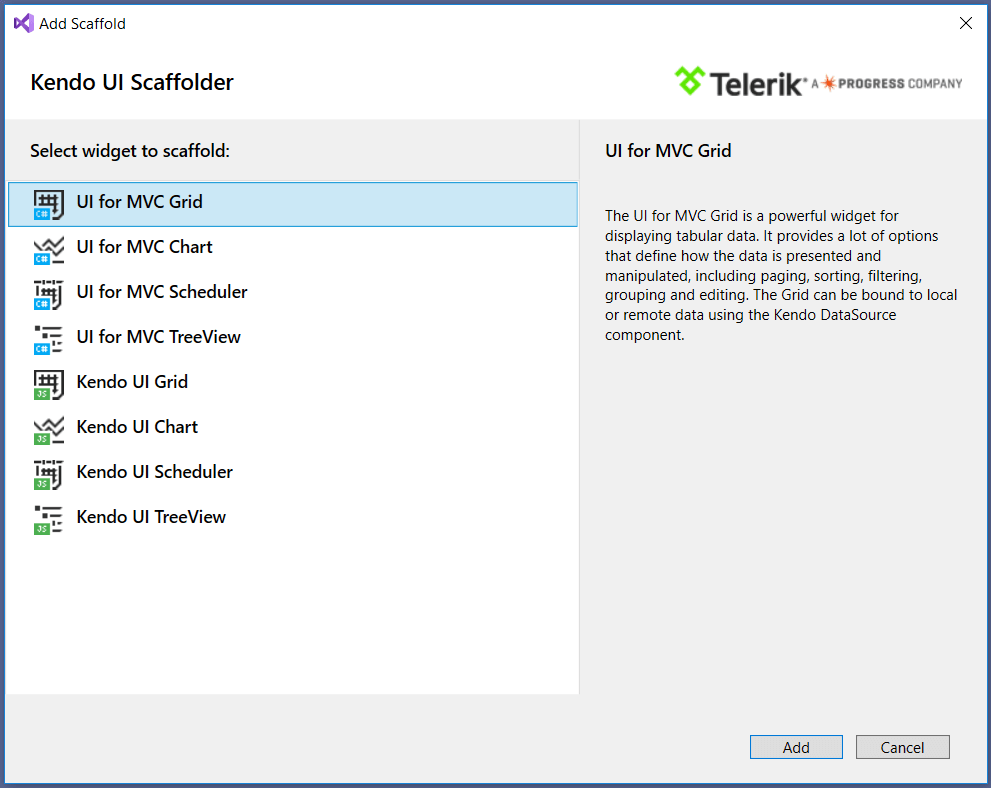

# Scaffolding

The Grid HtmlHelper for ASP.NET MVC enables you to use the Kendo UI Scaffolder Visual Studio extension.

> The Kendo UI Scaffolder will not include the required UI for ASP.NET MVC files to the project. To automatically achieve this, use the [Telerik UI for ASP.NET MVC Visual Studio Extensions](). To manually achieve this, refer to [this article]().

To scaffold the Grid HtmlHelper for ASP.NET MVC:

1. Create a new ASP.NET MVC application, include an Entity Framework Data Model and add Telerik UI for ASP.NET MVC. If you have already done so, move on to the next step. Otherwise, follow the first four steps described [in this article]().
1. Right-click the location where the Grid Controller should be generated. Select **Add** > **New Scaffolded item...** from the displayed menu. In this example, you generate it in the **Controllers** folder.

	

1. Select **Kendo UI Scaffolder** from the list of available scaffolders.

	

1. On the next screen, you are presented with the **Model** and **Data Context** options. Enter the **Controller** and **View** names.

	

	The **Model Class** DropDownList contains all model types from the active project. In this example, you list products in the Grid. Select the **Product** entity.

	

	From the **Data Context Class** DropDownList, select the **Entity Framework Data Model** class to be used. In this example it is **NorthwindEntities**.

	

1. (Optional) In some scenarios it is convenient to use view model objects instead of the entities returned by the Entity Framework. If this is the case, check the **Use an existing ViewModel** checkbox. It displays a drop-down list similar to the first one from which you can select the ViewModel that will be used.

	If you have not created it yet, add a new class to the `~/Models` folder. Name it `ProductViewModel`.

        public class ProductViewModel
        {
            public int ProductID { get; set; }
            public string ProductName { get; set; }
            public short? UnitsInStock { get; set; }
        }

	Select the **ProductViewModel** class from the **ViewModel Class** drop-down list.

	

	> The names of the properties in the ViewModel must be exactly the same as the corresponding ones in the Entity. Otherwise, the Kendo UI Scaffolder is not able to link them correctly.

1. Click the **Grid options** item on the left.

	

	This screen contains the Grid functionalities that can be configured before scaffolding:

	* `DataSource Type`&mdash;Ajax, Server, or WebApi.
	* `Editable`&mdash;Enable the editing, configure the edit mode&mdash;`InLine`, `InCell`, or `PopUp`&mdash;and the operations that will be included&mdash;`Create`, `Update`, `Destroy`.

	  

	* `Filterable`&mdash;Enable the filtering of the Grid and select the filter mode.

	  

	* `Column Menu`&mdash;Enable the column menu.
	* `Navigatable`&mdash;Enable the keyboard navigation.
	* `Pageable`&mdash;Enable the paging of the Grid.
	* `Reorderable`&mdash;Enable the column reordering.
	* `Scrollable`&mdash;Enable the scrolling of the Grid table.
	* `Selectable`&mdash;Enable the selection and specify the selection mode and type.

	  

	* `Sortable`&mdash;Enable the sorting and specify the sorting mode.

	  

	* `Excel Export`&mdash;Enable the Excel export functionality.
	* `PDF Export`&mdash;Enable the PDF export functionality.

1. Click the **Events** item on the left.

	

	From this screen, you can select the Grid events to which you want to attach handlers.

	> Not all events are supported in the server-binding mode. To see the complete list, refer to [this article](#supported-client-side-events).

1. When finished with the Grid configuration, click **Add** at the bottom. The Grid Controller and the corresponding View are now generated.

## See Also

* [Basic Usage of the Grid HtmlHelper for ASP.NET MVC (Demo)](https://demos.telerik.com/aspnet-mvc/grid)
* [Using the API of the Grid HtmlHelper for ASP.NET MVC (Demo)](https://demos.telerik.com/aspnet-mvc/grid/api)
* [Server-Side API](/api/grid)
