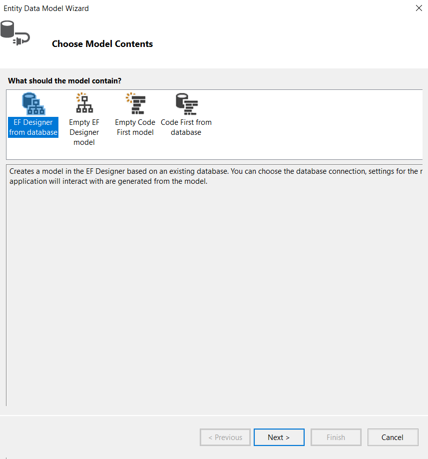
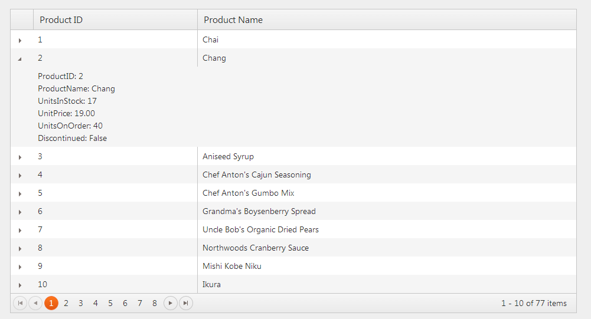
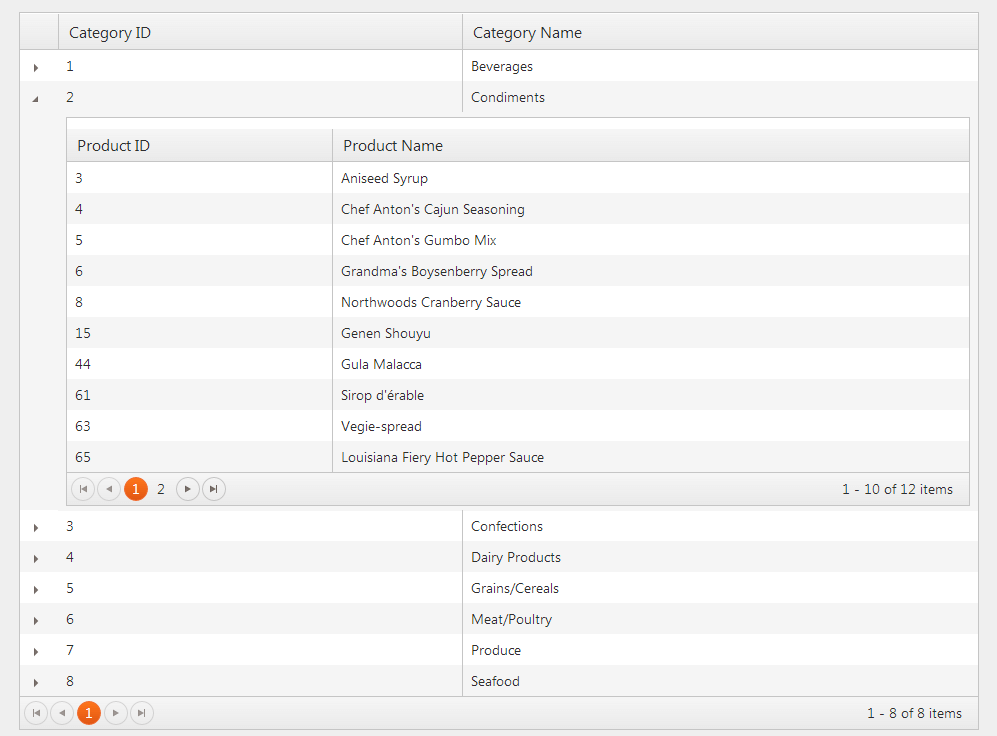

# Client Detail Templates

The Telerik UI Grid for {{ site.framework }} enables you to show additional information for a data item by setting the detail template of the Grid.

For a runnable example, refer to the [demo on detail templates in the Grid](https://demos.telerik.com/{{ site.platform }}/grid/detailtemplate).

To configure the client detail template:

1. [Define the client details](#defining-the-client-details)
1. [Set the client hierarchy](#setting-the-client-hierarchy)

## Defining the Client Details

To configure the Grid for {{ site.framework }} to display additional details of the **Product** entity from the **Northwind** database:


1. Create a new ASP.NET MVC application. If you have installed the [Telerik UI for ASP.NET MVC Visual Studio Extensions](), create a Telerik UI for ASP.NET MVC application. Name the application `KendoGridClientDetailTemplate`. If you decided not to use the Telerik UI for ASP.NET MVC Visual Studio Extensions, follow the steps from the [introductory article]() to add Telerik UI for ASP.NET MVC to the application.
1. Add a new `Entity Framework Data Model`. Right-click the `~/Models` folder in the solution explorer and pick **Add** > **New Item**. Choose **Data** > **ADO.NET Entity Data Model** in the **Add New Item** dialog. Name the model `Northwind.edmx` and click **Next**. This starts the **Entity Data Model Wizard**.

    

1. Select **Generate from database** and click **Next**. Configure a connection to the **Northwind** database. Click **Next**.

    

1. Choose the **Products** table from the **Which database objects do you want to include in your model?**. Leave all other options as they are set by default. Click **Finish**.

    


1. Open `HomeController.cs` and add a new action method which will return the Products as JSON. The Grid makes Ajax requests to this action.

        public ActionResult Products_Read()
        {
        }

1. Add a new parameter of type `DataSourceRequest` to the action. This parameter will contain the current Grid request information&mdash;page, sort, group, and filter. Decorate that parameter with the `DataSourceRequestAttribute`. This attribute will populate the `DataSourceRequest` object from the posted data.

        public ActionResult Products_Read([DataSourceRequest]DataSourceRequest request)
        {
        }

1. Use the `ToDataSourceResult` extension method to convert the Products to a `DataSourceResult` object. That extension method will page, filter, sort, or group your data using the information provided by the `DataSourceRequest` object.

        public ActionResult Products_Read([DataSourceRequest]DataSourceRequest request)
        {
            using (var northwind = new NorthwindEntities())
            {
                IQueryable<Product> products = northwind.Products;
                DataSourceResult result = products.ToDataSourceResult(request);
            }
        }

1. Return the `DataSourceResult` as JSON. Configure the Grid for Ajax binding.

        public ActionResult Products_Read([DataSourceRequest]DataSourceRequest request)
        {
            using (var northwind = new NorthwindEntities())
            {
                IQueryable<Product> products = northwind.Products;
                DataSourceResult result = products.ToDataSourceResult(request);
                return Json(result);
            }
        }

1. In the view, configure the Grid to use the action method created in the previous steps.

        @(Html.Kendo().Grid<KendoGridClientDetailTemplate.Models.Product>()
              .Name("grid")
              .DataSource(dataSource => dataSource
                  .Ajax()
                  .Read(read => read.Action("Products_Read", "Home"))
               )
              .Columns(columns =>
              {
                  columns.Bound(product => product.ProductID);
                  columns.Bound(product => product.ProductName);
              })
              .Pageable()
        )

1. Define the client template using the [Kendo UI for jQuery template](https://docs.telerik.com/kendo-ui/framework/templates/overview) syntax. The context of the template is the data item&mdash;Product entity&mdash;to which the current Grid row is bound.

    > Each `#` symbol that is not part of a template expression&mdash;`#: #`, `# #` or `#= #`&mdash;must be escaped&mdash;`\\#`.

        

1. Specify the `id` of the template by using the `ClientDetailTemplateId` method.

        @(Html.Kendo().Grid<KendoGridClientDetailTemplate.Models.Product>()
              .Name("grid")
              .DataSource(dataSource => dataSource
                  .Ajax()
                  .Read(read => read.Action("Products_Read", "Home"))
               )
              .Columns(columns =>
              {
                  columns.Bound(product => product.ProductID);
                  columns.Bound(product => product.ProductName);
              })
              .Pageable()
              .ClientDetailTemplateId("client-template")
        )

1. Build and run the project.

To download the Visual Studio Project, refer to [this GitHub repository](https://github.com/telerik/ui-for-aspnet-mvc-examples/tree/master/grid/client-detail-template).


## Setting the Client Hierarchy

To configure the Grid for {{ site.framework }} to display all **Product** entities that are available per the **Category** entity from the **Northwind** database:


1. Create a new ASP.NET MVC application. If you have installed the [Telerik UI for ASP.NET MVC Visual Studio Extensions](), create a Telerik UI for ASP.NET MVC application. Name the application `KendoGridClientHierarchy`. If you decided not to use the Telerik UI for ASP.NET MVC Visual Studio Extensions, follow the steps from the [introductory article]() to add Telerik UI for ASP.NET MVC to the application.
1. Add a new `Entity Framework Data Model`. Right-click the `~/Models` folder in the solution explorer and pick **Add** > **New Item**. Choose **Data** > **ADO.NET Entity Data Model** in the **Add New Item** dialog. Name the model `Northwind.edmx` and click **Next**. This starts the **Entity Data Model Wizard**.

    

1.  Select **Generate from database** and click **Next**. Configure a connection to the **Northwind** database. Click **Next**.

    

1. Choose the **Products** and **Categories** tables from **Which database objects do you want to include in your model?**. Leave all other options as they are set by default. Click **Finish**.


1. Open `HomeController.cs` and add a new action method which will return the **Category** entities as JSON. The Grid makes Ajax requests to this action.

        public ActionResult Categories_Read()
        {
        }

1. Add a new parameter of type `DataSourceRequest` to the action. This parameter will contain the current grid request information - page, sort, group and filter. Decorate that parameter with the `DataSourceRequestAttribute`. That attribute will populate the `DataSourceRequest` object from the posted data.

        public ActionResult Categories_Read([DataSourceRequest]DataSourceRequest request)
        {
        }

1. Use the `ToDataSourceResult` extension method to convert the Categories to a `DataSourceResult` object. That extension method will page, filter, sort, or group your data using the information provided by the `DataSourceRequest` object.

        public ActionResult Categories_Read([DataSourceRequest]DataSourceRequest request)
        {
            using (var northwind = new NorthwindEntities())
            {
                IQueryable<Category> categories = northwind.Categories;
                // Flatten the Category to avoid circular references during JSON serialization.
                DataSourceResult result = categories.ToDataSourceResult(request, category => new {
                    category.CategoryID,
                    category.CategoryName
                });
            }
        }

1.  Return the `DataSourceResult` as JSON. Now let's configure the Grid for AJAX binding.

        public ActionResult Categories_Read([DataSourceRequest]DataSourceRequest request)
        {
            using (var northwind = new NorthwindEntities())
            {
                IQueryable<Category> categories = northwind.Categories;
                // Flatten the Category to avoid circular references during JSON serialization.
                DataSourceResult result = categories.ToDataSourceResult(request, category => new {
                    category.CategoryID,
                    category.CategoryName
                });
                return Json(result);
            }
        }

1. Open `HomeController.cs` and add a new action method which will return the **Product** entities for a given category as JSON. The child Grid makes Ajax requests to this action.

        public ActionResult Products_Read([DataSourceRequest]DataSourceRequest request, int categoryId)
        {
            using (var northwind = new NorthwindEntities())
            {
                IQueryable<Product> products = northwind.Products.Where(product => product.CategoryID == categoryId);
                // Flatten the Product to avoid circular references during JSON serialization
                DataSourceResult result = products.ToDataSourceResult(request, product => new {
                    product.ProductID,
                    product.ProductName
                });
                return Json(result);
            }
        }

1. In the view, configure the Grid for Ajax binding to `Categories_Read`.

        @(Html.Kendo().Grid<KendoGridClientHierarchy.Models.Category>()
              .Name("grid")
              .Columns(columns =>
              {
                  columns.Bound(category => category.CategoryID);
                  columns.Bound(category => category.CategoryName);
              })
              .DataSource(dataSource =>
                dataSource.Ajax().Read(read => read.Action("Categories_Read", "Home"))
              )
        )

1. Define the client template using [Kendo UI Template](https://docs.telerik.com/kendo-ui/framework/templates/overview) syntax. The context of the template is the **Category** entity to which the current Grid row is bound. The template itself contains another Grid which is bound to the `Products_Read` action.

    > * Always call the `ToClientTemplate` method when using {{ site.product }} helpers in a client template.
    > * Escape the `#` characters used for a template expression when using a column `ClientTemplate` in a detail template, so that the expression is evaluated in the correct context.

        

1. Specify the `id` of the template using the `ClientDetailTemplateId` method.

        @(Html.Kendo().Grid<KendoGridClientHierarchy.Models.Category>()
              .Name("grid")
              .Columns(columns =>
              {
                  columns.Bound(category => category.CategoryID);
                  columns.Bound(category => category.CategoryName);
              })
              .DataSource(dataSource =>
                  dataSource.Ajax().Read(read => read.Action("Categories_Read", "Home"))
              )
              .ClientDetailTemplateId("client-template")
        )

1. Build and run the project.

    

To download the Visual Studio Project, refer to [this GitHub repository]((https://github.com/telerik/ui-for-aspnet-mvc-examples/tree/master/grid/client-hierarchy).


## Handling Nested Client Templates

Nesting client templates are not an out-of-the-box feature the Kendo UI Core wrappers support. For more information on this issue, check the Grid troubleshooting section in [invalid template errors when nesting client templates](https://docs.telerik.com/aspnet-mvc/helpers/grid/troubleshoot/known-exceptions#invalid-template-error-when-nesting-client-templates).

## See Also

* [Client Detail Templates by the Grid HtmlHelper for {{ site.framework }} (Demo)](https://demos.telerik.com/{{ site.platform }}/grid/detailtemplate)
* [Server-Side API](/api/grid)
