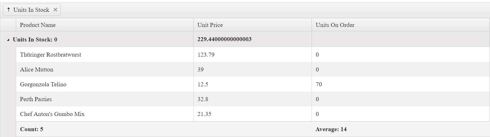

# Group Templates

Group rows help organize data rows into a tree structure when data grouping is applied.

For runnable examples, refer to the [demos on templates in the Grid](https://demos.telerik.com/{{ site.platform }}/grid/toolbar-template).

A group row contains an expanding and collapsing group icon that enables end-users to expand and collapse a group row, and thus show or hide its child rows. One of the main features of group rows is to display group summary values. The Grid provides three different templates that can be used to customize the appearance of the group rows:

- `ClientGroupHeaderTemplate`&mdash;Renders a template that will be displayed for the entire group row. Usually the main objective is to show an information about the entire group. By default if no template is defined the name of the field and the current group value is displayed.
- `ClientGroupHeaderColumnTemplate`&mdash;Renders a template in the group row aligned to the column itself. Usually it is used to show an aggregate value for a specific column in the context of the current group. Visually the template content is displayed aligned to the column itself. This functionality is introduced in R3 2018 release.
- `ClientGroupFooterTemplate`&mdash;Renders a template in the group footer row aligned to the column. Pretty much it works in the same way as the `ClientGroupHeaderColumnTemplate` for the group footer row.

If no template is defined, the name of the field and the current group are displayed in the following way.


The only difference in the use of `ClientGroupHeaderTemplate` is that the template content is compiled and displayed instead of the field and current group value.

Both `ClientGroupHeaderColumnTemplate` and `ClientGroupFooterTemplate` work in a similar way. `ClientGroupHeaderColumnTemplate` displays the content as aligned to the column in the group row. `ClientGroupFooterTemplate` displays the content as aligned to the column in the group footer row. Their content is displayed as aligned to the column as shown in the following way.



Due to the fact that `ClientGroupHeaderTemplate` is displayed next to the expanding icon of the group row, it takes precedence over the `ClientGroupHeaderColumnTemplate` of the first visible column. If you want to show the `ClientGroupHeaderColumnTemplate` content for the first column of the Grid, do not set the `ClientGroupHeaderTemplate` for the group column. The following Grid configuration shows that commenting the `ClientGroupHeaderTemplate` for the **Units In Stock** column shows the `ClientGroupHeaderColumnTemplate` for the **Product Name** column.

```
@(Html.Kendo().Grid<Kendo.Mvc.Examples.Models.ProductViewModel>()
    .Name("Grid")
    .Columns(columns =>
    {
        columns.Bound(p => p.ProductName)
            .ClientGroupHeaderColumnTemplate("Count: #=count#");
        columns.Bound(p => p.UnitPrice).Format("{0:C}");
        columns.Bound(p => p.UnitsOnOrder);
        columns.Bound(p => p.UnitsInStock);
            //.ClientGroupHeaderTemplate("Min: #= min #");
    })
    .Pageable()
    .Sortable()
    .DataSource(dataSource => dataSource
        .Ajax()
        .Aggregates(aggregates =>
        {
            aggregates.Add(p => p.UnitsInStock).Min();
            aggregates.Add(p => p.ProductName).Count();
        })
        .Group(groups => groups.Add(p => p.UnitsInStock))
        .Read(read => read.Action("Aggregates_Read", "Grid"))
    )
)
```


In a server-binding scenario, you can set the group templates without the `Client` prefix&mdash;`GroupHeaderTemplate`, `GroupHeaderColumnTemplate`, and `GroupFooterTemplate`. For more information, refer to the demo on [server aggregates of the Grid](https://demos.telerik.com/aspnet-mvc/grid/serveraggregates).

## Limitations

Тhe Grid for Core is not rendered on the server. Therefore, it is not possible to define server-side templates which makes the usage of `.ServerOperations(true)` in this case incompatible.


## See Also

* [Templates by the Grid HtmlHelper for {{ site.framework }} (Demos)](https://demos.telerik.com/{{ site.platform }}/grid/toolbar-template)
* [Server-Side API](/api/grid)
