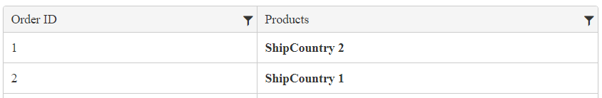

# Row Templates

The Kendo UI Grid supports row templates which enable you to place custom content into a Grid row.

For runnable examples, refer to:
* [Demo on using the row template of the Grid HtmlHelper for {{ site.framework }}](https://demos.telerik.com/{{ site.platform }}/grid/rowtemplate)
* [Demo on using the detail-row template of the Grid HtmlHelper for {{ site.framework }}](https://demos.telerik.com/{{ site.platform }}/grid/detailtemplate)
* [Demo on using the toolbar template of the Grid HtmlHelper for {{ site.framework }}](https://demos.telerik.com/{{ site.platform }}/grid/toolbar-template)

The following example demonstrates how to use a string row template which generates two columns. The outermost HTML element in the template must be a table row (`<tr>`). That table row must have the `uid` data attribute set to `#= uid #`. The grid uses the `uid` data attribute to determine the data to which a table row is bound to.

        .ClientRowTemplate("<tr data-uid='#=data.uid#'>" +
            "<td>#=data.OrderID#</td>" +
            "<td><strong>#=ShipCountry #</strong></td>" +
        "</tr>")

## See Also

* [Using Row Templates in the Grid HtmlHelper for {{ site.framework }} (Demo)](https://demos.telerik.com/{{ site.platform }}/grid/rowtemplate)
* [Using Detail-Row Templates in the Grid HtmlHelper for {{ site.framework }} (Demo)](https://demos.telerik.com/{{ site.platform }}/grid/detailtemplate)
* [Using Toolbar Templates in the Grid HtmlHelper for {{ site.framework }} (Demo)](https://demos.telerik.com/{{ site.platform }}/grid/toolbar-template)
* [Server-Side API](/api/grid)
