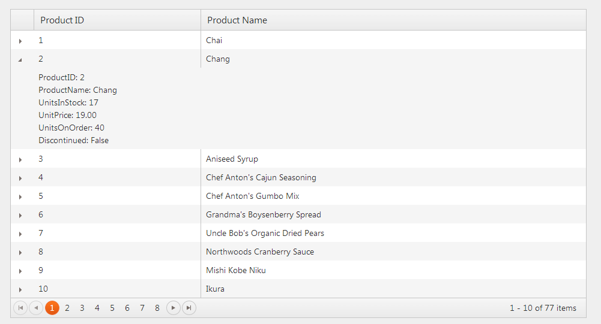
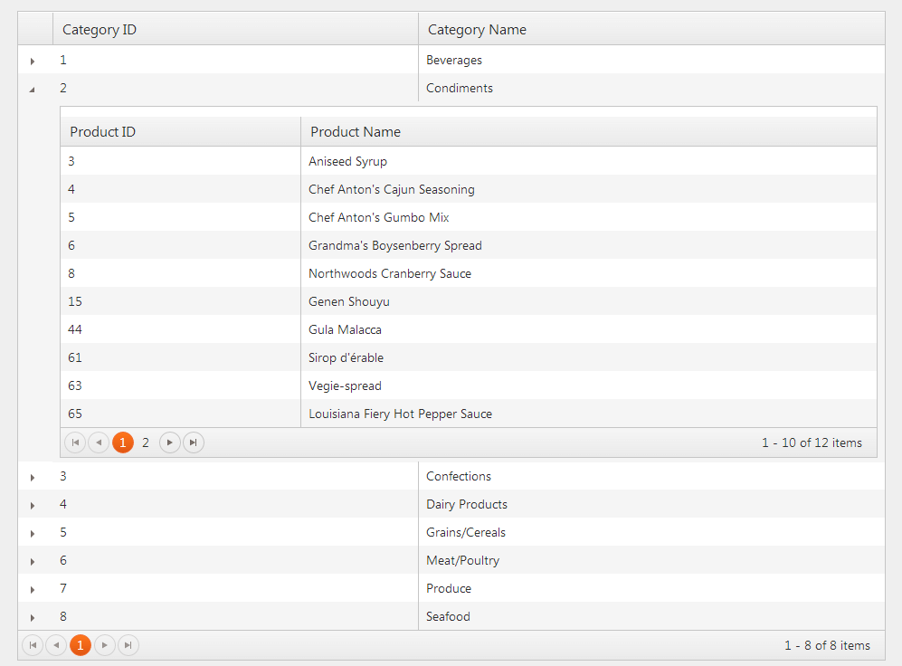

# Server Detail Templates

The Telerik UI Grid for ASP.NET MVC enables you to set the detail template that is used during the server binding of the Grid.

For a runnable example, refer to the [demo on the server detail template in the Grid](https://demos.telerik.com/aspnet-mvc/grid/serverdetails).

To configure the server detail template:

1. [Define the server details](#defining-the-server-details)
1. [Set the server hierarchy](#setting-the-server-hierarchy)

## Defining the Server Details

1. Create a new ASP.NET MVC 5 application. If you have installed the [Telerik UI for ASP.NET MVC Visual Studio Extensions](), create a Telerik UI for ASP.NET MVC application. Name the application `KendoGridServerDetailTemplate`. If you decided not to use the Telerik UI for ASP.NET MVC Visual Studio Extensions, follow the steps from the [First Steps article]() to add Telerik UI for ASP.NET MVC to the application.
1. Add a new `Entity Framework Data Model`. Right-click the `~/Models` folder in the solution explorer and pick **Add** > **New Item**. Choose **Data** > **ADO.NET Entity Data Model** in the **Add New Item** dialog. Name the model `Northwind.edmx` and click **Next**. This starts the **Entity Data Model Wizard**.

    

1. Select **Generate from database** and click **Next**. Configure a connection to the **Northwind** database. Click **Next**.

    

1. Choose the **Products** table from **Which database objects do you want to include in your model?**. Leave all other options as they are set by default. Click **Finish**.

    

1. Open `HomeController.cs` and edit the `Index` action method.

        public ActionResult Index()
        {
            var northwind = new NorthwindEntities();
            ViewBag.Products = northwind.Products;
            return View();
        }

1. In the view, configure the Grid for server binding to `ViewBag.Products`.

    ```ASPX
        <% Html.Kendo().Grid((IEnumerable<KendoGridServerDetailTemplate.Models.Product>)ViewBag.Products)
            .Name("grid")
            .Columns(columns =>
            {
                columns.Bound(product => product.ProductID);
                columns.Bound(product => product.ProductName);
            })
            .Render();
        %>
    ```
    ```Razor
        @(Html.Kendo().Grid((IEnumerable<KendoGridServerDetailTemplate.Models.Product>)ViewBag.Products)
            .Name("grid")
            .Columns(columns =>
            {
                columns.Bound(product => product.ProductID);
                columns.Bound(product => product.ProductName);
            })
        )
    ```

1. Set the detail template.

    ```ASPX
        <%: Html.Kendo().Grid((IEnumerable<KendoGridServerDetailTemplate.Models.Product>)ViewBag.Products)
            .Name("grid")
            .Columns(columns =>
            {
                columns.Bound(product => product.ProductID);
                columns.Bound(product => product.ProductName);
            })
            .Pageable()
            .DetailTemplate(product => {
            %>
                <div>ProductID: <%: product.ProductID %></div>
                <div>ProductName: <%: product.ProductName %></div>
                <div>UnitsInStock: <%: product.UnitsInStock %></div>
                <div>UnitPrice: <%: product.UnitPrice %></div>
                <div>UnitsOnOrder: <%: product.UnitsOnOrder %></div>
                <div>Discontinued: <%: product.Discontinued %></div>
            <%
            })
            .Render();
        %>
    ```
    ```Razor
        @(Html.Kendo().Grid((IEnumerable<KendoGridServerDetailTemplate.Models.Product>)ViewBag.Products)
            .Name("grid")
            .Columns(columns =>
            {
                columns.Bound(product => product.ProductID);
                columns.Bound(product => product.ProductName);
            })
            .Pageable()
            .DetailTemplate(@<text>
                <div>ProductID: @item.ProductID</div>
                <div>ProductName: @item.ProductName</div>
                <div>UnitsInStock: @item.UnitsInStock</div>
                <div>UnitPrice: @item.UnitPrice</div>
                <div>UnitsOnOrder: @item.UnitsOnOrder</div>
                <div>Discontinued: @item.Discontinued</div>
            </text>)
        )
    ```

1. Build and run the project.

    

To download the Visual Studio Project, refer to [this GitHub repository](https://github.com/telerik/ui-for-aspnet-mvc-examples/tree/master/grid/server-detail-template).

## Setting the Server Hierarchy

1. Create a new ASP.NET MVC 5 application. If you have installed the [Telerik UI for ASP.NET MVC Visual Studio Extensions](), create a Telerik UI for ASP.NET MVC application. Name the application `KendoGridServerDetailTemplate`. If you decided not to use the Telerik UI for ASP.NET MVC Visual Studio Extensions, follow the steps from the [First Steps article]() to add Telerik UI for ASP.NET MVC to the application.
1. Add a new `Entity Framework Data Model`. Right-click the `~/Models` folder in the solution explorer and pick **Add** > **New Item**. Choose **Data** > **ADO.NET Entity Data Model** in the **Add New Item** dialog. Name the model `Northwind.edmx` and click **Next**. This starts the **Entity Data Model Wizard**.

    

1. Select **Generate from database** and click **Next**. Configure a connection to the **Northwind** database. Click **Next**.

    

1. Choose the **Products** and **Categories** tables from the **Which database objects do you want to include in your model?**. Leave all other options as they are set by default. Click **Finish**.
1. Open `HomeController.cs` and edit the `Index` action method.

        public ActionResult Index()
        {
            var northwind = new NorthwindEntities();
            ViewBag.Categories = northwind.Categories;
            return View();
        }

1. In the view, configure the Grid for server binding to `ViewBag.Categories`.

    ```ASPX
        <% Html.Kendo().Grid((IEnumerable<KendoGridServerHierarchy.Models.Category>)ViewBag.Categories)
            .Name("grid")
            .Columns(columns =>
            {
                columns.Bound(category => category.CategoryID);
                columns.Bound(category => category.CategoryName);
            })
            .Render();
        %>
    ```
    ```Razor
        @(Html.Kendo().Grid((IEnumerable<KendoGridServerHierarchy.Models.Category>)ViewBag.Categories)
            .Name("grid")
            .Columns(columns =>
            {
                columns.Bound(category => category.CategoryID);
                columns.Bound(category => category.CategoryName);
            })
        )
    ```

1. Set the detail template. Define another Grid which is bound to the `Products` property of the category entity. Make sure the name of the Grid is unique.

    ```ASPX
        <% Html.Kendo().Grid((IEnumerable<KendoGridServerHierarchy.Models.Category>)ViewBag.Categories)
            .Name("grid")
            .Columns(columns =>
            {
                columns.Bound(category => category.CategoryID);
                columns.Bound(category => category.CategoryName);
            })
            .DetailTemplate(category => {
            %>
                <% Html.Kendo().Grid(item.Products)
                    .Name(string.Format("product_grid_{0}", item.CategoryID)) // The Name() should be unique.
                    .Columns(columns =>
                    {
                        columns.Bound(product => product.ProductID);
                        columns.Bound(product => product.ProductName);
                    })
                    .Pageable()
                    .Render();
                %>
            <%
            })
            .Render();
        %>
    ```
    ```Razor
        @(Html.Kendo().Grid((IEnumerable<KendoGridServerHierarchy.Models.Category>)ViewBag.Categories)
            .Name("grid")
            .Columns(columns =>
            {
                columns.Bound(category => category.CategoryID);
                columns.Bound(category => category.CategoryName);
            })
            .Pageable()
            .DetailTemplate(@<text>
                @(Html.Kendo().Grid(item.Products)
                    .Name(string.Format("product_grid_{0}", item.CategoryID)) // The Name() should be unique.
                    .Columns(columns =>
                    {
                        columns.Bound(product => product.ProductID);
                        columns.Bound(product => product.ProductName);
                    })
                    .Pageable()
                )
            </text>)
        )
    ```

1. Build and run the project.

    

## See Also

* [Server Detail Template by the Grid HtmlHelper for ASP.NET MVC (Demo)](https://demos.telerik.com/aspnet-mvc/grid/serverdetails)
* [Server-Side API](/api/grid)
