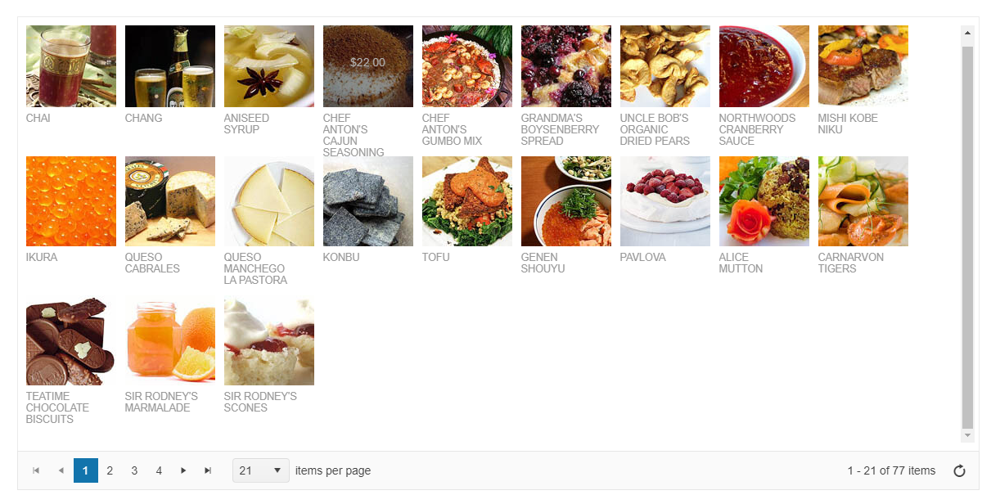

# Getting Started with the ListView

This tutorial explains how to set up the Telerik UI for {{ site.framework }} ListView.

You will declare a product view model and bind it to an instance of the ListView component. Next, you will configure the DataSource, the read transport operation for the ListView, and the server endpoint to handle the request at the backend. Finally, you'll add a Kendo template to render the ListView items and will learn how to reference the client-side instance of the component.

After completing this guide, you will achieve the following results:

 

@[template](/_contentTemplates/core/getting-started-prerequisites.md#repl-component-gs-prerequisites)

## 1. Prepare the CSHTML File

@[template](/_contentTemplates/core/getting-started-directives.md#gs-adding-directives)

Optionally, you can structure the document by adding the desired HTML elements like headings, divs, paragraphs, and others.

## 2. Declare the View Model

Declare the `ProductViewModel`.

```C#
using System.ComponentModel.DataAnnotations;
using System.ComponentModel;
using System;

    public class ProductViewModel
    {
        public int ProductID
        {
            get;
            set;
        }

        [Required]
        [Display(Name = "Product name")]
        public string ProductName
        {
            get;
            set;
        }

        [Display(Name = "Unit price")]
        [DataType(DataType.Currency)]
        [Range(0, int.MaxValue)]
        public decimal UnitPrice
        {
            get;
            set;
        }

        [Display(Name = "Units in stock")]
        [DataType("Integer")]
        [Range(0, int.MaxValue)]
        public int UnitsInStock
        {
            get;
            set;
        }

        public bool Discontinued
        {
            get;
            set;
        }

        [Display(Name = "Last supply")]
        [DataType(DataType.Date)]
        public DateTime LastSupply
        {
            get;
            set;
        }

        [DataType("Integer")]
        public int UnitsOnOrder
        {
            get;
            set;
        }
    }

```

## 3. Initialize the ListView

Use the ListView HtmlHelper or TagHelper to add the component to a page and set some of its options.

* Use the `Name()` configuration method to assign a name to the instance of the helper&mdash;this is mandatory as its value is used for the `id` and the `name` attributes of the outermost ListView element.
* Add the `DataSource()` configuration option and set the end point for the [read transport]().
* Configure the `TagName` to set the HTML element type used for the outermost element of the component.
* Set the `PageSize` of the DataSource, and use the `Pageable` property to enable the built-in pager of the ListView.

```HtmlHelper
    @using Kendo.Mvc.UI

    @(Html.Kendo().ListView<Kendo.Mvc.Examples.Models.ProductViewModel>()
        .Name("listView")
        .TagName("div")
        .DataSource(dataSource => dataSource
            .Ajax()
            .Read(read => read.Action("Products_Read", "ListView"))
            .PageSize(21)
        )
        .Pageable()
    )
```

```TagHelper
    @addTagHelper *, Kendo.Mvc

    <kendo-listview name="listView" tag-name="div">
        <datasource type="DataSourceTagHelperType.Ajax" page-size="21">
            <transport>
                <read url="@Url.Action("Products_Read", "ListView")" />
            </transport>
        </datasource>
        <pageable enabled="true" />
    </kendo-listview>
```


## 4. Declare the Read Action

In the `ListView` Controller, declare the `Read` Action method. Use the name of the Action (for example, "Products_Read") that you set in the DataSource configuration from the previous step. 

```ListViewController.cs
    using Kendo.Mvc.Extensions;
    using Kendo.Mvc.UI;

    public ActionResult Index() // The Action that returns the View, where the ListView component is defined.
    {
        return View();
    }

    private List<ProductViewModel> products = new List<ProductViewModel>() {
        new ProductViewModel { ProductID = 1, ProductName = "Chai", UnitPrice = 18, UnitsInStock = 39, Discontinued = false, LastSupply = new DateTime(2023, 03, 10, 00, 00, 00), UnitsOnOrder = 0 },
        new ProductViewModel { ProductID = 2, ProductName = "Chang", UnitPrice = 19, UnitsInStock = 17, Discontinued = false, LastSupply = new DateTime(2023, 03, 10, 00, 00, 00), UnitsOnOrder = 40 },
        new ProductViewModel { ProductID = 3, ProductName = "Aniseed Syrup", UnitPrice = 10, UnitsInStock = 13, Discontinued = false, LastSupply = new DateTime(2023, 03, 10, 00, 00, 00), UnitsOnOrder = 70 },
        new ProductViewModel { ProductID = 4, ProductName = "Chef Anton's Cajun Seasoning", UnitPrice = 22, UnitsInStock = 53, Discontinued = false, LastSupply = new DateTime(2023, 03, 10, 00, 00, 00), UnitsOnOrder = 0 },
        new ProductViewModel { ProductID = 5, ProductName = "Chef Anton's Gumbo Mix", UnitPrice = 21.35, UnitsInStock = 0, Discontinued = true, LastSupply = new DateTime(2023, 03, 10, 00, 00, 00), UnitsOnOrder = 0 },
        new ProductViewModel { ProductID = 6, ProductName = "Grandma's Boysenberry Spread", UnitPrice = 25, UnitsInStock = 120, Discontinued = false, LastSupply = new DateTime(2023, 03, 10, 00, 00, 00), UnitsOnOrder = 0 },
        new ProductViewModel { ProductID = 7, ProductName = "Uncle Bob's Organic Dried Pears", UnitPrice = 30, UnitsInStock = 15, Discontinued = false, LastSupply = new DateTime(2023, 03, 10, 00, 00, 00), UnitsOnOrder = 0 },
        new ProductViewModel { ProductID = 8, ProductName = "Northwoods Cranberry Sauce", UnitPrice = 40, UnitsInStock = 6, Discontinued = false, LastSupply = new DateTime(2023, 03, 10, 00, 00, 00), UnitsOnOrder = 0 },
        new ProductViewModel { ProductID = 9, ProductName = "Mishi Kobe Niku", UnitPrice = 97, UnitsInStock = 29, Discontinued = true, LastSupply = new DateTime(2023, 03, 10, 00, 00, 00), UnitsOnOrder = 0 },
        new ProductViewModel { ProductID = 10, ProductName = "Ikura", UnitPrice = 31, UnitsInStock = 31, Discontinued = false, LastSupply = new DateTime(2023, 03, 10, 00, 00, 00), UnitsOnOrder = 0 },
        new ProductViewModel { ProductID = 11, ProductName = "Queso Cabrales", UnitPrice = 21, UnitsInStock = 22, Discontinued = false, LastSupply = new DateTime(2023, 03, 10, 00, 00, 00), UnitsOnOrder = 30 },
        new ProductViewModel { ProductID = 12, ProductName = "Queso Manchego La Pastora", UnitPrice = 38, UnitsInStock = 86, Discontinued = false, LastSupply = new DateTime(2023, 03, 10, 00, 00, 00), UnitsOnOrder = 0 },
        new ProductViewModel { ProductID = 13, ProductName = "Konbu", UnitPrice = 6, UnitsInStock = 24, Discontinued = false, LastSupply = new DateTime(2023, 03, 10, 00, 00, 00), UnitsOnOrder = 0 },
        new ProductViewModel { ProductID = 14, ProductName = "Tofu", UnitPrice = 23.25, UnitsInStock = 35, Discontinued = false, LastSupply = new DateTime(2023, 03, 10, 00, 00, 00), UnitsOnOrder = 0 }, 
        new ProductViewModel { ProductID = 15, ProductName = "Genen Shouyu", UnitPrice = 15.5, UnitsInStock = 39, Discontinued = false, LastSupply = new DateTime(2023, 03, 10, 00, 00, 00), UnitsOnOrder = 0 },
        new ProductViewModel { ProductID = 16, ProductName = "Pavlova", UnitPrice = 17.45, UnitsInStock = 29, Discontinued = false, LastSupply = new DateTime(2023, 03, 10, 00, 00, 00), UnitsOnOrder = 0 },
        new ProductViewModel { ProductID = 17, ProductName = "Alice Mutton", UnitPrice = 39, UnitsInStock = 0, Discontinued = true, LastSupply = new DateTime(2023, 03, 10, 00, 00, 00), UnitsOnOrder = 0 },
        new ProductViewModel { ProductID = 18, ProductName = "Carnarvon Tigers", UnitPrice = 62.5, UnitsInStock = 42, Discontinued = false, LastSupply = new DateTime(2023, 03, 10, 00, 00, 00), UnitsOnOrder = 0 },
        new ProductViewModel { ProductID = 19, ProductName = "Teatime Chocolate Biscuits", UnitPrice = 9.2, UnitsInStock = 25, Discontinued = false, LastSupply = new DateTime(2023, 03, 10, 00, 00, 00), UnitsOnOrder = 0 },
        new ProductViewModel { ProductID = 20, ProductName = "Sir Rodney's Marmalade", UnitPrice = 81, UnitsInStock = 40, Discontinued = false, LastSupply = new DateTime(2023, 03, 10, 00, 00, 00), UnitsOnOrder = 0 },
        new ProductViewModel { ProductID = 21, ProductName = "Sir Rodney's Scones", UnitPrice = 10, UnitsInStock = 3, Discontinued = false, LastSupply = new DateTime(2023, 03, 10, 00, 00, 00), UnitsOnOrder = 40 }
    };

    public JsonResult Products_Read([DataSourceRequest] DataSourceRequest request)
    {
        return Json(products.ToDataSourceResult(request));
    }

```

## 5. Add a Template to Render the ListView Items

The ListView expects a mandatory `ClientTemplateId` configuration to render the data items received from the server.

```HtmlHelper
    @using Kendo.Mvc.UI

    @(Html.Kendo().ListView<Kendo.Mvc.Examples.Models.ProductViewModel>()
        .Name("listView")
        .TagName("div")
        .ClientTemplateId("template")
        .DataSource(dataSource => dataSource
            .Ajax()
            .Read(read => read.Action("Products_Read", "ListView"))
            .PageSize(21)
        )
        .Pageable()
    )
```

```TagHelper
    @addTagHelper *, Kendo.Mvc

    <kendo-listview name="listView" tag-name="div" template-id="template">
        <datasource type="DataSourceTagHelperType.Ajax" page-size="21">
            <transport>
                <read url="@Url.Action("Products_Read", "ListView")" />
            </transport>
        </datasource>
        <pageable enabled="true" />
    </kendo-listview>
```

```Template
    <script type="text/x-kendo-tmpl" id="template">
        <div class="product">
            
            <h3>#:ProductName#</h3>
            <p>#:kendo.toString(UnitPrice, "c")#</p>
        </div>
    </script>
```

## (Optional) Reference Existing ListView Instances

Referencing existing component instances allows you to build on top of their configuration. To reference an existing ListView instance, use the [`jQuery.data()`](http://api.jquery.com/jQuery.data/) method. Once a reference is established, use the [ListView client-side API](https://docs.telerik.com/kendo-ui/api/javascript/ui/listview#methods) to control its behavior.

1. Use the `id` attribute of the component instance to establish a reference.

    ```script
    <script>
        var listviewReference = $("#listView").data("kendoListView"); // listviewReference is a reference to the existing instance of the helper.
    </script>
    ```

1. Use the [ListView client-side API](https://docs.telerik.com/kendo-ui/api/javascript/ui/listview#methods) to control the behavior of the component. In this example, you will see how to turn on the [`selectable`](https://docs.telerik.com/kendo-ui/api/javascript/ui/listview/configuration/selectable) configuration by using the [`setOptions`](https://docs.telerik.com/kendo-ui/api/javascript/ui/widget/methods/setoptions) method. Then you can use the [`select`](https://docs.telerik.com/kendo-ui/api/javascript/ui/listview/methods/select) method to programmatically select one of the items.

    ```script
        <script>
            var listview = $("#listView").data("kendoListView");
            listview.setOptions({selectable: "single"});  // Turn on the selectable mode of the ListView.
            listview.select(listview.content.children().first()); // Select the first item.
        </script>
    ```


## Explore this Tutorial in REPL

You can continue experimenting with the code sample above by running it in the Telerik REPL server playground:

* [Sample code with the ListView HtmlHelper](https://netcorerepl.telerik.com/cRYdvubb06kr7jZv50)
* [Sample code with the ListView TagHelper](https://netcorerepl.telerik.com/QdExlOPl09DQHvVp44)



## Next Steps

* [ListView Editing]()
* [Subscribing to the ListView's Events]()
* [ListView Selection Modes]()

## See Also

* [Using the Events of the ListView for {{ site.framework }} (Demo)](https://demos.telerik.com/{{ site.platform }}/listview/events)
* [Client-Side API of the ListView](https://docs.telerik.com/kendo-ui/api/javascript/ui/listview)
* [Server-Side API of the ListView](/api/listview)
* [Knowledge Base Section](/knowledge-base)
