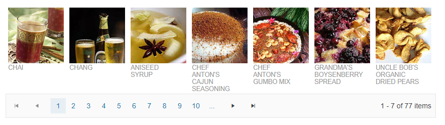

# Getting Started with the Pager

This tutorial explains how to set up the Telerik UI for {{ site.framework }} Pager and highlights the major steps in the configuration of the component.

You will declare a Pager and a DataSource to supply data from a remote endpoint, send a `Read` request to the backend and visualize the data items. Then you will be able to test the behavior of the Pager. Finally, you will handle a Pager JavaScript event and reference an existing instance of the component.

After completing this guide, you will achieve the following results:

 

@[template](/_contentTemplates/core/getting-started-prerequisites.md#component-gs-prerequisites)

## 1. Prepare the CSHTML File

@[template](/_contentTemplates/core/getting-started-directives.md#gs-adding-directives)

Optionally, you can structure the document by adding the desired HTML elements like headings, divs, paragraphs, and others.

## 2. Declare a DataSource

The DataSource will consume data from a remote end point. By configuring the `PageSize` of the DataSource, the number of available pages will be determined by the count of the available data items divided by the page size.

For more information about the DataSource component, visit the [Getting Started with the DataSource](https://docs.telerik.com/aspnet-core/html-helpers/datasource/getting-started) article.

```HtmlHelper
	@using Kendo.Mvc.UI
    
    @(Html.Kendo().DataSource<Kendo.Mvc.Examples.Models.ProductViewModel>()
        .Name("dataSource1")
        .Ajax(dataSource=>dataSource
            .Read(read => read.Action("Products_Read", "ListView"))
            .Events(ev=>ev.Change("change"))
            .PageSize(7)
        )
    )
```

```TagHelper
	@addTagHelper *, Kendo.Mvc

	<kendo-datasource name="dataSource1" type="DataSourceTagHelperType.Ajax" 
    server-operation="false" page-size="7"
    on-change="change">
        <transport>
            <read url="@Url.Action("Products_Read", "ListView")" />
        </transport>
    </kendo-datasource>
```


## 3. Initialize the Pager

Use the Pager HtmlHelper or TagHelper to configure the component.

* Use the `Name()` configuration method to assign a name to the instance of the helper&mdash;this is mandatory as its value is used for the `id` and the `name` attributes of the Pager element.
* Bind the external DataSource configured in the previous step by passing it to the `DataSource()` configuration option of the Pager.  
* Use the `HtmlAttributes` of the component to set the width of the Pager.

```HtmlHelper
	@using Kendo.Mvc.UI

    @(Html.Kendo().DataSource<Kendo.Mvc.Examples.Models.ProductViewModel>()
		.Name("dataSource1")
		.Ajax(dataSource=>dataSource
			.Read(read => read.Action("Products_Read", "ListView"))
			.Events(ev=>ev.Change("change"))
			.PageSize(7)
		)
    )

    <div class="contests-wrapper">
    </div>
    @(Html.Kendo().Pager()
        .Name("pager")
        .DataSource("dataSource1")
        .HtmlAttributes(new { style="width:850px"})
    )
```

```TagHelper
@addTagHelper *, Kendo.Mvc

<kendo-datasource name="dataSource1" type="DataSourceTagHelperType.Ajax" 
	server-operation="false" page-size="7"
	on-change="change">
    <transport>
        <read url="@Url.Action("Products_Read", "ListView")" />
    </transport>
</kendo-datasource>

<div class="contests-wrapper">
</div>
<kendo-pager name="pager1" refresh="true" responsive="false" datasource-id="dataSource1" width="850px">
</kendo-pager>
```


## (Optional) Visualize the Data Items

* Use a [Kendo template](https://docs.telerik.com/kendo-ui/framework/templates/overview) to configure the appearance of the data items.
* Subscribe to the [`Change` event](https://docs.telerik.com/kendo-ui/api/javascript/data/datasource/events/change) of the DataSource to render any changes to the data.

```HtmlHelper
<script type="text/x-kendo-tmpl" id="template">
	<div class="product">
		
		<h3>#:ProductName#</h3>
		<p>#:kendo.toString(UnitPrice, "c")#</p>
	</div>
</script>

<script>
	function change() {
		var template = kendo.template($("#template").html());
		$(".contests-wrapper").html(kendo.render(template, this.view()));
	}
	$(document).ready( function () {
		dataSource1.read();
	});
</script>

<div class="demo-section wide">
	@(Html.Kendo().DataSource<Kendo.Mvc.Examples.Models.ProductViewModel>()
		.Name("dataSource1")
		.Ajax(dataSource=>dataSource
			.Read(read => read.Action("Products_Read", "ListView"))
			.Events(ev=>ev.Change("change"))
			.PageSize(7)
		)
	)
	<div class="contests-wrapper">
	</div>
	@(Html.Kendo().Pager()
		.Name("pager")
		.DataSource("dataSource1")
		.HtmlAttributes(new { style="width:850px"})
	)
</div>
```

```TagHelper
@addTagHelper *, Kendo.Mvc

<script type="text/x-kendo-tmpl" id="template">
    <div class="product">
        
        <h3>#:ProductName#</h3>
        <p>#:kendo.toString(UnitPrice, "c")#</p>
    </div>
</script>

<script>
	function change() {
		var template = kendo.template($("#template").html());
		$(".contests-wrapper").html(kendo.render(template, this.view()));
	}

	$(document).ready( function () {
		dataSource1.read();
	});
</script>

<div class="demo-section wide">
    <kendo-datasource name="dataSource1" type="DataSourceTagHelperType.Ajax" 
    server-operation="false" page-size="7"
    on-change="change">
        <transport>
            <read url="@Url.Action("Products_Read", "ListView")" />
        </transport>
    </kendo-datasource>

    <div class="contests-wrapper">
    </div>
    <kendo-pager name="pager1" refresh="true" responsive="false" datasource-id="dataSource1" width="850px">
    </kendo-pager>
</div>
```


## 4. Handle the Change Event of the Pager

The Pager exposes a client-side event that you can handle and use to customize the component's functions. Attach a handler in the declaration of the Pager and declare the `onPagerChange` JavaScript function.

```HtmlHelper
<script type="text/x-kendo-tmpl" id="template">
	<div class="product">
		
		<h3>#:ProductName#</h3>
		<p>#:kendo.toString(UnitPrice, "c")#</p>
	</div>
</script>

<script>
	function change() {
		var template = kendo.template($("#template").html());
		$(".contests-wrapper").html(kendo.render(template, this.view()));
	}
	function onPagerChange(e){
        console.log("Pager is navigated to page "+e.sender.page());
    }

	$(document).ready( function () {
		dataSource1.read();
	});
</script>

<div class="demo-section wide">
	@(Html.Kendo().DataSource<Kendo.Mvc.Examples.Models.ProductViewModel>()
		.Name("dataSource1")
		.Ajax(dataSource=>dataSource
			.Read(read => read.Action("Products_Read", "ListView"))
			.Events(ev=>ev.Change("change"))
			.PageSize(7)
		)
	)
	<div class="contests-wrapper">
	</div>
	@(Html.Kendo().Pager()
		.Name("pager")
		.DataSource("dataSource1")
		.HtmlAttributes(new { style="width:850px"})
		.Events(e=>e.Change("onPagerChange"))
	)
</div>
```

```TagHelper
@addTagHelper *, Kendo.Mvc

<script type="text/x-kendo-tmpl" id="template">
    <div class="product">
        
        <h3>#:ProductName#</h3>
        <p>#:kendo.toString(UnitPrice, "c")#</p>
    </div>
</script>

<script>
	function change() {
		var template = kendo.template($("#template").html());
		$(".contests-wrapper").html(kendo.render(template, this.view()));
	}
	function onPagerChange(e){
        console.log("Pager is navigated to page "+e.sender.page());
    }

	$(document).ready( function () {
		dataSource1.read();
	});
</script>

<div class="demo-section wide">
    <kendo-datasource name="dataSource1" type="DataSourceTagHelperType.Ajax" 
    server-operation="false" page-size="7"
    on-change="change">
        <transport>
            <read url="@Url.Action("Products_Read", "ListView")" />
        </transport>
    </kendo-datasource>

    <div class="contests-wrapper">
    </div>
    <kendo-pager name="pager1" refresh="true" responsive="false" datasource-id="dataSource1" 
        width="850px"
        on-change="onPagerChange">
    </kendo-pager>
</div>
```


## (Optional) Reference Existing Pager Instances

Referencing existing instances allows you to build on top of their configuration. To reference an existing Pager instance, use the [`jQuery.data()`](http://api.jquery.com/jQuery.data/) method:

1. Use the `id` attribute of the component instance to establish a reference.

    ```JS script
    <script>
        var pagerReference = $("#pager").data("kendoPager"); // pagerReference is a reference to the existing instance of the helper.
    </script>
    ```

1. Use the [Pager client-side API](https://docs.telerik.com/kendo-ui/api/javascript/ui/pager#methods) to control the behavior of the widget. In this example, you will hide one of the Pager columns by using `hideColumn` method.

    ```JS script
    <script>
        var pagerReference = $("#pager").data("kendoPager"); // pagerReference is a reference to the existing instance of the helper.
        pagerReference.page(2); // Select page 2.
    </script>
    ```

For more information on referencing specific helper instances, see the [Methods and Events]() article.



## Explore this Tutorial in REPL

You can continue experimenting with the code sample above by running it in the Telerik REPL server playground:

* [Sample code with the Pager HtmlHelper](https://netcorerepl.telerik.com/mREzEjmb09quSDDX10)
* [Sample code with the Pager TagHelper](https://netcorerepl.telerik.com/wRuTEZma39knuo8750)



## Next Steps

* [Customizing the Settings and Types of Pager]()
* [Configuring a Responsive Pager]()


## See Also

* [Pager for {{ site.framework }} (Demo)](https://demos.telerik.com/{{ site.platform }}/pager)
* [Pager client-side API](https://docs.telerik.com/kendo-ui/api/javascript/ui/pager)
* [Pager server-side API](/api/pager)
* [Knowledge Base Section](/knowledge-base)
