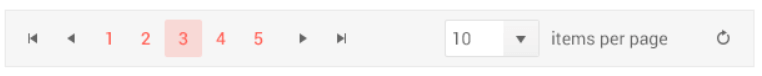

## Responsive Design

The Pager HtmlHelper for {{ site.framework }} is responsive by default. To disable the responsive behavior and have all of its elements visible at all times use the `Responsive()` method and pass to `false` as a parameter.

## Visible Elements

The Pager widget determines which internal elements to render based on its width. When the Pager width is greater than or equal to 600 pixels, all elements are visible:

- `Page Sizes Dropdown`
- `Numeric Page Number Buttons` or a `Numeric Input` if the pager is an `Input` one.
- `Info element`

## Breaking Points

When the Pager width is greater than or equal to 600 pixels, all elements are visible:

When the Pager width is greater than 480 and less than 600 pixels, the label showing the current paging information is hidden:

When the Pager width is greater than 360 and less than 480 pixels, the current page is represented by a native `<select/>` element. The `pageSizes` dropdown and the label showing the current paging information are hidden.

When the Pager width is less than 360 pixels, the current page is represented by a native `<select/>` element. The `pageSizes` dropdown and the label showing the current paging information are hidden.

## See Also

* [Pager Client-Side API](https://docs.telerik.com/kendo-ui/api/javascript/ui/pager)
* [Pager Server-Side API](/api/pager)
* [Pager Settings and Types]()
* [Pager Templates]()
* [Globalization and Messages]()
