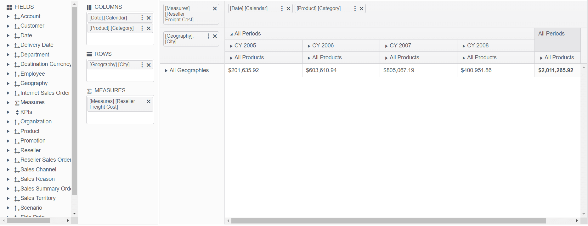

# PivotConfigurator Overview

The [Telerik UI PivotConfigurator component for {{ site.framework }}](/api/pivotconfigurator) represents an OLAP cube structure.

The PivotConfigurator can be used for configuring the column and row dimensions, and the measure fields of the [PivotGrid](https://demos.telerik.com/{{ site.platform }}/pivotgrid/index). It is a supplementary component which is strongly related to the Telerik UI PivotDataSource.

## Initializing the PivotConfigurator

The following example demonstrates how to create the PivotConfigurator.

```HtmlHelper
    @(Html.Kendo().PivotConfigurator()
        .Name("configurator")
        .Filterable(true)
        .Height(570)
    )

    @(Html.Kendo().PivotGrid()
    .Name("pivotgrid")
    .Height(570)
    .Filterable(true)
    .Configurator("#configurator")
    // Other configuration.
    )
```

```TagHelper
    <kendo-pivotconfigurator name="configurator" 
                             datasource-id="pivotSource" 
                             filterable="true"  
                             height="570">
    </kendo-pivotconfigurator>

    <kendo-pivotgrid name="pivotgrid" 
                     filterable="true" 
                     datasource-id="pivotSource"
                     height="570">
    </kendo-pivotgrid>
```


## Basic Configuration

The following example demonstrates how to configure the PivotConfigurator.

```HtmlHelper
    @(Html.Kendo().PivotConfigurator()
        .Name("configurator")
        .Filterable(true)
        .Sortable()
        .Height(570)
    )

    @(Html.Kendo().PivotGrid()
        .Name("pivotgrid")
        .ColumnWidth(200)
        .Height(570)
        .Filterable(true)
        .Sortable()
        .Configurator("#configurator")
        .DataSource(dataSource => dataSource.
            Xmla()
            .Columns(columns => {
                columns.Add("[Date].[Calendar]").Expand(true);
                columns.Add("[Product].[Category]");
            })
            .Rows(rows => rows.Add("[Geography].[City]"))
            .Measures(measures => measures.Values(new string[]{"[Measures].[Reseller Freight Cost]"}))
            .Transport(transport => transport
                .Connection(connection => connection
                    .Catalog("Adventure Works DW 2008R2")
                    .Cube("Adventure Works"))
                .Read(read => read
                    .Url("https://demos.telerik.com/olap/msmdpump.dll")
                    .DataType("text")
                    .ContentType("text/xml")
                    .Type(HttpVerbs.Post)
                )
            )
            .Events(e => e.Error("onError"))
        )
    )
```

```TagHelper
    <kendo-pivotdatasource type=@(PivotDataSourceType.Xmla) name="pivotSource">
        <columns>
            <pivot-datasource-column name="[Date].[Calendar]" expand="true"></pivot-datasource-column>
            <pivot-datasource-column name="[Product].[Category]"></pivot-datasource-column>
        </columns>
        <rows>
            <row name="[Geography].[City]"></row>
        </rows>
        <schema type="xmla"/>
        <measures values=@(new string[] {"[Measures].[Reseller Freight Cost]"} ) ></measures>
        <transport>
            <read url="https://demos.telerik.com/olap/msmdpump.dll" datatype="text" content-type="text/xml" type="POST" />
            <connection catalog="Adventure Works DW 2008R2" cube="Adventure Works"></connection>
        </transport>
    </kendo-pivotdatasource>

    <kendo-pivotconfigurator name="configurator" 
                             filterable="true" 
                             height="570" 
                             datasource-id="pivotSource">
    </kendo-pivotconfigurator>

    <kendo-pivotgrid name="pivotgrid"
                     filterable="true" 
                     column-width="200" 
                     height="570"
                     datasource-id="pivotSource">
        <sortable enabled="true" />
    </kendo-pivotgrid>
```


The following image demonstrates the output from the previous example.



## Referencing Existing Instances

To reference an existing PivotConfigurator instance, use the [`jQuery.data()`](http://api.jquery.com/jQuery.data/) method. Once a reference has been established, use the [PivotConfigurator client-side API](https://docs.telerik.com/kendo-ui/api/javascript/ui/pivotconfigurator) to control its behavior.

    var pivotconfigurator = $("#pivotconfigurator").data("kendoPivotConfigurator");

## See Also

* [OLAP Cube Fundamentals]()
* [OLAP Cube Setup]()
