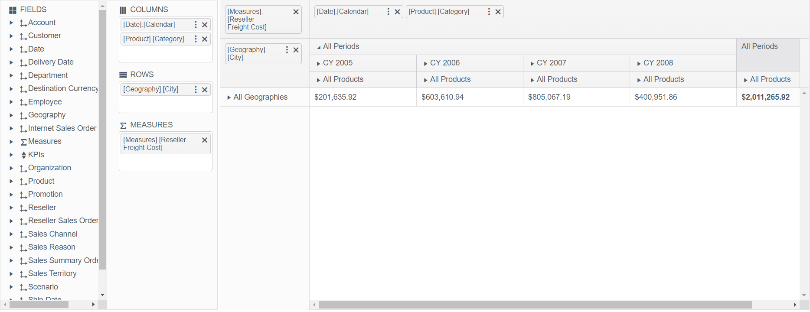

# PivotConfigurator Overview

The [Telerik UI PivotConfigurator HtmlHelper for {{ site.framework }}](/api/pivotconfigurator) represents an OLAP cube structure.

The PivotConfigurator can be used for configuring the column and row dimensions, and the measure fields of the [PivotGrid](https://demos.telerik.com/{{ site.platform }}/pivotgrid/index). It is a supplementary component which is strongly related to the Telerik UI PivotDataSource.

## Initializing the PivotConfigurator

The following example demonstrates how to create the PivotConfigurator.

    @(Html.Kendo().PivotConfigurator()
        .Name("configurator")
        .Filterable(true)
        .Height(570)
    )

    @(Html.Kendo().PivotGrid()
    .Name("pivotgrid")
    .Height(570)
    .Filterable(true)
    .Configurator("#configurator")
    // Other configuration.
    )

## Basic Configuration

The following example demonstrates how to configure the PivotConfigurator.

    @(Html.Kendo().PivotConfigurator()
        .Name("configurator")
        .Filterable(true)
        .Sortable()
        .Height(570)
    )

    @(Html.Kendo().PivotGrid()
        .Name("pivotgrid")
        .ColumnWidth(200)
        .Height(570)
        .Filterable(true)
        .Sortable()
        .Configurator("#configurator")
        .DataSource(dataSource => dataSource.
            Xmla()
            .Columns(columns => {
                columns.Add("[Date].[Calendar]").Expand(true);
                columns.Add("[Product].[Category]");
            })
            .Rows(rows => rows.Add("[Geography].[City]"))
            .Measures(measures => measures.Values(new string[]{"[Measures].[Reseller Freight Cost]"}))
            .Transport(transport => transport
                .Connection(connection => connection
                    .Catalog("Adventure Works DW 2008R2")
                    .Cube("Adventure Works"))
                .Read(read => read
                    .Url("https://demos.telerik.com/olap/msmdpump.dll")
                    .DataType("text")
                    .ContentType("text/xml")
                    .Type(HttpVerbs.Post)
                )
            )
            .Events(e => e.Error("onError"))
        )
    )

The following image demonstrates the output from the previous example.

## Referencing Existing Instances

To reference an existing PivotConfigurator instance, use the [`jQuery.data()`](http://api.jquery.com/jQuery.data/) method. Once a reference has been established, use the [PivotConfigurator client-side API](https://docs.telerik.com/kendo-ui/api/javascript/ui/pivotconfigurator) to control its behavior.

    var pivotconfigurator = $("#pivotconfigurator").data("kendoPivotConfigurator");

## See Also

* [OLAP Cube Fundamentals]()
* [OLAP Cube Setup]()
