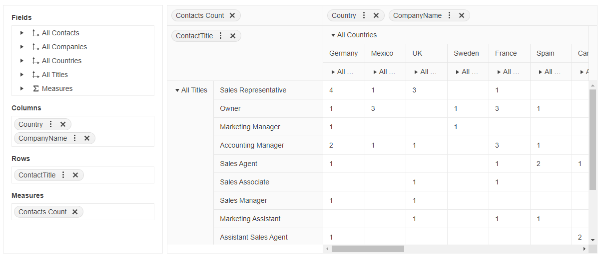

# Getting Started with the PivotGrid

This tutorial explains how to set up a basic Telerik UI for {{ site.framework }} PivotGrid and highlights the major steps in the configuration of the component.

You will declare a Model for the PivotGrid, define the [PivotConfigurator](), and initialize the PivotGrid component bound to remote flat data. Next, you will handle the PivotGrid events and call the `saveAsExcel()` method to export the data to Excel. Finally, you can run the sample code in [Telerik REPL](https://netcorerepl.telerik.com/) and continue exploring the components.

 

@[template](/_contentTemplates/core/getting-started-prerequisites.md#component-gs-prerequisites)

## 1. Prepare the CSHTML File

@[template](/_contentTemplates/core/getting-started-directives.md#gs-adding-directives)

Optionally, you can structure the View content by adding the desired HTML elements like headings, divs, paragraphs, and others.

```HtmlHelper
    @using Kendo.Mvc.UI
    <h4>Employees by country and company</h4>
    <div>
    </div>
```

```TagHelper
    @addTagHelper *, Kendo.Mvc
    <h4>Employees by country and company</h4>
    <div>
    </div>
```


## 2. Declare the View Model

Declare the `CustomerViewModel` Model.

```C#
	public class CustomerViewModel
    {
        public string CustomerID { get; set; }
        public string CompanyName { get; set; }
        public string ContactName { get; set; }
        public string ContactTitle { get; set; }
        public string Address { get; set; }
        public string City { get; set; }
        public string Region { get; set; }
        public string PostalCode { get; set; }
        public string Country { get; set; }
        public string Phone { get; set; }
        public string Fax { get; set; }
        public Nullable<bool> Bool { get; set; }
    }
```

## 3. Initialize the PivotConfigurator

Define the PivotConfigurator supplementary component that allows you to control the column and row dimensions and the measure fields of the PivotGrid. Also, enable its `Filterable` option to filter the PivotGrid rows and columns.

```HtmlHelper
    @using Kendo.Mvc.UI

    @(Html.Kendo().PivotConfigurator()
        .Name("configurator")
        .Filterable(true)
        .Height(500)
    )
```

```TagHelper
    @addTagHelper *, Kendo.Mvc

    <kendo-pivotconfigurator name="configurator" filterable="true" height="500">
    </kendo-pivotconfigurator>
```


## 4. Initialize the PivotGrid

Use the PivotGrid HtmlHelper or TagHelper to add the component to a page:

* The `Name()` configuration method is mandatory as its value is used for the `id` and the `name` attributes of the PivotGrid element.
* The `Configurator()` option sets the `Name()` of the defined PivotConfigurator that is connected to the PivotGrid.
* Add the `DataSource()` configuration option and set the remote endpoint to return the multi-dimensional array of data and the initial rows, columns, and measures of the PivotGrid.
* Enable additional component features, such as [filtering]() and [sorting]().

```HtmlHelper
    @using Kendo.Mvc.UI

    @(Html.Kendo().PivotGrid<CustomerViewModel>()
        .Name("pivotgrid")
        .Configurator("#configurator")
        .ColumnWidth(100)
        .Filterable(true)
        .Sortable(true)
        .Height(500)
        .DataSource(dataSource => dataSource
            .Ajax()
            .Transport(transport => transport.Read("ReadData", "PivotGrid"))
            .Schema(schema => schema
                .Cube(cube => cube
                    .Dimensions(dimensions => {
                        dimensions.Add(model => model.ContactName).Caption("All Contacts");
                        dimensions.Add(model => model.CompanyName).Caption("All Companies");
                        dimensions.Add(model => model.Country).Caption("All Countries");
                        dimensions.Add(model => model.ContactTitle).Caption("All Titles");
                    })
                    .Measures(measures => measures.Add("Contacts Count").Field(model => model.CustomerID).AggregateName("count"))
                ))
            .Columns(columns =>
            {
                columns.Add("Country").Expand(false);
                columns.Add("CompanyName");
            })
            .Rows(rows => rows.Add("ContactTitle").Expand(false))
            .Measures(measures => measures.Values("Contacts Count"))
        )
    )
```

```TagHelper
    @addTagHelper *, Kendo.Mvc

    <kendo-pivotdatasource name="pivotSource" type=@(PivotDataSourceType.Ajax)>
        <columns>
            <pivot-datasource-column name="Country" expand="true"></pivot-datasource-column>
            <pivot-datasource-column name="CompanyName"></pivot-datasource-column>
        </columns>
        <rows>
            <row name="ContactTitle" expand="true"></row>
        </rows>
        <schema type="json">
            <cube>
                <dimensions>
                    <dimension name="ContactName" caption="All Contact" />
                    <dimension name="CompanyName" caption="All Companies" />
                    <dimension name="Country" caption="All Countries" />
                    <dimension name="ContactTitle" caption="All Titles" />
                </dimensions>
                <measures>
                    <measure name="Contacts Count" field="CustomerID" aggregate="count" />
                </measures>
            </cube>
        </schema>
        <measures values='new string[] {"Contacts Count"}'></measures>
        <transport>
            <read url="@Url.Action("ReadData","PivotGrid")" datatype="json" content-type="application/json" type="POST" />
        </transport>
    </kendo-pivotdatasource>

    <kendo-pivotconfigurator name="configurator" datasource-id="pivotSource" filterable="true" height="500">
    </kendo-pivotconfigurator>

    <kendo-pivotgrid name="pivotgrid" column-width="100" datasource-id="pivotSource" filterable="true" sortable="true" height="500">
    </kendo-pivotgrid>
```


## 5. Define the DataSource Read Action

Declare the Read method that returns the data in the Controller. Use the name of the Read action that you set in the DataSource configuration in the previous step.

```C#
    using Kendo.Mvc.Extensions;
    using Kendo.Mvc.UI;

    public class PivotGridController
    {
        public PivotGridController(IDbContextFactory<SampleEntitiesDataContext> contextFactory) : base(contextFactory)
        {
        }

        public JsonResult ReadData([DataSourceRequest]DataSourceRequest request)
        {
            return Json(GetCustomers().ToDataSourceResult(request));
        }

        private IEnumerable<CustomerViewModel> GetCustomers()
        {
            using (var northwind = GetContext())
            {
                return northwind.Customers.Select(customer => new CustomerViewModel
                {
                    CustomerID = customer.CustomerID,
                    CompanyName = customer.CompanyName,
                    ContactName = customer.ContactName,
                    ContactTitle = customer.ContactTitle,
                    Address = customer.Address,
                    City = customer.City,
                    Region = customer.Region,
                    PostalCode = customer.PostalCode,
                    Country = customer.Country,
                    Phone = customer.Phone,
                    Fax = customer.Fax,
                    Bool = customer.Bool
                });
            }
        }
    }
```

## 6. Handle the PivotGrid Events

The PivotGrid exposes [events](/api/kendo.mvc.ui.fluent/pivotgrideventbuilder) that you can handle and further customize the functionality of the component. In this tutorial, you will use the `ExpandMember` event to hide a specified table row based on condition.

```HtmlHelper
    @(Html.Kendo().PivotGrid<Kendo.Mvc.Examples.Models.CustomerViewModel>()
        .Name("pivotgrid")
        .Events(ev => ev.ExpandMember("onExpandMember"))
        ... // Other configuration.
    )

    <script>
        function onExpandMember(e) {
            let expandedAxis = e.axis;
            let expandedPath = e.path[0];
            if(expandedAxis == "rows" && expandedPath == "ContactTitle") {
                setTimeout(() => {
                    // Hide the third table row when the "ContactTitle" row is expanded.
                    $(".k-pivot-rowheaders .k-grid").find(".k-table-row:nth-child(3)").hide();
                    $(".k-pivot-table .k-grid-content").find(".k-table-row:nth-child(3)").hide();
                });
            }
        }
    </script>
```

```TagHelper
    @addTagHelper *, Kendo.Mvc

    <kendo-pivotgrid name="pivotgrid" datasource-id="pivotSource" filterable="true" on-expand-member="onExpandMember">
    </kendo-pivotgrid>

    <script>
        function onExpandMember(e) {
            let expandedAxis = e.axis;
            let expandedPath = e.path[0];
            if(expandedAxis == "rows" && expandedPath == "ContactTitle") {
                setTimeout(() => {
                    // Hide the third table row when the "ContactTitle" row is expanded.
                    $(".k-pivot-rowheaders .k-grid").find(".k-table-row:nth-child(3)").hide();
                    $(".k-pivot-table .k-grid-content").find(".k-table-row:nth-child(3)").hide();
                });
            }
        }
    </script>
```


## 7. (Optional) Reference Existing PivotGrid Instances

You can reference the PivotGrid instances that you have created and build on top of their existing configuration:

1. Use the `id` attribute of the component instance to get its reference.

    ```script
        <script>
            $(document).ready(function() {
                var pivotGridReference = $("#pivotgrid").data("kendoPivotGrid"); // pivotGridReference is a reference to the existing PivotGrid instance of the helper.
            });
        </script>
    ```

1. Use the [PivotGrid client-side API](https://docs.telerik.com/kendo-ui/api/javascript/ui/pivotgrid#methods) to control the behavior of the component. In this example, you will use the `saveAsExcel()` method to export the PivotGrid data to Excel (for example, when a button is clicked).

    ```HtmlHelper
        @(Html.Kendo().Button()
            .Name("exportBtn")
            .Content("Export to Excel")
            .Events(ev => ev.Click("onBtnClick"))
        )
    ```
    
    ```TagHelper
        @addTagHelper *, Kendo.Mvc
        <kendo-button name="exportBtn" on-click="onBtnClick">
            Export to Excel
        </kendo-button>
    ```
    
    ```Scripts
        <script>
            function onBtnClick() {
                var pivotGridReference = $("#pivotgrid").data("kendoPivotGrid");
                pivotGridReference.saveAsExcel();
            }
        </script>
    ```

For more information on referencing specific helper instances, see the [Methods and Events]() article.


## Explore this Tutorial in REPL

You can continue experimenting with the code sample above by running it in the Telerik REPL server playground:

* [Sample code with the PivotGrid HtmlHelper](https://netcorerepl.telerik.com/mHvwFMkD0823BMTH40)
* [Sample code with the PivotGrid TagHelper](https://netcorerepl.telerik.com/GdvQlsaj09tU75Eh32)



## Next Steps

* [Binding the PivotGrid to Data]()
* [Filtering the PivotGrid]()
* [Sorting the PivotGrid]()

## See Also

* [Using the templates of the PivotGrid for {{ site.framework }} (Demo)](https://demos.telerik.com/{{ site.platform }}/pivotgrid/templates)
* [Client-Side API of the PivotGrid](https://docs.telerik.com/kendo-ui/api/javascript/ui/pivotgrid)
* [Server-Side API of the PivotGrid](/api/pivotgrid)

* [Server-Side API of the PivotGrid TagHelper](/api/taghelpers/pivotgrid)

* [Knowledge Base Section](/knowledge-base)