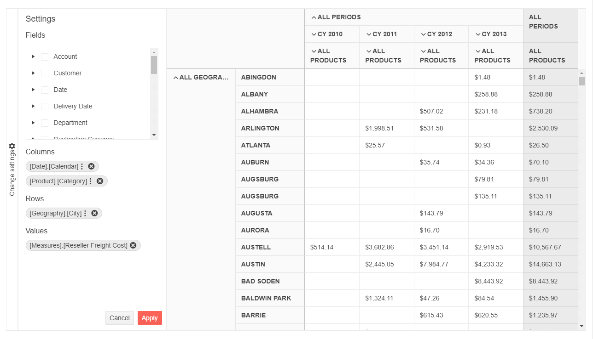

# PivotConfiguratorV2 Overview

The [Telerik UI PivotConfiguratorV2 HtmlHelper for {{ site.framework }}](/api/pivotconfigurator) represents an OLAP cube structure.

The PivotConfiguratorV2 can be used for configuring the column and row dimensions, and the measure fields of the [PivotGridV2](https://demos.telerik.com/{{ site.platform }}/pivotgrid/index). It is a supplementary component which is strongly related to the Telerik UI PivotDataSourceV2 component.

## Initializing the PivotConfiguratorV2

The following example demonstrates how to create the PivotConfigurator.

```HtmlHelper
    @(Html.Kendo().PivotConfiguratorV2()
        .Name("configurator")
        .Filterable(true)
        .Height(570)
    )

    @(Html.Kendo().PivotGridV2()
    .Name("pivotgridv2")
    .Height(570)
    .Configurator("#configurator")
    // Other configuration.
    )
```

```TagHelper
    <kendo-pivotconfiguratorv2 name="configurator" filterable="true" height="570">
    </kendo-pivotconfiguratorv2>

    <kendo-pivotgridv2 name="pivotgridv2" height="570" configurator="#configurator">
        <!--Other configuration. -->
    </kendo-pivotgridv2>
````


## Basic Configuration

The following example demonstrates how to configure the PivotConfigurator.

```HtmlHelper
    @(Html.Kendo().PivotConfiguratorV2()
        .Name("configurator")
        .Filterable(true)
        .Height(570)
    )

    @(Html.Kendo().PivotGridV2()
        .Name("pivotgrid")
        .ColumnWidth(200)
        .Height(570)
        .Configurator("#configurator")
        .DataSource(dataSource => dataSource.
            Xmla()
            .Columns(columns =>
            {
                columns.Add("[Date].[Calendar]").Expand(true);
                columns.Add("[Product].[Category]");
            })
            .Rows(rows => rows.Add("[Geography].[City]"))
            .Measures(measures => measures.Values(new string[] { "[Measures].[Reseller Freight Cost]" }))
            .Transport(transport => transport
                .Connection(connection => connection
                    .Catalog("Adventure Works DW 2008R2")
                    .Cube("Adventure Works"))
                .Read(read => read
                    .Url("https://demos.telerik.com/olap/msmdpump.dll")
                    .DataType("text")
                    .ContentType("text/xml")
                    .Type(HttpVerbs.Post)
                )
            )
        )
    )
```

```TagHelper
    <kendo-pivotconfiguratorv2 name="configurator" filterable="true" height="570">
    </kendo-pivotconfiguratorv2>

    <kendo-pivotgridv2 name="pivotgrid" column-width="200" height="570" configurator="#configurator">
        <pivot-datasource type="PivotDataSourceType.Xmla">
            <columns>
                <pivot-datasource-column name="[Date].[Calendar]" expand="true"></pivot-datasource-column>
                <pivot-datasource-column name="[Product].[Category]"></pivot-datasource-column>
            </columns>
            <rows>
                <row name="[Geography].[City]"></row>
            </rows>
            <measures values=@(new string[] {"[Measures].[Reseller Freight Cost]"} )></measures>
            <transport read-url="https://demos.telerik.com/olap/msmdpump.dll" datatype="text" content-type="text/xml" type="POST">
                <connection catalog="Adventure Works DW 2008R2" cube="Adventure Works"></connection>
            </transport>
        </pivot-datasource>
    </kendo-pivotgridv2>
````


The following image demonstrates the output from the previous example.



## Referencing Existing Instances

To reference an existing PivotConfigurator instance, use the [`jQuery.data()`](http://api.jquery.com/jQuery.data/) method. Once a reference has been established, use the [PivotConfigurator client-side API](https://docs.telerik.com/kendo-ui/api/javascript/ui/pivotconfiguratorv2#methods) to control its behavior.

    var pivotconfiguratorv2 = $("#pivotconfiguratorv2").data("kendoPivotConfiguratorV2");

## See Also

* [OLAP Cube Fundamentals]()
* [OLAP Cube Setup]()
* [PivotConfiguratorV2 JavaScript API Reference](/api/javascript/ui/pivotconfiguratorv2)
