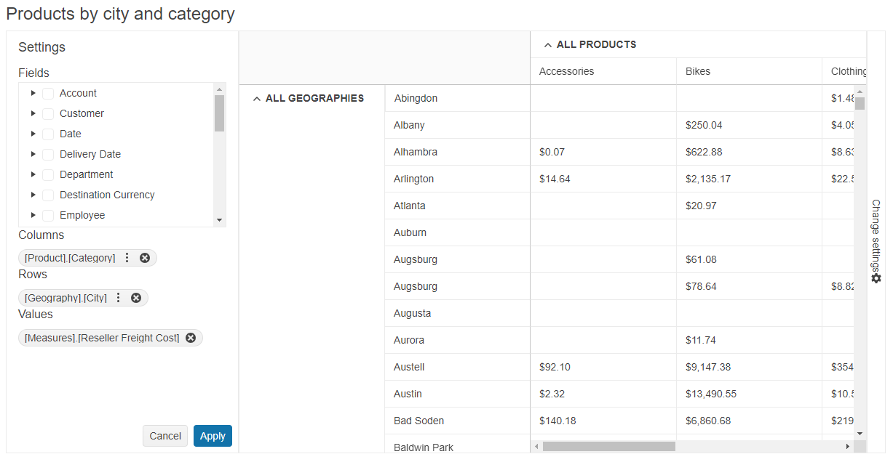

# Getting Started with the PivotGridV2

This tutorial explains how to set up a basic Telerik UI for {{ site.framework }} PivotGridV2 and highlights the major steps in the configuration of the component.

You will create a [PivotContainer](https://docs.telerik.com/{{ site.platform }}/api/pivotcontainer) that will hold the [PivotConfiguratorV2](), the PivotGridV2 component, and the [PivotConfiguratorButton](https://docs.telerik.com/{{ site.platform }}/api/pivotconfiguratorbutton). Next, you will define the PivotConfiguratorV2 and initialize the PivotGridV2 component configured for Ajax data binding to an [Online Analytical Processing (OLAP)](https://learn.microsoft.com/en-us/previous-versions/sql/sql-server-2005/ms175367(v=sql.90)) cube. After that, you will handle the PivotGridV2 events and call the `saveAsExcel()` method to export the data to Excel. Finally, you can run the sample code in [Telerik REPL](https://netcorerepl.telerik.com/) and continue exploring the components.

 

@[template](/_contentTemplates/core/getting-started-prerequisites.md#component-gs-prerequisites)

## 1. Prepare the CSHTML File

@[template](/_contentTemplates/core/getting-started-directives.md#gs-adding-directives)

Optionally, you can structure the View content by adding the desired HTML elements like headings, divs, paragraphs, and others.

```HtmlHelper
    @using Kendo.Mvc.UI
    <h4>Products by city and category</h4>
    <div>
    </div>
```

```TagHelper
    @addTagHelper *, Kendo.Mvc
    <h4>Products by city and category</h4>
    <div>
    </div>
```


## 2. Declare the PivotContainer and PivotConfiguratorButton

Declare the [PivotContainer](https://docs.telerik.com/{{ site.platform }}/api/pivotcontainer) that will hold the pivot configurator component and the [PivotConfiguratorButton](https://docs.telerik.com/{{ site.platform }}/api/pivotconfiguratorbutton) that toggles the visibility of the related PivotConfiguratorV2.

```HtmlHelper   
    @(Html.Kendo().PivotContainer()
        .Name("container")
        .ConfiguratorPosition("right")
        .Content(@<text>        
            @(Html.Kendo().PivotConfiguratorButton()
                .Name("toggleConfiguratorBtn")
                .Text("Toggle Configurator")
                .Configurator("configurator")
            )
        </text>)
    )
```

```TagHelper
    @addTagHelper *, Kendo.Mvc

    <kendo-pivotcontainer name="container" configurator-position="right">
        <kendo-pivotconfiguratorbutton name="toggleConfiguratorBtn" configurator="configurator" text="Toggle Configurator">
        </kendo-pivotconfiguratorbutton>
    </kendo-pivotcontainer>
```


## 3. Initialize the PivotConfiguratorV2

Define the PivotConfiguratorV2 supplementary component into the PivotContainer declaration. The configurator allows you to control the column and row dimensions and the measure fields of the PivotGridV2. Also, enable its `Filterable` and `Sortable` options to filter and sort the rows and columns.

```HtmlHelper   
    @(Html.Kendo().PivotContainer()
        .Name("container")
        .ConfiguratorPosition("right")
        .Content(@<text>   
            @(Html.Kendo().PivotConfiguratorV2()
                .Name("configurator")
                .Sortable()
                .Filterable()
            )

            @(Html.Kendo().PivotConfiguratorButton()
                .Name("toggleConfiguratorBtn")
                .Text("Toggle Configurator")
                .Configurator("configurator")
            )
        </text>)
    )
```

```TagHelper
    @addTagHelper *, Kendo.Mvc

    <kendo-pivotcontainer name="container" configurator-position="right">
        <kendo-pivotconfiguratorv2 name="configurator" sortable="true" filterable="true"></kendo-pivotconfiguratorv2>

        <kendo-pivotconfiguratorbutton name="toggleConfiguratorBtn" configurator="configurator" text="Toggle Configurator">
        </kendo-pivotconfiguratorbutton>
    </kendo-pivotcontainer>
```


## 4. Initialize the PivotGridV2

Use the PivotGridV2 HtmlHelper or TagHelper to add the component to a page:

* The `Name()` configuration method is mandatory as its value is used for the `id` and the `name` attributes of the PivotGridV2 element.
* The `Configurator()` option sets the `Name()` of the defined PivotConfiguratorV2 that is connected to the component.
* Add the `DataSource()` configuration option and set its type to [`Xmla`](#what-is-xmla). Configure the OLAP service dll (`https://demos.telerik.com/olap/msmdpump.dll`) in the `Read` action to bind the PivotGridV2 to data over an [OLAP cube](#what-is-an-olap-cube). Also, define the desired initial rows, columns and measures.

Define the component into the PivotContainer declaration:

```HtmlHelper   
    @(Html.Kendo().PivotContainer()
        .Name("container")
        .ConfiguratorPosition("right")
        .Content(@<text>   
            ... // PivotConfiguratorV2 declaration.

            @(Html.Kendo().PivotGridV2()
                .Name("pivotgrid")
                .ColumnWidth(200)
                .Height(580)
                .Configurator("#configurator")
                .DataSource(dataSource => dataSource.
                    Xmla()
                    .Columns(columns => {
                        columns.Add("[Product].[Category]").Expand(true);
                    })
                    .Rows(rows => rows.Add("[Geography].[City]").Expand(true))
                    .Measures(measures => measures.Values(new string[]{"[Measures].[Reseller Freight Cost]"}))
                    .Transport(transport => transport
                        .Connection(connection => connection
                            .Catalog("Adventure Works DW 2008R2")
                            .Cube("Adventure Works"))
                        .Read("https://demos.telerik.com/olap/msmdpump.dll")
                    )
                )
            )

            ... // PivotConfiguratorButton declaration.
        </text>)
    )
```

```TagHelper
    @addTagHelper *, Kendo.Mvc

    <kendo-pivotcontainer name="container" configurator-position="right">
        <!-- pivotconfiguratorv2 declaration -->

        <kendo-pivotgridv2 name="pivotgrid" column-width="200" height="580" configurator="#configurator">
            <pivot-datasource type="PivotDataSourceType.Xmla">
                <columns>
                    <pivot-datasource-column name="[Product].[Category]" expand="true"></pivot-datasource-column>
                </columns>
                <rows>
                    <row name="[Geography].[City]" expand="true"></row>
                </rows>
                <measures values=@(new string[] {"[Measures].[Reseller Freight Cost]"} )></measures>
                <transport read-url="https://demos.telerik.com/olap/msmdpump.dll">
                    <connection catalog="Adventure Works DW 2008R2" cube="Adventure Works"></connection>
                </transport>
            </pivot-datasource>
        </kendo-pivotgridv2>

        <!-- pivotconfiguratorbutton declaration -->
    </kendo-pivotcontainer>
```


## 5. Handle the PivotGridV2 Events

The PivotGrid exposes [events](/api/kendo.mvc.ui.fluent/pivotgridv2eventbuilder) that you can handle and further customize the functionality of the component. In this tutorial, you will use the `DataBound` event to access the OLAP cube data.

```HtmlHelper
     @(Html.Kendo().PivotGridV2()
        .Name("pivotgrid")
        .Events(ev => ev.DataBound("onDataBound"))
        ... // Other configuration.
    )

    <script>
        function onDataBound(e) {
            let receivedData = e.sender.dataSource.data();
            console.log(receivedData); // Log the received data in the browser console.
        }
    </script>
```

```TagHelper
    @addTagHelper *, Kendo.Mvc

    <kendo-pivotgrid name="pivotgrid" on-data-bound="onDataBound">
        <!-- Other configuration -->
    </kendo-pivotgrid>

    <script>
        function onDataBound(e) {
            let receivedData = e.sender.dataSource.data();
            console.log(receivedData); // Log the received data in the browser console.
        }
    </script>
```


## 6. (Optional) Reference Existing PivotGridV2 Instances

You can reference the PivotGridV2 instances that you have created and build on top of their existing configuration:

1. Use the `id` attribute of the component instance to get its reference.

    ```script
        <script>
            $(document).ready(function() {
                var pivotGridV2Reference = $("#pivotgrid").data("kendoPivotGridV2"); // pivotGridV2Reference is a reference to the existing PivotGridV2 instance of the helper.
            });
        </script>
    ```

1. Use the [PivotGridV2 client-side API](https://docs.telerik.com/kendo-ui/api/javascript/ui/pivotgridv2#methods) to control the behavior of the component. In this example, you will use the `saveAsPDF()` method to export the PivotGridV2 data to PDF (for example, when a button is clicked).

    ```HtmlHelper
        @(Html.Kendo().Button()
            .Name("exportBtn")
            .Content("Export to PDF")
            .Events(ev => ev.Click("onBtnClick"))
        )
    ```
    
    ```TagHelper
        @addTagHelper *, Kendo.Mvc
        <kendo-button name="exportBtn" on-click="onBtnClick">
            Export to PDF
        </kendo-button>
    ```
    
    ```Scripts
        <script>
            function onBtnClick() {
                var pivotGridV2Reference = $("#pivotgrid").data("kendoPivotGridV2");
                pivotGridV2Reference.saveAsPDF();
            }
        </script>
    ```

For more information on referencing specific helper instances, see the [Methods and Events]() article.


## Explore this Tutorial in REPL

You can continue experimenting with the code sample above by running it in the Telerik REPL server playground:

* [Sample code with the PivotGridV2 HtmlHelper](https://netcorerepl.telerik.com/cRvwlWvk30vdYhxT23)
* [Sample code with the PivotGridV2 TagHelper](https://netcorerepl.telerik.com/mHPGvivP286LiXbz46)



## Next Steps

* [Binding the PivotGridV2 to Data]()
* [Using the PivotGridV2 Templates]()
* [Exporting the PivotGridV2]()

## See Also

* [Binding the PivotGridV2 for {{ site.framework }} to Local Data (Demo)](https://demos.telerik.com/{{ site.platform }}/pivotgridv2/local-flat-data-binding)
* [Client-Side API of the PivotGridV2](https://docs.telerik.com/kendo-ui/api/javascript/ui/pivotgridv2)
* [Server-Side API of the PivotGridV2](/api/pivotgridv2)

* [Server-Side API of the PivotGridV2 TagHelper](/api/taghelpers/pivotgridv2)

* [Knowledge Base Section](/knowledge-base)