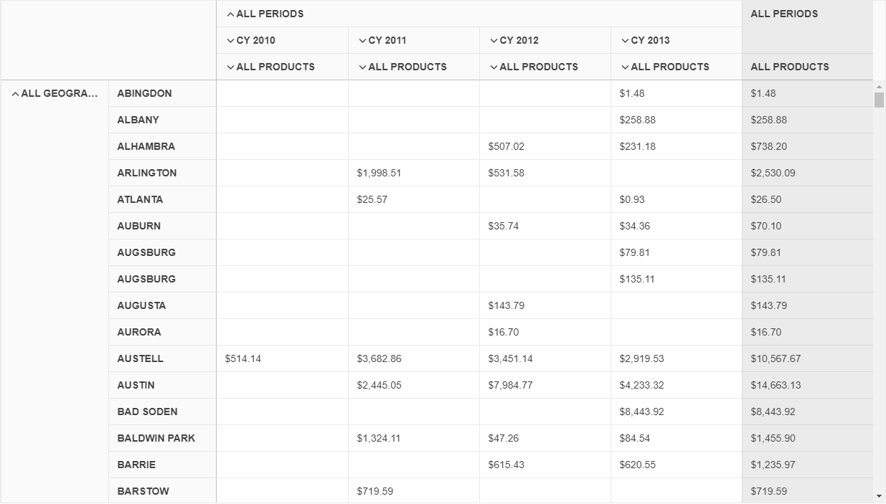


    
    

    
    


# {{ site.framework }} PivotGridV2 Overview


The Telerik UI PivotGridV2 HtmlHelper and TagHelper for {{ site.framework }} are server-side wrappers for the Kendo UI PivotGridV2 widget. To add the component to your ASP.NET Core application, you can use either.

The Telerik UI PivotGridV2 HtmlHelper for {{ site.framework }} is a server-side wrapper for the Kendo UI PivotGridV2 widget.


The PivotGridV2 represents multidimensional data in a cross-tabular format. Compared to the legacy [PivotGrid](), PivotGridV2 offers a brand new design, and its future-proof architecture allows the implementation of many upcoming features. We recommended using the PivotGridV2 in your new projects, because, at some point in the future, the PivotGridV2 will replace the legacy PivotGrid. For more details about the differences between the PivotGrid and PivotGridV2, refer to the [Comparison]() article.

* [Demo page for the PivotGridV2 HtmlHelper](https://demos.telerik.com/{{ site.platform }}/pivotgridv2)

* [Demo page for the PivotGridV2 TagHelper](https://demos.telerik.com/aspnet-core/pivotgridv2/tag-helper)


## Basic Configuration

To configure the PivotGridV2 for Ajax binding to an [Adventure Works](https://learn.microsoft.com/en-us/analysis-services/multidimensional-tutorial/multidimensional-modeling-adventure-works-tutorial?view=asallproducts-allversions) cube that is hosted on `https://demos.telerik.com/olap/msmdpump.dll`, follow the next steps:

1. Create a new {{ site.framework }} application. If you have the [{{ site.product }} Visual Studio Extensions]() installed, create a {{ site.product }} application. Name the application `KendoPivotGridV2`. If you decide not to use the {{ site.product }} Visual Studio Extensions, follow the steps from the [getting started article]() to add {{ site.product }} to the application.
1. Add a PivotGridV2 to the `Index` View.

    ```HtmlHelper
         @(Html.Kendo().PivotConfiguratorV2()
            .Name("configurator")
            .Filterable(true)
            .Sortable()
            .Height(570)
        )

        @(Html.Kendo().PivotGridV2()
            .Name("pivotgridv2")
            .ColumnWidth(200)
            .Height(570)
            .Configurator("#configurator")
            .DataSource(dataSource => dataSource.
                Xmla()
                .Columns(columns => {
                    columns.Add("[Date].[Calendar]").Expand(true);
                    columns.Add("[Product].[Category]");
                })
                .Rows(rows => rows.Add("[Geography].[City]"))
                .Measures(measures => measures.Values(new string[]{"[Measures].[Reseller Freight Cost]"}))
                .Transport(transport => transport
                    .Connection(connection => connection
                        .Catalog("Adventure Works DW 2008R2")
                        .Cube("Adventure Works"))
                    .Read(read => read
                        .Url("https://demos.telerik.com/olap/msmdpump.dll")
                        .DataType("text")
                        .ContentType("text/xml")
                        .Type(HttpVerbs.Post)
                    )
                )
            )
        )
    ```
    
    ```TagHelper
        <kendo-pivotconfiguratorv2 name="configurator" sortable="true" filterable="true" height="570">
        </kendo-pivotconfiguratorv2>

        <kendo-pivotgridv2 name="pivotgrid" column-width="200" height="570" configurator="#configurator">
            <pivot-datasource type="PivotDataSourceType.Xmla">
                <columns>
                    <pivot-datasource-column name="[Date].[Calendar]" expand="true"></pivot-datasource-column>
                    <pivot-datasource-column name="[Product].[Category]"></pivot-datasource-column>
                </columns>
                <rows>
                    <row name="[Geography].[City]"></row>
                </rows>
                <measures values=@(new string[] {"[Measures].[Reseller Freight Cost]"} )></measures>
                <transport read-url="https://demos.telerik.com/olap/msmdpump.dll" datatype="text" content-type="text/xml" type="POST">
                    <connection catalog="Adventure Works DW 2008R2" cube="Adventure Works"></connection>
                </transport>
            </pivot-datasource>
        </kendo-pivotgridv2>
    ````
    

1. Build and run the application.

The following image demonstrates the output from the example.



## Functionality and Features

* [Comparison with the PivotGrid]()&mdash;Learn more about the major differences between the PivotGrid and PivotGridV2 components.
* [Data binding]()&mdash;You can bind the PivotGridV2 to [Online Analytical Processing (OLAP)](https://learn.microsoft.com/en-us/previous-versions/sql/sql-server-2005/ms175367(v=sql.90)) cube and or flat data.
* [Templates]()&mdash;The available templates allow you to control the rendering of the data cells and headers.
* [PDF export]()&mdash;You can export the component data to PDF through a single click.
* [Accessibility]()&mdash;The PivotGridV2 is accessible for screen readers, supports WAI-ARIA, Section 508, WCAG 2.2, and delivers [keyboard shortcuts]() for faster navigation.

## Next Steps

* [Getting Started with the PivotGridV2]()
* [Basic Usage of the PivotGridV2 HtmlHelper for {{ site.framework }} (Demo)](https://demos.telerik.com/{{ site.platform }}/pivotgridv2)

* [Basic Usage of the PivotGridV2 TagHelper for ASP.NET Core (Demo)](https://demos.telerik.com/aspnet-core/pivotgridv2/tag-helper)


## See Also

* [Server-Side API of the PivotGridV2 HtmlHelper](/api/pivotgridv2)

* [Server-Side API of the PivotGridV2 TagHelper](/api/taghelpers/pivotgridv2)

* [Client-Side API of the PivotGridV2](https://docs.telerik.com/kendo-ui/api/javascript/ui/pivotgridv2)
