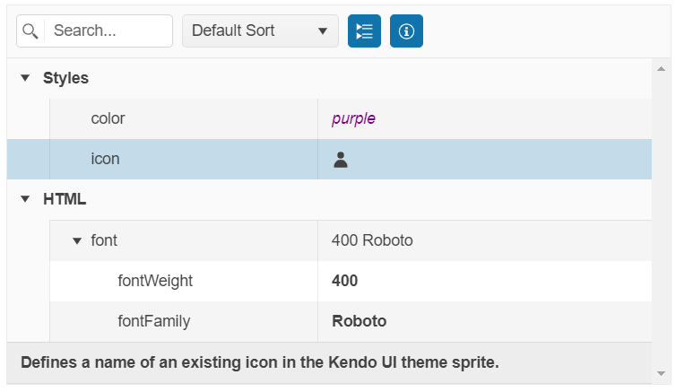

# Getting Started with the PropertyGrid

This tutorial explains how to set up the Telerik UI for {{ site.framework }} PropertyGrid and goes through the steps in the configuration of the component.

You will declare a view model and bind it to an instance of the PropertyGrid component. Next, you will configure the PropertyGrid items and their editors. Then, you will use the template options to enhance the items appearance and learn how to handle the JavaScript events of the component. Finally, you can run the sample code in [Telerik REPL](https://netcorerepl.telerik.com/) and continue exploring the components.

After completing this guide, you will achieve the following results:

 

@[template](/_contentTemplates/core/getting-started-prerequisites.md#component-gs-prerequisites)

## 1. Prepare the CSHTML File

@[template](/_contentTemplates/core/getting-started-directives.md#gs-adding-directives)

Optionally, you can structure the document by adding the desired HTML elements like headings, divs, paragraphs, and others.

```HtmlHelper
    @using Kendo.Mvc.UI

    <h4>Review element properties</h4>
    <div>

    </div>
```

```TagHelper
    @addTagHelper *, Kendo.Mvc

    <h4>Review element properties</h4>
    <div>

    </div>
```


## 2. Declare the View Model

Binding a model to the PropertyGrid will set the PropertyGrid items internally to the Telerik Editor components that are suitable for the bound data. In addition, the `DataAnnotation` attributes of the model properties will be automatically applied to the PropertyGrid items.

```Model
	using System;
    using System.ComponentModel.DataAnnotations;

    public class PropertyViewMiodel
    {
        [Display(GroupName = "Styles", Description = "Select a different color that will be applied in the template.")]
        public string color { get; set; }

        [Display(GroupName = "Styles", Description = "Defines a name of an existing icon in the Kendo UI theme sprite.")]
        public string icon { get; set; }

        [Display(GroupName = "HTML")]
        public FontViewModel font { get; set; }
    }

    public class FontViewModel
    {
        [Required]
        [Display(GroupName = "font", Description = "Sets how thick or thin characters in text must be displayed.")]
        public int fontWeight { get; set; }

        [Required]
        [Display(GroupName = "font", Description = "Specifies the font family name for the element.")]
        public string fontFamily { get; set; }
    }
```
```Controller
    public ActionResult Index()
    {
        return View(new PropertyViewMiodel() {
            color = "red",
            icon = "star",
            font = new FontViewModel()
            {
                fontWeight = 400,
                fontFamily = "Roboto"
            }
        });
    }
```

## 3. Initialize the PropertyGrid

Use the PropertyGrid HtmlHelper or TagHelper to configure the component.

* The `Name()` configuration method is mandatory as its value is used for the `id` and the `name` attributes of the PropertyGrid element.
* The `Model` option defines the model to which the PropertyGrid binds.
* The `EditMode()` method enables the component editing.
* The `Columns()` configuration specifies the widths of the field and value columns.

```HtmlHelper
    @model PropertyViewMiodel

    @(Html.Kendo().PropertyGrid<PropertyViewMiodel>()
        .Name("propertyGrid")
        .Model(Model)
        .Columns(columns => columns.FieldColumn(fieldCol => fieldCol.Width(200)).ValueColumn(valueCol => valueCol.Width(250)))
        .EditMode(true)
    )
```

```TagHelper
    @addTagHelper *, Kendo.Mvc
    @model PropertyViewMiodel  

    <kendo-propertygrid name="propertyGrid" model="@Model" edit-mode="true">
        <columns>
            <field-column width="200" />
            <value-column width="250" />
        </columns>
    </kendo-propertygrid>
```


## 4. Configure the Items Editors

The next step is to configure custom editors for the property values. 

* Use a [DropDownList]() editor for the **color** and **icon** properties.

    ```HtmlHelper
        @model PropertyViewMiodel

        @(Html.Kendo().PropertyGrid<PropertyViewMiodel>()
            .Name("propertyGrid")
            .Model(Model)
            .Columns(columns => columns.FieldColumn(fieldCol => fieldCol.Width(200)).ValueColumn(valueCol => valueCol.Width(250)))
            .EditMode(true)
            .Items(items =>
            {
                items.Add().Field(f => f.color)
                .Editor(editor => editor
                    .DropDownList()
                    .BindTo(new string[] { "red", "green", "blue", "purple", "orange" }));

                items.Add().Field(f => f.icon)
                .Editor(editor => editor
                    .DropDownList()
                    .DataTextField("Text")
                    .DataValueField("Value")
                    .BindTo(new List<SelectListItem>() {
                        new SelectListItem() {
                            Text = "gear", Value = "gear"
                        },
                        new SelectListItem() {
                            Text = "star", Value = "star"
                        },
                        new SelectListItem() {
                            Text = "folder", Value = "folder"
                        },
                        new SelectListItem() {
                            Text = "user", Value = "user"
                        },
                        new SelectListItem() {
                            Text = "info-circle", Value = "info-circle"
                        }
                    }));
            })
        )
    ```
    
    ```TagHelper
        @addTagHelper *, Kendo.Mvc
        @model PropertyViewMiodel 

        @{
            var colors = new string[] { "red", "green", "blue", "purple", "orange" };
            var icons = new List<SelectListItem>() {
                new SelectListItem() {
                    Text = "gear", Value = "gear"
                },
                new SelectListItem() {
                    Text = "star", Value = "star"
                },
                new SelectListItem() {
                    Text = "folder", Value = "folder"
                },
                new SelectListItem() {
                    Text = "user", Value = "user"
                },
                new SelectListItem() {
                    Text = "info-circle", Value = "info-circle"
                }
            };
        } 

        <kendo-propertygrid name="propertyGrid" model="@Model" edit-mode="true">
            <columns>
                <field-column width="200" />
                <value-column width="250" />
            </columns>
            <property-grid-items>
                <property-grid-item field="color">
                    <dropdownlist-editor bind-to="colors"></dropdownlist-editor>
                </property-grid-item>
                <property-grid-item field="icon">
                    <dropdownlist-editor datatextfield="Text" datavaluefield="Value" bind-to="icons"></dropdownlist-editor>
                </property-grid-item>
            </property-grid-items>
        </kendo-propertygrid>
    ```
    

* Use an [AutoComplete]() editor for the **fontFamily** property.

    ```HtmlHelper
        @model PropertyViewMiodel

        @(Html.Kendo().PropertyGrid<PropertyViewMiodel>()
            .Name("propertyGrid")
            .Model(Model)
            .Columns(columns => columns.FieldColumn(fieldCol => fieldCol.Width(200)).ValueColumn(valueCol => valueCol.Width(250)))
            .EditMode(true)
            .Items(items =>
            {
                ... //Additional configuration
                items.Add().Field("font")
                .Items(childItems =>
                {
                    childItems.Add().Field("fontFamily").Editor(editor => editor
                    .AutoComplete()
                    .BindTo(new string[] { "Arial", "Roboto", "Georgia", "Calibri", "Cursive", "Monospace", "Fantasy" }));
                });
            })
        )
    ```
    
    ```TagHelper
        @addTagHelper *, Kendo.Mvc
        @model PropertyViewMiodel 

        @{
            var fonts = new string[] {"Arial", "Roboto", "Georgia", "Calibri", "Cursive", "Monospace", "Fantasy"};
        } 

        <kendo-propertygrid name="propertyGrid" model="@Model" edit-mode="true">
            <columns>
                <field-column width="200" />
                <value-column width="250" />
            </columns>
            <property-grid-items>
                <!-- Additional configuration -->
                <property-grid-item field="font" editable="false">
                    <property-grid-items>
                        <property-grid-item field="fontFamily">
                            <autocomplete-editor bind-to="fonts"></autocomplete-editor>
                        </property-grid-item>
                    </property-grid-items>
                </property-grid-item>
            </property-grid-items>
        </kendo-propertygrid>
    ```
    

## 5. Customize the Appearance of the PropertyGrid

To alter the appearance of the PropertyGrid values, use the template options of the items. By using the `TemplateHandler()` method, you can return the desired template through a JavaScript function. Another option is to pass the template as a string to the `Template()` method.

```HtmlHelper
    @model PropertyViewMiodel

    @(Html.Kendo().PropertyGrid<PropertyViewMiodel>()
        .Name("propertyGrid")
        .Model(Model)
        .Columns(columns => columns.FieldColumn(fieldCol => fieldCol.Width(200)).ValueColumn(valueCol => valueCol.Width(250)))
        .EditMode(true)
        .Items(items =>
        {
            items.Add().Field(f => f.color)
            .Template("<span style='color:#=value#'>#=value#</span>")
            .Editor(...);

            items.Add().Field(f => f.icon)
            .TemplateHandler("iconTemplate")
            .Editor(...);

            items.Add().Field("font").TemplateHandler("fontTemplate")
            .Items(...);
        })
    )
```

```TagHelper
    @addTagHelper *, Kendo.Mvc
    @model PropertyViewMiodel 

    <kendo-propertygrid name="propertyGrid" model="@Model" edit-mode="true">
        <columns>
            <field-column width="200" />
            <value-column width="250" />
        </columns>
         <property-grid-items>
            <property-grid-item field="color" template="<span style='color:#=value#'>#=value#</span>">
                ...
            </property-grid-item>
            <property-grid-item field="icon" template-handler="iconTemplate">
                ...
            </property-grid-item>
            <property-grid-item field="font" template-handler="fontTemplate" editable="false">
                ...
            </property-grid-item>
        </property-grid-items>
    </kendo-propertygrid>
```

```Scripts
    <script>
        function iconTemplate(data) {
            return `${kendo.ui.icon(data.value)}`;
        }

        function fontTemplate(data) {
            var propertyGridModel = $("#propertyGrid").data('kendoPropertyGrid').model();
            return `<span class="fontWeight">${propertyGridModel.font["fontWeight"]}</span> <span class="fontFamily">${propertyGridModel.font["fontFamily"]}</span>`;
        }
    </script>
```
In addition, you can control the width and height of the PropertyGrid by setting the respective `Width()` and `Height()` options.

```HtmlHelper
    @model PropertyViewMiodel

    @(Html.Kendo().PropertyGrid<PropertyViewMiodel>()
        .Name("propertyGrid")
        .Model(Model)
        .Width(600)
        .Height(800)
        .Columns(columns => 
        {
            columns.FieldColumn(fieldCol => fieldCol.Width(200));
            columns.ValueColumn(valueCol => valueCol.Width(250));
        })
        ... //Additional configuration
    )
```

```TagHelper
    @addTagHelper *, Kendo.Mvc
    @model PropertyViewMiodel 

    <kendo-propertygrid name="propertyGrid" model="@Model" width="600" height="800">
        <columns>
            <field-column width="200" />
            <value-column width="250" />
        </columns>
        <!-- Additional configuration -->
    </kendo-propertygrid>
```


## 6. Handle the PropertyGrid Events

The PropertyGrid exposes events that you can handle and further customize the functionality of the component. In this tutorial, you will use the exposed `Edit` event to log the current state of the model in the browser's console.

```HtmlHelper
    @model PropertyViewMiodel

    @(Html.Kendo().PropertyGrid<PropertyViewMiodel>()
        .Name("propertyGrid")
        .Model(Model)
        .Events(ev => ev.Edit("onEdit"))
        .... //Additional configuration
    )

    <script>
        function onEdit(e) {
            console.log(e.model);
        }
    </script>
```

```TagHelper
    @addTagHelper *, Kendo.Mvc
    @model PropertyViewMiodel 

    <kendo-propertygrid name="propertyGrid" model="@Model" edit-mode="true" on-edit="onEdit">
        <!-- Additional configuration -->
    </kendo-propertygrid>

    <script>
        function onEdit(e) {
            console.log(e.model);
        }
    </script>
```


## 7. (Optional) Reference Existing PropertyGrid Instances

Referencing existing component instances allows you to build on top of their configuration. To reference an existing PropertyGrid instance, use the [`jQuery.data()`](http://api.jquery.com/jQuery.data/) method.

1. Use the `Name()` option of the component to establish a reference.

    ```script
        <script>
            var propertyGridReference = $("#propertyGrid").data("kendoPropertyGrid"); // propertyGridReference is a reference to the existing instance of the helper.
        </script>
    ```

1. Use the [PropertyGrid client-side API](https://docs.telerik.com/kendo-ui/api/javascript/ui/propertygrid#methods) to control the behavior of the widget. In this example, you will see how to toggle the expanded or collapsed state of the first group (for example, when a button is clicked).

    ```HtmlHelper
        @(Html.Kendo().Button()
            .Name("btn")
            .Content("Toggle first PropertyGrid group")
            .Events(ev => ev.Click("onBtnClick")))
        
        <script>
            function onBtnClick() {
                var propertyGridReference = $("#propertyGrid").data("kendoPropertyGrid");
                propertyGridReference.toggleGroup($("#propertyGrid .k-table-group-row.k-grouping-row:nth-child(1)"));
            }
        </script>
    ```
    
    ```TagHelper
        @addTagHelper *, Kendo.Mvc

        <kendo-button name="btn" on-click="onBtnClick">
            Toggle first PropertyGrid group
        </kendo-button>

        <script>
            function onBtnClick() {
                var propertyGridReference = $("#propertyGrid").data("kendoPropertyGrid");
                propertyGridReference.toggleGroup($("#propertyGrid .k-table-group-row.k-grouping-row:nth-child(1)"));
            }
        </script>
    ```
    

For more information on referencing specific helper instances, see the [Methods and Events]() article.


## Explore this Tutorial in REPL

You can continue experimenting with the code sample above by running it in the Telerik REPL server playground:

* [Sample code with the PropertyGrid HtmlHelper](https://netcorerepl.telerik.com/wSEevJmQ11QuSQaA42)
* [Sample code with the PropertyGrid TagHelper](https://netcorerepl.telerik.com/weuelzQG159D1Txi06)



## Next Steps

* [Configuring the PropertyGrid Columns]()
* [Configuring the Items in the PropertyGrid]()
* [Handling JavaScript Events of the User Interactions]() 

## See Also

* [Using the API of the PropertyGrid for {{ site.framework }} (Demo)](https://demos.telerik.com/{{ site.platform }}/propertygrid/api)
* [Client-Side API of the PropertyGrid](https://docs.telerik.com/kendo-ui/api/javascript/ui/propertygrid)
* [Server-Side API of the PropertyGrid](/api/propertygrid)

* [Server-Side API of the PropertyGrid TagHelper](/api/taghelpers/propertygrid)

