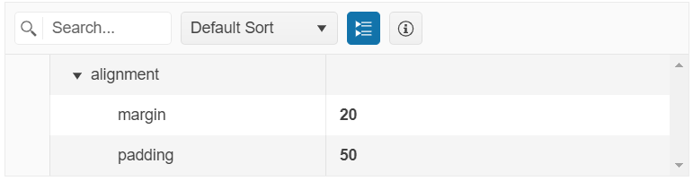
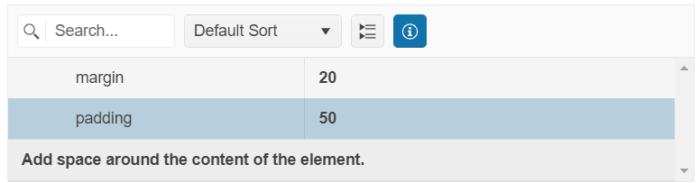

# Items

By default, all properties of the Model that binds to the PropertyGrid are automatically loaded in the data table. 

The `Items` option allows you to customize the behavior and appearance of the displayed properties and their values. The `Items` configuration maps the properties of the Model that binds to the component and through it you can:

* Specify the required editors and edit mode type.
* Adjust the names of the groups and property descriptions.
* Customize the appearance of the values.

## Configure Groups

The PropertyGrid supports items grouping that is enabled by default. The groups can be toggled through the built-in toolbar button.



To set the name of the group to which the item belongs, use the `Group()` option.

```HtmlHelper
    @(Html.Kendo().PropertyGrid<PropertyViewModel>()
        .Name("propertyGrid")
        .Items(items =>
        {
            items.Add().Field(f => f.size).Group("Group 1");

        })
        ... //Additional configuration
    )
```

```TagHelper
    @addTagHelper *, Kendo.Mvc

    <kendo-propertygrid name="propertyGrid">
        <property-grid-items>
            <property-grid-item field="size" group="Group 1">
            </property-grid-item>
        </property-grid-items>
      <!-- Additional configuration -->
    </kendo-propertygrid>
```


To disable the grouping functionality, set the `Groupable()` option to `false`.

```HtmlHelper
    @(Html.Kendo().PropertyGrid<PropertyViewModel>()
        .Name("propertyGrid")
        .Groupable(false)
        ... //Additional configuration
    )
```

```TagHelper
    @addTagHelper *, Kendo.Mvc

    <kendo-propertygrid name="propertyGrid" groupable="false">
      <!-- Additional configuration -->
    </kendo-propertygrid>
```


## Configure Descriptions

You can set a description for each item that will be displayed in the details box at the bottom of the PropertyGrid table when the specified field is selected. The details box can be toggled through the built-in **Toggle Info box** toolbar button.



Use the `Description()` option to specify the desired property description.

```HtmlHelper
    @(Html.Kendo().PropertyGrid<PropertyViewModel>()
        .Name("propertyGrid")
        .Items(items =>
        {
            items.Add().Field(f => f.size).Description("Controls the overall physical size of a button. Default value is 'medium'.");

        })
        ... //Additional configuration
    )
```

```TagHelper
    @addTagHelper *, Kendo.Mvc

    <kendo-propertygrid name="propertyGrid">
        <property-grid-items>
            <property-grid-item field="size" description="Controls the overall physical size of a button. Default value is 'medium'.">
            </property-grid-item>
        </property-grid-items>
      <!-- Additional configuration -->
    </kendo-propertygrid>
```


To prevent the rendering of the details box at the bottom of the PropertyGrid and disable the functionality, set the `ShowDetails()` option to `false`.

```HtmlHelper
    @(Html.Kendo().PropertyGrid<PropertyViewModel>()
        .Name("propertyGrid")
        .ShowDetails(false)
        ... //Additional configuration
    )
```

```TagHelper
    @addTagHelper *, Kendo.Mvc

    <kendo-propertygrid name="propertyGrid" show-details="false">
      <!-- Additional configuration -->
    </kendo-propertygrid>
```


## Use DataAnnotation Attributes

The PropertyGrid HtmlHelper supports the [`DataAnnotation`](https://learn.microsoft.com/en-us/dotnet/api/system.componentmodel.dataannotations?view=net-8.0) attributes applied to the Model properties. For example, you can set the group name, property description, value formatting, and validations by using `DataAnnotation` attributes instead of specifying them through the `Items()` configuration of the PropertyGrid.

The example below shows how to specify `DataAnnotation` attributes to the Model that binds to the PropertyGrid component. If the `Items()` configuration is not set within the component declaration, all `DataAnnotation` attributes are applied to the respective properties.

```Model
    using System.ComponentModel.DataAnnotations;

    public class PropertyViewModel
    {
        [Required]
        [Display(GroupName = "numeric")]
        public int OrderID { get; set; }

        [Range(2,20)]
        [Display(GroupName = "numeric", Description ="An example description for the Freight.")]
        public decimal? Freight { get; set; }
 
        [DisplayFormat(DataFormatString = "{0: dd/MM/yyyy}")]
        [Display(GroupName = "date", Description ="The order date.")]
        public DateTime? OrderDate { get; set; }

        [MaxLength(10)]
        [Display(GroupName = "ship information")]
        public string ShipCity { get; set; }
    }
```
```HtmlHelper
    @model PropertyViewModel

    @(Html.Kendo().PropertyGrid<PropertyViewModel>()
        .Name("propertyGrid")
        .Model(Model)
        .Columns(columns => 
        {
            columns.FieldColumn(fieldCol => fieldCol.Width(200));
            columns.ValueColumn(valueCol => valueCol.Width(250));
        })
    )
```

```TagHelper
    @addTagHelper *, Kendo.Mvc
    @model PropertyViewModel

    <kendo-propertygrid name="propertyGrid" model="@Model">
        <columns>
            <field-column width="200" />
            <value-column width="250" />
        </columns>
    </kendo-propertygrid>
```


To override the applied `DataAnnotations` attributes of specific properties such as group name, description, numeric range constraints, and more, use the available options in the `Items()` configuration.

The following example shows how to override the group name that specified through [`GroupName DataAnnotation`](https://learn.microsoft.com/es-es/dotnet/api/system.componentmodel.dataannotations.displayattribute.groupname).

```Model
    using System.ComponentModel.DataAnnotations;

    public class PropertyViewModel
    {
        [Required]
        [Display(GroupName = "numeric")]
        public int OrderID { get; set; }

        [Range(2,20)]
        [Display(GroupName = "numeric", Description ="An example description for the Freight.")]
        public decimal? Freight { get; set; }
    }
```
```HtmlHelper
    @model PropertyViewModel

    @(Html.Kendo().PropertyGrid<PropertyViewModel>()
        .Name("propertyGrid")
        .Model(Model)
        .Columns(columns => 
        {
            columns.FieldColumn(fieldCol => fieldCol.Width(200));
            columns.ValueColumn(valueCol => valueCol.Width(250));
        })
        .Items(items =>
        {
            items.Add().Field(f => f.OrderID).Group("Group 1");
            items.Add().Field(f => f.Freight).Group("Group 1");
        })
    )
```

```TagHelper
    @addTagHelper *, Kendo.Mvc
    @model PropertyViewModel

    <kendo-propertygrid name="propertyGrid" model="@Model">
        <columns>
            <field-column width="200" />
            <value-column width="250" />
        </columns>
        <property-grid-items>
            <property-grid-item field="OrderID" group="Group 1"></property-grid-item>
            <property-grid-item field="Freight" group="Group 1"></property-grid-item>
        </property-grid-items>
    </kendo-propertygrid>
```


## Configure Editors

You can explicitly configure an editor for a specific field by using any of the following options:

* Using the `Editor()` option to set an AutoComplete editor for a field.

    ```HtmlHelper
        @model PropertyViewModel

        @(Html.Kendo().PropertyGrid<PropertyViewModel>()
            .Name("propertyGrid")
            .Model(Model)
            .Items(items =>
            {
                
                items.Add().Field(f => f.FontFamily)
                .Editor(editor => editor
                    .AutoComplete()
                    .BindTo(new string[] { "Arial", "Roboto", "Georgia", "Calibri", "Cursive", "Monospace", "Fantasy" }));
            })
            ... //Additional configuration
        )
    ```
    
    ```TagHelper
        @addTagHelper *, Kendo.Mvc
        @model PropertyViewModel

        @{
            var fonts = new string[] { "Arial", "Roboto", "Georgia", "Calibri", "Cursive", "Monospace", "Fantasy" };
        }

        <kendo-propertygrid name="propertyGrid" model="@Model">
            <property-grid-items>
                <property-grid-item field="FontFamily">
                    <autocomplete-editor bind-to="fonts"></autocomplete-editor>
                </property-grid-item>
            </property-grid-items>
            <!-- Additional configuration -->
        </kendo-propertygrid>
    ```
    
    ```Model

        public class PropertyViewModel
        {
            public string FontFamily { get; set; }
        }
    ```
    Alternatively, you can use the [Template]() component to define the required field editor.

* Using the `EditorHandler()` option to set a custom editor for a field.

    ```HtmlHelper
        @model PropertyViewModel

        @(Html.Kendo().PropertyGrid<PropertyViewModel>()
            .Name("propertyGrid")
            .Model(Model)
            .Items(items =>
            {
                
                items.Add().Field(f => f.FontFamily).EditorHandler("fontFamilyEditor");
            })
            ... //Additional configuration
        )
    ```
    
    ```TagHelper
        @addTagHelper *, Kendo.Mvc
        @model PropertyViewModel

        <kendo-propertygrid name="propertyGrid" model="@Model">
            <property-grid-items>
                <property-grid-item field="FontFamily" editor-handler="fontFamilyEditor">
                </property-grid-item>
            </property-grid-items>
            <!-- Additional configuration -->
        </kendo-propertygrid>
    ```
    
    ```Model

        public class PropertyViewModel
        {
            public string FontFamily { get; set; }
        }
    ```
    ```Scripts
        <script>
            function fontFamilyEditor(container, options) {
                $('<textarea class="myCustomEditor" data-bind="value: ' + options.field + '" name="' + options.model.field + '"/>')
                .appendTo(container);
            }
        </script>
    ```

## See Also

* [Server-Side API of the PropertyGrid HtmlHelper](/api/propertygrid)

* [Server-Side API of the PropertyGrid TagHelper](/api/taghelpers/propertygrid)

* [Client-Side API of the PropertyGrid](https://docs.telerik.com/kendo-ui/api/javascript/ui/propertygrid)
