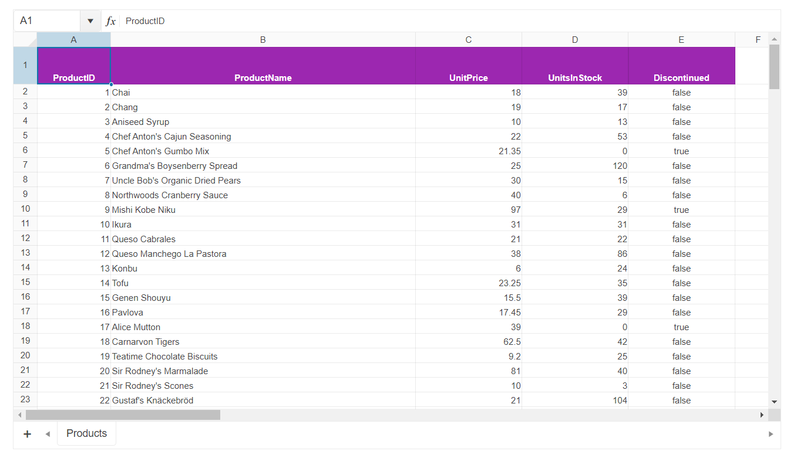

# Getting Started with the Spreadsheet

This tutorial explains how to set up the Telerik UI for {{ site.framework }} Spreadsheet.

You will declare a product view model and bind it to an instance of the Spreadsheet component. Then, you will set up a sheet by configuring its columns, rows and by providing a DataSource for it. Next, you will configure the DataSource, the read transport operation for the Spreadsheet, and the server endpoint to handle the request at the backend. Finally, you will learn how to subscribe to client-side events and reference the client-side instance of the component.

After completing this guide, you will achieve the following results:

 

@[template](/_contentTemplates/core/getting-started-prerequisites.md#repl-component-gs-prerequisites)

## 1. Prepare the CSHTML File

@[template](/_contentTemplates/core/getting-started-directives.md#gs-adding-directives)

> Starting with v2023.3.1115 the JSZip library is no longer distributed with the rest of the Kendo UI for jQuery scripts. You must use one of the official distribution channels such as `unpkg` instead.

* Add the [JSZip](https://stuk.github.io/jszip/) library that is used internally by the Spreadsheet:

```HtmlHelper
@using Kendo.Mvc.UI
<script src="https://unpkg.com/jszip/dist/jszip.min.js"></script>

```

```TagHelper
@addTagHelper *, Kendo.Mvc
<script src="https://unpkg.com/jszip/dist/jszip.min.js"></script>

```


Optionally, you can structure the document by adding the desired HTML elements like headings, divs, paragraphs, and others.

## 2. Declare the View Model

Declare the `SpreadsheetProductViewModel`.

```C#
using System.ComponentModel.DataAnnotations;
using System.ComponentModel;
using System;

namespace Kendo.Mvc.Examples.Models
{
    public class SpreadsheetProductViewModel
    {
        [ScaffoldColumn(false)]
        public int ProductID
        {
            get;
            set;
        }

        [Required]
        [Display(Name = "Product name")]
        public string ProductName
        {
            get;
            set;
        }

        [Display(Name = "Unit price")]
        [DataType(DataType.Currency)]
        [Range(0, int.MaxValue)]
        public decimal UnitPrice
        {
            get;
            set;
        }

        [Display(Name = "Units in stock")]
        [DataType("Integer")]
        [Range(0, int.MaxValue)]
        public int UnitsInStock
        {
            get;
            set;
        }

        public bool Discontinued
        {
            get;
            set;
        }
    }
}
```

## 3. Initialize the Spreadsheet

Use the Spreadsheet HtmlHelper or TagHelper to add the component to a page and set some of its options.

* Use the `Name()` configuration method to assign a name to the instance of the helper&mdash;this is mandatory as its value is used for the `id` and the `name` attributes of the outermost Spreadsheet element.
* Configure the `Sheets` by giving each one a `Name` and setting up its `Columns` and `Rows`. When configuring the `Rows`, set up the formatting of the header row's cells with the options `Bold`, `Background`, `TextAlign`, and `Color`.
* Add a `DataSource()` for each sheet you'd like to bind to remote data and pass a JavaScript handler that would submit the read request to the endpoint.

```HtmlHelper
@using Kendo.Mvc.UI
<script src="https://unpkg.com/jszip/dist/jszip.min.js"></script>

    @(Html.Kendo().Spreadsheet()
        .Name("spreadsheet")
        .HtmlAttributes(new { style = "width:100%" })
        .Toolbar(false)
        .Sheetsbar(false)
        .Sheets(sheets =>
        {
            sheets.Add()
                .Name("Products")
                .DataSource<Kendo.Mvc.Examples.Models.SpreadsheetProductViewModel>(ds => ds
                    .Custom()
                    .Batch(true)
                    .PageSize(25)
                    .Transport(t => t
                        .Read("onRead")
                    )
                )
                .Columns(columns =>
                {
                    columns.Add().Width(100);
                    columns.Add().Width(415);
                    columns.Add().Width(145);
                    columns.Add().Width(145);
                    columns.Add().Width(145);
                })
                .Rows(rows =>
                {
                    rows.Add().Height(40).Cells(cells =>
                    {
                        cells.Add()
                            .Bold(true)
                            .Background("#9c27b0")
                            .TextAlign(SpreadsheetTextAlign.Center)
                            .Color("white");

                        cells.Add()
                            .Bold(true)
                            .Background("#9c27b0")
                            .TextAlign(SpreadsheetTextAlign.Center)
                            .Color("white");

                        cells.Add()
                            .Bold(true)
                            .Background("#9c27b0")
                            .TextAlign(SpreadsheetTextAlign.Center)
                            .Color("white");

                        cells.Add()
                            .Bold(true)
                            .Background("#9c27b0")
                            .TextAlign(SpreadsheetTextAlign.Center)
                            .Color("white");

                        cells.Add()
                            .Bold(true)
                            .Background("#9c27b0")
                            .TextAlign(SpreadsheetTextAlign.Center)
                            .Color("white");
                    });
                });
        })
    )

<script>
    function onRead(options) {
        $.ajax({
            url: '@Url.Action("Data_Source_Products_Read", "Spreadsheet")',
            dataType: "json",
            success: function (result) {
                options.success(result.Data);
            },
            error: function (result) {
                options.error(result);
            }
        });
    }
</script>
```

```TagHelper
@addTagHelper *, Kendo.Mvc
<script src="https://unpkg.com/jszip/dist/jszip.min.js"></script>

<kendo-spreadsheet name="spreadsheet" style="width: 100%">
    <toolbar enabled="false" />
    <sheets>
        <sheet name="Products">
            <datasource type="DataSourceTagHelperType.Custom" page-size="25">
                <schema data="Data" errors="Errors" total="Total">
                    <model id="ProductID">
                        <fields>
                            <field name="ProductID" type="number" editable="false"></field>
                            <field name="ProductName" type="string"></field>
                            <field name="UnitPrice" type="number"></field>
                            <field name="UnitsInStock" type="number"></field>
                            <field name="Discontinued" type="boolean"></field>
                        </fields>
                    </model>
                </schema>
                <transport>
                    <read url="@Url.Action("Data_Source_Products_Read", "Spreadsheet")" />
                </transport>
            </datasource>
            <columns>
                <sheet-column width="100" />
                <sheet-column width="415" />
                <sheet-column width="145" />
                <sheet-column width="145" />
                <sheet-column width="145" />
            </columns>
            <rows>
                <sheet-row height="50">
                    <cells>
                        <cell index="0" bold="true" background="#9c27b0" text-align="SpreadsheetTextAlign.Center" color="white"></cell>
                        <cell index="1" bold="true" background="#9c27b0" text-align="SpreadsheetTextAlign.Center" color="white"></cell>
                        <cell index="2" bold="true" background="#9c27b0" text-align="SpreadsheetTextAlign.Center" color="white"></cell>
                        <cell index="3" bold="true" background="#9c27b0" text-align="SpreadsheetTextAlign.Center" color="white"></cell>
                        <cell index="4" bold="true" background="#9c27b0" text-align="SpreadsheetTextAlign.Center" color="white"></cell>
                    </cells>
                </sheet-row>
            </rows>
        </sheet>
    </sheets>
</kendo-spreadsheet>

```


## 4. Declare the Read Action

In the `Spreadsheet` controller, declare the `Read` action method. Use the name of the action that you set in the DataSource configuration from the previous step. 

```Controller
public ActionResult Index()
{
    return View();
}

private List<SpreadsheetProductViewModel> products = new List<SpreadsheetProductViewModel>{
     new SpreadsheetProductViewModel { ProductID = 1,  ProductName = "Chai",  UnitPrice = 18,  UnitsInStock = 39,  Discontinued = false },
     new SpreadsheetProductViewModel { ProductID = 2,  ProductName = "Chang",  UnitPrice = 19,  UnitsInStock = 17,  Discontinued = false },
     new SpreadsheetProductViewModel { ProductID = 3,  ProductName = "Aniseed Syrup",  UnitPrice = 10,  UnitsInStock = 13,  Discontinued = false },
     new SpreadsheetProductViewModel { ProductID = 4,  ProductName = "Chef Anton's Cajun Seasoning",  UnitPrice = 22,  UnitsInStock = 53,  Discontinued = false },
     new SpreadsheetProductViewModel { ProductID = 5,  ProductName = "Chef Anton's Gumbo Mix",  UnitPrice = 21.35,  UnitsInStock = 0,  Discontinued = true },
     new SpreadsheetProductViewModel { ProductID = 6,  ProductName = "Grandma's Boysenberry Spread",  UnitPrice = 25,  UnitsInStock = 120,  Discontinued = false },
     new SpreadsheetProductViewModel { ProductID = 7,  ProductName = "Uncle Bob's Organic Dried Pears",  UnitPrice = 30,  UnitsInStock = 15,  Discontinued = false },
     new SpreadsheetProductViewModel { ProductID = 8,  ProductName = "Northwoods Cranberry Sauce",  UnitPrice = 40,  UnitsInStock = 6,  Discontinued = false },
     new SpreadsheetProductViewModel { ProductID = 9,  ProductName = "Mishi Kobe Niku",  UnitPrice = 97,  UnitsInStock = 29,  Discontinued = true },
     new SpreadsheetProductViewModel { ProductID = 10,  ProductName = "Ikura",  UnitPrice = 31,  UnitsInStock = 31,  Discontinued = false },
     new SpreadsheetProductViewModel { ProductID = 11,  ProductName = "Queso Cabrales",  UnitPrice = 21,  UnitsInStock = 22,  Discontinued = false },
     new SpreadsheetProductViewModel { ProductID = 12,  ProductName = "Queso Manchego La Pastora",  UnitPrice = 38,  UnitsInStock = 86,  Discontinued = false },
     new SpreadsheetProductViewModel { ProductID = 13,  ProductName = "Konbu",  UnitPrice = 6,  UnitsInStock = 24,  Discontinued = false },
     new SpreadsheetProductViewModel { ProductID = 14,  ProductName = "Tofu",  UnitPrice = 23.25,  UnitsInStock = 35,  Discontinued = false },
     new SpreadsheetProductViewModel { ProductID = 15,  ProductName = "Genen Shouyu",  UnitPrice = 15.5,  UnitsInStock = 39,  Discontinued = false },
     new SpreadsheetProductViewModel { ProductID = 16,  ProductName = "Pavlova",  UnitPrice = 17.45,  UnitsInStock = 29,  Discontinued = false },
     new SpreadsheetProductViewModel { ProductID = 17,  ProductName = "Alice Mutton",  UnitPrice = 39,  UnitsInStock = 0,  Discontinued = true },
     new SpreadsheetProductViewModel { ProductID = 18,  ProductName = "Carnarvon Tigers",  UnitPrice = 62.5,  UnitsInStock = 42,  Discontinued = false },
     new SpreadsheetProductViewModel { ProductID = 19,  ProductName = "Teatime Chocolate Biscuits",  UnitPrice = 9.2,  UnitsInStock = 25,  Discontinued = false },
     new SpreadsheetProductViewModel { ProductID = 20,  ProductName = "Sir Rodney's Marmalade",  UnitPrice = 81,  UnitsInStock = 40,  Discontinued = false },
     new SpreadsheetProductViewModel { ProductID = 21,  ProductName = "Sir Rodney's Scones",  UnitPrice = 10,  UnitsInStock = 3,  Discontinued = false },
     new SpreadsheetProductViewModel { ProductID = 22,  ProductName = "Gustaf's Knäckebröd",  UnitPrice = 21,  UnitsInStock = 104,  Discontinued = false },
     new SpreadsheetProductViewModel { ProductID = 23,  ProductName = "Tunnbröd",  UnitPrice = 9,  UnitsInStock = 61,  Discontinued = false },
     new SpreadsheetProductViewModel { ProductID = 24,  ProductName = "Guaraná Fantástica",  UnitPrice = 4.5,  UnitsInStock = 20,  Discontinued = true },
     new SpreadsheetProductViewModel { ProductID = 25,  ProductName = "NuNuCa Nuß-Nougat-Creme",  UnitPrice = 14,  UnitsInStock = 76,  Discontinued = false }
}

public virtual JsonResult Data_Source_Products_Read([DataSourceRequest] DataSourceRequest request)
{
    return Json(products.ToDataSourceResult(request));
}

```

## 5. Handle Spreadsheet Events

The Spreadsheet exposes numerous client-side events that you can handle to customize behavior of the component. In this tutorial, you will subscribe to the [`DataBinding`](https://docs.telerik.com/aspnet-core/api/kendo.mvc.ui.fluent/spreadsheeteventbuilder#databindingsystemstring) and [`DataBound`](https://docs.telerik.com/aspnet-core/api/kendo.mvc.ui.fluent/spreadsheeteventbuilder#databoundsystemstring) events.

```HtmlHelper
@using Kendo.Mvc.UI
<script src="https://unpkg.com/jszip/dist/jszip.min.js"></script>

    @(Html.Kendo().Spreadsheet()
        .Name("spreadsheet")
        .HtmlAttributes(new { style = "width:100%" })
        .Toolbar(false)
        .Sheetsbar(false)
        .Events(e => e
            .DataBinding("onDataBinding")
            .DataBound("onDataBound")
        )
        .Sheets(sheets =>
        {
            sheets.Add()
                .Name("Products")
                .DataSource<Kendo.Mvc.Examples.Models.SpreadsheetProductViewModel>(ds => ds
                    .Custom()
                    .Batch(true)
                    .PageSize(25)
                    .Transport(t => t
                        .Read("onRead")
                    )
                )
                .Columns(columns =>
                {
                    columns.Add().Width(100);
                    columns.Add().Width(415);
                    columns.Add().Width(145);
                    columns.Add().Width(145);
                    columns.Add().Width(145);
                })
                .Rows(rows =>
                {
                    rows.Add().Height(40).Cells(cells =>
                    {
                        cells.Add()
                            .Bold(true)
                            .Background("#9c27b0")
                            .TextAlign(SpreadsheetTextAlign.Center)
                            .Color("white");

                        cells.Add()
                            .Bold(true)
                            .Background("#9c27b0")
                            .TextAlign(SpreadsheetTextAlign.Center)
                            .Color("white");

                        cells.Add()
                            .Bold(true)
                            .Background("#9c27b0")
                            .TextAlign(SpreadsheetTextAlign.Center)
                            .Color("white");

                        cells.Add()
                            .Bold(true)
                            .Background("#9c27b0")
                            .TextAlign(SpreadsheetTextAlign.Center)
                            .Color("white");

                        cells.Add()
                            .Bold(true)
                            .Background("#9c27b0")
                            .TextAlign(SpreadsheetTextAlign.Center)
                            .Color("white");
                    });
                });
        })
    )

<script>
    function onRead(options) {
        $.ajax({
            url: '@Url.Action("Data_Source_Products_Read", "Spreadsheet")',
            dataType: "json",
            success: function (result) {
                options.success(result.Data);
            },
            error: function (result) {
                options.error(result);
            }
        });
    }

    function onDataBinding(e) {
        console.log('Data is about to be bound to sheet "' + e.sheet.name() + '".');
    }

    function onDataBound(e) {
        console.log('Data has been bound to sheet "' + e.sheet.name() + '".');
    }
</script>
```

```TagHelper
@addTagHelper *, Kendo.Mvc
<script src="https://unpkg.com/jszip/dist/jszip.min.js"></script>

<kendo-spreadsheet name="spreadsheet" style="width: 100%" on-data-binding="onDataBinding" on-data-bound="onDataBound">
    <toolbar enabled="false" />
    <sheets>
        <sheet name="Products">
            <datasource type="DataSourceTagHelperType.Custom" page-size="25">
                <schema data="Data" errors="Errors" total="Total">
                    <model id="ProductID">
                        <fields>
                            <field name="ProductID" type="number" editable="false"></field>
                            <field name="ProductName" type="string"></field>
                            <field name="UnitPrice" type="number"></field>
                            <field name="UnitsInStock" type="number"></field>
                            <field name="Discontinued" type="boolean"></field>
                        </fields>
                    </model>
                </schema>
                <transport>
                    <read url="@Url.Action("Data_Source_Products_Read", "Spreadsheet")" />
                </transport>
            </datasource>
            <columns>
                <sheet-column width="100" />
                <sheet-column width="415" />
                <sheet-column width="145" />
                <sheet-column width="145" />
                <sheet-column width="145" />
            </columns>
            <rows>
                <sheet-row height="50">
                    <cells>
                        <cell index="0" bold="true" background="#9c27b0" text-align="SpreadsheetTextAlign.Center" color="white"></cell>
                        <cell index="1" bold="true" background="#9c27b0" text-align="SpreadsheetTextAlign.Center" color="white"></cell>
                        <cell index="2" bold="true" background="#9c27b0" text-align="SpreadsheetTextAlign.Center" color="white"></cell>
                        <cell index="3" bold="true" background="#9c27b0" text-align="SpreadsheetTextAlign.Center" color="white"></cell>
                        <cell index="4" bold="true" background="#9c27b0" text-align="SpreadsheetTextAlign.Center" color="white"></cell>
                    </cells>
                </sheet-row>
            </rows>
        </sheet>
    </sheets>
</kendo-spreadsheet>

<script>
    function onDataBinding(e) {
        console.log('Data is about to be bound to sheet "' + e.sheet.name() + '".');
    }

    function onDataBound(e) {
        console.log('Data has been bound to sheet "' + e.sheet.name() + '".');
    }
</script>
```


## (Optional) Reference Existing Spreadsheet Instances

Referencing existing component instances allows you to build on top of their configuration. To reference an existing Spreadsheet instance, use the [`jQuery.data()`](http://api.jquery.com/jQuery.data/) method. Once a reference is established, use the [Spreadsheet client-side API](https://docs.telerik.com/kendo-ui/api/javascript/ui/spreadsheet#methods) to control its behavior.

1. Use the `id` attribute of the component instance to establish a reference.

    ```script
        <script>
            var spreadsheetReference = $("#spreadsheet").data("kendoSpreadsheet"); // spreadsheetReference is a reference to the existing instance of the helper.
        </script>
    ```

1. Use the [Spreadsheet client-side API](https://docs.telerik.com/kendo-ui/api/javascript/ui/spreadsheet#methods) to control the behavior of the widget.

In this example, you will also see how to utilize the  [`Sheet API`](https://docs.telerik.com/kendo-ui/api/javascript/spreadsheet/sheet) as well as the [`Range API`](https://docs.telerik.com/kendo-ui/api/javascript/spreadsheet/range) to customize the behavior of the Spreadsheet.

    ```script
        <script>
            var spreadsheet = $("#spreadsheet").data("kendoSpreadsheet");
            var sheet = spreadsheet.activeSheet(); // Select the currently active sheet.
            var range = sheet.range("A2:A7"); // Select the range of cell from A2 through A7.
            range.background("green"); // Set a green background color for the selected range of cells.
        </script>
    ```


## Explore this Tutorial in REPL

You can continue experimenting with the code sample above by running it in the Telerik REPL server playground:

* [Sample code with the Spreadsheet HtmlHelper](https://netcorerepl.telerik.com/GHuJFkFu56XLpflW24)
* [Sample code with the Spreadsheet TagHelper](https://netcorerepl.telerik.com/mnOTbEbu56fQ8LfX27)



## Next Steps

* [Subscribing to the Spreadsheet's Events]()
* [Using Validation with the Spreadsheet]()
* [Formatting the Spreadsheet]()

## See Also

* [Using the API of the Spreadsheet for {{ site.framework }} (Demo)](https://demos.telerik.com/{{ site.platform }}/spreadsheet/api)
* [Client-Side API of the Spreadsheet](https://docs.telerik.com/kendo-ui/api/javascript/ui/spreadsheet)
* [Server-Side API of the Spreadsheet](/api/spreadsheet)
* [Knowledge Base Section](/knowledge-base)
