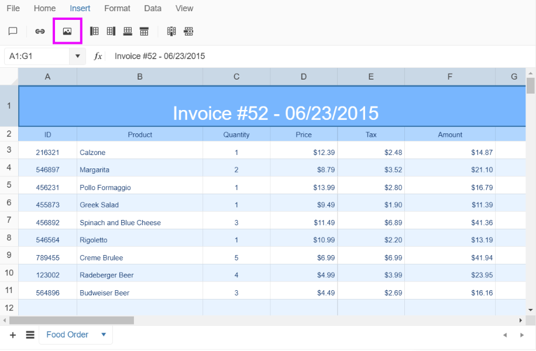
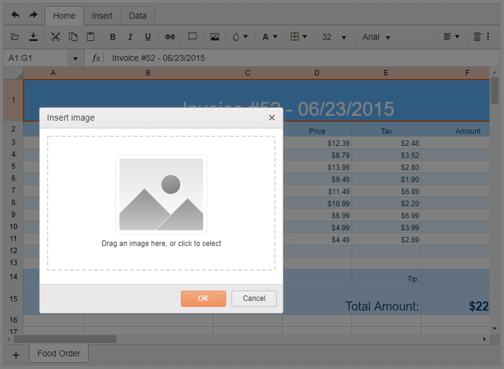

# Images

The Spreadsheet supports the placing of images in its sheets.

To load an image to a sheet, use any of the following approaches:

* Use the Insert Image tool available on the Spreadsheet toolbar.
* Use the initial configuration of the Spreadsheet to load and point to the widget.
* Use the `sheet.addImage()` API method.

## Using the Insert Image Tool

You can upload and insert a custom image in the Spreadsheet with the `Insert Image` tool.



Then, in the popup window, you can select or drag in a file from the file system.



## Configuring the Spreadsheet to Initially Display an Image

1. To properly configure the Spreadsheet to display an image on one its sheets, add a definition for the image to the Spreadsheet [`images`](https://docs.telerik.com/kendo-ui/api/javascript/ui/spreadsheet/configuration/images) field. In the `images` object each image should be specified with unique key (property name) holding as value the image URL. The image URLs can be either [data URLs](https://developer.mozilla.org/en-US/docs/Web/HTTP/Basics_of_HTTP/Data_URIs), in which case the images are fully contained in the definition, or can be external URLs.
1. Reference that image and place it accordingly using the [`drawings`](https://docs.telerik.com/kendo-ui/api/javascript/ui/spreadsheet/configuration/sheets.drawings) array of the respective sheet.

  The drawing definition has to contain:

      * A pointer to the cell that will hold the top-left corner of the image: `TopLeftCell`.
      * X and Y offset of the top-left corner: `OffsetX` and  `OffsetY`.
      * Dimensions of the rendered image: `Width` and `Height`.
      * A pointer to the image key that is used in the `Images` configuration of the Spreadsheet: `Image`.

The following example demonstrates how to configure the Spreadsheet to display an image with top-left corner placed in the `J6` cell.

```
    @(Html.Kendo().Spreadsheet()
        .Name("spreadsheet")
        .Images(new { testImage = "/images/image1.png" })
        .Sheets(sheets =>
        {
            sheets.Add()
                .Name("Sheet1")
                .Drawings(dr =>
                {
                    dr.Add()
                    .TopLeftCell("J6")
                    .OffsetX(30)
                    .OffsetY(10)
                    .Width(50)
                    .Height(50)
                    .Image("testImage");

                })
                .Columns(columns =>
                {
                    columns.Add().Width(115);
                })
                .Rows(rows =>
                {
                    rows.Add().Height(25).Cells(cells =>
                    {
                            cells.Add()
                            .Value("ID")
                            .TextAlign(SpreadsheetTextAlign.Center);
                    });
                });
        })
    )
```

## Using the addImage() Method

The Spreadsheet Sheet API exposes a method that allows you to programmatically add an image to the Spreadsheet and place it on a sheet.

1. Create a new `kendo.spreadsheet.Drawing` object. The configuration of the `Drawing` object is the same as the one described in the example from the previous section.
1. Pass the `Drawing` to the [`sheet.addDrawing()`](https://docs.telerik.com/kendo-ui/api/javascript/spreadsheet/sheet/methods/adddrawing).

    > When you use the export functionality of the Spreadsheet together with images, note the following:
    > * Images are supported only for client-side import and export. When you engage server-side import or export, no images will be loaded or exported.
    > * To properly export any image to PDF by using the default Spreadsheet functionality, at least one cell with data has to be present on the sheet which contains that image.

    ```
        @(Html.Kendo().Spreadsheet()
           .Name("spreadsheet")
           .Sheets(sheets =>
           {
               sheets.Add()
                   .Name("Sheet1")
                   .Columns(columns =>
                   {
                       columns.Add().Width(115);
                   })
                   .Rows(rows =>
                   {
                       rows.Add().Height(25).Cells(cells =>
                       {
                               cells.Add()
                               .Value("ID")
                               .TextAlign(SpreadsheetTextAlign.Center);
                       });
                   });
           })
        )

        <script>
            $(document).ready(function () {
                var spreadsheet = $("#spreadsheet").data("kendoSpreadsheet");

                var sheet = spreadsheet.activeSheet();

                var drawing = kendo.spreadsheet.Drawing.fromJSON({
                    topLeftCell: "J6",
                    offsetX: 30,
                    offsetY: 10,
                    width: 50,
                    height: 50,
                    image: spreadsheet.addImage("/images/chrome.gif")
                });

                sheet.addDrawing(drawing);
            })
        </script>
    ```

## See Also

* [Server-Side API](/api/spreadsheet)
