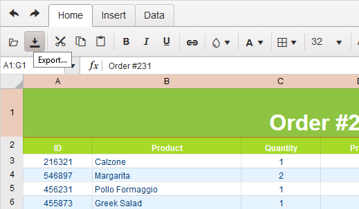
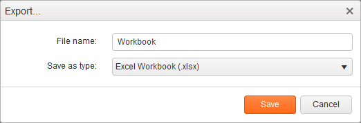

# Excel Export

The Spreadsheet utilizes the [Kendo UI for jQuery Excel export](https://docs.telerik.com/kendo-ui/framework/excel/introduction) framework to produce Excel files directly in the browser.

The output files are in the OOXML Spreadsheet format with an `.xlsx` extension. The legacy `.xls` binary format is not supported.

## User Interface

The default toolbar configuration includes an **Export** button. Clicking it opens a dialog box for entering the file name and selecting the desired output format for the exported document.



The following image demonstrates the export of the Spreadsheet data to Excel.



## API Export Reference

The Spreadsheet client-side API includes the [`saveAsExcel`](https://docs.telerik.com/kendo-ui/api/javascript/ui/spreadsheet/methods/saveasexcel) method for initiating the export with JavaScript. This method does not ask you to specify a file name. Instead, it sets the value in [`excel.fileName`](https://docs.telerik.com/kendo-ui/api/javascript/ui/spreadsheet/configuration/excel#excel.fileName).

```
    @(Html.Kendo().Spreadsheet()
        .Name("spreadsheet")
        .Excel(ex => ex.FileName("Order.xlsx"))
    )
```

## Known Issues

Currently, the export module does not handle sorting and filtering. This limitation will be addressed before the widget goes out of its Beta version.

## See Also

* [Server-Side API](/api/spreadsheet)
* [Custom Functions]()
* [Cell Formatting]()
* [Data Source Binding]()
