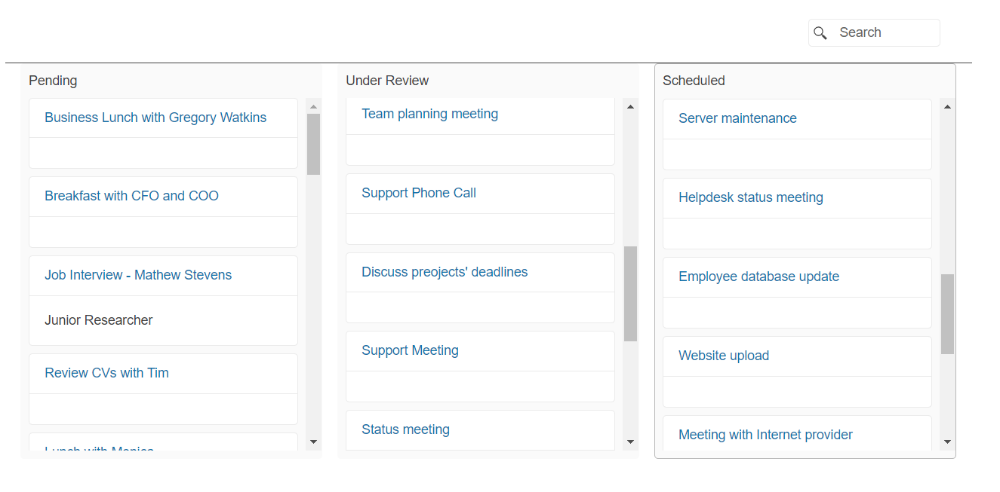

# Getting Started with the TaskBoard

This tutorial explains how to set up the Telerik UI for {{ site.framework }} TaskBoard and highlights the major steps in the configuration of the component.

In this tutorial, you will declare two view models for the TaskBoard and initialize the component. Then, you will bind the TaskBoard to visualize the tasks in separate columns and utilize the [Template Component](https://docs.telerik.com/{{ site.platform }}/html-helpers/template/overview) to customize the cards of the tasks. Next, you will handle events triggered by the user and reference a client-side instance of the component. Finally, you can run the sample code in [Telerik REPL](https://netcorerepl.telerik.com/) and continue exploring the components.

After completing this guide, you will achieve the following results:

 

@[template](/_contentTemplates/core/getting-started-prerequisites.md#repl-component-gs-prerequisites)

## 1. Prepare the CSHTML File

@[template](/_contentTemplates/core/getting-started-directives.md#gs-adding-directives)

Optionally, you can structure the document by adding the desired HTML elements like headings, divs, paragraphs, and others.

## 2. Declare the View Models

The TaskBoard binds to two View Models. In this guide, the `Column` model determines the available task columns. The `TaskViewModel` specifies the data fields available for each task. Optionally, the `TaskViewModel` can implement the `ISchedulerEvent` interface to ensure that task instances can be consumed by both the TaskBoard and the Scheduler Components.

Declare the `ProductViewModel` view model.

```C# Column

    public class Column
    {
        public int ID { get; set; }
        public string Text { get; set; }
        public string Status { get; set; }
        public string Image { get; set; }
    }
```
```C# TaskViewModel
    using Kendo.Mvc.UI;

    public class TaskViewModel : ISchedulerEvent
    {
        public int TaskID { get; set; }
        public string Title { get; set; }
        public string Description { get; set; }

        private DateTime start;
        public DateTime Start
        {
            get
            {
                return start;
            }
            set
            {
                start = value.ToUniversalTime();
            }
        }

        public string StartTimezone { get; set; }

        private DateTime end;
        public DateTime End
        {
            get
            {
                return end;
            }
            set
            {
                end = value.ToUniversalTime();
            }
        }

        public string EndTimezone { get; set; }

        public string RecurrenceRule { get; set; }
        public int? RecurrenceID { get; set; }
        public string RecurrenceException { get; set; }
        public bool IsAllDay { get; set; }
        public int? OwnerID { get; set; }

        public Task ToEntity()
        {
            return new Task
            {
                TaskID = TaskID,
                Title = Title,
                Start = Start,
                StartTimezone = StartTimezone,
                End = End,
                EndTimezone = EndTimezone,
                Description = Description,
                RecurrenceRule = RecurrenceRule,
                RecurrenceException = RecurrenceException,
                RecurrenceID = RecurrenceID,
                IsAllDay = IsAllDay,
                OwnerID = OwnerID
            };
        }
    }
```
```C# Interface
    public interface ISchedulerEvent
    {
        string Title { get; set; }
        string Description { get; set; }
        bool IsAllDay { get; set; }
        DateTime Start { get; set; }
        DateTime End { get; set; }
        string StartTimezone { get; set; }
        string EndTimezone { get; set; }
        string RecurrenceRule { get; set; }
        string RecurrenceException { get; set; }
    }
```

## 3. Initialize the TaskBoard

Use the TaskBoard HtmlHelper or TagHelper to add the component to a page and set some of its options:

* Bind the TaskBoard to the designated View Models.
* Use the `Name()` configuration method to assign a name to the instance of the helper&mdash;this is mandatory as its value is used for the `id` of the TaskBoard element.
* Configure the `ColumnSettings` property to set up the data fields of the columns and the `Columns` property to specify a [`DataSource`](https://docs.telerik.com/{{ site.platform }}/html-helpers/datasource/overview) that handles the remote data binding.
* Set up the [data field properties](https://docs.telerik.com/{{ site.platform }}/api/kendo.mvc.ui.fluent/taskboardbuilder#datacategoryfieldsystemstring) of the cards.

```HtmlHelper
@using Kendo.Mvc.UI

(Html.Kendo().TaskBoard<Kendo.Mvc.Examples.Models.Scheduler.TaskViewModel, Kendo.Mvc.Examples.Models.TaskBoard.Column>()
        .Name("taskBoard")
        .ColumnSettings(columnSettings => columnSettings
            .DataTextField("Text")
            .DataStatusField("ID")
        )
        .Columns(dataSource => dataSource
            .Ajax()
            .Read("Remote_Data_Binding_Columns_Read", "TaskBoard")
        )
        .DataTitleField("Title")
        .DataStatusField("OwnerID")
        .DataDescriptionField("Description")
        .DataCategoryField("ID")
        .Template(Html.Kendo().Template().AddHtml(templateHtml))
        .DataSource(dataSource => dataSource
            .Ajax()
            .Model(model => model.Id(p => p.TaskID))
            .Read(read => read.Action("Remote_Data_Binding_Read", "TaskBoard"))
            .Update(update => update.Action("Remote_Data_Binding_Update", "TaskBoard"))
        )
        .Editable(false)
        .Height("500")
    )
```

```TagHelper
    @using Kendo.Mvc.UI
    @addTagHelper *, Kendo.Mvc

	<kendo-taskboard 
		datacategoryfield="ID" 
		datadescriptionfield="Description" 
		datastatusfield="OwnerID" 
		datatitlefield="Title"
		height="500"
		name="taskBoard" >
        <taskboard-columns>
            <datasource type="DataSourceTagHelperType.Ajax">
                <transport>
                    <read url="@Url.Action("Remote_Data_Binding_Columns_Read", "TaskBoard")"/>
                </transport>
            </datasource>
        </taskboard-columns>
		<datasource type="DataSourceTagHelperType.Ajax">
	 		<schema data="Data" total="Total" errors="Errors">
				 <model id="TaskID"></model>
	 		</schema>
	 		<transport>
	 	 		<read url="@Url.Action("Remote_Data_Binding_Read", "TaskBoard")" />
	 	 		<update url="@Url.Action("Remote_Data_Binding_Update", "TaskBoard")" />
	 		</transport>
		</datasource>
		<column-settings datastatusfield="ID" datatextfield="Text">
		</column-settings>
		<editable enabled="false">
		</editable>
	</kendo-taskboard>
```


## 4. Configure a Custom Template to Visualize Task Cards

This example showcases an integrated {{ site.framework }} [`Template`](https://docs.telerik.com/{{ site.platform }}/html-helpers/template/overview) component that renders each TaskBoard card. 

```C#
    string templateHtml = "<div class='template-container'>"+
            "<div>"+
                "<div class='k-card-header k-hbox'>"+
                    "<a class='k-card-title k-link' href='' data-command='SelectCardCommand'>${data.Title}</a><span class='k-spacer'></span>"+
                "</div>"+
                "<div class='k-card-body'>"+
                    "<p>${ (data.Description == null) ? ' ' : data.Description }</p>"+
                "</div>"+
            "</div>"+
        "</div>";
```
```HtmlHelper
    @using Kendo.Mvc.UI

    @(Html.Kendo().TaskBoard<Kendo.Mvc.Examples.Models.Scheduler.TaskViewModel, Kendo.Mvc.Examples.Models.TaskBoard.Column>()
        .Name("taskBoard")
        .ColumnSettings(columnSettings => columnSettings
            .DataTextField("Text")
            .DataStatusField("ID")
        )
        .Columns(dataSource => dataSource
            .Ajax()
            .Read("Remote_Data_Binding_Columns_Read", "TaskBoard")
        )
        .DataTitleField("Title")
        .DataStatusField("OwnerID")
        .DataDescriptionField("Description")
        .DataCategoryField("ID")
        .Template(Html.Kendo().Template()
            .AddHtml(templateHtml)
        )
        .DataSource(dataSource => dataSource
            .Ajax()
            .Model(model => model.Id(p => p.TaskID))
            .Read(read => read.Action("Remote_Data_Binding_Read", "TaskBoard"))
            .Update(update => update.Action("Remote_Data_Binding_Update", "TaskBoard"))
        )
        .Editable(false)
        .Height("500")
    )
```

```TagHelper
    <kendo-taskboard 
		datacategoryfield="ID" 
		datadescriptionfield="Description" 
		datastatusfield="OwnerID" 
		datatitlefield="Title"
		height="500"
		name="taskBoard" >
        <taskboard-columns>
            <column>
                <column-template>
                    <div class="template-container">
                        <div>
                            <div class="k-card-header k-hbox">
                                <a class="k-card-title k-link" href="" data-command="SelectCardCommand">${ Title }</a><span class="k-spacer"></span>
                            </div>
                            <div class="k-card-body">
                                <p>${ (Description == null) ? ' ' : Description }</p>
                            </div>
                        </div>
                    </div>
                </column-template>
            </column>
            <datasource type="DataSourceTagHelperType.Ajax">
                <transport>
                    <read url="@Url.Action("Remote_Data_Binding_Columns_Read", "TaskBoard")"/>
                </transport>
            </datasource>
        </taskboard-columns>
		<datasource type="DataSourceTagHelperType.Ajax">
	 		<schema data="Data" total="Total" errors="Errors">
				 <model id="TaskID"></model>
	 		</schema>
	 		<transport>
	 	 		<read url="@Url.Action("Remote_Data_Binding_Read", "TaskBoard")" />
	 	 		<update url="@Url.Action("Remote_Data_Binding_Update", "TaskBoard")" />
	 		</transport>
		</datasource>
		<column-settings datastatusfield="ID" datatextfield="Text">
		</column-settings>
		<editable enabled="false">
		</editable>
	</kendo-taskboard>
```


## 5. Handle a TaskBoard Event

The TaskBoard exposes different [client-side events](https://docs.telerik.com/kendo-ui/api/javascript/ui/taskboard#events) that you can handle and use to customize the component's functions. In this tutorial, you will use the `Execute` event to prevent the selection of tasks by the user.

To achieve the desired behavior, attach a handler in the declaration of the TaskBoard, declare the `onExecute` JavaScript function and prevent the event for the `SelectCardCommand`'s execution.

```HtmlHelper
    @using Kendo.Mvc.UI

    @(Html.Kendo().TaskBoard<Kendo.Mvc.Examples.Models.Scheduler.TaskViewModel, Kendo.Mvc.Examples.Models.TaskBoard.Column>()
        .Name("taskBoard")
        .ColumnSettings(columnSettings => columnSettings
            .DataTextField("Text")
            .DataStatusField("ID")
        )
        .Columns(dataSource => dataSource
            .Ajax()
            .Read("Remote_Data_Binding_Columns_Read", "TaskBoard")
        )
        .DataTitleField("Title")
        .DataStatusField("OwnerID")
        .DataDescriptionField("Description")
        .DataCategoryField("ID")
        .Template(Html.Kendo().Template().AddHtml(templateHtml))
        .DataSource(dataSource => dataSource
            .Ajax()
            .Model(model => model.Id(p => p.TaskID))
            .Read(read => read.Action("Remote_Data_Binding_Read", "TaskBoard"))
            .Update(update => update.Action("Remote_Data_Binding_Update", "TaskBoard"))
        )
        .Editable(false)
        .Height("500")
        .Events(ev =>
        {
            ev.Execute("onExecute");
        })
    )
```

```TagHelper
@using Kendo.Mvc.UI
@addTagHelper *, Kendo.Mvc

    <kendo-taskboard 
		datacategoryfield="ID" 
		datadescriptionfield="Description" 
		datastatusfield="OwnerID" 
		datatitlefield="Title"
		height="500"
		template-id="card-template" 
		name="taskBoard" 
		on-execute="onExecute">
        <taskboard-columns>
            <column>
                <column-template>
                    <div class="template-container">
                        <div>
                            <div class="k-card-header k-hbox">
                                <a class="k-card-title k-link" href="" data-command="SelectCardCommand">${ Title }</a><span class="k-spacer"></span>
                            </div>
                            <div class="k-card-body">
                                <p>${ (Description == null) ? ' ' : Description }</p>
                            </div>
                        </div>
                    </div>
                </column-template>
            </column>
            <datasource type="DataSourceTagHelperType.Ajax">
                <transport>
                    <read url="@Url.Action("Remote_Data_Binding_Columns_Read", "TaskBoard")"/>
                </transport>
            </datasource>
        </taskboard-columns>
		<datasource type="DataSourceTagHelperType.Ajax">
	 		<schema data="Data" total="Total" errors="Errors">
				 <model id="TaskID"></model>
	 		</schema>
	 		<transport>
	 	 		<read url="@Url.Action("Remote_Data_Binding_Read", "TaskBoard")" />
	 	 		<update url="@Url.Action("Remote_Data_Binding_Update", "TaskBoard")" />
	 		</transport>
		</datasource>
		<column-settings datastatusfield="ID" datatextfield="Text">
		</column-settings>
		<editable enabled="false">
		</editable>
	</kendo-taskboard>
```

```JavaScript
	function onExecute(ev) {
        if (ev.command === "SelectCardCommand") {
            ev.preventDefault();
        }
    }
```

## (Optional) Reference Existing TaskBoard Instances

Referencing existing instances of a component allows you to build on top of their configuration. To reference an existing Grid instance, use the [`jQuery.data()`](https://api.jquery.com/jQuery.data/) method:

1. To reference an existing TaskBoard instance, use the `id` provided to the component by the `Name` configuration property. 

    ```JS script
        <script>
            $(document).ready(function(){
                var taskBoardReference = $("#taskBoard").data("kendoTaskBoard"); // taskBoardReference is a reference to the existing instance of the helper.
            })
        </script>
    ```

1. Use the [TaskBoard client-side API](https://docs.telerik.com/kendo-ui/api/javascript/ui/taskboard#methods) to control the behavior of the widget. In this example, you will preview a task's card with the [`previewCard`](https://docs.telerik.com/kendo-ui/api/javascript/ui/taskboard/methods/previewcard) method.

    ```JS script
        <script>
            var taskBoard = $("#taskBoard").data("kendoTaskBoard");
            taskBoard.previewCard(taskBoard.items().eq(3));
        </script>
    ```


## Explore this Tutorial in REPL

You can continue experimenting with the code sample above by running it in the Telerik REPL server playground:

* [Sample code with the TaskBoard HtmlHelper](https://netcorerepl.telerik.com/QIavuGPF28FOlxf335)
* [Sample code with the TaskBoard TagHelper](https://netcorerepl.telerik.com/wyaFaQPG41amgBL528)



## Next Steps

* [Handling TaskBoard Events]()
* [Data Binding Options]()
* [TaskBoard Cards]()
* [TaskBoard Columns]()

## See Also

* [Using the API of the TaskBoard for {{ site.framework }} (Demo)](https://demos.telerik.com/{{ site.platform }}/taskboard/api)
* [TaskBoard client-side API](https://docs.telerik.com/kendo-ui/api/javascript/ui/taskboard)
* [TaskBoard server-side API](/api/taskboard)
* [Knowledge Base Section](/knowledge-base)
