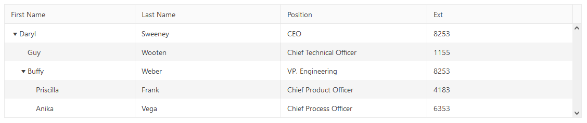

# Getting Started with the TreeList

This tutorial explains how to set up a basic Telerik UI for {{ site.framework }} TreeList and highlights the major steps in the configuration of the component.

You will initialize a TreeList control and bind it to data. Next, you will handle some of the TreeList events. Finally, you can run the sample code in [Telerik REPL](https://netcorerepl.telerik.com/) and continue exploring the components.

 

@[template](/_contentTemplates/core/getting-started-prerequisites.md#repl-component-gs-prerequisites)

## 1. Prepare the CSHTML File

@[template](/_contentTemplates/core/getting-started-directives.md#gs-adding-directives)

Optionally, you can structure the document by adding the desired HTML elements like headings, divs, paragraphs, and others.

## 2. Declare the View Model

Declare the `EmployeeDirectoryRemoteModel` view model.

```C#
public class EmployeeDirectoryRemoteModel
{
    public int EmployeeId { get; set; }

    public string FirstName { get; set; }

    public string LastName { get; set; }

    public int? ReportsTo { get; set; }

    public int? Extension { get; set; }

    public string Position { get; set; }

    public bool hasChildren { get; set; }
}
```

## 3. Initialize the TreeList

Use the TreeList HtmlHelper or TagHelper to add the component to a page and set some of its options.

* Use the `Name()` configuration method to assign a name to the instance of the helper&mdash;this is mandatory as its value is used for the `id` and the `name` attributes of the TreeList element.
* Configure the columns of the TreeList by binding them to the fields of the `EmployeeDirectoryRemoteModel`.
* Add the `DataSource()` configuration option and set the `Read` end point and the `Model` option.   

```HtmlHelper
@using Kendo.Mvc.UI

<p class="title">Employees</p>
@(Html.Kendo().TreeList<MyApplication.Models.EmployeeDirectoryRemoteModel>()
    .Name("treelist")
    .Columns(columns =>
    {
        columns.Add().Field(f => f.FirstName).Width(250);
        columns.Add().Field(e => e.LastName);
        columns.Add().Field(e => e.Position);
        columns.Add().Field(e => e.Extension).Title("Ext").Format("{0:#}");
    })
    .DataSource(dataSource => dataSource
        .Read(read => read.Action("GetData", "Home"))
        .Model(m => {
            m.Id(f => f.EmployeeId);
            m.ParentId(f => f.ReportsTo).Nullable(true);
            m.Field(f => f.FirstName);
            m.Field(f => f.LastName);
            m.Field(f => f.ReportsTo);
        })
    )
)
```

```TagHelper
@addTagHelper *, Kendo.Mvc

<p class="title">Employees</p>
<kendo-treelist name="treelist">
    <columns>
        <treelist-column field="FirstName" width="250px"></treelist-column>
        <treelist-column field="LastName"></treelist-column>
        <treelist-column field="Position"></treelist-column>
        <treelist-column field="Extension" title="Ext" format="{0:#}"></treelist-column>
    </columns>
    <treelist-datasource>
        <transport>
            <read url="@Url.Action("GetData","Home")"/>
        </transport>
        <schema data="Data" total="Total" errors="Errors">
            <treelist-model id="EmployeeId" parent-id="ReportsTo">
                <fields>
                    <field name="EmployeeId" type="number"></field>
                    <field name="ReportsTo" nullable="true"></field>
                    <field name="FirstName" type="string"></field>
                    <field name="LastName" type="string"></field>
                </fields>
            </treelist-model>
        </schema>
    </treelist-datasource>
</kendo-treelist>
```


## 4. Declare the Read Action

In the `Home` controller, declare the `GetData` action that you set to the DataSource `Read` configuration in the previous step. 

```Controller
public JsonResult GetData([DataSourceRequest] DataSourceRequest request, int? id)
{
    var data = GetEmployees();

    var result = data.Where(v => id.HasValue ? v.ReportsTo == id : v.ReportsTo == null)
        .Select(v => new
        {
            EmployeeId = v.EmployeeId,
            FirstName = v.FirstName,
            LastName = v.LastName,
            ReportsTo = v.ReportsTo,
            Position = v.Position,
            Extension = v.Extension,
            hasChildren = v.hasChildren,
        });

    return Json(result.ToTreeDataSourceResult(request));
}

public List<EmployeeDirectoryRemoteModel> GetEmployees()
{
    List<EmployeeDirectoryRemoteModel> data = new List<EmployeeDirectoryRemoteModel>();

    data.Add(new EmployeeDirectoryRemoteModel
    {
        EmployeeId = 1,
        FirstName = "Daryl",
        LastName = "Sweeney",
        Position = "CEO",
        Extension = 8253,
        ReportsTo = null,
        hasChildren = true
    });

    data.Add(new EmployeeDirectoryRemoteModel
    {
        EmployeeId = 2,
        FirstName = "Guy",
        LastName = "Wooten",
        Position = "Chief Technical Officer",
        Extension = 1155,
        ReportsTo = 1,
        hasChildren = false
    });

    data.Add(new EmployeeDirectoryRemoteModel
    {
        EmployeeId = 3,
        FirstName = "Buffy",
        LastName = "Weber",
        Position = "VP, Engineering",
        Extension = 8253,
        ReportsTo = 1,
        hasChildren = true
    });

    data.Add(new EmployeeDirectoryRemoteModel
    {
        EmployeeId = 4,
        FirstName = "Priscilla",
        LastName = "Frank",
        Position = "Chief Product Officer",
        Extension = 4183,
        ReportsTo = 3,
        hasChildren = false
    });

    data.Add(new EmployeeDirectoryRemoteModel
    {
        EmployeeId = 5,
        FirstName = "Anika",
        LastName = "Vega",
        Position = "Chief Process Officer",
        Extension = 6353,
        ReportsTo = 3,
        hasChildren = false
    });

    return data;
}
```

## 5. Handle the TreeList Events

The TreeList [exposes various events](/api/kendo.mvc.ui.fluent/treelisteventbuilder) that you can handle and further customize the functionality of the component. In this tutorial, you will use the `DataBinding` and `DataBound` events of the TreeList.

```HtmlHelper
    @using Kendo.Mvc.UI

    @(Html.Kendo().TreeList<MyApplication.Models.EmployeeDirectoryRemoteModel>()
        .Name("treelist")
        .Columns(columns =>
        {
            columns.Add().Field(f => f.FirstName).Width(250);
            columns.Add().Field(e => e.LastName);
            columns.Add().Field(e => e.Position);
            columns.Add().Field(e => e.Extension).Title("Ext").Format("{0:#}");
        })
        .DataSource(dataSource => dataSource
            .Read(read => read.Action("GetData", "Home"))
            .Model(m => {
                m.Id(f => f.EmployeeId);
                m.ParentId(f => f.ReportsTo).Nullable(true);
                m.Field(f => f.FirstName);
                m.Field(f => f.LastName);
                m.Field(f => f.ReportsTo);
            })
        )
        .Events(events =>
        {
            events.DataBinding("onDataBinding");
            events.DataBound("onDataBound");
        })
    )

    <script>
        function onDataBinding(e) {
            console.log("TreeList data binding");
        }

        function onDataBound(e) {
            console.log("TreeList data bound");
        }
    </script>
```

```TagHelper
    @addTagHelper *, Kendo.Mvc

    <kendo-treelist name="treelist"
        on-data-binding="onDataBinding"
        on-data-bound="onDataBound">
        <columns>
            <treelist-column field="FirstName" width="250px"></treelist-column>
            <treelist-column field="LastName"></treelist-column>
            <treelist-column field="Position"></treelist-column>
            <treelist-column field="Extension" title="Ext" format="{0:#}"></treelist-column>
        </columns>
        <treelist-datasource>
            <transport>
                <read url="@Url.Action("GetData","Home")"/>
            </transport>
            <schema data="Data" total="Total" errors="Errors">
                <treelist-model id="EmployeeId" parent-id="ReportsTo">
                    <fields>
                        <field name="EmployeeId" type="number"></field>
                        <field name="ReportsTo" nullable="true"></field>
                        <field name="FirstName" type="string"></field>
                        <field name="LastName" type="string"></field>
                    </fields>
                </treelist-model>
            </schema>
        </treelist-datasource>
    </kendo-treelist>

    <script>
        function onDataBinding(e) {
            console.log("TreeList data binding");
        }

        function onDataBound(e) {
            console.log("TreeList data bound");
        }
    </script>
```


For more examples, refer to the [demo on using the events of the TreeList](https://demos.telerik.com/{{ site.platform }}/treelist/events).

## 6. (Optional) Reference Existing TreeList Instances

To use the client-side API of the TreeList and build on top of its initial configuration, you need a reference to the TreeList instance. Once you get a valid reference, you can call the respective API methods:

1. Use the `.Name()` (`id` attribute) of the component instance to get a reference.

    ```script
    <script>
        var treelistReference = $("#TreeList").data("kendoTreeList"); // treelistReference is a reference to the existing instance of the helper.
    </script>
    ```

1. Use the [TreeList client-side API](https://docs.telerik.com/kendo-ui/api/javascript/ui/treelist#methods) to control the behavior of the widget. In this example, you will use the `autoFitColumn` method to apply the minimum possible width to the second column of the TreeList.

    ```script
    <script>
        $(document).ready(function () {
            var treelistReference = $("#TreeList").data("kendoTreeList");

            treelistReference.autoFitColumn(1);
        })
    </script>
    ```

For more information on referencing specific helper instances, see the [Methods and Events]() article.


## Explore this Tutorial in REPL

You can continue experimenting with the code sample above by running it in the Telerik REPL server playground:

* [Sample code with the TreeList HtmlHelper](https://netcorerepl.telerik.com/QHknlcwF48c1N4wq30)
* [Sample code with the TreeList TagHelper](https://netcorerepl.telerik.com/mROxFQQP494iJpNT23)



## Next Steps

* [Adding Custom Content through TreeList Row Templates]()
* [Using Filtering in the TreeList]()

## See Also

* [Using the API of the TreeList for {{ site.framework }} (Demo)](https://demos.telerik.com/{{ site.platform }}/treelist/api)
* [Client-Side API of the TreeList](https://docs.telerik.com/kendo-ui/api/javascript/ui/treelist)
* [Server-Side API of the TreeList](/api/treelist)
* [Knowledge Base Section](/knowledge-base)
