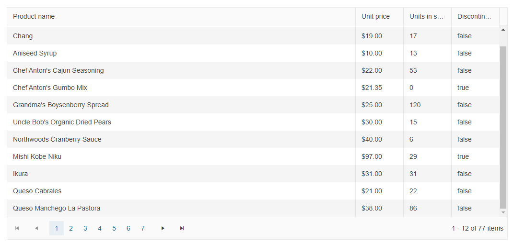

# Getting Started with the DataSource

This tutorial explains how to set up the Telerik UI for {{ site.framework }} DataSource and highlights the major steps in the configuration of the component.

You will declare a view model for the DataSource and initialize a shared component. Then, you will bind the DataSource to visualize the returned data. To show if the server timed out before responding, you will handle the Error event. Finally, you will see how to send additional data to the controller, disable the server operations, and reference a client-side instance of the component.

After completing this guide, you will achieve the following results:

 

@[template](/_contentTemplates/core/getting-started-prerequisites.md#repl-component-gs-prerequisites)

## 1. Prepare the CSHTML File

@[template](/_contentTemplates/core/getting-started-directives.md#gs-adding-directives)

Optionally, you can structure the document by adding the desired HTML elements like headings, divs, paragraphs, and others.

## 2. Declare the View Model

Declare the `ProductViewModel` view model.

```C#
public class ProductViewModel
{
    public int ProductID
    {
        get;
        set;
    }

    [Required]
    [DisplayName("Product name")]
    public string ProductName
    {
        get;
        set;
    }

    [DisplayName("Unit price")]
    [DataType(DataType.Currency)]
    [Range(0, int.MaxValue)]
    public decimal UnitPrice
    {
        get;
        set;
    }

    [DisplayName("Units in stock")]
    [DataType("Integer")]
    [Range(0, int.MaxValue)]
    public int UnitsInStock
    {
        get;
        set;
    }

    public bool Discontinued
    {
        get;
        set;
    }

    [DataType("Integer")]
    public int UnitsOnOrder
    {
        get;
        set;
    }
}
```

## 3. Initialize the DataSource

Use the DataSource HtmlHelper or TagHelper to add the component to a page and set some of its options:

* Use the `Name()` configuration method to assign a name to the instance of the helper&mdash;this is mandatory as its value is used for   the `name` of the DataSource element.
* Add the `Ajax()` configuration option&mdash;this formats the request filter, sort, group, page, page size, and aggregates and requires you to configure a `[DataSourceRequest]DataSourceRequest request ` parameter in the [controller action](#4-declare-the-read-action) and extend the response with the `ToDataSourceResult`, which will handle data operations automatically.
* Configure the `Read` transport and set the end point for the [Read operation](https://docs.telerik.com/aspnet-core/html-helpers/datasource/crud#read).  
* Set the `PageSize` to determine how many items to include in each response of the server.

```HtmlHelper
@using Kendo.Mvc.UI

@(Html.Kendo().DataSource<Kendo.Mvc.Examples.Models.ProductViewModel>()
    .Name("dataSource1")
    .Ajax(dataSource => dataSource
    .Read(read => read.Action("Products_Read", "DataSource"))
    .PageSize(12)
    )
)
```

```TagHelper
@using Kendo.Mvc.UI
@addTagHelper *, Kendo.Mvc

<kendo-datasource name="dataSource1" type="DataSourceTagHelperType.Ajax" page-size="12">
    <transport>
        <read url="@Url.Action("Products_Read", "DataSource")" />
    </transport>
</kendo-datasource>
```


## 4. Declare the Read Action

In the `Home` controller, declare the `Read` action. Use the name of the action you set in the DataSource configuration in the previous step. 

```Controller
public ActionResult Index()
{
    return View();
}

private List<ProductViewModel> products = new List<ProductViewModel> {
    new ProductViewModel { ProductID = 1, ProductName = "Chai", UnitPrice = 18, UnitsInStock = 39, Discontinued = false },
    new ProductViewModel { ProductID = 2, ProductName = "Chang", UnitPrice = 19, UnitsInStock = 17, Discontinued = false },
    new ProductViewModel { ProductID = 3, ProductName = "Aniseed Syrup", UnitPrice = 10, UnitsInStock = 13, Discontinued = false },
    new ProductViewModel { ProductID = 4, ProductName = "Chef Anton's Cajun Seasoning", UnitPrice = 21, UnitsInStock = 53, Discontinued = false },
    new ProductViewModel { ProductID = 5, ProductName = "Chef Anton's Gumbo Mix", UnitPrice = 18, UnitsInStock = 0, Discontinued = true },
    new ProductViewModel { ProductID = 6, ProductName = "Grandma's Boysenberry Spread", UnitPrice = 25, UnitsInStock = 120, Discontinued = false },
    new ProductViewModel { ProductID = 7, ProductName = "Uncle Bob's Organic Dried Pears", UnitPrice = 30, UnitsInStock = 15, Discontinued = false },
    new ProductViewModel { ProductID = 8, ProductName = "Northwoods Cranberry Sauce", UnitPrice = 40, UnitsInStock = 6, Discontinued = false },
    new ProductViewModel { ProductID = 9, ProductName = "Mishi Kobe Niku", UnitPrice = 97, UnitsInStock = 29, Discontinued = true },
    new ProductViewModel { ProductID = 10, ProductName = "Ikura", UnitPrice = 31, UnitsInStock = 31, Discontinued = false },
    new ProductViewModel { ProductID = 11, ProductName = "Queso Cabrales", UnitPrice = 21, UnitsInStock = 22, Discontinued = false },
    new ProductViewModel { ProductID = 12, ProductName = "Queso Manchego La Pastora", UnitPrice = 38, UnitsInStock = 86, Discontinued = false }
};

public ActionResult Products_Read([DataSourceRequest] DataSourceRequest request)
{
    return Json(products.ToDataSourceResult(request));
}
```

## 5. Bind a Component to the DataSource

1. Initialize a Grid component.
1. To bind the Grid to the DataSource, pass the name of the DataSource to the `.DataSource()` configuration property of the Grid.

The demonstrated data binding approach allows you to bind the same DataSource to other data-bound components and let them share the same data.

```HtmlHelper
@using Kendo.Mvc.UI

@(Html.Kendo().DataSource<Kendo.Mvc.Examples.Models.ProductViewModel>()
    .Name("dataSource1")
    .Ajax(dataSource => dataSource
    .Read(read => read.Action("Products_Read", "DataSource"))
    .PageSize(12)
    )
)

@(Html.Kendo().Grid<Kendo.Mvc.Examples.Models.ProductViewModel>()
    .Name("grid")
    .Columns(columns =>
    {
        columns.Bound(p => p.ProductName);
        columns.Bound(p => p.UnitPrice).Format("{0:c}").Width(100);
        columns.Bound(p => p.UnitsInStock).Width(100);
        columns.Bound(p => p.Discontinued).Width(100);
    })
    .Pageable()
    .Scrollable()
    .DataSource("dataSource1")
)
```

```TagHelper
@using Kendo.Mvc.UI
@addTagHelper *, Kendo.Mvc

<kendo-datasource name="dataSource1" type="DataSourceTagHelperType.Ajax" server-operation="true" page-size="12">
    <transport>
        <read url="@Url.Action("Products_Read", "DataSource")" />
    </transport>
</kendo-datasource>

<kendo-grid name="grid" datasource-id="dataSource1">
    <columns>
        <column field="ProductName"></column>
        <column field="UnitPrice" format="{0:c}" width="100"></column>
        <column field="UnitsInStock" width="100"></column>
        <column field="Discontinued" width="100"></column>
    </columns>
    <pageable enabled="true"/>
    <scrollable enabled="true" />
</kendo-grid>
```


For a complete tutorial on how to configure the Grid component, refer to the [Grid's Getting Started article]().

## 6. Handle a DataSource Event

The DataSource exposes different client-side events that you can handle and use to customize the component's functions. In this tutorial, you will use the `Error` event to show the user a message if an error occurs on the server while accessing the data.

To achieve the desired behavior, attach a handler in the declaration of the DataSource and declare the `error_handler` JavaScript function.

```HtmlHelper
@using Kendo.Mvc.UI

@(Html.Kendo().DataSource<Kendo.Mvc.Examples.Models.ProductViewModel>()
    .Name("dataSource1")
    .Ajax(dataSource => dataSource
    .Read(read => read.Action("Products_Read", "DataSource"))
    .ServerOperation(true)
    .PageSize(12)
    .Events(e=>e.Error("error_handler"))
    )
)
@(Html.Kendo().Grid<Kendo.Mvc.Examples.Models.ProductViewModel>()
    .Name("grid")
    .Columns(columns =>
    {
        columns.Bound(p => p.ProductName);
        columns.Bound(p => p.UnitPrice).Format("{0:c}").Width(100);
        columns.Bound(p => p.UnitsInStock).Width(100);
        columns.Bound(p => p.Discontinued).Width(100);
    })
    .Pageable()
    .Scrollable()
    .DataSource("dataSource1")
)
```

```TagHelper
@using Kendo.Mvc.UI
@addTagHelper *, Kendo.Mvc

<kendo-datasource name="dataSource1" type="DataSourceTagHelperType.Ajax" server-operation="true" page-size="12"
    on-error="error_handler">
    <transport>
        <read url="@Url.Action("Products_Read", "DataSource")" />
    </transport>
</kendo-datasource>

<kendo-grid name="grid" datasource-id="dataSource1">
    <columns>
        <column field="ProductName"></column>
        <column field="UnitPrice" format="{0:c}" width="100"></column>
        <column field="UnitsInStock" width="100"></column>
        <column field="Discontinued" width="100"></column>
    </columns>
    <pageable enabled="true"/>
    <scrollable enabled="true" />
</kendo-grid>
```

```JavaScript
	function error_handler(e){
        if (e.errors) {
            var message = "Errors:\n";
            $.each(e.errors, function (key, value) {
                if ('errors' in value) {
                    $.each(value.errors, function () {
                        message += this + "\n";
                    });
                }
            });
            alert(message);
        }
    }
```

## (Optional) Pass Additional Data to Action Methods

Optionally, you can pass additional parameters to the action by using the `Data` method of the Transport properties. To accomplish this, provide the name of a JavaScript function that will return a JavaScript object with the additional data.

The custom parameter names must not match reserved words, which are used by the Kendo UI DataSource for jQuery for [sorting](http://docs.telerik.com/kendo-ui/api/javascript/data/datasource#configuration-serverSorting), [filtering](http://docs.telerik.com/kendo-ui/api/javascript/data/datasource#configuration-serverFiltering), [paging](http://docs.telerik.com/kendo-ui/api/javascript/data/datasource#configuration-serverPaging), and [grouping](http://docs.telerik.com/kendo-ui/api/javascript/data/datasource#configuration-serverGrouping).

The following code demonstrates how to add the additional parameters to the action method.

    public ActionResult Products_Read([DataSourceRequest]DataSourceRequest request, string firstName, string lastName)
    {
        // The implementation is omitted.
    }

The following snippet demonstrates how to specify the JavaScript function which returns additional data.

```HtmlHelper
    .Ajax()
    .PageSize(20)
    .Read(read => read
        .Action("Products_Read", "Home") // Set the action method which will return the data in JSON format.
        .Data("productsReadData") // Specify the JavaScript function which will return the data.
    )
```

```TagHelper
    <transport>
        <read url="@Url.Action("Products_Read","Home")" data="productsReadData"/> <!--Specify the JavaScript function which will return the data.-->
    </transport>
```

```JavaScript
	function productsReadData() {
        return {
            firstName: "John",
            lastName: "Doe"
        };
    }
```

## (Optional) Enable Client Data Processing

By default, the Telerik UI Grid for {{ site.framework }} makes an AJAX request to the `Action` method every time the user sorts, filters, groups or changes the page. To perform these operations on the client disable the `ServerOperation` option.

```HtmlHelper
    .Ajax()
    .PageSize(20)
    .ServerOperation(false) // Paging, sorting, filtering, and grouping will be done client-side.
    .Read(read => read.Action("Products_Read", "Home"))
```

```TagHelper
    <kendo-datasource name="dataSource1" type="DataSourceTagHelperType.Ajax" 
        page-size="20" 
        server-operation="false"> <!--Paging, sorting, filtering, and grouping will be done client-side.-->
        <transport>
            <read url="@Url.Action("Products_Read","Home")"/>
        </transport>
    </kendo-datasource>
```


## (Optional) Reference Existing DataSource Instances

Referencing existing instances of a component allows you to build on top of their configuration. 

1. To reference an existing DataSource instance, use the `Name` provided to the component.

    ```script
    <script>
		$(document).ready(function(){
        	console.log(dataSource1)
    	})
    </script>
    ```

1. Use the [DataSource client-side API](https://docs.telerik.com/kendo-ui/api/javascript/ui/datasource#methods) to control the behavior of the widget. In this example, you will force the DataSource to send a new read request to the backend with the [`read`](https://docs.telerik.com/kendo-ui/api/javascript/data/datasource/methods/read) method. Then, you will then handle the returned promise to access the data item of the returned page with the [`view`](https://docs.telerik.com/kendo-ui/api/javascript/data/datasource/methods/view) method of the DataSource.

    ```script
    <script>
        dataSource1.read().then(function() {
			var view = dataSource1.view();
			console.log(view[0].ProductName); // displays "Chai"
		});
    </script>
    ```


## Explore this Tutorial in REPL

You can continue experimenting with the code sample above by running it in the Telerik REPL server playground:

* [Sample code with the DataSource HtmlHelper](https://netcorerepl.telerik.com/wdaeYIcn54rJw0fs25)
* [Sample code with the DataSource TagHelper](https://netcorerepl.telerik.com/wRuekowx54gS5g1c03)



## Next Steps

* [Choosing the Appropriate DataSource Type]()
* [Configuring the CRUD Operations]()
* [Handling DataSource Events]()
* [Configuring the Model]()

## See Also

* [Using the API of the DataSource for {{ site.framework }} (Demo)](https://demos.telerik.com/{{ site.platform }}/datasource/api)
* [DataSource client-side API](https://docs.telerik.com/kendo-ui/api/javascript/ui/datasource)
* [DataSource server-side API](/api/datasource)
* [Knowledge Base Section](/knowledge-base)
