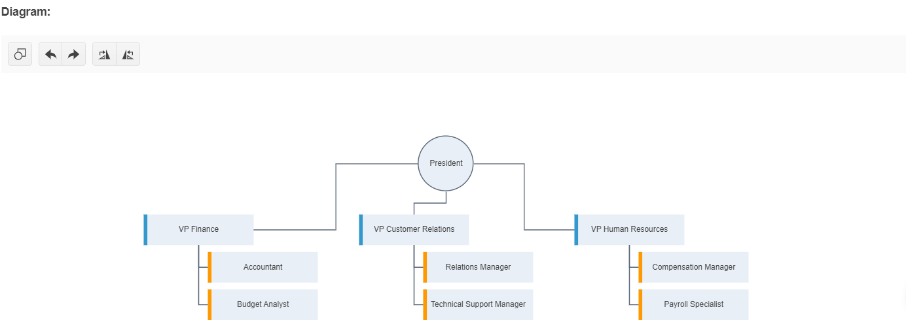

# Getting Started with the Diagram

This tutorial explains how to set up the Telerik UI for {{ site.framework }} Diagram and highlights the major steps in the configuration of the component.

You will declare a view model for the Diagram's shapes and connections, initialize the UI component by adding a connection and shape data sources and configure the layout of the component. To make the Diagram editable, you will configure the CRUD operations. Finally, you will handle a Diagram JavaScript event and reference an existing instance of the component.


After completing this guide, you will achieve the following results:

 

@[template](/_contentTemplates/core/getting-started-prerequisites.md#component-gs-prerequisites)


## 1. Prepare the CSHTML File

@[template](/_contentTemplates/core/getting-started-directives.md#gs-adding-directives)

Optionally, you can structure the document by adding the desired HTML elements like headings, divs, paragraphs, and others.

## 2. Declare the View Models

Declare the `Shape` an `Connection` view models.

```C# OrgChartShape
    public partial class OrgChartShape
    {
        public int Id { get; set; }
        public string Color { get; set; }
        public string JobTitle { get; set; }
    }
```
```C# OrgChartConnection
    public partial class OrgChartConnection
    {
        public long Id { get; set; }
        public long? FromPointX { get; set; }
        public long? FromPointY { get; set; }
        public long? FromShapeId { get; set; }
        public string Text { get; set; }
        public long? ToPointX { get; set; }
        public long? ToPointY { get; set; }
        public long? ToShapeId { get; set; }
    }
```

## 3. Initialize the Diagram

Use the Diagram HtmlHelper or TagHelper to add the component to a page and set some of its options.

1. Use the `Name()` configuration method to assign a name to the instance of the helper&mdash;this is mandatory as its value is used for the `id` and the `name` attributes of the Diagram element.
1. Add the `DataSource()` configuration option, configure the `ShapeDataSource` and `ConnectionsDataSource`, and set the end points for the [CRUD operations](). 
1. Customize the [appearance](https://docs.telerik.com/{{ site.platform }}/html-helpers/diagrams-and-maps/diagram/binding/binding#customizing-the-appearance) of the Diagram.

```HtmlHelper
    @(Html.Kendo().Diagram<OrgChartShape, OrgChartConnection>()
              .Name("diagram")
              .DataSource(d => d
                  .ShapeDataSource()
                  .Model(m =>
                  {
                      m.Id(s => s.Id);
                      m.Field(s => s.Id).Editable(false);
                      m.Field(s => s.JobTitle);
                      m.Field(s => s.Color);
                  })
                  .Read("ReadShapes", "DiagramData")
                  .Create("CreateShape", "DiagramData")
                  .Destroy("DestroyShape", "DiagramData")
                  .Update("UpdateShape", "DiagramData")
              )
              .ConnectionsDataSource(d => d
                  .Model(m =>
                  {
                      m.Id(c => c.Id);
                      m.Field(c => c.Id).Editable(false);
                      m.Field(c => c.Text).Editable(false);
                      m.From(c => c.FromShapeId);
                      m.To(c => c.ToShapeId);
                      m.FromX(c => c.FromPointX);
                      m.FromY(c => c.FromPointY);
                      m.ToX(c => c.ToPointX);
                      m.ToY(c => c.ToPointY);
                  })
                  .Read("ReadConnections", "DiagramData")
                  .Create("CreateConnection", "DiagramData")
                  .Destroy("DestroyConnection", "DiagramData")
                  .Update("UpdateConnection", "DiagramData")
              )
              .Layout(l => l
                  .Type(DiagramLayoutType.Tree)
                  .Subtype(DiagramLayoutSubtype.Tipover)
                  .UnderneathHorizontalOffset(140)
              )
              .ShapeDefaults(sd => sd
                  .Visual("visualTemplate")
                  .Content(c => c
                      .Template("#= dataItem.JobTitle #")
                      .FontSize(17)
                      .Color("#444")
                  )
              )
              .ConnectionDefaults(cd => cd
                  .Stroke(s => s
                      .Color("#586477")
                      .Width(2)
                  )
              )
              .HtmlAttributes(new { style = "height: 600px;" })
    )
```

```TagHelper
    <kendo-diagram name="diagram" style="height: 600px;">
        <hierarchical-datasource server-operation="false" type="DataSourceTagHelperType.Ajax">
            <transport>
                <read url="@Url.Action("ReadShapes", "DiagramData")" />
                <create url="@Url.Action("CreateShape", "DiagramData")" />
                <destroy url="@Url.Action("DestroyShape", "DiagramData")" />
                <update url="@Url.Action("UpdateShape", "DiagramData")" />
            </transport>
            <schema>
                <hierarchical-model id="Id">
                    <fields>
                        <field name="Id" editable="false" type="number"></field>
                        <field name="JobTitle" type="string"></field>
                        <field name="Color" type="string"></field>
                    </fields>
                </hierarchical-model>
            </schema>
        </hierarchical-datasource>
        <layout type="DiagramLayoutType.Tree" subtype="DiagramLayoutSubtype.Tipover" underneath-horizontal-offset=140></layout>
        <shape-defaults visual="visualTemplate">
            <content template="#= dataItem.JobTitle #" font-size="17" color="#444" />
        </shape-defaults>
        <connections-datasource server-operation="false" type="DataSourceTagHelperType.Ajax">
            <transport>
                <read url="@Url.Action("ReadConnections", "DiagramData")" />
                <create url="@Url.Action("CreateConnection", "DiagramData")" />
                <destroy url="@Url.Action("DestroyConnection", "DiagramData")" />
                <update url="@Url.Action("UpdateConnection", "DiagramData")" />
            </transport>
            <schema>
                <model id="id">
                    <fields>
                        <field name="id" editable="false" type="number"></field>
                        <field name="text" editable="false" type="string"></field>
                        <field name="from" from="FromShapeId" type="number"></field>
                        <field name="to" from="ToShapeId" type="number"></field>
                        <field name="fromX" from="FromPointX" type="number"></field>
                        <field name="fromY" from="FromPointY" type="number"></field>
                        <field name="toX" from="ToPointX" type="number"></field>
                        <field name="toY" from="ToPointY" type="number"></field>
                    </fields>
                </model>
            </schema>
        </connections-datasource>
        <connection-defaults>
            <stroke color="#586477" width="2" />
        </connection-defaults>
    </kendo-diagram>
```

```JS script.js
    <script>
        function visualTemplate(options) {
            var dataviz = kendo.dataviz;
            var g = new dataviz.diagram.Group();
            var dataItem = options.dataItem;

            if (dataItem.JobTitle === "President") {
                g.append(new dataviz.diagram.Circle({
                    radius: 60,
                    stroke: {
                        width: 2,
                        color: dataItem.Color || "#586477"
                    },
                    fill: "#e8eff7"
                }));
            } else {
                g.append(new dataviz.diagram.Rectangle({
                    width: 240,
                    height: 67,
                    stroke: {
                        width: 0
                    },
                    fill: "#e8eff7"
                }));

                g.append(new dataviz.diagram.Rectangle({
                    width: 8,
                    height: 67,
                    fill: dataItem.Color,
                    stroke: {
                        width: 0
                    }
                }));
            }

            return g;
        }

    </script>
```

## 4. Declare the CRUD Actions

In the `DiagramData` controller, declare the CRUD actions. Use the names of the actions you set in the DataSource configuration in the previous step.


```Controller
    public class DiagramDataController : Controller
    {
        public static List<OrgDiagramShape> diagramShapes = new List<OrgDiagramShape>
        {
            new OrgDiagramShape() { Id = 1, Color = "", JobTitle = "President" },
            new OrgDiagramShape() { Id = 2, Color = "#3399cc", JobTitle = "VP Finance" },
            new OrgDiagramShape() { Id = 3, Color = "#3399cc", JobTitle = "VP Customer Relations" },
            new OrgDiagramShape() { Id = 4, Color = "#3399cc", JobTitle = "VP Human Resources" },
            new OrgDiagramShape() { Id = 5, Color = "#ff9900", JobTitle = "Accountant" },
            new OrgDiagramShape() { Id = 6, Color = "#ff9900", JobTitle = "Budget Analyst" },
            new OrgDiagramShape() { Id = 7, Color = "#ff9900", JobTitle = "Relations Manager" },
            new OrgDiagramShape() { Id = 8, Color = "#ff9900", JobTitle = "Technical Support Manager" },
            new OrgDiagramShape() { Id = 9, Color = "#ff9900", JobTitle = "Compensation Manager" },
            new OrgDiagramShape() { Id = 10, Color = "#ff9900", JobTitle = "Payroll Specialist" }
        };

        public static List<OrgDiagramConnection> diagramConnections = new List<OrgDiagramConnection>
        {
            new OrgDiagramConnection() { Id = 1, FromShapeId = 1, ToShapeId = 2 },
            new OrgDiagramConnection() { Id = 2, FromShapeId = 1, ToShapeId = 3 },
            new OrgDiagramConnection() { Id = 3, FromShapeId = 1, ToShapeId = 4 },
            new OrgDiagramConnection() { Id = 4, FromShapeId = 2, ToShapeId = 5 },
            new OrgDiagramConnection() { Id = 5, FromShapeId = 2, ToShapeId = 6 },
            new OrgDiagramConnection() { Id = 6, FromShapeId = 3, ToShapeId = 7 },
            new OrgDiagramConnection() { Id = 7, FromShapeId = 3, ToShapeId = 8 },
            new OrgDiagramConnection() { Id = 8, FromShapeId = 4, ToShapeId = 9 },
            new OrgDiagramConnection() { Id = 9, FromShapeId = 4, ToShapeId = 10 }
        };

        public IActionResult Index()
        {
            return View();
        }

        public IActionResult ReadShapes([DataSourceRequest] DataSourceRequest request)
        {
            return Json(diagramShapes.ToDataSourceResult(request));
        }

        public IActionResult CreateShape([DataSourceRequest] DataSourceRequest request, OrgDiagramShape shape)
        {
            // Update the id field.
            return Json(new[] { shape }.ToDataSourceResult(request, ModelState));
        }
        public IActionResult UpdateShape([DataSourceRequest] DataSourceRequest request, OrgDiagramShape shape)
        {
            // Custom Update.
            return Json(new[] { shape }.ToDataSourceResult(request, ModelState));
        }
        public IActionResult DestroyShape([DataSourceRequest] DataSourceRequest request, OrgDiagramShape shape)
        {
            diagramShapes.Remove(shape);
            return Json(new[] { shape }.ToDataSourceResult(request, ModelState));
        }

        public IActionResult ReadConnections([DataSourceRequest] DataSourceRequest request)
        {
            return Json(diagramConnections.ToDataSourceResult(request));
        }

        public IActionResult CreateConnection([DataSourceRequest] DataSourceRequest request, OrgDiagramConnection connection)
        {
            // Update the id field.
            return Json(new[] { connection }.ToDataSourceResult(request, ModelState));
        }

        public IActionResult UpdateConnection([DataSourceRequest] DataSourceRequest request, OrgDiagramConnection connection)
        {
            // Custom Update
            return Json(new[] { connection }.ToDataSourceResult(request, ModelState));
        }

        public IActionResult DestroyConnection([DataSourceRequest] DataSourceRequest request, OrgDiagramConnection connection)
        {
            // Custom Remove
            diagramConnections.Remove(connection);
            return Json(new[] { connection }.ToDataSourceResult(request, ModelState));
        }
    }
```

```Controller
    public class DiagramDataController : Controller
    {
        public static List<OrgDiagramShape> diagramShapes = new List<OrgDiagramShape>
        {
            new OrgDiagramShape() { Id = 1, Color = "", JobTitle = "President" },
            new OrgDiagramShape() { Id = 2, Color = "#3399cc", JobTitle = "VP Finance" },
            new OrgDiagramShape() { Id = 3, Color = "#3399cc", JobTitle = "VP Customer Relations" },
            new OrgDiagramShape() { Id = 4, Color = "#3399cc", JobTitle = "VP Human Resources" },
            new OrgDiagramShape() { Id = 5, Color = "#ff9900", JobTitle = "Accountant" },
            new OrgDiagramShape() { Id = 6, Color = "#ff9900", JobTitle = "Budget Analyst" },
            new OrgDiagramShape() { Id = 7, Color = "#ff9900", JobTitle = "Relations Manager" },
            new OrgDiagramShape() { Id = 8, Color = "#ff9900", JobTitle = "Technical Support Manager" },
            new OrgDiagramShape() { Id = 9, Color = "#ff9900", JobTitle = "Compensation Manager" },
            new OrgDiagramShape() { Id = 10, Color = "#ff9900", JobTitle = "Payroll Specialist" }
        };

        public static List<OrgDiagramConnection> diagramConnections = new List<OrgDiagramConnection>
        {
            new OrgDiagramConnection() { Id = 1, FromShapeId = 1, ToShapeId = 2 },
            new OrgDiagramConnection() { Id = 2, FromShapeId = 1, ToShapeId = 3 },
            new OrgDiagramConnection() { Id = 3, FromShapeId = 1, ToShapeId = 4 },
            new OrgDiagramConnection() { Id = 4, FromShapeId = 2, ToShapeId = 5 },
            new OrgDiagramConnection() { Id = 5, FromShapeId = 2, ToShapeId = 6 },
            new OrgDiagramConnection() { Id = 6, FromShapeId = 3, ToShapeId = 7 },
            new OrgDiagramConnection() { Id = 7, FromShapeId = 3, ToShapeId = 8 },
            new OrgDiagramConnection() { Id = 8, FromShapeId = 4, ToShapeId = 9 },
            new OrgDiagramConnection() { Id = 9, FromShapeId = 4, ToShapeId = 10 }
        };

        public ActionResult Index()
        {
            return View();
        }

        public ActionResult ReadShapes([DataSourceRequest] DataSourceRequest request)
        {
            return Json(diagramShapes.ToDataSourceResult(request));
        }

        public ActionResult CreateShape([DataSourceRequest] DataSourceRequest request, OrgDiagramShape shape)
        {
            // Update the id field.
            return Json(new[] { shape }.ToDataSourceResult(request, ModelState));
        }
        public ActionResult UpdateShape([DataSourceRequest] DataSourceRequest request, OrgDiagramShape shape)
        {
            // Custom Update.
            return Json(new[] { shape }.ToDataSourceResult(request, ModelState));
        }
        public ActionResult DestroyShape([DataSourceRequest] DataSourceRequest request, OrgDiagramShape shape)
        {
            diagramShapes.Remove(shape);
            return Json(new[] { shape }.ToDataSourceResult(request, ModelState));
        }

        public ActionResult ReadConnections([DataSourceRequest] DataSourceRequest request)
        {
            return Json(diagramConnections.ToDataSourceResult(request));
        }

        public ActionResult CreateConnection([DataSourceRequest] DataSourceRequest request, OrgDiagramConnection connection)
        {
            // Update the id field.
            return Json(new[] { connection }.ToDataSourceResult(request, ModelState));
        }

        public ActionResult UpdateConnection([DataSourceRequest] DataSourceRequest request, OrgDiagramConnection connection)
        {
            // Custom Update
            return Json(new[] { connection }.ToDataSourceResult(request, ModelState));
        }

        public ActionResult DestroyConnection([DataSourceRequest] DataSourceRequest request, OrgDiagramConnection connection)
        {
            // Custom Remove
            diagramConnections.Remove(connection);
            return Json(new[] { connection }.ToDataSourceResult(request, ModelState));
        }
    }
```


## 5. Handle a Diagram Event

The Diagram exposes a variety of client-side events that you can explicitly handle to alter the components's built-in functionality as per your requirements. In this tutorial, you will use the [DataBound](https://docs.telerik.com/{{ site.platform }}/api/kendo.mvc.ui.fluent/diagrameventbuilder#databoundsystemstring) event to bring in the previously declared shapes within the boundaries of the component by using the [bringIntoView()](https://docs.telerik.com/kendo-ui/api/javascript/dataviz/ui/diagram/methods/bringintoview) client-side method.

```HtmlHelper
    @(Html.Kendo().Diagram<OrgChartShape, OrgChartConnection>()
              .Name("diagram")
              .DataSource(d => d
                  .ShapeDataSource()
                  .Model(m =>
                  {
                      m.Id(s => s.Id);
                      m.Field(s => s.Id).Editable(false);
                      m.Field(s => s.JobTitle);
                      m.Field(s => s.Color);
                  })
                  .Read("ReadShapes", "DiagramData")
                  .Create("CreateShape", "DiagramData")
                  .Destroy("DestroyShape", "DiagramData")
                  .Update("UpdateShape", "DiagramData")
              )
              .ConnectionsDataSource(d => d
                  .Model(m =>
                  {
                      m.Id(c => c.Id);
                      m.Field(c => c.Id).Editable(false);
                      m.Field(c => c.Text).Editable(false);
                      m.From(c => c.FromShapeId);
                      m.To(c => c.ToShapeId);
                      m.FromX(c => c.FromPointX);
                      m.FromY(c => c.FromPointY);
                      m.ToX(c => c.ToPointX);
                      m.ToY(c => c.ToPointY);
                  })
                  .Read("ReadConnections", "DiagramData")
                  .Create("CreateConnection", "DiagramData")
                  .Destroy("DestroyConnection", "DiagramData")
                  .Update("UpdateConnection", "DiagramData")
              )
              .Events(e => e.DataBound("onDataBound"))
              .Layout(l => l
                  .Type(DiagramLayoutType.Tree)
                  .Subtype(DiagramLayoutSubtype.Tipover)
                  .UnderneathHorizontalOffset(140)
              )
              .ShapeDefaults(sd => sd
                  .Visual("visualTemplate")
                  .Content(c => c
                      .Template("#= dataItem.JobTitle #")
                      .FontSize(17)
                      .Color("#444")
                  )
              )
              .ConnectionDefaults(cd => cd
                  .Stroke(s => s
                      .Color("#586477")
                      .Width(2)
                  )
              )
              .HtmlAttributes(new { style = "height: 600px;" })
    )
```

```TagHelper
    <kendo-diagram name="diagram" on-data-bound="onDataBound" style="height: 600px;">
        <hierarchical-datasource server-operation="false" type="DataSourceTagHelperType.Ajax">
            <transport>
                <read url="@Url.Action("ReadShapes", "DiagramData")" />
                <create url="@Url.Action("CreateShape", "DiagramData")" />
                <destroy url="@Url.Action("DestroyShape", "DiagramData")" />
                <update url="@Url.Action("UpdateShape", "DiagramData")" />
            </transport>
            <schema>
                <hierarchical-model id="Id">
                    <fields>
                        <field name="Id" editable="false" type="number"></field>
                        <field name="JobTitle" type="string"></field>
                        <field name="Color" type="string"></field>
                    </fields>
                </hierarchical-model>
            </schema>
        </hierarchical-datasource>
        <layout type="DiagramLayoutType.Tree" subtype="DiagramLayoutSubtype.Tipover" underneath-horizontal-offset=140></layout>
        <shape-defaults visual="visualTemplate">
            <content template="#= dataItem.JobTitle #" font-size="17" color="#444" />
        </shape-defaults>
        <connections-datasource server-operation="false" type="DataSourceTagHelperType.Ajax">
            <transport>
                <read url="@Url.Action("ReadConnections", "DiagramData")" />
                <create url="@Url.Action("CreateConnection", "DiagramData")" />
                <destroy url="@Url.Action("DestroyConnection", "DiagramData")" />
                <update url="@Url.Action("UpdateConnection", "DiagramData")" />
            </transport>
            <schema>
                <model id="id">
                    <fields>
                        <field name="id" editable="false" type="number"></field>
                        <field name="text" editable="false" type="string"></field>
                        <field name="from" from="FromShapeId" type="number"></field>
                        <field name="to" from="ToShapeId" type="number"></field>
                        <field name="fromX" from="FromPointX" type="number"></field>
                        <field name="fromY" from="FromPointY" type="number"></field>
                        <field name="toX" from="ToPointX" type="number"></field>
                        <field name="toY" from="ToPointY" type="number"></field>
                    </fields>
                </model>
            </schema>
        </connections-datasource>
        <connection-defaults>
            <stroke color="#586477" width="2" />
        </connection-defaults>
    </kendo-diagram>
```

```JS script.js
    <script>
        function visualTemplate(options) {
            var dataviz = kendo.dataviz;
            var g = new dataviz.diagram.Group();
            var dataItem = options.dataItem;

            if (dataItem.JobTitle === "President") {
                g.append(new dataviz.diagram.Circle({
                    radius: 60,
                    stroke: {
                        width: 2,
                        color: dataItem.Color || "#586477"
                    },
                    fill: "#e8eff7"
                }));
            } else {
                g.append(new dataviz.diagram.Rectangle({
                    width: 240,
                    height: 67,
                    stroke: {
                        width: 0
                    },
                    fill: "#e8eff7"
                }));

                g.append(new dataviz.diagram.Rectangle({
                    width: 8,
                    height: 67,
                    fill: dataItem.Color,
                    stroke: {
                        width: 0
                    }
                }));
            }

            return g;
        }

        function onDataBound(e) {
            var that = this;
            setTimeout(function () {
                that.bringIntoView(that.shapes);
            }, 0);
        }
    </script>
```

## (Optional) Reference Existing Diagram Instances

Referencing existing instances allows you to build on top of their configuration. To reference an existing Diagram instance, use the [`jQuery.data()`](http://api.jquery.com/jQuery.data/) method:

1. Use the `id` attribute of the component instance to establish a reference.

    ```JS script
    <script>
        var diagramReference = $("#diagram").data("kendoDiagram"); // diagramReference is a reference to the existing instance of the helper.
    </script>
    ```

1. Use the [Diagram client-side API](https://docs.telerik.com/kendo-ui/api/javascript/dataviz/ui/diagram) to control the behavior of the widget. In this example, you will bring the Diagram into focus by using the `focus` method.

    ```JS script
    <script>
        var diagramReference = $("#diagram").data("kendoDiagram"); // diagramReference is a reference to the existing instance of the helper.
        diagramReference.focus(); // Bring the Diagram into focus.
    </script>
    ```

## Next Steps

* [Setting the Layout of the Diagram]()
* [Binding the Diagram to Data]()
* [Implementing Editing in the Diagram]()

## See Also

* [Using the API of the Diagram for {{ site.framework }} (Demo)](https://demos.telerik.com/{{ site.platform }}/diagram/api)
* [Diagram Client-Side API](https://docs.telerik.com/kendo-ui/api/javascript/dataviz/ui/diagram)
* [Diagram Server-Side API](/api/diagram)
* [Knowledge Base Section](/knowledge-base)
