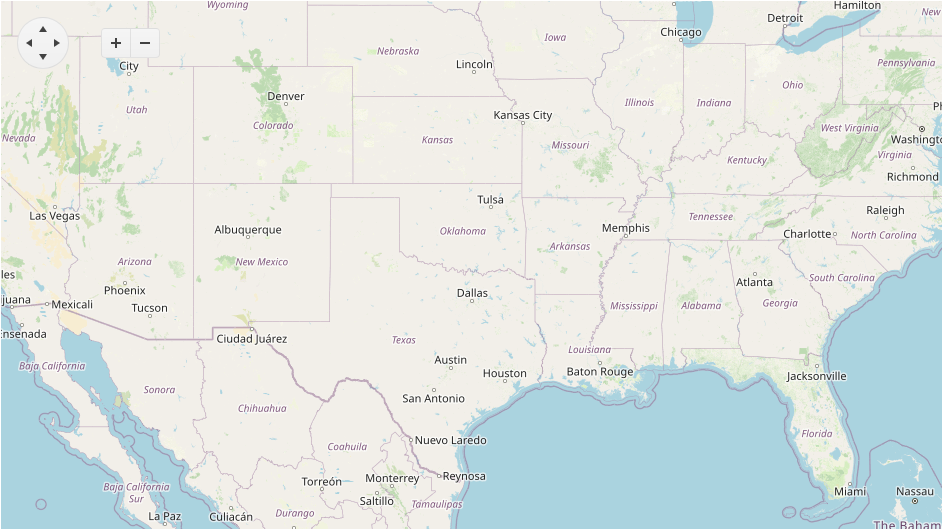

# Getting Started with the Map

This tutorial explains how to set up a basic Telerik UI for {{ site.framework }} Map and highlights the major steps in the configuration of the component.

You will initialize a Map and learn how to zoom in it. Then, you will see how to attach an event handler to the component. 

Finally, you can run the sample code in [Telerik REPL](https://netcorerepl.telerik.com/) and continue exploring the component.

 

@[template](/_contentTemplates/core/getting-started-prerequisites.md#repl-component-gs-prerequisites)

## 1. Prepare the CSHTML File

@[template](/_contentTemplates/core/getting-started-directives.md#gs-adding-directives)

Optionally, you can structure the document by adding the desired HTML elements like headings, divs, paragraphs, and others.

```HtmlHelper
@using Kendo.Mvc.UI
<h4>Map with event handler</h4>
<p>
</p>
```

```TagHelper
@addTagHelper *, Kendo.Mvc
<h4>Map with event handler</h4>
<p>
</p>
```


## 2. Initialize the Map

Use the Map HtmlHelper or TagHelper to add the component to a page:

* The `Name()` configuration method is mandatory as its value is used for the `id` and the `name` attributes of the Map element.
* The `Layers()` configuration method determines of the type of the layer. 
* The `Center()` configuration method sets the center of the map. Coordinates are listed as [Latitude, Longitude].
* The `Markers()` configuration method sets the static markers to display on the map.

```HtmlHelper
@using Kendo.Mvc.UI

<h4>Map with event handler</h4>
<p>
@(Html.Kendo().Map()
    .Name("map")
    .Center(30.268107, -97.744821)
    .Layers(layers =>
    {
        layers.Add()
            .Type(MapLayerType.Tile)
            .UrlTemplate("https://#= subdomain #.tile.openstreetmap.org/#= zoom #/#= x #/#= y #.png")
            .Subdomains("a", "b", "c")
            .Attribution("&copy; <a href='https://osm.org/copyright'>OpenStreetMap contributors</a>");
    })
    .Markers(markers =>
    {
        markers.Add()
            .Location(30.268107, -97.744821)
            .Shape(MapMarkersShape.PinTarget)
            .Tooltip(tooltip => tooltip.Content("Austin, TX"));
    })
)
</p>
```

```TagHelper
@addTagHelper *, Kendo.Mvc

<h4>Map with event handler</h4>
<p>
@{
    var coordinates = new double[] { 30.268107, -97.744821 };
    var subdomains = new string[] { "a", "b", "c" };
}

<kendo-map name="map" center="coordinates">
    <layers>
        <layer type="MapLayerType.Tile"
               url-template="https://#= subdomain #.tile.openstreetmap.org/#= zoom #/#= x #/#= y #.png"
               subdomains="subdomains"
               attribution="&copy; <a href='https://osm.org/copyright'>OpenStreetMap contributors</a>">
        </layer>
    </layers>
    <markers>
        <map-marker location="coordinates" shape="MapMarkersShape.PinTarget">
            <tooltip content="Austin, TX"></tooltip>
        </map-marker>
    </markers>
</kendo-map>
</p>
```


## 3. Use the Zoom Configuration of the Map

The next step is to configure Zoom configuration. Typical web maps use zoom levels from 0 (whole world) to 19 (sub-meter features). You can do that by using the `Zoom()` configuration.

```HtmlHelper
@using Kendo.Mvc.UI

<h4>Map with event handler</h4>
<p>
@(Html.Kendo().Map()
    .Name("map")
    .Zoom(5)
    .Center(30.268107, -97.744821)
    .Layers(layers =>
    {
        layers.Add()
            .Type(MapLayerType.Tile)
            .UrlTemplate("https://#= subdomain #.tile.openstreetmap.org/#= zoom #/#= x #/#= y #.png")
            .Subdomains("a", "b", "c")
            .Attribution("&copy; <a href='https://osm.org/copyright'>OpenStreetMap contributors</a>");
    })
    .Markers(markers =>
    {
        markers.Add()
            .Location(30.268107, -97.744821)
            .Shape(MapMarkersShape.PinTarget)
            .Tooltip(tooltip => tooltip.Content("Austin, TX"));
    })
)
</p>
```

```TagHelper
@addTagHelper *, Kendo.Mvc

<h4>Map with event handler</h4>
<p>
@{
    var coordinates = new double[] { 30.268107, -97.744821 };
    var subdomains = new string[] { "a", "b", "c" };
}

<kendo-map name="map" center="coordinates" zoom="5">
    <layers>
        <layer type="MapLayerType.Tile"
               url-template="https://#= subdomain #.tile.openstreetmap.org/#= zoom #/#= x #/#= y #.png"
               subdomains="subdomains"
               attribution="&copy; <a href='https://osm.org/copyright'>OpenStreetMap contributors</a>">
        </layer>
    </layers>
    <markers>
        <map-marker location="coordinates" shape="MapMarkersShape.PinTarget">
            <tooltip content="Austin, TX"></tooltip>
        </map-marker>
    </markers>
</kendo-map>
</p>
```


## 4. Handle a Map Event

The Map exposes a `ZoomStart()` event that you can handle and assign specific functions to the component. In this tutorial, you will use the `ZoomStart()` event to display a message when the user start zooming of in the Map.

```HtmlHelper
@using Kendo.Mvc.UI

<h4>Map with event handler</h4>
<p>
@(Html.Kendo().Map()
    .Name("map")
    .Zoom(5)
    .Center(30.268107, -97.744821)
    .Layers(layers =>
    {
        layers.Add()
            .Type(MapLayerType.Tile)
            .UrlTemplate("https://#= subdomain #.tile.openstreetmap.org/#= zoom #/#= x #/#= y #.png")
            .Subdomains("a", "b", "c")
            .Attribution("&copy; <a href='https://osm.org/copyright'>OpenStreetMap contributors</a>");
    })
    .Markers(markers =>
    {
        markers.Add()
            .Location(30.268107, -97.744821)
            .Shape(MapMarkersShape.PinTarget)
            .Tooltip(tooltip => tooltip.Content("Austin, TX"));
    })
    .Events(e => e.ZoomStart("onZoomStart"))
)
</p>

<script>
    function onZoomStart(){
        console.log("zoom started")
    }
</script>
```

```TagHelper
@addTagHelper *, Kendo.Mvc

<h4>Map with event handler</h4>
<p>
@{
    var coordinates = new double[] { 30.268107, -97.744821 };
    var subdomains = new string[] { "a", "b", "c" };
}

<kendo-map name="map" center="coordinates" zoom="5" on-zoom-start="onZoomStart">
    <layers>
        <layer type="MapLayerType.Tile"
               url-template="https://#= subdomain #.tile.openstreetmap.org/#= zoom #/#= x #/#= y #.png"
               subdomains="subdomains"
               attribution="&copy; <a href='https://osm.org/copyright'>OpenStreetMap contributors</a>">
        </layer>
    </layers>
    <markers>
        <map-marker location="coordinates" shape="MapMarkersShape.PinTarget">
            <tooltip content="Austin, TX"></tooltip>
        </map-marker>
    </markers>
</kendo-map>
</p>

<script>
    function onZoomStart(){
        console.log("zoom started")
    }
</script>
```


For more examples, refer to the [demo on using the events of the Map](https://demos.telerik.com/{{ site.platform }}/map/events).

## 5. (Optional) Reference Existing Map Instances

You can reference the Map instances that you have created and build on top of their existing configuration:

1. Use the `id` attribute of the component instance to establish a reference.

    ```JS script
    <script>
        var map = $("#map").data("kendoMap"); // map is a reference to the existing map instance of the helper.
    </script>
    ```
1. Use the [Map client-side API](https://docs.telerik.com/kendo-ui/api/javascript/ui/map#methods) to control the behavior of the widget. In this example, you will use the `center` method to access center the view of the Map
    ```JS script
    <script>
        var map = $("#map").data("kendoMap"); // map is a reference to the existing map instance of the helper.
        map.center([32.7758, -96.7966]).zoom(10); // set the Map center
    </script>
    ```
For more information on referencing specific helper instances, see the [Methods and Events]() article.

## Explore this Tutorial in REPL
You can continue experimenting with the code sample above by running it in the Telerik REPL server playground:
* [Sample code with the Map HtmlHelper](https://netcorerepl.telerik.com/mRlmEblS02CGTQVj42)

* [Sample code with the Map TagHelper](https://netcorerepl.telerik.com/QHbmaFby03r7DXvx18)

## Next Steps
* [Export the Map in PDF, SVG or PNG format]()
* [Use Remote Binding for the markers of the Map]()
## See Also
* [Using the API of the Map for {{ site.framework }} (Demo)](https://demos.telerik.com/{{ site.platform }}/map/api)
* [Client-Side API of the Map](https://docs.telerik.com/kendo-ui/api/javascript/ui/map)
* [Server-Side API of the Map](/api/map)
* [Knowledge Base Section](/knowledge-base)