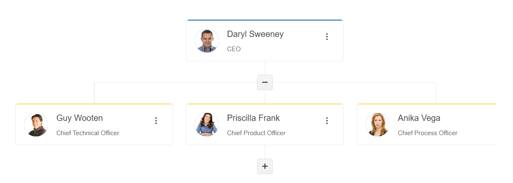

# Getting Started with the OrgChart

This tutorial explains how to set up a basic Telerik UI for {{ site.framework }} OrgChart and highlights the major steps in the configuration of the component.

You will initialize a OrgChart control and bind it to data. Then, you will handle some of the OrgChart events. Finally, you can run the sample code in a [Telerik REPL](https://netcorerepl.telerik.com/) and continue exploring the component.

After completing this guide, you will achieve the following result:

 

@[template](/_contentTemplates/core/getting-started-prerequisites.md#repl-component-gs-prerequisites)

## 1. Prepare the CSHTML File

@[template](/_contentTemplates/core/getting-started-directives.md#gs-adding-directives)

Optionally, you can structure the document by adding the desired HTML elements like headings, divs, paragraphs, and others.

## 2. Declare the View Model

Declare the `EmployeeViewModel` view model. The model must have a property field that represents the hierarchical relationship of the entries. In this tutorial, this is the `ParentID` field.

```C#
public class EmployeeViewModel
{
    public int ID { get; set; }

    public string Name { get; set; }

    public string Title { get; set; }

    public string Avatar { get; set; }

    public string Group { get; set; }

    public bool? Expanded { get; set; }

    public int? ParentID { get; set; }

    public bool hasChildren { get; set; }
}
```

## 3. Initialize the OrgChart

Use the OrgChart HtmlHelper or TagHelper to add the component to a page and set some of its options.

* Use the `Name()` configuration method to assign a name to the instance of the helper&mdash;this is mandatory as its value is used for the `id` and the `name` attributes of the OrgChart element.
* Add the `DataSource()` configuration option and set the `Read` end point.
* Configure the DataSource `Model` to correctly bind the fields to their respective OrgChart properties. 

```HtmlHelper
@using Kendo.Mvc.UI


@(Html.Kendo().OrgChart()
    .Name("orgchart")
    .DataTextField("Name")
    .DataSource(dataSource => dataSource
        .Read(read => read
            .Action("RemoteDataBindingData", "OrgChart")
        )
        .Model(m => {
            m.Id(f => f.ID);
            m.ParentId(f => f.ParentID);
            m.Name(f => f.Name);
            m.Title(f => f.Title);
            m.Avatar(f => f.Avatar);
            m.Expanded(f=>f.Expanded);
        })
    )
)
```

```TagHelper
@addTagHelper *, Kendo.Mvc

<kendo-orgchart datatextfield="Name" name="orgchart">
    <orgchart-datasource>
        <transport>
            <read url="@Url.Action("RemoteDataBindingData", "OrgChart")" />
        </transport>
        <orgchart-model id="ID" parent-id="ParentID" name="Name" title="Title" avatar="Avatar" expanded="true">
                    <fields>
                        <field name="ParentID" nullable="true"></field>
                        <field name="ID" type="number"></field>
                        <field name="Name" type="string"></field>
                        <field name="Title" type="string"></field>
                        <field name="Avatar" type="string"></field>
                    </fields>
        </orgchart-model>
    </orgchart-datasource>
</kendo-orgchart>

```


## 4. Declare the Read Action

In the `Home` controller, declare the `RemoteDataBindingData` action that you set to the DataSource `Read` configuration in the previous step. 

```Controller

public List<EmployeeViewModel> GetData()
{
    List<EmployeeViewModel> employees = new List<EmployeeViewModel>(){
        new EmployeeViewModel { 
          ID = 1,
          Name = "Daryl Sweeney",
          Title = "CEO",
          ParentID = null,
          hasChildren = false 
        },
        new EmployeeViewModel {
          ID = 2,
          Name = "Guy Wooten",
          Title = "Chief Technical Officer",
          ParentID = 1,
          hasChildren = false
        },
        new EmployeeViewModel {
          ID = 3,
          Name = "Priscilla Frank",
          Title = "Chief Product Officer",
          ParentID = 1,
          hasChildren = false 
        },
        new EmployeeViewModel {
          ID = 4,
          Name = "Ursula Holmes",
          Title = "EVP, Product Strategy",
          ParentID = 3,
          hasChildren = false 
        },
        new EmployeeViewModel {
          ID = 5,
          Name = "Anika Vega",
          Title = "Chief Process Office",
          ParentID = 1,
          hasChildren = false
        }
    }

    return employees;
}

public JsonResult RemoteDataBindingData([DataSourceRequest] DataSourceRequest request)
{
    var source = GetData().Select((x, i) => new EmployeeViewModel()
    {
        ID = x.EmployeeId,
        Name = x.Name,
        ParentID = x.ParentID,
        Title = x.Position,
        Avatar = "../shared/web/treelist/people/" + (i + 1) + ".jpg",
    }).ToList<EmployeeViewModel>();

    source[0].Expanded = true;

    return Json(new
    {
        Data = source
    });
}

```

## 5. Handle the OrgChart Events

The OrgChart [exposes various events](/api/kendo.mvc.ui.fluent/orgcharteventbuilder) that you can handle and further customize the functionality of the component. In this tutorial, you will use the `DataBound` event of the OrgChart.

```HtmlHelper
    @using Kendo.Mvc.UI


    @(Html.Kendo().OrgChart()
        .Name("orgchart")
        .DataTextField("Name")
        .DataSource(dataSource => dataSource
            .Read(read => read
                .Action("RemoteDataBindingData", "OrgChart")
            )
            .Model(m => {
                m.Id(f => f.ID);
                m.ParentId(f => f.ParentID);
                m.Name(f => f.Name);
                m.Title(f => f.Title);
                m.Avatar(f => f.Avatar);
                m.Expanded(f=>f.Expanded);
            })
        )
        .Events(e=>e.DataBound("onDataBound"))
    )
```

```TagHelper
    @addTagHelper *, Kendo.Mvc


    <kendo-orgchart datatextfield="Name" name="orgchart"
        on-data-bound="onDataBound">
        <orgchart-datasource>
            <transport>
                <read url="@Url.Action("RemoteDataBindingData", "OrgChart")" />
            </transport>
            <orgchart-model id="ID" parent-id="ParentID" name="Name" title="Title" avatar="Avatar" expanded="true">
                    <fields>
                        <field name="ParentID" nullable="true"></field>
                        <field name="ID" type="number"></field>
                        <field name="Name" type="string"></field>
                        <field name="Title" type="string"></field>
                        <field name="Avatar" type="string"></field>
                    </fields>
            </orgchart-model>
        </orgchart-datasource>
    </kendo-orgchart>
```

```JavaScript
    <script>
        function onDataBound(e) {
            console.log("OrgChart data bound");
        }
    </script>
```

For more examples, refer to the [demo on using the events of the OrgChart](https://demos.telerik.com/{{ site.platform }}/orgchart/events).

## 6. (Optional) Reference Existing OrgChart Instances

To use the client-side API of the OrgChart and build on top of its initial configuration, you need a reference to the OrgChart instance. Once you get a valid reference, you can call the respective API methods:

1. Use the `.Name()` (`id` attribute) of the component instance to get a reference.

    ```script
        <script>
            var orgchartReference = $("#orgchart").data("kendoOrgChart"); // orgchartReference is a reference to the existing instance of the helper.
        </script>
    ```

1. Use the [OrgChart client-side API](https://docs.telerik.com/kendo-ui/api/javascript/ui/orgchart#methods) to control the behavior of the widget. In this example, you will use the [`items`](https://docs.telerik.com/kendo-ui/api/javascript/ui/orgchart/methods/items) method to access the element of the first node use the [`expand`](https://docs.telerik.com/kendo-ui/api/javascript/ui/orgchart/methods/expand) method to expand it programmatically.

    ```script
        <script>
            $(document).ready(function () {
                var orgChart = $("#orgchart").getKendoOrgChart(); // Reference to the existing instance of the helper.
                var node = orgChart.items()[1]; // Access the element of the first node.

                orgChart.expand(node); // Expand the node.
            })
        </script>
    ```


## Explore this Tutorial in REPL

You can continue experimenting with the code sample above by running it in the Telerik REPL server playground:

* [Sample code with the OrgChart HtmlHelper](https://netcorerepl.telerik.com/QREAOBPf54BB0Ii109)
* [Sample code with the OrgChart TagHelper](https://netcorerepl.telerik.com/QxkUOhPf54s8tQl147)



## Next Steps

* [Binding the OrgChart to Data]()
* [Configuring the OrgChart Editing Feature]()
* [Using the OrgChart Templates]()
* [Grouping the OrgChart Nodes]()

## See Also

* [Using the API of the OrgChart for {{ site.framework }} (Demo)](https://demos.telerik.com/{{ site.platform }}/orgchart/api)
* [Client-Side API of the OrgChart](https://docs.telerik.com/kendo-ui/api/javascript/ui/orgchart)
* [Server-Side API of the OrgChart](/api/orgchart)
* [Knowledge Base Section](/knowledge-base)
