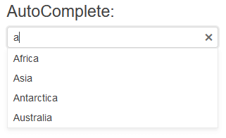

# Getting Started with the AutoComplete

This tutorial explains how to set up a basic Telerik UI for {{ site.framework }} AutoComplete and highlights the major steps in the configuration of the component.

You will initialize a AutoComplete component and load it with data. Finally, you can run the sample code in [Telerik REPL](https://netcorerepl.telerik.com/) and continue exploring the components.

 

@[template](/_contentTemplates/core/getting-started-prerequisites.md#repl-component-gs-prerequisites)

## 1. Prepare the CSHTML File

@[template](/_contentTemplates/core/getting-started-directives.md#gs-adding-directives)

You will also add some sample data that the AutoComplete will display. Optionally, you can structure the content in the view by adding the desired HTML elements like headings, divs, paragraphs, and others.

```HtmlHelper
    @using Kendo.Mvc.UI

    @{
        var continents = new List<SelectListItem> {
            new SelectListItem() {Text = "Africa", Value = "1"},
            new SelectListItem() {Text = "Europe", Value = "2"},
            new SelectListItem() {Text = "Asia", Value = "3"},
            new SelectListItem() {Text = "North America", Value = "4"},
            new SelectListItem() {Text = "South America", Value = "5"},
            new SelectListItem() {Text = "Antarctica", Value = "6"},
            new SelectListItem() {Text = "Australia", Value = "7"}
        };
    }

    <h4>AutoComplete:</h4>
```

```TagHelper
    @addTagHelper *, Kendo.Mvc

    @{
        var continents = new List<SelectListItem> {
            new SelectListItem() {Text = "Africa", Value = "1"},
            new SelectListItem() {Text = "Europe", Value = "2"},
            new SelectListItem() {Text = "Asia", Value = "3"},
            new SelectListItem() {Text = "North America", Value = "4"},
            new SelectListItem() {Text = "South America", Value = "5"},
            new SelectListItem() {Text = "Antarctica", Value = "6"},
            new SelectListItem() {Text = "Australia", Value = "7"}
        };
    }

    <h4>AutoComplete:</h4>
```


## 2. Initialize the AutoComplete

Use the AutoComplete HtmlHelper or TagHelper to add the component to the page:

* The `Name()` configuration method is mandatory as its value is used for the `id` and the `name` attributes of the AutoComplete element.
* The `Placeholder()` configuration specifies the text that is shown initially within the AutoComplete, when none of the items is selected.
* The `DataTextField()` option specifies the name of the field in the data, which will be used to show text in the items. The same field is used to set the value of the component.

```HtmlHelper
    @using Kendo.Mvc.UI

    @{
        var continents = new List<SelectListItem> {
            new SelectListItem() {Text = "Africa", Value = "1"},
            new SelectListItem() {Text = "Europe", Value = "2"},
            new SelectListItem() {Text = "Asia", Value = "3"},
            new SelectListItem() {Text = "North America", Value = "4"},
            new SelectListItem() {Text = "South America", Value = "5"},
            new SelectListItem() {Text = "Antarctica", Value = "6"},
            new SelectListItem() {Text = "Australia", Value = "7"}
        };
    }

    <h4>AutoComplete:</h4>

	@(Html.Kendo().AutoComplete()
		.Name("autocomplete")
		.DataTextField("Text")
		.Placeholder("Select a continent")
		.HtmlAttributes(new { style = "width: 300px;"})
		.BindTo(continents)
	)
```

```TagHelper
    @addTagHelper *, Kendo.Mvc

    @{
        var continents = new List<SelectListItem> {
            new SelectListItem() {Text = "Africa", Value = "1"},
            new SelectListItem() {Text = "Europe", Value = "2"},
            new SelectListItem() {Text = "Asia", Value = "3"},
            new SelectListItem() {Text = "North America", Value = "4"},
            new SelectListItem() {Text = "South America", Value = "5"},
            new SelectListItem() {Text = "Antarctica", Value = "6"},
            new SelectListItem() {Text = "Australia", Value = "7"}
        };
    }

    <h4>AutoComplete:</h4>

    <kendo-autocomplete name="autocomplete"
        datatextfield="Text"
        placeholder="Select a continent"
        bind-to="continents"
        style="width: 300px;">
    </kendo-autocomplete>
```


>Do not set the `Name()` option when using `AutoCompleteFor`. The `[ComponentName]For` method automatically sets the control's `Name()` to the field it is bound to. For more information, see the [Fundamentals]()() article.

## 3. Select a Default Value

The next step is to set one of the items of the AutoComplete as selected. The following example shows how to use the `.Value()` method of the AutoComplete to select the item with text `Europe`.

```HtmlHelper
    @using Kendo.Mvc.UI

    @{
        var continents = new List<SelectListItem> {
            new SelectListItem() {Text = "Africa", Value = "1"},
            new SelectListItem() {Text = "Europe", Value = "2"},
            new SelectListItem() {Text = "Asia", Value = "3"},
            new SelectListItem() {Text = "North America", Value = "4"},
            new SelectListItem() {Text = "South America", Value = "5"},
            new SelectListItem() {Text = "Antarctica", Value = "6"},
            new SelectListItem() {Text = "Australia", Value = "7"}
        };
    }

    <h4>AutoComplete:</h4>

	@(Html.Kendo().AutoComplete()
		.Name("autocomplete")
		.DataTextField("Text")
		.Placeholder("Select a continent")
		.HtmlAttributes(new { style = "width: 300px;"})
		.BindTo(continents)
        .Value("Europe")
	)
```

```TagHelper
    @addTagHelper *, Kendo.Mvc

    @{
        var continents = new List<SelectListItem> {
            new SelectListItem() {Text = "Africa", Value = "1"},
            new SelectListItem() {Text = "Europe", Value = "2"},
            new SelectListItem() {Text = "Asia", Value = "3"},
            new SelectListItem() {Text = "North America", Value = "4"},
            new SelectListItem() {Text = "South America", Value = "5"},
            new SelectListItem() {Text = "Antarctica", Value = "6"},
            new SelectListItem() {Text = "Australia", Value = "7"}
        };
    }

    <h4>AutoComplete:</h4>

    <kendo-autocomplete name="autocomplete"
        datatextfield="Text"
        placeholder="Select a continent"
        bind-to="continents"
        style="width: 300px;"
        value="Europe">
    </kendo-autocomplete>
```


## 4. Handle an AutoComplete Event

The AutoComplete component exposes convenient events for implementing your desired logic. In this example, you will use the `Change()` event to log the value of the selected item in the browser's console. You will also handle the `Open()` event and log an entry in the browser's console when the event fires. 

```HtmlHelper
    @using Kendo.Mvc.UI

    @{
        var continents = new List<SelectListItem> {
            new SelectListItem() {Text = "Africa", Value = "1"},
            new SelectListItem() {Text = "Europe", Value = "2"},
            new SelectListItem() {Text = "Asia", Value = "3"},
            new SelectListItem() {Text = "North America", Value = "4"},
            new SelectListItem() {Text = "South America", Value = "5"},
            new SelectListItem() {Text = "Antarctica", Value = "6"},
            new SelectListItem() {Text = "Australia", Value = "7"}
        };
    }

    <script>
        function onChange(e) {
            console.log("Change :: " + this.value());
        }

        function onOpen(e) {
            console.log("AutoComplete opened");
        }
    </script>

    <h4>AutoComplete:</h4>

    @(Html.Kendo().AutoComplete()
		.Name("autocomplete")
		.DataTextField("Text")
		.Placeholder("Select a continent")
		.HtmlAttributes(new { style = "width: 300px;"})
		.BindTo(continents)
        .Value("Europe")
        .Events(e => e // Configure the client-side events.
            .Change("onChange")
            .Open("onOpen")
        )
	)
```

```TagHelper
    @addTagHelper *, Kendo.Mvc

    @{
        var continents = new List<SelectListItem> {
            new SelectListItem() {Text = "Africa", Value = "1"},
            new SelectListItem() {Text = "Europe", Value = "2"},
            new SelectListItem() {Text = "Asia", Value = "3"},
            new SelectListItem() {Text = "North America", Value = "4"},
            new SelectListItem() {Text = "South America", Value = "5"},
            new SelectListItem() {Text = "Antarctica", Value = "6"},
            new SelectListItem() {Text = "Australia", Value = "7"}
        };
    }

    <script>
        function change(e) {
            console.log("Change :: " + this.value());
        }

        function open(e) {
            console.log("AutoComplete opened");
        }
    </script>

    <h4>AutoComplete:</h4>

    <kendo-autocomplete name="autocomplete"
        datatextfield="Text"
        placeholder="Select a continent"
        bind-to="continents"
        style="width: 300px;"
        value="Europe"
        on-change="change"
        on-open="open">
    </kendo-autocomplete>
```



## 5. (Optional) Reference Existing AutoComplete Instances

To use the client-side API of the AutoComplete and build on top of its initial configuration, you need a reference to the AutoComplete instance. Once you get a valid reference, you can call the respective API methods:

1. Use the `.Name()` (id attribute) of the component instance to get a reference.

    ```script
        <script>
            $(document).ready(function() {
                var autocompleteReference = $("#autocomplete").data("kendoAutoComplete"); // autocompleteReference is a reference to the existing AutoComplete instance of the helper.
            })
        </script>
    ```

1. Use the [AutoComplete client-side API](https://docs.telerik.com/kendo-ui/api/javascript/ui/autocomplete#methods) to control the behavior of the control. In this example, you will use the `value` method to select an item.

    ```script
        <script>
            $(document).ready(function() {
                var autocompleteReference = $("#autocomplete").data("kendoAutoComplete"); // autocompleteReference is a reference to the existing AutoComplete instance of the helper.
                autocompleteReference.value("Asia"); 
            })
        </script>
    ```


## Explore this Tutorial in REPL

You can continue experimenting with the code sample above by running it in the Telerik REPL server playground:

* [Sample code with the AutoComplete HtmlHelper](https://netcorerepl.telerik.com/QnuFlUlG48KX8d8D54)
* [Sample code with the AutoComplete TagHelper](https://netcorerepl.telerik.com/QnuFbgvG497AEgmh25)



## Next Steps

* [Binding the AutoComplete to Data]()
* [Customize the Appearance of the AutoComplete]()
* [Controlling the Rendering of the AutoComplete through Templates]()

## See Also

* [Using the API of the AutoComplete for {{ site.framework }} (Demo)](https://demos.telerik.com/{{ site.platform }}/autocomplete/api)
* [Client-Side API of the AutoComplete ](https://docs.telerik.com/kendo-ui/api/javascript/ui/autocomplete)
* [Server-Side API of the AutoComplete](/api/autocomplete)
* [Knowledge Base Section](/knowledge-base)
