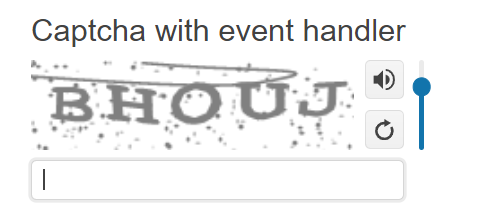

# Getting Started with the Captcha

This tutorial explains how to set up a basic Telerik UI for {{ site.framework }} Captcha and highlights the major steps in the configuration of the component.

You will initialize a Captcha and learn how to add audio reading support. Then, you will see how to attach an event handler to the component. Finally, you can run the sample code in [Telerik REPL](https://netcorerepl.telerik.com/) and continue exploring the component.

 

@[template](/_contentTemplates/core/getting-started-prerequisites.md#repl-component-gs-prerequisites)

## 1. Prepare the CSHTML File

@[template](/_contentTemplates/core/getting-started-directives.md#gs-adding-directives)

Optionally, you can structure the document by adding the desired HTML elements like headings, divs, paragraphs, and others.

```HtmlHelper
@using Kendo.Mvc.UI

<h4>Captcha with event handler</h4>

<p>

</p>
```

```TagHelper
@addTagHelper *, Kendo.Mvc

<h4>Captcha with event handler</h4>

<p>

</p>
``` 


## 2. Initialize the Captcha

Use the Captcha HtmlHelper or TagHelper to add the component to a page:

* The `Name()` configuration method is mandatory as its value is used for the `id` and the `name` attributes of the Captcha element.
* The `DataCaptchaField()` represents the main field.
* The `DataCaptchaIdField()` represents the ID field.
* The `Handler()` configuration points to the respective Controller action.

```HtmlHelper
@using Kendo.Mvc.UI

<h4>Captcha with event handler</h4>

<p>
  @(Html.Kendo().Captcha()
   .Name("captcha")
   .DataCaptchaField("Captcha")
   .DataCaptchaIdField("CaptchaID")
   .Handler(handler => handler.Action("Reset_Events", "captcha"))
)
</p>

```

```TagHelper
@addTagHelper *, Kendo.Mvc

<h4>Captcha with event handler</h4>

<p>
   <kendo-captcha name="captcha" 
    datacaptchafield="Captcha"
    datacaptchaidfield="CaptchaID">
      <handler url="@Url.Action("Reset_Events", "captcha")" />
   </kendo-captcha>
</p>
```


## 3. Add Audio Reader

The next step is to configure the Captcha to allow audio capability. You can do that by using the `AudioHandlerFunction()` configuration.

```HtmlHelper
@using Kendo.Mvc.UI

<h4>Captcha with event handler</h4>

<script>
function audioHandler(args) {
    args.success("../shared/UserFiles/captcha/" + args.data.CaptchaID + ".wav");
}
</script>

<p>
  @(Html.Kendo().Captcha()
   .Name("captcha")
   .DataCaptchaField("Captcha")
   .DataCaptchaIdField("CaptchaID")
   .Handler(handler => handler.Action("Reset_Events", "captcha"))
   .AudioHandlerFunction("audioHandler")
)
</p>
```

```TagHelper
@addTagHelper *, Kendo.Mvc

<h4>Captcha with event handler</h4>

<script>
function audioHandler(args) {
    args.success("../shared/UserFiles/captcha/" + args.data.CaptchaID + ".wav");
}
</script>

<p>
   <kendo-captcha name="captcha" 
    datacaptchafield="Captcha"
    datacaptchaidfield="CaptchaID">
      <handler url="@Url.Action("Reset_Events", "captcha")" />
         <audio-handler function-handler="audioHandler" />
   </kendo-captcha>
</p>
```


## 4. Handle a Captcha Event

The Captcha exposes a `Change()` event that you can handle and assign specific functions to the component. In this tutorial, you will use the `Change()` event to display a message when the user changes the input value.

```HtmlHelper
@using Kendo.Mvc.UI

<h4>Captcha with event handler</h4>

<script>
function audioHandler(args) {
    args.success("../shared/UserFiles/captcha/" + args.data.CaptchaID + ".wav");
}
function onChange(e) {
    var value = e.sender.value();
    console.log(value);
}
</script>

<p>
  @(Html.Kendo().Captcha()
   .Name("captcha")
   .DataCaptchaField("Captcha")
   .DataCaptchaIdField("CaptchaID")
   .Handler(handler => handler.Action("Reset_Events", "captcha"))
   .AudioHandlerFunction("audioHandler")
   .Events(e => e.Change("onChange"))
)
</p>
```

```TagHelper
@addTagHelper *, Kendo.Mvc

<h4>Captcha with event handler</h4>

<script>
function audioHandler(args) {
    args.success("../shared/UserFiles/captcha/" + args.data.CaptchaID + ".wav");
}
function onChange(e) {
    var value = e.sender.value();
    console.log(value);
}
</script>

<p>
   <kendo-captcha name="captcha" 
    datacaptchafield="Captcha"
    datacaptchaidfield="CaptchaID"
    on-change="onChange">
      <handler url="@Url.Action("Reset_Events", "captcha")" />
         <audio-handler function-handler="audioHandler" />
   </kendo-captcha>
</p>
```


For more examples, refer to the [demo on using the events of the Captcha](https://demos.telerik.com/{{ site.platform }}/captcha/events).

## 5. (Optional) Reference Existing Captcha Instances

You can reference the Captcha instances that you have created and build on top of their existing configuration:

1. Use the `id` attribute of the component instance to establish a reference.

    ```script
    <script>
        var captchaReference = $("#captcha").data("kendoCaptcha"); // captchaReference is a reference to the existing captcha instance of the helper.
    </script>
    ```

1. Use the [Captcha client-side API](https://docs.telerik.com/kendo-ui/api/javascript/ui/captcha#methods) to control the behavior of the widget. In this example, you will use the `reset` method to refresh the captcha.

    ```script
    <script>
        var captchaReference = $("#captcha").data("kendoCaptcha"); // captchaReference is a reference to the existing timeCaptcha instance of the helper.
         captchaReference.reset(); // refreshes the Captcha
    </script>
    ```

For more information on referencing specific helper instances, see the [Methods and Events]() article.


## Explore this Tutorial in REPL

You can continue experimenting with the code sample above by running it in the Telerik REPL server playground:

* [Sample code with the Captcha HtmlHelper](https://netcorerepl.telerik.com/GRvPYjaC142YAsQv52)
* [Sample code with the Captcha TagHelper](https://netcorerepl.telerik.com/GxPFatuW14a3k4cE22)



## Next Steps

* [Configure the Provider of the Captcha]()
* [Configure the Captcha's Validation]()

## See Also

* [Using the API of the Captcha for {{ site.framework }} (Demo)](https://demos.telerik.com/{{ site.platform }}/captcha/api)
* [Client-Side API of the Captcha](https://docs.telerik.com/kendo-ui/api/javascript/ui/captcha)
* [Server-Side API of the Captcha](/api/captcha)
* [Knowledge Base Section](/knowledge-base)
