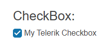

# Getting Started with the CheckBox

This tutorial explains how to set up a basic Telerik UI for {{ site.framework }} CheckBox and highlights the major steps in the configuration of the component.

You will initialize a CheckBox component with explicitly defined messages depending on its `check` state, and then change its appearance. Finally, you will learn how to handle the events of the CheckBox.

 

@[template](/_contentTemplates/core/getting-started-prerequisites.md#repl-component-gs-prerequisites)

## 1. Prepare the CSHTML File

@[template](/_contentTemplates/core/getting-started-directives.md#gs-adding-directives)

Optionally, you can structure the document by adding the desired HTML elements like headings, divs, and paragraphs.

```HtmlHelper
    @using Kendo.Mvc.UI
    <h4>CheckBox with a placeholder</h4>
    <div>
    
    </div>
```

```TagHelper
    @addTagHelper *, Kendo.Mvc
    <h4>CheckBox with a placeholder</h4>
    <div>
    
    </div>
```


## 2. Initialize the CheckBox

Use the CheckBox HtmlHelper or TagHelper to add the component to a page:

* The `Name()` configuration method is mandatory as its value is used for the `id` and the `name` attributes of the  CheckBox element.

```HtmlHelper
    @(Html.Kendo().CheckBox()
        .Name("checkbox")    
    )
```

```TagHelper
    <kendo-checkbox name="checkbox">
    </kendo-checkbox>
```



## 3. Configure the Label

The next step is to explicitly define the label for the CheckBox. The following example will configure the label functionality.

```HtmlHelper
    @(Html.Kendo().CheckBox()
        .Name("checkbox")    
        .Label("My Telerik Checkbox")
    )
```


```TagHelper
    <kendo-checkbox name="checkbox"
                label="My Telerik Checkbox">
    </kendo-checkbox>
```



## 4. Customize the Appearance of the CheckBox

To change the [appearance]() of the CheckBox, use any of its built-in styling options, for example, `Size()` or `Rounded()`.

```HtmlHelper
    @(Html.Kendo().CheckBox()
        .Name("checkbox")
        .Label("My Telerik Checkbox")
        .Size(ComponentSize.Medium)
        .Rounded(BasicRounded.Medium)
    )
```

```TagHelper
    <kendo-checkbox name="checkbox"
                    label="My Telerik Checkbox"
                    size="ComponentSize.Medium"
                    rounded="Rounded.Medium">
    </kendo-checkbox>
```


## 5. Handle the CheckBox Events

The CheckBox component exposes an [event](api/kendo.mvc.ui.fluent/checkboxbuilder#eventssystemaction) that you can handle and further customize the functionality of the component. In this tutorial, you will use the `Change` event to display a popup message when the value of the CheckBox changes through user interaction.

```HtmlHelper
    @(Html.Kendo().CheckBox()
        .Name("checkbox")
        .Label("My Telerik Checkbox")
        .Size(ComponentSize.Medium)
        .Rounded(BasicRounded.Medium)
        .Events(events => events.Change("onChange"))
    )

    <script>
        function onChange(e){
            alert("Changed value: "+ e.sender.value());
        }
    </script>
```

```TagHelper
    <kendo-checkbox name="checkbox"
                    label="My Telerik Checkbox"
                    size="ComponentSize.Medium"
                    rounded="Rounded.Medium"
                    on-change="onChange">
    </kendo-checkbox>

    <script>
        function onChange(e){
            alert("Changed value: "+ e.sender.value());
        }
    </script>
```


## 6. (Optional) Reference Existing CheckBox Instances

You can reference the CheckBox instances that you have created and build on top of their existing configuration:

1. Use the `.Name()` (`id` attribute) of the component instance to get a reference.

    ```script
         <script>
             $(document).ready(function() {
                 var checkBoxReference = $("#checkbox").data("kendoCheckBox"); // checkBoxReference is a reference to the existing CheckBox instance of the helper.
             })
         </script>
    ```
1. Set the check state of the component by using the [`check()`](https://docs.telerik.com/kendo-ui/api/javascript/ui/checkbox/methods/check) client-side method.

    ```script
        <script>
            $(document).ready(function() {
               var checkBoxReference = $("#checkbox").data("kendoCheckBox"); // checkBoxReference is a reference to the existing CheckBox instance of the helper.
               checkBoxReference.check(true); // Set the initial check state of the component.
            })
        </script>
    ```



## Explore this Tutorial in REPL

You can continue experimenting with the code sample above by running it in the Telerik REPL server playground:

* [Sample code with the CheckBox HtmlHelper](https://netcorerepl.telerik.com/wnOhwnFm19h60Tfz24)
* [Sample code with the CheckBox TagHelper](https://netcorerepl.telerik.com/wRaVGnbw21ol49UB27)




## Next Steps

* [Customizing the Appearance of the CheckBox]()

## See Also

* [Basic Overview of the CheckBox for {{ site.framework }} (Demo)](https://demos.telerik.com/{{ site.platform }}/checkbox)
* [Client-Side API of the CheckBox](https://docs.telerik.com/kendo-ui/api/javascript/ui/checkbox)
* [Server-Side API of the CheckBox for {{ site.framework }}](/api/checkbox)
* [Knowledge Base Section](/knowledge-base)
