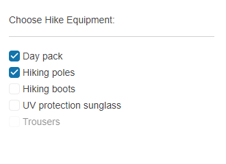

# Getting Started with the CheckBoxGroup

This tutorial explains how to set up a basic Telerik UI for {{ site.framework }}  CheckBoxGroup and highlights the major steps in the configuration of the component.

You will initialize a CheckBoxGroup control with 5 checkbox items. You will set their labels and value and will determine which items to be checked upon initialization. Next, you will handle the CheckBoxGroup events and will determine whether the user uses Keyboard Navigation to focus and apply changes to the component. Then, you will learn how to reference the client-side instance of the CheckBoxGroup and set its values during runtime. Finally, you can run the sample code in [Telerik REPL](https://netcorerepl.telerik.com/) and continue exploring the components.

 

@[template](/_contentTemplates/core/getting-started-prerequisites.md#repl-component-gs-prerequisites)

## 1. Prepare the CSHTML File
@[template](/_contentTemplates/core/getting-started-directives.md#gs-adding-directives)

Optionally, you can structure the document by adding the desired HTML elements like headings, divs, and paragraphs.

## 2. Initialize the CheckBoxGroup
Use the CheckBoxGroup HtmlHelper or TagHelper to add the component to a page:

* The `Name()` configuration method is mandatory as its value is used for the `id` and the `name` attributes of the CheckBoxGroup element.
* Configure the [Items](https://docs.telerik.com/aspnet-core/api/kendo.mvc.ui.fluent/checkboxgroupitembuilder) configuration method of the CheckBoxGroup. Each item represents a separate checkbox.
* The [Label](https://docs.telerik.com/aspnet-core/api/kendo.mvc.ui.fluent/checkboxgroupitembuilder#labelsystemstring) configuration method sets the text of the items. The [Value](https://docs.telerik.com/aspnet-core/api/kendo.mvc.ui.fluent/checkboxgroupbuilder#valuesystemcollectionsgenericienumerable) setting of an item assigns a value to the checkbox.
* The array of strings passed to the [Value](https://docs.telerik.com/aspnet-core/api/kendo.mvc.ui.fluent/checkboxgroupitembuilder#labelsystemstring) configuration of the CheckBoxGroup determines which items will be selected upon initialization.

```HtmlHelper
    @using Kendo.Mvc.UI

    <label class="label">Choose Hike Equipment:</label>
    <hr />
    @(Html.Kendo().CheckBoxGroup()
        .Name("checkboxgroup")
        .Items(i =>
        {
            i.Add().Label("Day pack").Value("1");
            i.Add().Label("Hiking poles").Value("2");
            i.Add().Label("Hiking boots").Value("3");
            i.Add().Label("UV protection sunglass").Value("4");
            i.Add().Label("Trousers").Value("5").Enabled(false);
        })
        .Value(new string[] { "1", "2" })
    )
```

```TagHelper
    @addTagHelper *, Kendo.Mvc
    @model Kendo.Mvc.Examples.Models.CheckBoxGroupViewModel
    @{
        var value = new string[]{"1", "2"};
    }

    <label class="label">Choose Hike Equipment:</label>
    <hr />
    <kendo-checkboxgroup name="checkboxgroup"
                         value="value">
        <kendo-checkboxgroup-items>
            <kendo-checkboxgroup-item label="Day pack"
                                      value="1">
            </kendo-checkboxgroup-item>
            <kendo-checkboxgroup-item label="Hiking poles"
                                      value="2">
            </kendo-checkboxgroup-item>
            <kendo-checkboxgroup-item label="Hiking boots"
                                      value="3">
            </kendo-checkboxgroup-item>
            <kendo-checkboxgroup-item label="UV protection sunglass"
                                      value="4">
            </kendo-checkboxgroup-item>
            <kendo-checkboxgroup-item label="Trousers"
                                      value="5"
                                      enabled="false">
            </kendo-checkboxgroup-item>
        </kendo-checkboxgroup-items>
    </kendo-checkboxgroup>
```


## 3. Handle the CheckBoxGroup Events
The CheckBoxGroup exposes various [events](/api/kendo.mvc.ui.fluent/checkboxbroupeventbuilder) that you can handle and further customize the functionality of the component. In this tutorial, you will use the `Focus` and `Select` events to determine whether the user utilizes the [Keyboard Navigation](https://docs.telerik.com/aspnet-core/html-helpers/editors/checkboxgroup/accessibility/keyboard-navigation) feature.

```HtmlHelper
    @using Kendo.Mvc.UI

    <label class="label">Choose Hike Equipment:</label>
    <hr />
    @(Html.Kendo().CheckBoxGroup()
        .Name("checkboxgroup")
        .Items(i =>
        {
            i.Add().Label("Day pack").Value("1");
            i.Add().Label("Hiking poles").Value("2");
            i.Add().Label("Hiking boots").Value("3");
            i.Add().Label("UV protection sunglass").Value("4");
            i.Add().Label("Trousers").Value("5").Enabled(false);
        })
        .Value(new string[] { "1", "2" })
        .Events(e => e.Focus("onFocus").Select("onSelect"))
    )
```

```TagHelper
    @addTagHelper *, Kendo.Mvc
    @model Kendo.Mvc.Examples.Models.CheckBoxGroupViewModel
    @{
        var value = new string[]{"1", "2"};
    }

    <label class="label">Choose Hike Equipment:</label>
    <hr />
    <kendo-checkboxgroup name="checkboxgroup"
                         value="value"
                         on-focus="onFocus"
                         on-select="onSelect">
        <kendo-checkboxgroup-items>
            <kendo-checkboxgroup-item label="Day pack"
                                      value="1">
            </kendo-checkboxgroup-item>
            <kendo-checkboxgroup-item label="Hiking poles"
                                      value="2">
            </kendo-checkboxgroup-item>
            <kendo-checkboxgroup-item label="Hiking boots"
                                      value="3">
            </kendo-checkboxgroup-item>
            <kendo-checkboxgroup-item label="UV protection sunglass"
                                      value="4">
            </kendo-checkboxgroup-item>
            <kendo-checkboxgroup-item label="Trousers"
                                      value="5"
                                      enabled="false">
            </kendo-checkboxgroup-item>
        </kendo-checkboxgroup-items>
    </kendo-checkboxgroup>
```

```JavaScript
    <script>
        $(document).on("keydown.examples", function (e) {
            if (e.altKey && e.keyCode === 87 /* w */) {
                $("#checkboxgroup").find(".k-checkbox:first").focus();
            }
        });
        var focusTime;
        var selectTime;
        function onSelect(e) {
            selectTime = Date.now();
            if(selectTime-focusTime>200){
                console.log("User utilizes keyboard navigation.")
            };
        }
        function onFocus(e) {
            focusTime = Date.now();
        }
</script>
```

## 4. (Optional) Reference Existing CheckBoxGroup Instances
You can reference the CheckBoxGroup instances that you have created and build on top of their existing configuration:

1. Use the `id` attribute of the component instance to establish a reference.

    ```JavaScript
        $(document).ready( function (e) {
            var checkboxgroupReference = $("#checkboxgroup").data("kendoCheckBoxGroup"); // checkboxgroupReference is a reference to the existing CheckBoxGroup instance of the helper.
        });
    ```

1. Use the [CheckBoxGroup client-side API](https://docs.telerik.com/kendo-ui/api/javascript/ui/checkboxgroup#methods) to control the behavior of the component. In this example, you will use the [`value`](https://docs.telerik.com/kendo-ui/api/javascript/ui/checkboxgroup/methods/value) method to select checkboxes programmatically.

    ```JavaScript
        $(document).ready(function (e) {
            var checkboxgroupReference = $("#checkboxgroup").data("kendoCheckBoxGroup");
            checkboxgroupReference.value("3","4");
        });
    ```


## Explore this Tutorial in REPL

You can continue experimenting with the code sample above by running it in the Telerik REPL server playground:

* [Sample code with the CheckBoxGroup HtmlHelper](https://netcorerepl.telerik.com/cnEhmSlK52Z2BtVJ54)
* [Sample code with the CheckBoxGroup TagHelper](https://netcorerepl.telerik.com/GHOVGIlq52Jle9qs42)



## Next Steps

* [Binding the CheckBoxGroup to Data]()
* [Customizing the Appearance of the CheckBoxGroup]()

## See Also

* [Using the API of the CheckBoxGroup for {{ site.framework }} (Demo)](https://demos.telerik.com/{{ site.platform }}/checkboxgroup/api)
* [Client-Side API of the CheckBoxGroup](https://docs.telerik.com/kendo-ui/api/javascript/ui/checkboxgroup)
* [Server-Side API of the CheckBoxGroup](/api/checkboxgroup)
* [Knowledge Base Section](/knowledge-base)
