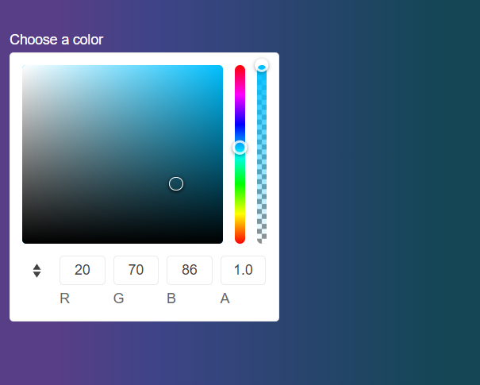

# Getting Started with the ColorGradient

This tutorial explains how to set up a basic Telerik UI for {{ site.framework }} ColorGradient and highlights the major steps in the configuration of the component.

You will initialize a ColorGradient component and use its `Change` event to dynamically change the color of the page's background. Finally, you can run the sample code in [Telerik REPL](https://netcorerepl.telerik.com/) and continue exploring the components.

 

@[template](/_contentTemplates/core/getting-started-prerequisites.md#repl-component-gs-prerequisites)

## 1. Prepare the CSHTML File

@[template](/_contentTemplates/core/getting-started-directives.md#gs-adding-directives)

You will also add some sample data that the ColorGradient will display. Optionally, you can structure the content in the view by adding the desired HTML elements like headings, divs, paragraphs, and others.

```html
    <div class="main-container k-d-flex k-flex-col">
            <div class="k-d-flex k-gap-3 k-align-items-center k-mb-5">
            </div>
            <div class="k-d-flex k-flex-col k-gap-1">
                <label for="colorGradient">Choose a color</label>
            </div>
    </div>
    <style>
        label{
            color:white;
        }
        body{
            background: linear-gradient(90deg,#583e87ff 14%, #3e4487ff 34%, #3e7587ff 89%);
        }
    </style>
```

## 2. Initialize the ColorGradient

Use the ColorGradient HtmlHelper or TagHelper to add the component to the page:

* Assign a name to the component by using the `Name()` configuration method—this is mandatory as the assigned value is used for the `id` and the `name` attributes of the ColorGradient element.
* Set the initial color selected by the control through its `Value` configuration method.
* Use the `Opacity` configuration method to enable the opacity slider and allow the users to adjust the transparency.


```HtmlHelper
    @using Kendo.Mvc.UI

    <div class="main-container k-d-flex k-flex-col">
            <div class="k-d-flex k-gap-3 k-align-items-center k-mb-5">
            </div>
            <div class="k-d-flex k-flex-col k-gap-1">
                <label for="colorGradient">Choose a color</label>
                @(Html.Kendo().ColorGradient()
                    .Name("colorGradient")
                    .Value("#3e7587ff")
                    .Opacity(true)
                )
            </div>
    </div>
    <style>
        label{
            color:white;
        }
        body{
            background: linear-gradient(90deg,#583e87ff 14%, #3e4487ff 34%, #3e7587ff 89%);
        }
    </style>
```

```TagHelper
    @addTagHelper *, Kendo.Mvc

    <div class="main-container k-d-flex k-flex-col">
            <div class="k-d-flex k-gap-3 k-align-items-center k-mb-5">
            </div>
            <div class="k-d-flex k-flex-col k-gap-1">
                <label for="colorGradient">Choose a color</label>

                <kendo-colorgradient name="colorGradient"
                        value="#3e7587ff"
                        opacity="true">
                </kendo-colorgradient>
            </div>
    </div>
    <style>
        label{
            color:white;
        }
        body{
            background: linear-gradient(90deg,#583e87ff 14%, #3e4487ff 34%, #3e7587ff 89%);
        }
    </style>
```


## 3. Configure the Format

The next step is to set the available formats through the `Formats` configuration and to select the one that is used by default through the `Format` method.

```HtmlHelper
    @using Kendo.Mvc.UI

    <div class="main-container k-d-flex k-flex-col">
            <div class="k-d-flex k-gap-3 k-align-items-center k-mb-5">
            </div>
            <div class="k-d-flex k-flex-col k-gap-1">
                <label for="colorGradient">Choose a color</label>
                @(Html.Kendo().ColorGradient()
                    .Name("colorGradient")
                    .Value("#3e7587ff")
                    .Opacity(true)
                    .Formats(new string[] { "rgb", "hex" })
                    .Format(ColorGradientFormat.Rgb)                  
                )
            </div>
    </div>
    <style>
        label{
            color:white;
        }
        body{
            background: linear-gradient(90deg,#583e87ff 14%, #3e4487ff 34%, #3e7587ff 89%);
        }
    </style>
```

```TagHelper
    @addTagHelper *, Kendo.Mvc
    @{
        var format_types = new string[] { "rgb", "hex" };
    }

    <div class="main-container k-d-flex k-flex-col">
            <div class="k-d-flex k-gap-3 k-align-items-center k-mb-5">
            </div>
            <div class="k-d-flex k-flex-col k-gap-1">
                <label for="colorGradient">Choose a color</label>
                <kendo-colorgradient name="colorGradient"
                        value="#3e7587ff"
                        opacity="true"
                        formats="format_types"
                        format="ColorGradientFormat.Rgb">
                </kendo-colorgradient>
            </div>
    </div>
    <style>
        label{
            color:white;
        }
        body{
            background: linear-gradient(90deg,#583e87ff 14%, #3e4487ff 34%, #3e7587ff 89%);
        }
    </style>
```


## 3. Handle a ColorGradient Event

The ColorGradient component exposes useful events for implementing custom requirements. In this example, you will use the `Change()` event in use to access the selected color of the ColorGradient and then apply that color to the background of the page.

```HtmlHelper
    @using Kendo.Mvc.UI

    <div class="main-container k-d-flex k-flex-col">
            <div class="k-d-flex k-gap-3 k-align-items-center k-mb-5">
            </div>
            <div class="k-d-flex k-flex-col k-gap-1">
                <label for="colorGradient">Choose a color</label>
                @(Html.Kendo().ColorGradient()
                    .Name("colorGradient")
                    .Value("#3e7587ff")
                    .Opacity(true)
                    .Format(ColorGradientFormat.Rgb)
                    .Formats(new string[] { "rgb", "hex" })
                    .Events(e => e.Change("select"))
                )
            </div>
    </div>
    <style>
        label{
            color:white;
        }
        body{
            background: linear-gradient(90deg,#583e87ff 14%, #3e4487ff 34%, #3e7587ff 89%);
        }
    </style>
```

```TagHelper
    @addTagHelper *, Kendo.Mvc

    @{
        var format_types = new string[] { "rgb", "hex" };
    }


    <div class="main-container k-d-flex k-flex-col">
            <div class="k-d-flex k-gap-3 k-align-items-center k-mb-5">
            </div>
            <div class="k-d-flex k-flex-col k-gap-1">
                <label for="colorGradient">Choose a color</label>

                <kendo-colorgradient name="colorGradient"
                                    value="#3e7587ff"
                                    opacity="true"
                                    format="ColorGradientFormat.Rgb"
                                    formats="format_types"
                                    on-change="select">
                </kendo-colorgradient>
            </div>
    </div>
    <style>
        label{
            color:white;
        }
        body{
            background: linear-gradient(90deg,#583e87ff 14%, #3e4487ff 34%, #3e7587ff 89%);
        }
    </style>
```

```JavaScript
    <script>
        function select(e) {
            var selectedColor = e.value;
            var gradient =  `linear-gradient(90deg,#583e87ff 14%, #3e4487ff 34%, ${selectedColor} 89%)`;
            $("body").css('background',gradient);
        }
    </script>
```


## 5. (Optional) Reference Existing ColorGradient Instances

To use the client-side API of the ColorGradient and build on top of its initial configuration, you need a reference to the ColorGradient instance. Once you get a valid reference, you can call the respective API methods:

1. Use the `.Name()` (`id` attribute) of the component instance to get a reference.

    ```script
        <script>
            $(document).ready(function() {
                var colorgradientReference = $("#colorgradient").data("kendoColorGradient"); // colorgradientReference is a reference to the existing ColorGradient instance of the helper.
            })
        </script>
    ```

1. Use the [ColorGradient client-side API](https://docs.telerik.com/kendo-ui/api/javascript/ui/colorgradient#methods) to control the behavior of the control. In this example, you will use the `value` method to change the color programmatically.

    ```script
        <script>
            $(document).ready(function() {
                var colorgradientReference = $("#colorgradient").data("kendoColorGradient"); // colorgradientReference is a reference to the existing ColorGradient instance of the helper.
                colorgradientReference.value("yellow"); 
            })
        </script>
    ```


## Explore this Tutorial in REPL

You can continue experimenting with the code sample above by running it in the Telerik REPL server playground:

* [Sample code with the ColorGradient HtmlHelper](https://netcorerepl.telerik.com/wRuibLFS29DA9UB143)
* [Sample code with the ColorGradient TagHelper](https://netcorerepl.telerik.com/GxaClBby29Ryv7Yx58)



## Next Steps

* [Utilizing the ColorGradient Contrast Tool]()
* [Customizing the Behavior of the ColorGradient with Events]()

## See Also

* [RGB and HEX input formats]()
* [Using the API of the ColorGradient for {{ site.framework }} (Demo)](https://demos.telerik.com/{{ site.platform }}/colorgradient/api)
* [Client-Side API of the ColorGradient](https://docs.telerik.com/kendo-ui/api/javascript/ui/colorgradient)
* [Server-Side API of the ColorGradient](/api/colorgradient)
* [Knowledge Base Section](/knowledge-base)
