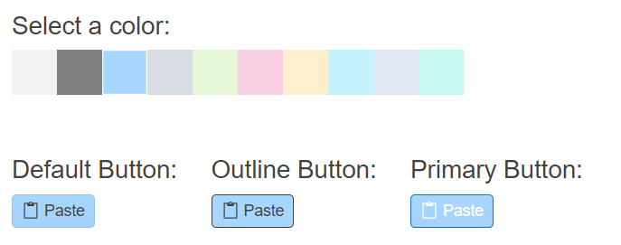

# Getting Started with the ColorPalette

This tutorial explains how to set up a basic Telerik UI for {{ site.framework }} ColorPalette and highlights the major steps in the configuration of the component.

You will initialize a ColorPalette control with a custom set of colors. Next, you will handle the [`Change` event](/api/kendo.mvc.ui.fluent/colorpaletteeventbuilder) [`Change` event](/api/kendo.mvc.ui.fluent/simplecolorpickereventbuilder#changesystemfunc) of the component to get the selected color and apply it as a background color to [DropDownButtons](). Finally, you can run the sample code in [Telerik REPL](https://netcorerepl.telerik.com/) and continue exploring the components.

 

@[template](/_contentTemplates/core/getting-started-prerequisites.md#component-gs-prerequisites)

## 1. Prepare the CSHTML File

@[template](/_contentTemplates/core/getting-started-directives.md#gs-adding-directives)

Optionally, you can structure the View content by adding the desired HTML elements like headings, divs, paragraphs, and others.

```HtmlHelper
    @using Kendo.Mvc.UI

    <div class="main-container">
        <div class="colorpalette-container">
            <h4>Select a color:</h4>
        </div>
    </div>
```

```TagHelper
    @addTagHelper *, Kendo.Mvc

    <div class="main-container">
        <div class="colorpalette-container">
            <h4>Select a color:</h4>
        </div>
    </div>
```


## 2. Initialize the ColorPalette

Use the ColorPalette HtmlHelper or TagHelper to add the component to a page:

* The `Name()` configuration method is mandatory as its value is used for the `id` and the `name` attributes of the ColorPalette element.
* The `Palette()` option sets the desired range of colors that the user can pick from.

```HtmlHelper
    @using Kendo.Mvc.UI

    <div class="main-container">
        <div class="colorpalette-container">
            <h4>Select a color:</h4>
            @(Html.Kendo().ColorPalette()
                .Name("colorpalette")
                .Palette(new string[] {
                    "#f2f2f2", "#7f7f7f", "#a7d6ff", "#d9dde4", "#e5f5d7", "#fad0e4", "#fef0cd", "#c5f2ff", "#e2e7f4", "#c9f7f1"
                })
            )
        </div>
    </div>
```

```TagHelper
    @addTagHelper *, Kendo.Mvc
    @{
        var color_set = new string[] { "#f2f2f2", "#7f7f7f", "#a7d6ff", "#d9dde4", "#e5f5d7", "#fad0e4", "#fef0cd", "#c5f2ff", "#e2e7f4", "#c9f7f1" };
    }

    <div class="main-container">
        <div class="colorpalette-container">
            <h4>Select a color:</h4>
            <kendo-colorpalette name="colorpalette"
                palette-colors="color_set">
            </kendo-colorpalette>
        </div>
    </div>
```


## 3. Implement the Color Changing

The next step is to configure DropDownButtons and handle the ColorPalette color selection. The `Change` event handler allows you to access the selected color. Iterate through the DropDownButtons on the page and change the background color of each button by using the jQuery [`css()`](http://api.jquery.com/css/) method.

```HtmlHelper
    @using Kendo.Mvc.UI

    <div class="main-container">
        <div class="colorpalette-container">
            <h4>Select a color:</h4>
            @(Html.Kendo().ColorPalette()
            .Name("colorpalette")
            .Palette(new string[] {
                "#f2f2f2", "#7f7f7f", "#a7d6ff", "#d9dde4", "#e5f5d7", "#fad0e4", "#fef0cd", "#c5f2ff", "#e2e7f4", "#c9f7f1"
            })
            .Events(ev=>ev.Change("onChange")))
        </div>
        <div class="buttons-container">
            <div class='column'>
                <h4>Default Button:</h4>
                @(Html.Kendo().DropDownButton()
                    .Name("default")
                    .Text("Paste")
                    .Icon("clipboard")
                    .Items(items=>{
                        items.Add().Id("keep-text").Text("Keep Text Only").Icon("clipboard-text").Click(@<text>function() { alert("Keep Text Only") }</text>);
                        items.Add().Id("paste-html").Text("Paste as HTML").Icon("clipboard-code").Click(@<text>function() { alert("Paste as HTML") }</text>);
                        items.Add().Id("paste-markdown").Text("Paste Markdown").Icon("clipboard-markdown").Click(@<text>function() { alert("Paste Markdown") }</text>);
                        items.Add().Id("paste-default").Text("Set Default Paste").Click(@<text>function() { alert("Set Default Paste") }</text>);
                    })
                )
            </div>
            <div class='column'>
                <h4>Outline Button:</h4>
                @(Html.Kendo().DropDownButton()
                    .Name("outline")
                    .Text("Paste")
                    .FillMode(FillMode.Outline)
                    .Icon("clipboard")
                    .Items(items=>{
                        items.Add().Id("keep-text").Text("Keep Text Only").Icon("clipboard-text").Click(@<text>function() { alert("Keep Text Only") }</text>);
                        items.Add().Id("paste-html").Text("Paste as HTML").Icon("clipboard-code").Click(@<text>function() { alert("Paste as HTML") }</text>);
                        items.Add().Id("paste-markdown").Text("Paste Markdown").Icon("clipboard-markdown").Click(@<text>function() { alert("Paste Markdown") }</text>);
                        items.Add().Id("paste-default").Text("Set Default Paste").Click(@<text>function() { alert("Set Default Paste") }</text>);
                    })
                )
            </div>
            <div class='column'>
                <h4>Primary Button:</h4>
                @(Html.Kendo().DropDownButton()
                    .Name("primary")
                    .Text("Paste")
                    .ThemeColor(ThemeColor.Primary)
                    .Icon("clipboard")
                    .Items(items=>{
                        items.Add().Id("keep-text").Text("Keep Text Only").Icon("clipboard-text").Click(@<text>function() { alert("Keep Text Only") }</text>);
                        items.Add().Id("paste-html").Text("Paste as HTML").Icon("clipboard-code").Click(@<text>function() { alert("Paste as HTML") }</text>);
                        items.Add().Id("paste-markdown").Text("Paste Markdown").Icon("clipboard-markdown").Click(@<text>function() { alert("Paste Markdown") }</text>);
                        items.Add().Id("paste-default").Text("Set Default Paste").Click(@<text>function() { alert("Set Default Paste") }</text>);
                    })
                )
            </div>
        </div>
    </div>
```

```TagHelper
    @addTagHelper *, Kendo.Mvc

    @{
        var color_set = new string[] { "#f2f2f2", "#7f7f7f", "#a7d6ff", "#d9dde4", "#e5f5d7", "#fad0e4", "#fef0cd", "#c5f2ff", "#e2e7f4", "#c9f7f1" };
    }

    <div class="main-container">
        <div class="colorpalette-container">
            <h4>Select a color:</h4>
            <kendo-colorpalette name="colorpalette" on-change="onChange"
                palette-colors="color_set">
            </kendo-colorpalette>
        </div>
        <div class="buttons-container">
            <div class='column'>
                <h4>Default Button:</h4>
                <kendo-dropdownbutton name="default" text="Paste" icon="clipboard">
                    <dropdownbutton-items>
                        <item id="keep-text" text="Keep Text Only" icon="clipboard-text"></item>
                        <item id="paste-html" text="Paste as HTML" icon="clipboard-code"></item>
                        <item id="paste-markdown" text="Paste Markdown" icon="clipboard-markdown"></item>
                        <item id="paste-default" text="Set Default Paste"></item>
                    </dropdownbutton-items>
                </kendo-dropdownbutton>
            </div>
            <div class='column'>
                <h4>Outline Button:</h4>
                <kendo-dropdownbutton name="outline" text="Paste" icon="clipboard" fill-mode="FillMode.Outline">
                    <dropdownbutton-items>
                        <item id="keep-text" text="Keep Text Only" icon="clipboard-text"></item>
                        <item id="paste-html" text="Paste as HTML" icon="clipboard-code"></item>
                        <item id="paste-markdown" text="Paste Markdown" icon="clipboard-markdown"></item>
                        <item id="paste-default" text="Set Default Paste"></item>
                    </dropdownbutton-items>
                </kendo-dropdownbutton>
            </div>
            <div class='column'>
                <h4>Primary Button:</h4>
                <kendo-dropdownbutton name="primary" text="Paste" icon="clipboard" theme-color="ThemeColor.Primary">
                    <dropdownbutton-items>
                        <item id="keep-text" text="Keep Text Only" icon="clipboard-text"></item>
                        <item id="paste-html" text="Paste as HTML" icon="clipboard-code"></item>
                        <item id="paste-markdown" text="Paste Markdown" icon="clipboard-markdown"></item>
                        <item id="paste-default" text="Set Default Paste"></item>
                    </dropdownbutton-items>
                </kendo-dropdownbutton>
            </div>
        </div>
    </div>
```

```JS scripts
    <script>
        function onChange(e){
            let selectedColor = e.value;
            $.each($("[data-role='dropdownbutton']"), function(){
                $(this).css("background-color", selectedColor)
            });
        }
    </script>
```

## 4. Customize the Appearance of ColorPalette

You can customize the overall ColorPalette appearance by using the following options:

* Use the [`Columns()`](https://docs.telerik.com/aspnet-core/api/kendo.mvc.ui.fluent/colorpalettebuilder#columnssystemint32) method to specify the required number of columns.
* The [`TileSize()`](https://docs.telerik.com/aspnet-core/api/kendo.mvc.ui.fluent/colorpalettebuilder#tilesizesystemaction) configuration allows you to define the size of the color cell.

```HtmlHelper
    @using Kendo.Mvc.UI

    <div class="main-container">
        <div class="colorpalette-container">
            <h4>Select a color:</h4>
            @(Html.Kendo().ColorPalette()
                .Name("colorpalette")
                .Palette(new string[] {
                    "#f2f2f2", "#7f7f7f", "#a7d6ff", "#d9dde4", "#e5f5d7", "#fad0e4", "#fef0cd", "#c5f2ff", "#e2e7f4", "#c9f7f1"
                })
                .Columns(4)
                .TileSize(ts => ts.Width(50).Height(50))
            )
        </div>
    </div>
```

```TagHelper
    @addTagHelper *, Kendo.Mvc
    @{
        var color_set = new string[] { "#f2f2f2", "#7f7f7f", "#a7d6ff", "#d9dde4", "#e5f5d7", "#fad0e4", "#fef0cd", "#c5f2ff", "#e2e7f4", "#c9f7f1" };
    }

    <div class="main-container">
        <div class="colorpalette-container">
            <h4>Select a color:</h4>
            <kendo-colorpalette name="colorpalette" columns="4"
                palette-colors="color_set">
                <tile-size width="50" height="50"/>
            </kendo-colorpalette>
        </div>
    </div>
```


## 5. (Optional) Reference Existing ColorPalette Instances

You can reference the ColorPalette instances that you have created and build on top of their existing configuration:

1. Use the value of the `Name()` option of the component to establish a reference.

   ```JS script
        <script>
            $(document).ready(function() {
                var colorPaletteReference = $("#colorpalette").data("kendoColorPalette"); // colorPaletteReference is a reference to the existing ColorPalette instance of the helper.
            });
        </script>
   ```

1. Use the [ColorPalette client-side API](https://docs.telerik.com/kendo-ui/api/javascript/ui/colorpalette#methods) to control the behavior of the component. In this example, you will use the `enable` method to disable the control dynamically (for example, when a button is clicked).

    ```HtmlHelper
        @(Html.Kendo().Button()
            .Name("btn")
            .Content("Disable ColorPalette")
            .Events(ev => ev.Click("onBtnClick")))
    ```
    
    ```TagHelper
        @addTagHelper *, Kendo.Mvc

        <kendo-button name="btn" on-click="onBtnClick">
            Disable ColorPalette
        </kendo-button>
    ```
    
    ```JS scripts
        <script>
            function onBtnClick() {
                var colorPaletteReference = $("#colorpalette").data("kendoColorPalette");
                colorPaletteReference.enable(false);
            }
        </script>
    ```


## Explore this Tutorial in REPL

You can continue experimenting with the code sample above by running it in the Telerik REPL server playground:

* [Sample code with the ColorPalette HtmlHelper](https://netcorerepl.telerik.com/GHkWvyFz32sl5F1D56)
* [Sample code with the ColorPalette TagHelper](https://netcorerepl.telerik.com/cROWbSvf19qoxGv944)



## Next Steps

* [Configuring Color Presets of the ColorPalette]()
* [Using the Keyboard Navigation of the ColorPalette for {{ site.framework }} (Demo)](https://demos.telerik.com/aspnet-core/colorpalette/keyboard-navigation)

## See Also

* [Using the API of the ColorPalette for {{ site.framework }} (Demo)](https://demos.telerik.com/{{ site.platform }}/colorpalette/api)
* [Client-Side API of the ColorPalette](https://docs.telerik.com/kendo-ui/api/javascript/ui/colorpalette)
* [Server-Side API of the ColorPalette](/api/colorpalette)
* [Knowledge Base Section](/knowledge-base)
