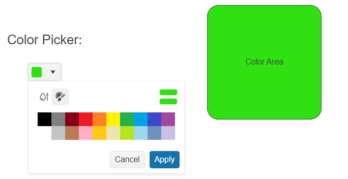

# Getting Started with the ColorPicker

This tutorial explains how to set up a basic Telerik UI for {{ site.framework }} ColorPicker and highlights the major steps in the configuration of the component.

You will initialize a ColorPicker component with predefined `gradient` and `palette` view types, and then change its appearance. Finally, you will learn how to handle the events of the ColorPicker in order to color an arbitrary container.

 

@[template](/_contentTemplates/core/getting-started-prerequisites.md#repl-component-gs-prerequisites)

## 1. Prepare the CSHTML File

@[template](/_contentTemplates/core/getting-started-directives.md#gs-adding-directives)

Optionally, you can structure the document by adding the desired HTML elements like headings, divs, and paragraphs.

```HtmlHelper
    @using Kendo.Mvc.UI
    <h4>ColorPicker with a placeholder</h4>
    <div>
    
    </div>
```

```TagHelper
    @addTagHelper *, Kendo.Mvc
    <h4>ColorPicker with a placeholder</h4>
    <div>
    
    </div>
```



## 2. Initialize the ColorPicker

Use the ColorPicker HtmlHelper or TagHelper to add the component to a page.

The `Name()` configuration method is mandatory as its value is used for the `id` and the `name` attributes of the  ColorPicker element.

```HtmlHelper
    @(Html.Kendo().ColorPicker()
        .Name("colorPicker")
    )
```

```TagHelper
    <kendo-colorpicker name="colorPicker">
    </kendo-colorpicker>
```



## 3. Configure the Views

The next step is to explicitly declare the Views configuration. The following example will configure the `gradient` and `palette` view types whilst providing a default view as the primary source of coloring.


```HtmlHelper
    @(Html.Kendo().ColorPicker()
        .Name("colorPicker")
        .View(ColorPickerView.Palette)
        .Views(new string[] { "palette", "gradient"})
    )
```


```TagHelper
    @{
        string[] views = new string[] { "gradient", "palette" };
    }

    <kendo-colorpicker name="colorPicker" 
                       view="ColorPickerView.Palette"
                       views="views">
    </kendo-colorpicker>
```


## 4. Specify the Formats

The ColorPicker supports both RGB and HEX formats. The following example will configure the RGB and HEX formats, as well as  a default format.

```HtmlHelper
    @(Html.Kendo().ColorPicker()
        .Name("colorPicker")
        .View(ColorPickerView.Palette)
        .Views(new string[] { "palette", "gradient"})
        .Format(ColorPickerFormat.Hex)
        .Formats(new string[] { "rgb", "hex" })
    )
```


```TagHelper
    @{
        string[] views = new string[] { "gradient", "palette" };
        string[] formats = new string[] { "rgb", "hex" };
    }

    <kendo-colorpicker name="colorPicker" 
                       view="ColorPickerView.Palette"
                       views="views"
                       format="ColorPickerFormat.Hex"
                       formats="formats">
    </kendo-colorpicker>
```



## 5. Customize the Appearance of ColorPicker

To change the [appearance]() of the ColorPicker, use any of its built-in styling options, for example, `Size()`, `Rounded()`, and `FillMode()`.

```HtmlHelper
    @(Html.Kendo().ColorPicker()
        .Name("colorPicker")
        .View(ColorPickerView.Palette)
        .Views(new string[] { "palette", "gradient"})
        .Format(ColorPickerFormat.Hex)
        .Formats(new string[] { "rgb", "hex" })
        .Size(ComponentSize.Medium)
        .Rounded(Rounded.Medium)
        .FillMode(FillMode.Solid)
    )
```


```TagHelper
    @{
        string[] views = new string[] { "gradient", "palette" };
        string[] formats = new string[] { "rgb", "hex" };
    }

    <kendo-colorpicker name="colorPicker" 
                       view="ColorPickerView.Palette"
                       views="views"
                       format="ColorPickerFormat.Hex"
                       formats="formats"
                       size="ComponentSize.Medium"
                       rounded="Rounded.Medium"
                       fillmode="FillMode.Solid">
    </kendo-colorpicker>
```


## 6. Handle the ColorPicker Events

The ColorPicker component exposes various [events](https://docs.telerik.com/{{ site.platform }}/api/kendo.mvc.ui.fluent/colorpickerbuilder#eventssystemaction) that you can handle and further customize the functionality of the component or other proprietary HTML elements. In this tutorial, you will use the `Change` event to change the color of another container.

```HtmlHelper
    @(Html.Kendo().ColorPicker()
        .Name("colorPicker")
        .View(ColorPickerView.Palette)
        .Views(new string[] { "palette", "gradient"})
        .Format(ColorPickerFormat.Hex)
        .Formats(new string[] { "rgb", "hex" })
        .Size(ComponentSize.Medium)
        .Rounded(Rounded.Medium)
        .FillMode(FillMode.Solid)
        .Events(events => events.Change("onChange"))
    )

    <script>
        function onChange(e) {
            $("#background").css("background-color", e.value);
        }
    </script>
```

```TagHelper
    @{
        string[] views = new string[] { "gradient", "palette" };
        string[] formats = new string[] { "rgb", "hex" };
    }

    <kendo-colorpicker name="colorPicker" 
                       view="ColorPickerView.Palette"
                       views="views"
                       format="ColorPickerFormat.Hex"
                       formats="formats"
                       size="ComponentSize.Medium"
                       rounded="Rounded.Medium"
                       fillmode="FillMode.Solid"
                       on-change="onChange">
    </kendo-colorpicker>

    <script>
        function onChange(e) {
            $("#background").css("background-color", e.value);
        }
    </script>
```


## 7. (Optional) Reference Existing ColorPicker Instances

You can reference the ColorPicker instances that you have created and build on top of their existing configuration:

1. Use the `.Name()` (`id` attribute) of the component instance to get a reference.

    ```JS script
         <script>
             $(document).ready(function() {
                 var colorPickerReference = $("#colorPicker").data("kendoColorPicker"); // colorPickerReference is a reference to the existing ColorPicker instance of the helper.
             })
         </script>
    ```
1. Toggle the popup of the component by using the [`toggle()`](https://docs.telerik.com/kendo-ui/api/javascript/ui/colorpicker/methods/toggle) client-side method.

    ```JS script
        <script>
            $(document).ready(function() {
               var colorPickerReference = $("#colorPicker").data("kendoColorPicker"); // colorPickerReference is a reference to the existing ColorPicker instance of the helper.
               colorPickerReference.toggle(); // Toggle the popup of the component.
            })
        </script>
    ```




## Explore this Tutorial in REPL

You can continue experimenting with the code sample above by running it in the Telerik REPL server playground:

* [Sample code with the ColorPicker HtmlHelper](https://netcorerepl.telerik.com/cnEVwpYA19Js36bT53)
* [Sample code with the ColorPicker TagHelper](https://netcorerepl.telerik.com/cdkhwJEq22Pa8xDN26)




## Next Steps


* [Configuring the Contrast Tool]()

* [Customizing the Appearance of the ColorPicker]()

## See Also

* [Using the API of the ColorPicker for {{ site.framework }} (Demo)](https://demos.telerik.com/{{ site.platform }}/colorpicker/api)
* [Client-Side API of the ColorPicker](https://docs.telerik.com/kendo-ui/api/javascript/ui/colorpicker)
* [Server-Side API of the ColorPicker for {{ site.framework }}](/api/colorpicker)
* [Knowledge Base Section](/knowledge-base)