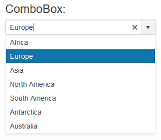

# Getting Started with the ComboBox

This tutorial explains how to set up a basic Telerik UI for {{ site.framework }} ComboBox and highlights the major steps in the configuration of the component.

You will initialize a ComboBox component and load it with data. Finally, you can run the sample code in [Telerik REPL](https://netcorerepl.telerik.com/) and continue exploring the components.

 

@[template](/_contentTemplates/core/getting-started-prerequisites.md#repl-component-gs-prerequisites)

## 1. Prepare the CSHTML File

@[template](/_contentTemplates/core/getting-started-directives.md#gs-adding-directives)

You will also add some sample data that the ComboBox will display. Optionally, you can structure the content in the view by adding the desired HTML elements like headings, divs, paragraphs, and others.

```HtmlHelper
    @using Kendo.Mvc.UI

    @{
        var continents = new List<SelectListItem> {
            new SelectListItem() {Text = "Africa", Value = "1"},
            new SelectListItem() {Text = "Europe", Value = "2"},
            new SelectListItem() {Text = "Asia", Value = "3"},
            new SelectListItem() {Text = "North America", Value = "4"},
            new SelectListItem() {Text = "South America", Value = "5"},
            new SelectListItem() {Text = "Antarctica", Value = "6"},
            new SelectListItem() {Text = "Australia", Value = "7"}
        };
    }

    <h4>ComboBox:</h4>
```

```TagHelper
    @addTagHelper *, Kendo.Mvc

    @{
        var continents = new List<SelectListItem> {
            new SelectListItem() {Text = "Africa", Value = "1"},
            new SelectListItem() {Text = "Europe", Value = "2"},
            new SelectListItem() {Text = "Asia", Value = "3"},
            new SelectListItem() {Text = "North America", Value = "4"},
            new SelectListItem() {Text = "South America", Value = "5"},
            new SelectListItem() {Text = "Antarctica", Value = "6"},
            new SelectListItem() {Text = "Australia", Value = "7"}
        };
    }

    <h4>ComboBox:</h4>
```


## 2. Initialize the ComboBox

Use the ComboBox HtmlHelper or TagHelper to add the component to the page:

* The `Name()` configuration method is mandatory as its value is used for the `id` and the `name` attributes of the ComboBox element.
* The `Placeholder()` configuration specifies the text that is shown initially within the ComboBox, when none of the items is selected.
* The `DataTextField()` option specifies the name of the field in the data, which will be used to show text in the items.
* The `DataValueField()` option specifies the name of the field, which holds the value of the items.  

```HtmlHelper
    @using Kendo.Mvc.UI

    @{
        var continents = new List<SelectListItem> {
            new SelectListItem() {Text = "Africa", Value = "1"},
            new SelectListItem() {Text = "Europe", Value = "2"},
            new SelectListItem() {Text = "Asia", Value = "3"},
            new SelectListItem() {Text = "North America", Value = "4"},
            new SelectListItem() {Text = "South America", Value = "5"},
            new SelectListItem() {Text = "Antarctica", Value = "6"},
            new SelectListItem() {Text = "Australia", Value = "7"}
        };
    }

    <h4>ComboBox:</h4>

	@(Html.Kendo().ComboBox()
		.Name("combobox")
		.DataTextField("Text")
		.DataValueField("Value")
		.Placeholder("Select a continent")
		.HtmlAttributes(new { style = "width: 300px;"})
		.BindTo(continents)
	)
```

```TagHelper
    @addTagHelper *, Kendo.Mvc

    @{
        var continents = new List<SelectListItem> {
            new SelectListItem() {Text = "Africa", Value = "1"},
            new SelectListItem() {Text = "Europe", Value = "2"},
            new SelectListItem() {Text = "Asia", Value = "3"},
            new SelectListItem() {Text = "North America", Value = "4"},
            new SelectListItem() {Text = "South America", Value = "5"},
            new SelectListItem() {Text = "Antarctica", Value = "6"},
            new SelectListItem() {Text = "Australia", Value = "7"}
        };
    }

    <h4>ComboBox:</h4>

    <kendo-combobox name="combobox"
        datatextfield="Text"
        datavaluefield="Value"
        placeholder="Select a continent"
        bind-to="continents"
        style="width: 300px;">
    </kendo-combobox>
```


## 3. Select a Default Value

The next step is to set one of the items of the ComboBox as selected. The following example shows how to use the `.Value()` method of the ComboBox, to select the item with a value of `2`.

```HtmlHelper
    @using Kendo.Mvc.UI

    @{
        var continents = new List<SelectListItem> {
            new SelectListItem() {Text = "Africa", Value = "1"},
            new SelectListItem() {Text = "Europe", Value = "2"},
            new SelectListItem() {Text = "Asia", Value = "3"},
            new SelectListItem() {Text = "North America", Value = "4"},
            new SelectListItem() {Text = "South America", Value = "5"},
            new SelectListItem() {Text = "Antarctica", Value = "6"},
            new SelectListItem() {Text = "Australia", Value = "7"}
        };
    }

    <h4>ComboBox:</h4>

	@(Html.Kendo().ComboBox()
		.Name("combobox")
		.DataTextField("Text")
		.DataValueField("Value")
		.Placeholder("Select a continent")
		.HtmlAttributes(new { style = "width: 300px;"})
		.BindTo(continents)
        .Value("2")
	)
```

```TagHelper
    @addTagHelper *, Kendo.Mvc

    @{
        var continents = new List<SelectListItem> {
            new SelectListItem() {Text = "Africa", Value = "1"},
            new SelectListItem() {Text = "Europe", Value = "2"},
            new SelectListItem() {Text = "Asia", Value = "3"},
            new SelectListItem() {Text = "North America", Value = "4"},
            new SelectListItem() {Text = "South America", Value = "5"},
            new SelectListItem() {Text = "Antarctica", Value = "6"},
            new SelectListItem() {Text = "Australia", Value = "7"}
        };
    }

    <h4>ComboBox:</h4>

    <kendo-combobox name="combobox"
        datatextfield="Text"
        datavaluefield="Value"
        placeholder="Select a continent"
        bind-to="continents"
        style="width: 300px;"
        value="2">
    </kendo-combobox>
```


## 4. Handle a ComboBox Event

The ComboBox component exposes convenient events for implementing your desired logic. In this example, you will use the `Change()` event to log the value of the selected item in the browser's console. You will also handle the `Open()` event and log an entry in the browser's console, when the event fires. 

```HtmlHelper
    @using Kendo.Mvc.UI

    @{
        var continents = new List<SelectListItem> {
            new SelectListItem() {Text = "Africa", Value = "1"},
            new SelectListItem() {Text = "Europe", Value = "2"},
            new SelectListItem() {Text = "Asia", Value = "3"},
            new SelectListItem() {Text = "North America", Value = "4"},
            new SelectListItem() {Text = "South America", Value = "5"},
            new SelectListItem() {Text = "Antarctica", Value = "6"},
            new SelectListItem() {Text = "Australia", Value = "7"}
        };
    }

    <script>
        function onChange(e) {
            console.log("Change :: " + this.value());
        }

        function onOpen(e) {
            console.log("ComboBox opened");
        }
    </script>

    <h4>ComboBox:</h4>

    @(Html.Kendo().ComboBox()
		.Name("combobox")
		.DataTextField("Text")
		.DataValueField("Value")
		.Placeholder("Select a continent")
		.HtmlAttributes(new { style = "width: 300px;"})
		.BindTo(continents)
        .Value("2")
        .Events(e => e // Configure the client-side events.
            .Change("onChange")
            .Open("onOpen")
        )
	)
```

```TagHelper
    @addTagHelper *, Kendo.Mvc

    @{
        var continents = new List<SelectListItem> {
            new SelectListItem() {Text = "Africa", Value = "1"},
            new SelectListItem() {Text = "Europe", Value = "2"},
            new SelectListItem() {Text = "Asia", Value = "3"},
            new SelectListItem() {Text = "North America", Value = "4"},
            new SelectListItem() {Text = "South America", Value = "5"},
            new SelectListItem() {Text = "Antarctica", Value = "6"},
            new SelectListItem() {Text = "Australia", Value = "7"}
        };
    }

    <script>
        function change(e) {
            console.log("Change :: " + this.value());
        }

        function open(e) {
            console.log("ComboBox opened");
        }
    </script>

    <h4>ComboBox:</h4>

    <kendo-combobox name="combobox"
        datatextfield="Text"
        datavaluefield="Value"
        placeholder="Select a continent"
        bind-to="continents"
        style="width: 300px;"
        value="2"
        on-change="change"
        on-open="open">
    </kendo-combobox>
```


>Do not set the `Name()` option when using `ComboBoxFor`. The `[ComponentName]For` method automatically sets the control's `Name()` to the field it is bound to. For more information, see the [Fundamentals]()() article.

## 5. (Optional) Reference Existing ComboBox Instances

To use the client-side API of the ComboBox and build on top of its initial configuration, you need a reference to the ComboBox instance. Once you get a valid reference, you can call the respective API methods:

1. Use the `.Name()` (id attribute) of the component instance to get a reference.

    ```script
        <script>
            $(document).ready(function() {
                var comboboxReference = $("#combobox").data("kendoComboBox"); // comboboxReference is a reference to the existing ComboBox instance of the helper.
            })
        </script>
    ```

1. Use the [ComboBox client-side API](https://docs.telerik.com/kendo-ui/api/javascript/ui/combobox#methods) to control the behavior of the control. In this example, you will use the `value` method to select an item.

    ```script
        <script>
            $(document).ready(function() {
                var comboboxReference = $("#combobox").data("kendoComboBox"); // comboboxReference is a reference to the existing ComboBox instance of the helper.
                comboboxReference.value("3"); 
            })
        </script>
    ```


## Explore this Tutorial in REPL

You can continue experimenting with the code sample above by running it in the Telerik REPL server playground:

* [Sample code with the ComboBox HtmlHelper](https://netcorerepl.telerik.com/mnubbUEN51jEcSHt23)
* [Sample code with the ComboBox TagHelper](https://netcorerepl.telerik.com/wdYbPqON53pqzVy358)



## Next Steps

* [Binding the ComboBox to Data]()
* [Customize the Appearance of the ComboBox]()
* [Controlling the Rendering of the ComboBox through Templates]()

## See Also

* [Using the API of the ComboBox for {{ site.framework }} (Demo)](https://demos.telerik.com/{{ site.platform }}/combobox/api)
* [Client-Side API of the ComboBox](https://docs.telerik.com/kendo-ui/api/javascript/ui/combobox)
* [Server-Side API of the ComboBox](/api/combobox)
* [Knowledge Base Section](/knowledge-base)
