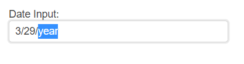

# Getting Started with the DateInput

This tutorial explains how to set up a basic Telerik UI for {{ site.framework }} DateInput and highlights the major steps in the configuration of the component.

You will initialize a DateInput component and set a default value. Finally, you can run the sample code in [Telerik REPL](https://netcorerepl.telerik.com/) and continue experimenting with different configurations.

 

@[template](/_contentTemplates/core/getting-started-prerequisites.md#repl-component-gs-prerequisites)

## 1. Prepare the CSHTML File

@[template](/_contentTemplates/core/getting-started-directives.md#gs-adding-directives)

## 2. Initialize the DateInput

Use the DateInput HtmlHelper or TagHelper to add the component to the page:

* The `Name()` configuration method is mandatory as its value is used for the `id` and the `name` attributes of the DateInput element.
* The `Label()` configuration specifies the label text of the DateInput. Optionally, you can [enable the `Floating` feature of the label](https://demos.telerik.com/{{ site.platform }}/dateinput/floating-label).

>Do not set the `Name()` option when using `DateInputFor`. The `[ComponentName]For` method automatically sets the control's `Name()` to the field it is bound to. For more information, see the [Fundamentals]()() article.

```HtmlHelper

	@(Html.Kendo().DateInput()
		.Name("dateinput")
        .Label(label=>{
            label.Content("DateInput:")
        })
	)
```

```TagHelper
    @addTagHelper *, Kendo.Mvc

    <kendo-dateinput name="dateinput">
        <label content="DateInput:" />
    </kendo-dateinput>
```


## 3. Set a Default Value

The next step is to set a default value. The following example shows how to use the `.Value()` method of the DateInput, to set the current date as a value of the component.

```HtmlHelper
    @{
       var defaultDateInput = DateTime.Now;
    }

	@(Html.Kendo().DateInput()
		.Name("dateinput")
        .Label(label=>{
            label.Content("DateInput:")
        })
        .Value(defaultDateInput)
	)
```

```TagHelper
    @addTagHelper *, Kendo.Mvc
    @{
         var defaultDateInput = DateTime.Now;
    }

    <kendo-dateinput name="dateinput" value="defaultDateInput">
        <label content="DateInput:" />
    </kendo-dateinput>
```


## 4. (Optional) Reference Existing DateInput Instances

To use the client-side API of the DateInput and build on top of its initial configuration, create a reference to the DateInput instance. Once you get a valid reference, you can call the respective API methods:

1. Use the `.Name()` (`id` attribute) of the component instance to get a reference.

    ```script
        <script>
            $(document).ready(function() {
                var dateinputReference = $("#dateinput").data("kendoDateInput"); // dateinputReference is a reference to the existing DateInput instance of the helper.
            })
        </script>
    ```

1. Use the [DateInput client-side API](https://docs.telerik.com/kendo-ui/api/javascript/ui/combobox#methods) to control the behavior of the control. In this example, you will use the [`enable`](https://docs.telerik.com/kendo-ui/api/javascript/ui/dateinput/methods/enable) method to disable the input.

    ```script
        <script>
            $(document).ready(function() {
                var dateinputReference = $("#dateinput").data("kendoDateInput"); // dateinputReference is a reference to the existing DateInput instance of the helper.
                dateinputReference.enable(false); // enable or disable the input 
            })
        </script>
    ```


## Explore this Tutorial in REPL

You can continue experimenting with the code sample above by running it in the Telerik REPL server playground:

* [Sample code with the DateInput HtmlHelper](https://netcorerepl.telerik.com/cHkRGDbG08bnajUg00)
* [Sample code with the DateInput TagHelper](https://netcorerepl.telerik.com/GHExcjPw07xpa32v43)



## Next Steps

* [Subscribing to DateInput Events]()
* [Customize the Appearance of the DateInput]()

## See Also

* [Using the API of the DateInput for {{ site.framework }} (Demo)](https://demos.telerik.com/{{ site.platform }}/dateinput/api)
* [Client-Side API of the DateInput](https://docs.telerik.com/kendo-ui/api/javascript/ui/dateinput)
* [Server-Side API of the DateInput](/api/dateinput)
* [Knowledge Base Section](/knowledge-base)

