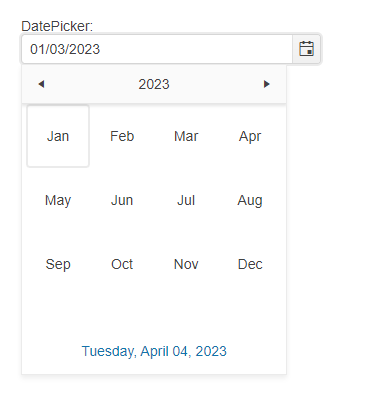

# Getting Started with the DatePicker

This tutorial explains how to set up a basic Telerik UI for {{ site.framework }} DatePicker and highlights the major steps in the configuration of the component.

You will initialize a DatePicker component and set a default value. Finally, you can run the sample code in [Telerik REPL](https://netcorerepl.telerik.com/) and continue experimenting with different configurations.

 

@[template](/_contentTemplates/core/getting-started-prerequisites.md#repl-component-gs-prerequisites)

## 1. Prepare the CSHTML File

@[template](/_contentTemplates/core/getting-started-directives.md#gs-adding-directives)

## 2. Initialize the DatePicker

Use the DatePicker HtmlHelper or TagHelper to add the component to the page:

* The `Name()` configuration method is mandatory as its value is used for the `id` and the `name` attributes of the DatePicker element.
* The `Label()` configuration specifies the label text of the DatePicker. 

>Do not set the `Name()` option when using `DatePickerFor`. The `[ComponentName]For` method automatically sets the control's `Name()` to the field it is bound to. For more information, see the [Fundamentals]()() article.

```HtmlHelper

	@(Html.Kendo().DatePicker()
		.Name("datepicker")
        .Label(label=>{
            label.Content("DatePicker:");
        })
	)
```

```TagHelper
    @addTagHelper *, Kendo.Mvc

    <kendo-datepicker name="datepicker">
        <label content="DatePicker:" />
    </kendo-datepicker>
```


## 3. Set a Default Value

The next step is to set a default value. The following example shows how to use the `.Value()` method of the DatePicker, to set the current date as a value of the component.

```HtmlHelper
    @{
       var defaultDatePicker = DateTime.Now;
    }

	@(Html.Kendo().DatePicker()
		.Name("datepicker")
        .Label(label=>{
            label.Content("DatePicker:");
        })
        .Value(defaultDatePicker)
	)
```

```TagHelper
    @addTagHelper *, Kendo.Mvc
    @{
         var defaultDatePicker = DateTime.Now;
    }

    <kendo-datepicker name="datepicker" value="defaultDatePicker">
        <label content="DatePicker:" />
    </kendo-datepicker>
```


## 4. Handle the DatePicker Events

The DatePicker component exposes convenient events for implementing custom logic. In this example, you will use the Change() event to log the value of the selected item in the browser's console.

```HtmlHelper
    @{
       var defaultDatePicker = DateTime.Now;
    }

	@(Html.Kendo().DatePicker()
		.Name("datepicker")
        .Label(label=>{
            label.Content("DatePicker:");
        })
        .Value(defaultDatePicker)
        .Events(e=>e.Change("onChange"))
	)
```

```TagHelper
    @addTagHelper *, Kendo.Mvc
    @{
         var defaultDatePicker = DateTime.Now;
    }

    <kendo-datepicker name="datepicker" value="defaultDatePicker"
        on-change="onChange">
        <label content="DatePicker:" />
    </kendo-datepicker>
```

```JavaScript
    function onChange(e){
        var datePicker = e.sender;
        console.log(datePicker.value());
    }
```

## 5. (Optional) Reference Existing DatePicker Instances

To use the client-side API of the DatePicker and build on top of its initial configuration, you need a reference to the DatePicker instance:

1. Use the `.Name()` (`id` attribute) of the component instance to get a reference.

    ```script
        <script>
            $(document).ready(function() {
                var datepickerReference = $("#datepicker").data("kendoDatePicker"); // datepickerReference is a reference to the existing DatePicker instance of the helper.
            })
        </script>
    ```

1. Use the [DatePicker client-side API](https://docs.telerik.com/kendo-ui/api/javascript/ui/combobox#methods) to control the behavior of the control. In this example, you will use the [`enable`](https://docs.telerik.com/kendo-ui/api/javascript/ui/datepicker/methods/enable) method to disable the input.

    ```script
        <script>
            $(document).ready(function() {
                var datepicker = $("#datepicker").data("kendoDatePicker");

                //Use the "value" API method to get the DatePicker's value.
                console.log(datepicker.value());
            })
        </script>
    ```


## Explore this Tutorial in REPL

You can continue experimenting with the code sample above by running it in the Telerik REPL server playground:

* [Sample code with the DatePicker HtmlHelper](https://netcorerepl.telerik.com/mnkIkoFq12RGkA0Q04)
* [Sample code with the DatePicker TagHelper](https://netcorerepl.telerik.com/mxaoaIFg05rWFlvo05)



## Next Steps

* [Subscribing to DatePicker Events]()
* [Customizing the Appearance of the DatePicker]()

## See Also

* [Using the API of the DatePicker for {{ site.framework }} (Demo)](https://demos.telerik.com/{{ site.platform }}/datepicker/api)
* [Client-Side API of the DatePicker](https://docs.telerik.com/kendo-ui/api/javascript/ui/datepicker)
* [Server-Side API of the DatePicker](/api/datepicker)
* [Knowledge Base Section](/knowledge-base)

