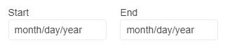

# Getting Started with the DateRangePicker

This tutorial explains how to set up a basic Telerik UI for {{ site.framework }} DateRangePicker and highlights the major steps in the configuration of the component.

You will initialize a DateRangePicker control with a number of tools. Next, you will handle some of the DateRangePicker events. Finally, you can run the sample code in [Telerik REPL](https://netcorerepl.telerik.com/) and continue exploring the components.

 

@[template](/_contentTemplates/core/getting-started-prerequisites.md#repl-component-gs-prerequisites)

## 1. Prepare the CSHTML File

@[template](/_contentTemplates/core/getting-started-directives.md#gs-adding-directives)

Optionally, you can structure the document by adding the desired HTML elements like headings, divs, paragraphs, and apply some basic styles.

## 2. Initialize the DateRangePicker

Use the DateRangePicker HtmlHelper or TagHelper to add the component to a page:

* The `Name()` configuration method is mandatory as its value is used for the `id` and the `name` attributes of the DateRangePicker element.

* The `Culture()` configuration method specifies the culture info used by the widget. `Date` and `time` values typically vary by culture. For example, the `"d"` standard format string indicates that a date and time value is to be displayed using a short date pattern. For the invariant culture, this pattern is `"MM/dd/yyyy"`. For the `fr-FR` culture, it is `"dd/MM/yyyy"`. For the `ja-JP` culture, it is `"yyyy/MM/dd"`.

* The `Labels` configuration method determines if the labels for the inputs will be visible.

```HtmlHelper

@using Kendo.Mvc.UI

@(Html.Kendo().DateRangePicker()
            .Name("daterangepicker")
            .Culture("fr-FR")
            .Labels(true)
        )
```


```TagHelper
@addTagHelper *, Kendo.Mvc

<kendo-daterangepicker name="daterangepicker" culture="fr-FR" labels="true" >
</kendo-daterangepicker>

```


## 3. Handle the DateRangePicker Events

The DateRangePicker [exposes various events](/api/kendo.mvc.ui.fluent/daterangepickereventbuilder) that you can handle and further customize the functionality of the component. In this tutorial, you will use the `Open`, `Close`, and `Change` events of the DateRangePicker.

```HtmlHelper
@using Kendo.Mvc.UI

@(Html.Kendo().DateRangePicker()
          .Name("daterangepicker")
          .Culture("fr-FR")
          .Labels(true)
          .Events(e=> e.Open("onOpen").Close("onClose").Change("onChange"))
        )

<script>
        function onOpen() {
            console.log("Open");
        }

        function onClose() {
            console.log("Close");
        }

        function onChange() {
            var range = this.range();
            console.log("Change :: start - " + kendo.toString(range.start, 'd') + " end - " + kendo.toString(range.end, 'd'));
        }
</script>
```

```TagHelper

@addTagHelper *, Kendo.Mvc

<kendo-daterangepicker name="daterangepicker" culture="fr-FR" labels="true" style="width: 100%;"
                               on-open="onOpen"
                               on-close="onClose"
                               on-change="onChange">
</kendo-daterangepicker>

<script>
        function onOpen() {
            console.log("Open");
        }

        function onClose() {
            console.log("Close");
        }

        function onChange() {
            var range = this.range();
            console.log("Change :: start - " + kendo.toString(range.start, 'd') + " end - " + kendo.toString(range.end, 'd'));
        }
</script>
```


For more examples, refer to the [demo on using the events of the DateRangePicker](https://demos.telerik.com/{{ site.platform }}/daterangepicker/events).

## 4. (Optional) Reference Existing DateRangePicker Instances

To use the [client-side API of the DateRangePicker](https://docs.telerik.com/kendo-ui/api/javascript/ui/daterangepicker) and build on top of its initial configuration, you need a reference to the DateRangePicker instance. Once you get a valid reference, you can call the respective API methods:

1. Use the `.Name()` (`id` attribute) of the component instance to get a reference.

    ```script
        <script>
            var dateRangePickerReference = $("#daterangepicker").data("kendoDateRangePicker"); // DateRangePicker Reference is a reference to the existing instance of the helper.
        </script>
    ```

1. Use the [client-side API of the DateRangePicker](https://docs.telerik.com/kendo-ui/api/javascript/ui/daterangepicker) to control the behavior of the widget. In this example, you will use the [`enable`](https://docs.telerik.com/kendo-ui/api/javascript/ui/daterangepicker/methods/enable) method to disable the DateRangePicker.

    ```script
        <script>
            $(document).ready(function () {
                var daterangepicker = $("#daterangepicker").data("kendoDateRangePicker");

                daterangepicker.enable(false);
            })
        </script>
    ```

For more information on referencing specific helper instances, see the [Methods and Events]() article.



## Explore this Tutorial in REPL

You can continue experimenting with the code sample above by running it in the Telerik REPL server playground:

* [Sample code with the DateRangePicker HtmlHelper](https://netcorerepl.telerik.com/QnYScCbF53Nh3A5V48)

* [Sample code with the DateRangePicker TagHelper](https://netcorerepl.telerik.com/mdOTaGvI52raPXWh54)


## Next Steps

* [Configuring the Selected Dates of the DateRangePicker ]()
* [Changing the Appearance of the DateRangePicker]()
* [Using Validation with the DateRangePicker]()

## See Also

* [Using the API of the DateRangePicker for {{ site.framework }} (Demo)](https://demos.telerik.com/{{ site.platform }}/daterangepicker/api)
* [Client-Side API of the DateRangePicker](https://docs.telerik.com/kendo-ui/api/javascript/ui/daterangepicker)
* [Server-Side API of the DateRangePicker](/api/daterangepicker)
* [Knowledge Base Section](/knowledge-base)
