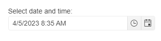

# Getting Started with the DateTimePicker

This tutorial explains how to set up a basic Telerik UI for {{ site.framework }} DateTimePicker and highlights the major steps in the configuration of the component.

You will initialize a DateTimePicker control with a number of tools. Next, you will handle some of the DateTimePicker events. Finally, you can run the sample code in [Telerik REPL](https://netcorerepl.telerik.com/) and continue exploring the components.

 

@[template](/_contentTemplates/core/getting-started-prerequisites.md#repl-component-gs-prerequisites)

## 1. Prepare the CSHTML File

@[template](/_contentTemplates/core/getting-started-directives.md#gs-adding-directives)

Optionally, you can structure the document by adding the desired HTML elements like headings, divs, paragraphs, and apply some basic styles.

## 2. Initialize the DateTimePicker

Use the DateTimePicker HtmlHelper or TagHelper to add the component to a page:

* The `Name()` configuration method is mandatory as its value is used for the `id` and the `name` attributes of the DateRangePicker element.

* The `Culture()` configuration method specifies the culture info used by the widget. `Date` and `time` values typically vary by culture. For example, the `"d"` standard format string indicates that a date and time value is to be displayed using a short date pattern. For the invariant culture, this pattern is `"MM/dd/yyyy"`. For the `fr-FR` culture, it is `"dd/MM/yyyy"`. For the `ja-JP` culture, it is `"yyyy/MM/dd"`.

* The `Depth` configuration method specifies the navigation depth. The available parameter settings are `month`, `year`, `decade`, and `century`.

```HtmlHelper

@using Kendo.Mvc.UI

    @(Html.Kendo().DateTimePicker()
            .Name("datetimepicker")
            .Value(DateTime.Now)
            .Culture("fr-FR")
            .Depth(CalendarView.Month)
    )
```


```TagHelper
@addTagHelper *, Kendo.Mvc

    <kendo-datetimepicker value="DateTime.Now" name="datetimepicker" culture="fr-FR" depth="CalendarView.Year">
    </kendo-datetimepicker>

```


## 3. Handle the DateTimePicker Events

The DateTimePicker [exposes various events](/api/kendo.mvc.ui.fluent/datetimepickereventbuilder) that you can handle and further customize the functionality of the component. In this tutorial, you will use the `Open`, `Close`, and `Change` events of the DateRangePicker.

```HtmlHelper
@using Kendo.Mvc.UI

    @(Html.Kendo().DateTimePicker()
            .Name("datetimepicker")
            .Value(DateTime.Now)
            .Culture("fr-FR")
            .Depth(CalendarView.Month)
              .Events(e =>
              {
                  e.Change("change").Open("open").Close("close");
              })
    )

<script>
    function open(e) {
        console.log("Open :: " + e.view + "-view");
    }

    function close(e) {
        console.log("Close :: " + e.view + "-view");
    }

    function change() {
        console.log("Change :: " + kendo.toString(this.value(), 'g'));
    }
</script>
```

```TagHelper

@addTagHelper *, Kendo.Mvc

        <kendo-datetimepicker value="DateTime.Now" name="datetimepicker" culture="fr-FR" depth="CalendarView.Year" on-change="change" on-open="open" on-close="close">
        </kendo-datetimepicker>

<script>
    function open(e) {
        console.log("Open :: " + e.view + "-view");
    }

    function close(e) {
        console.log("Close :: " + e.view + "-view");
    }

    function change() {
        console.log("Change :: " + kendo.toString(this.value(), 'g'));
    }
</script>
```


For more examples, refer to the [demo on using the events of the DateTimePicker](https://demos.telerik.com/{{ site.platform }}/datetimepicker/events).

## 4. (Optional) Reference Existing DateTimePicker Instances

To use the [client-side API of the DateTimePicker](https://docs.telerik.com/kendo-ui/api/javascript/ui/datetimepicker) and build on top of its initial configuration, you need a reference to the DateTimePicker instance. Once you get a valid reference, you can call the respective API methods:

1. Use the `.Name()` (`id` attribute) of the component instance to get a reference.

    ```script
        <script>
            var dateTimePickerReference = $("#datetimepicker").data("kendoDateTimePicker"); // DateTimePicker Reference is a reference to the existing instance of the helper.
        </script>
    ```

1. Use the [client-side API of the DateTimePicker](https://docs.telerik.com/kendo-ui/api/javascript/ui/datetimepicker) to control the behavior of the widget. In this example, you will use the [`enable`](https://docs.telerik.com/kendo-ui/api/javascript/ui/datetimepicker/methods/enable) method to disable the DateTimePicker.

    ```script
        <script>
            $(document).ready(function () {
                var dateTimePicker= $("#datetimepicker").data("kendoDateTimePicker");

                dateTimePicker.enable(false);
            })
        </script>
    ```

For more information on referencing specific helper instances, see the [Methods and Events]() article.



## Explore this Tutorial in REPL

You can continue experimenting with the code sample above by running it in the Telerik REPL server playground:

* [Sample code with the DateTimePicker HtmlHelper](https://netcorerepl.telerik.com/mdYowWFc11JLqmR846)

* [Sample code with the DateTimePicker TagHelper](https://netcorerepl.telerik.com/GdYyGsFQ129QUP4631)


## Next Steps

* [DateTimePicker Floating Label]()
* [DateTimePicker Appearance]()
* [DateTimePicker Validation]()

## See Also

* [Using the API of the DateTimePicker for {{ site.framework }} (Demo)](https://demos.telerik.com/{{ site.platform }}/datetimepicker/api)
* [Client-Side API of the DateTimePicker](https://docs.telerik.com/kendo-ui/api/javascript/ui/datetimepicker)
* [Server-Side API of the DateTimePicker](/api/datetimepicker)
* [Knowledge Base Section](/knowledge-base)
