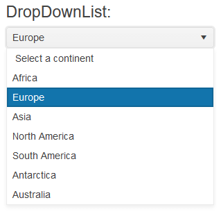

# Getting Started with the DropDownList

This tutorial explains how to set up a basic Telerik UI for {{ site.framework }} DropDownList and highlights the major steps in the configuration of the component.

You will initialize a DropDownList component and load it with data. Finally, you can run the sample code in [Telerik REPL](https://netcorerepl.telerik.com/) and continue exploring the components.

 

@[template](/_contentTemplates/core/getting-started-prerequisites.md#repl-component-gs-prerequisites)

## 1. Prepare the CSHTML File

@[template](/_contentTemplates/core/getting-started-directives.md#gs-adding-directives)

You will also add some sample data that the DropDownList will display. Optionally, you can structure the content in the view by adding the desired HTML elements like headings, divs, paragraphs, and others.

```HtmlHelper
    @using Kendo.Mvc.UI

    @{
        var continents = new List<SelectListItem> {
            new SelectListItem() {Text = "Africa", Value = "1"},
            new SelectListItem() {Text = "Europe", Value = "2"},
            new SelectListItem() {Text = "Asia", Value = "3"},
            new SelectListItem() {Text = "North America", Value = "4"},
            new SelectListItem() {Text = "South America", Value = "5"},
            new SelectListItem() {Text = "Antarctica", Value = "6"},
            new SelectListItem() {Text = "Australia", Value = "7"}
        };
    }

    <h4>DropDownList:</h4>
```

```TagHelper
    @addTagHelper *, Kendo.Mvc

    @{
        var continents = new List<SelectListItem> {
            new SelectListItem() {Text = "Africa", Value = "1"},
            new SelectListItem() {Text = "Europe", Value = "2"},
            new SelectListItem() {Text = "Asia", Value = "3"},
            new SelectListItem() {Text = "North America", Value = "4"},
            new SelectListItem() {Text = "South America", Value = "5"},
            new SelectListItem() {Text = "Antarctica", Value = "6"},
            new SelectListItem() {Text = "Australia", Value = "7"}
        };
    }

    <h4>DropDownList:</h4>
```


## 2. Initialize the DropDownList

Use the DropDownList HtmlHelper or TagHelper to add the component to the page:

* The `Name()` configuration method is mandatory as its value is used for the `id` and the `name` attributes of the DropDownList element.
* The `.OptionLabel()` configuration adds an empty item in the list and shows its text as selected when none of the items in the data source is selected.
* The `DataTextField()` option specifies the name of the field in the data, which will be used to show text in the items.
* The `DataValueField()` option specifies the name of the field, which holds the value of the items.  

```HtmlHelper
    @using Kendo.Mvc.UI

    @{
        var continents = new List<SelectListItem> {
            new SelectListItem() {Text = "Africa", Value = "1"},
            new SelectListItem() {Text = "Europe", Value = "2"},
            new SelectListItem() {Text = "Asia", Value = "3"},
            new SelectListItem() {Text = "North America", Value = "4"},
            new SelectListItem() {Text = "South America", Value = "5"},
            new SelectListItem() {Text = "Antarctica", Value = "6"},
            new SelectListItem() {Text = "Australia", Value = "7"}
        };
    }

    <h4>DropDownList:</h4>

	@(Html.Kendo().DropDownList()
		.Name("dropdownlist")
		.DataTextField("Text")
		.DataValueField("Value")
		.OptionLabel("Select a continent")
		.HtmlAttributes(new { style = "width: 300px;"})
		.BindTo(continents)
	)
```

```TagHelper
    @addTagHelper *, Kendo.Mvc

    @{
        var continents = new List<SelectListItem> {
            new SelectListItem() {Text = "Africa", Value = "1"},
            new SelectListItem() {Text = "Europe", Value = "2"},
            new SelectListItem() {Text = "Asia", Value = "3"},
            new SelectListItem() {Text = "North America", Value = "4"},
            new SelectListItem() {Text = "South America", Value = "5"},
            new SelectListItem() {Text = "Antarctica", Value = "6"},
            new SelectListItem() {Text = "Australia", Value = "7"}
        };
    }

    <h4>DropDownList:</h4>

    <kendo-dropdownlist name="dropdownlist"
        datatextfield="Text"
        datavaluefield="Value"
        option-label="Select a continent"
        bind-to="continents"
        style="width: 300px;">
    </kendo-dropdownlist>
```


>Do not set the `Name()` option when using `DropDownListFor`. The `[ComponentName]For` method automatically sets the control's `Name()` to the field it is bound to. For more information, see the [Fundamentals]()() article.

## 3. Select a Default Value

The next step is to set one of the items of the DropDownList as selected. The following example shows how to use the `.Value()` method of the DropDownList, to select the item with a value of `2`.

```HtmlHelper
    @using Kendo.Mvc.UI

    @{
        var continents = new List<SelectListItem> {
            new SelectListItem() {Text = "Africa", Value = "1"},
            new SelectListItem() {Text = "Europe", Value = "2"},
            new SelectListItem() {Text = "Asia", Value = "3"},
            new SelectListItem() {Text = "North America", Value = "4"},
            new SelectListItem() {Text = "South America", Value = "5"},
            new SelectListItem() {Text = "Antarctica", Value = "6"},
            new SelectListItem() {Text = "Australia", Value = "7"}
        };
    }

    <h4>DropDownList:</h4>

	@(Html.Kendo().DropDownList()
		.Name("dropdownlist")
		.DataTextField("Text")
		.DataValueField("Value")
		.OptionLabel("Select a continent")
		.HtmlAttributes(new { style = "width: 300px;"})
		.BindTo(continents)
        .Value("2")
	)
```

```TagHelper
    @addTagHelper *, Kendo.Mvc

    @{
        var continents = new List<SelectListItem> {
            new SelectListItem() {Text = "Africa", Value = "1"},
            new SelectListItem() {Text = "Europe", Value = "2"},
            new SelectListItem() {Text = "Asia", Value = "3"},
            new SelectListItem() {Text = "North America", Value = "4"},
            new SelectListItem() {Text = "South America", Value = "5"},
            new SelectListItem() {Text = "Antarctica", Value = "6"},
            new SelectListItem() {Text = "Australia", Value = "7"}
        };
    }

    <h4>DropDownList:</h4>

    <kendo-dropdownlist name="dropdownlist"
        datatextfield="Text"
        datavaluefield="Value"
        option-label="Select a continent"
        bind-to="continents"
        style="width: 300px;"
        value="2">
    </kendo-dropdownlist>
```


## 4. Handle a DropDownList Event

The DropDownList component exposes convenient events for implementing your desired logic. In this example, you will use the `Change()` event to log the value of the selected item in the browser's console. You will also handle the `Open()` event and log an entry in the browser's console, when the event fires. 

```HtmlHelper
    @using Kendo.Mvc.UI

    @{
        var continents = new List<SelectListItem> {
            new SelectListItem() {Text = "Africa", Value = "1"},
            new SelectListItem() {Text = "Europe", Value = "2"},
            new SelectListItem() {Text = "Asia", Value = "3"},
            new SelectListItem() {Text = "North America", Value = "4"},
            new SelectListItem() {Text = "South America", Value = "5"},
            new SelectListItem() {Text = "Antarctica", Value = "6"},
            new SelectListItem() {Text = "Australia", Value = "7"}
        };
    }

    <script>
        function onChange(e) {
            console.log("Change :: " + this.value());
        }

        function onOpen(e) {
            console.log("DropDownList opened");
        }
    </script>

    <h4>DropDownList:</h4>

    @(Html.Kendo().DropDownList()
		.Name("dropdownlist")
		.DataTextField("Text")
		.DataValueField("Value")
		.OptionLabel("Select a continent")
		.HtmlAttributes(new { style = "width: 300px;"})
		.BindTo(continents)
        .Value("2")
        .Events(e => e // Configure the client-side events.
            .Change("onChange")
            .Open("onOpen")
        )
	)
```

```TagHelper
    @addTagHelper *, Kendo.Mvc

    @{
        var continents = new List<SelectListItem> {
            new SelectListItem() {Text = "Africa", Value = "1"},
            new SelectListItem() {Text = "Europe", Value = "2"},
            new SelectListItem() {Text = "Asia", Value = "3"},
            new SelectListItem() {Text = "North America", Value = "4"},
            new SelectListItem() {Text = "South America", Value = "5"},
            new SelectListItem() {Text = "Antarctica", Value = "6"},
            new SelectListItem() {Text = "Australia", Value = "7"}
        };
    }

    <script>
        function change(e) {
            console.log("Change :: " + this.value());
        }

        function open(e) {
            console.log("DropDownList opened");
        }
    </script>

    <h4>DropDownList:</h4>

    <kendo-dropdownlist name="dropdownlist"
        datatextfield="Text"
        datavaluefield="Value"
        option-label="Select a continent"
        bind-to="continents"
        style="width: 300px;"
        value="2"
        on-change="change"
        on-open="open">
    </kendo-dropdownlist>
```



## 5. (Optional) Reference Existing DropDownList Instances

To use the client-side API of the DropDownList and build on top of its initial configuration, you need a reference to the DropDownList instance. Once you get a valid reference, you can call the respective API methods:

1. Use the `.Name()` (id attribute) of the component instance to get a reference.

    ```script
        <script>
            $(document).ready(function() {
                var dropdownlistReference = $("#dropdownlist").data("kendoDropDownList"); // dropdownlistReference is a reference to the existing DropDownList instance of the helper.
            })
        </script>
    ```

1. Use the [DropDownList client-side API](https://docs.telerik.com/kendo-ui/api/javascript/ui/dropdownlist#methods) to control the behavior of the control. In this example, you will use the `value` method to select an item.

    ```script
        <script>
            $(document).ready(function() {
                var dropdownlistReference = $("#dropdownlist").data("kendoDropDownList"); // dropdownlistReference is a reference to the existing DropDownList instance of the helper.
                dropdownlistReference.value("3"); 
            })
        </script>
    ```


## Explore this Tutorial in REPL

You can continue experimenting with the code sample above by running it in the Telerik REPL server playground:

* [Sample code with the DropDownList HtmlHelper](https://netcorerepl.telerik.com/QHuFvgPd11XmzxqG18)
* [Sample code with the DropDownList TagHelper](https://netcorerepl.telerik.com/wxuvFgFH12hDlg5800)



## Next Steps

* [Binding the DropDownList to Data]()
* [Customize the Appearance of the DropDownList]()
* [Controlling the Rendering of the DropDownList through Templates]()

## See Also

* [Using the API of the DropDownList for {{ site.framework }} (Demo)](https://demos.telerik.com/{{ site.platform }}/dropdownlist/api)
* [Client-Side API of the DropDownList](https://docs.telerik.com/kendo-ui/api/javascript/ui/dropdownlist)
* [Server-Side API of the DropDownList](/api/dropdownlist)
* [Knowledge Base Section](/knowledge-base)
