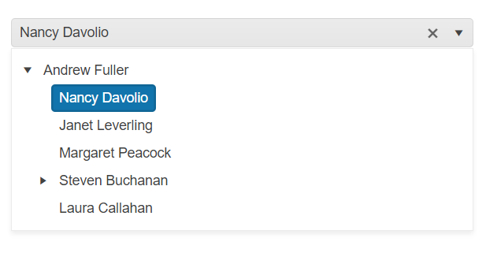

# Getting Started with the DropDownTree

This tutorial explains how to set up a basic Telerik UI for {{ site.framework }} DropDownTree and highlights the major steps in the configuration of the component.

You will initialize a DropDownTree control and bind it to data. Next, you will handle some of the DropDownTree events. Finally, you can run the sample code in [Telerik REPL](https://netcorerepl.telerik.com/) and continue exploring the components.

After completing this guide, you will achieve the following result:

 

@[template](/_contentTemplates/core/getting-started-prerequisites.md#repl-component-gs-prerequisites)

## 1. Prepare the CSHTML File

@[template](/_contentTemplates/core/getting-started-directives.md#gs-adding-directives)

Optionally, you can structure the document by adding the desired HTML elements like headings, divs, paragraphs, and others.

## 2. Declare the View Model

Declare the `EmployeeViewModel` view model.

>The model must have a property field that represents the hierarchical relationship of the entries. In this tutorial, this is the `ReportsTo` field.

>The `hasChildren` property of the model is required to render items as parent nodes on the client-side.

```C#
public class EmployeeViewModel
{
    public int EmployeeID { get; set; }

    public string Name { get; set; }

    public int? ReportsTo { get; set; }

    public string Title { get; set; }

    public bool hasChildren { get; set; }
}
```

## 3. Initialize the DropDownTree

Use the DropDownTree HtmlHelper or TagHelper to add the component to a page and set some of its options.

* The `Name()` configuration assigns a name to the instance of the helper&mdash;this is mandatory as its value is used for the `id` and the `name` attributes of the DropDownTree element.
* Configure the `DataTextField` of the DropDownTree to bind the items of the popup to a field of the `EmployeeViewModel`.
* Add the `DataSource()` configuration option and set the `Read` end point.   

```HtmlHelper
@using Kendo.Mvc.UI

<label for="dropdowntree">Employees:</label>
@(Html.Kendo().DropDownTree()
    .Name("dropdowntree")
    .DataTextField("Name")
    .DataSource(dataSource => dataSource
        .Read(read => read
            .Action("Get_Employees", "DropDownTree")
        )
    )
)
```

```TagHelper
@addTagHelper *, Kendo.Mvc

<label for="dropdowntree">Users:</label>
<kendo-dropdowntree datatextfield="Name" name="dropdowntree">
    <hierarchical-datasource>
        <schema>
            <hierarchical-model id="id"></hierarchical-model>
        </schema>
        <transport>
            <read url="@Url.Action("Get_Employees", "DropDownTree")" />
        </transport>
    </hierarchical-datasource>
</kendo-dropdowntree>

```


## 4. Declare the Read Action

In the `Home` controller, declare the `Get_Employees` action that you set to the DataSource `Read` configuration in the previous step. 

```Controller

public List<EmployeeViewModel> GetFlatData()
{
    List<EmployeeViewModel> employees = new List<EmployeeViewModel>(){
        new EmployeeViewModel { 
          EmployeeID = 1,
          Name = "Nancy Davolio",
          Title = "Sales Representative",
          ReportsTo = 2,
          hasChildren = false 
        },
        new EmployeeViewModel {
          EmployeeID = 2,
          Name = "Andrew Fuller",
          Title = "Vice President, Sales",
          ReportsTo = null,
          hasChildren = true 
        },
        new EmployeeViewModel {
          EmployeeID = 3,
          Name = "Janet Leverling",
          Title = "Sales Representative",
          ReportsTo = 2,
          hasChildren = false 
        },
        new EmployeeViewModel {
          EmployeeID = 4,
          Name = "Margaret Peacock",
          Title = "Sales Representative",
          ReportsTo = 2,
          hasChildren = false 
        },
        new EmployeeViewModel {
          EmployeeID = 5,
          Name = "Steven Buchanan",
          Title = "Sales Manager",
          ReportsTo = 2,
          hasChildren = true
        },
        new EmployeeViewModel {
          EmployeeID = 6,
          Name = "Michael Suyama",
          Title = "Sales Representative",
          ReportsTo = 5,
          hasChildren = false 
        },
        new EmployeeViewModel {
          EmployeeID = 7,
          Name = "Robert King",
          Title = "Sales Representative",
          ReportsTo = 5,
          hasChildren = false 
        },
        new EmployeeViewModel {
          EmployeeID = 8,
          Name = "Laura Callahan",
          Title = "Inside Sales Coordinator",
          ReportsTo = 2,
          hasChildren = false 
        },
        new EmployeeViewModel {
          EmployeeID = 9,
          Name = "Anne Dodsworth",
          Title = "Sales Representative",
          ReportsTo = 5,
          hasChildren = false 
        }
    }

    return employees;
}

public JsonResult Get_Employees([DataSourceRequest] DataSourceRequest request, int? id)
{
    var data = GetFlatData();

    var result = from e in data.Employees
                 where (id.HasValue ? e.ReportsTo == id : e.ReportsTo == null)
                 select new
                 {
                     id = e.EmployeeID,
                     Name = e.FirstName + " " + e.LastName,
                     hasChildren = (from q in data.Employees
                                    where (q.ReportsTo == e.EmployeeID)
                                    select q
                                    ).Count() > 0
                 };

    return Json(result.ToTreeDataSourceResult(request));
}

```

## 5. Handle the DropDownTree Events

The DropDownTree [exposes various events](/api/kendo.mvc.ui.fluent/dropdowntreeeventbuilder) that you can handle and further customize the functionality of the component. In this tutorial, you will use the `DataBound` event of the DropDownTree.

```HtmlHelper
    @using Kendo.Mvc.UI

    <label for="dropdowntree">Employees:</label>
    @(Html.Kendo().DropDownTree()
        .Name("dropdowntree")
        .DataTextField("Name")
        .DataSource(dataSource => dataSource
            .Read(read => read
                .Action("Get_Employees", "DropDownTree")
            )
        )
        .Events(e=>e.DataBound("onDataBound"))
    )
```

```TagHelper
    @addTagHelper *, Kendo.Mvc

    <label for="dropdowntree">Users:</label>
    <kendo-dropdowntree datatextfield="Name" name="dropdowntree"
        on-data-bound="onDataBound">
        <hierarchical-datasource>
            <schema>
                <hierarchical-model id="id"></hierarchical-model>
            </schema>
            <transport>
                <read url="@Url.Action("Get_Employees", "DropDownTree")" />
            </transport>
        </hierarchical-datasource>
    </kendo-dropdowntree>
```

```JavaScript
    <script>
        function onDataBound(e) {
            console.log("DropDownTree data bound");
        }
    </script>
```

For more examples, refer to the [demo on using the events of the DropDownTree](https://demos.telerik.com/{{ site.platform }}/dropdowntree/events).

## 6. (Optional) Reference Existing DropDownTree Instances

To use the client-side API of the DropDownTree and build on top of its initial configuration, you need a reference to the DropDownTree instance. Once you get a valid reference, you can call the respective API methods:

1. Use the `.Name()` (`id` attribute) of the component instance to get a reference.

    ```script
    <script>
        var dropdowntreeReference = $("#dropdowntree").data("kendoDropDownTree"); // dropdowntreeReference is a reference to the existing instance of the helper.
    </script>
    ```

1. Use the [DropDownTree client-side API](https://docs.telerik.com/kendo-ui/api/javascript/ui/dropdowntree#methods) to control the behavior of the widget. In this example, you will use the `open` method to open the popup of the DropDownTree programmatically.

    ```script
    <script>
        $(document).ready(function () {
            var dropdowntreeReference = $("#dropdowntree").data("kendoDropDownTree");

            dropdowntreeReference.open();
        })
    </script>
    ```

For more information on referencing specific helper instances, see the [Methods and Events]() article.


## Explore this Tutorial in REPL

You can continue experimenting with the code sample above by running it in the Telerik REPL server playground:

* [Sample code with the DropDownTree HtmlHelper](https://netcorerepl.telerik.com/QRuSaAlT09u9OUQG31)
* [Sample code with the DropDownTree TagHelper](https://netcorerepl.telerik.com/wnOyYKPT09ersZUo47)



## Next Steps

* [Adding Custom Content through DropDownTree Templates]()
* [Using Filtering in the DropDownTree]()

## See Also

* [Using the API of the DropDownTree for {{ site.framework }} (Demo)](https://demos.telerik.com/{{ site.platform }}/dropdowntree/api)
* [Client-Side API of the DropDownTree](https://docs.telerik.com/kendo-ui/api/javascript/ui/dropdowntree)
* [Server-Side API of the DropDownTree](/api/dropdowntree)
* [Knowledge Base Section](/knowledge-base)
