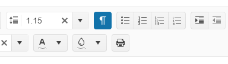

# Formatting Marks

As of the `2024 Q2 Release` you can enable the **Formatting Marks** tool.

Formatting marks enable you to show characters that represent non-printing elements in the Editor for the following formatting functions: `Line Ending`, `Paragraph Ending`, and `Space Marks`.

 

## Line Ending

The Line Ending mark `↵` represents a line break within a paragraph. It allows you to break a line without starting a new paragraph. When formatting marks are visible, the line break mark is displayed as a bent arrow pointing downward.

## Paragraph Ending

The Paragraph Ending mark `¶` represents a paragraph break in a document. It indicates where one paragraph ends, and another begins.

## Space Marks

The Space mark `∙` is represented by a small raised dot. This ensures the users to not have space characters where they are not needed.

## Formatting Marks Refresh Delay

The Editor exposes a [`FormattingMarksRefreshDelay`](/api/kendo.mvc.ui.fluent/editorbuilder#formattingmarksrefreshdelaysystemdouble) configuration option allowing you to specify the delay for refreshing the formatting marks. This functionality prevents refreshing the Formatting marks on every key press and improves the Editor performance. The visual effect from this configuration is that the marks will briefly disappear while the user is typing.

The `FormattingMarksRefreshDelay` accepts a `boolean` value for enabling or disabling the functionality or a `number` value for a specific delay in milliseconds before the formatting marks are refreshed. You can set the value to `false` to fully turn off this behavior.

This feature is useful for performance optimization as the formatting marks are re-rendered any time the user presses a key. When the user is typing very fast or holding down a key, the delay will prevent the re-rendering from being executed multiple times.

## See Also

* [All Tools of the Editor HtmlHelper for {{ site.framework }} (Demo)](https://demos.telerik.com/{{ site.platform }}/editor/all-tools)
* [Custom Tools by the Editor HtmlHelper for {{ site.framework }} (Demo)](https://demos.telerik.com/{{ site.platform }}/editor/custom-tools)
* [Server-Side API](/api/editor)
