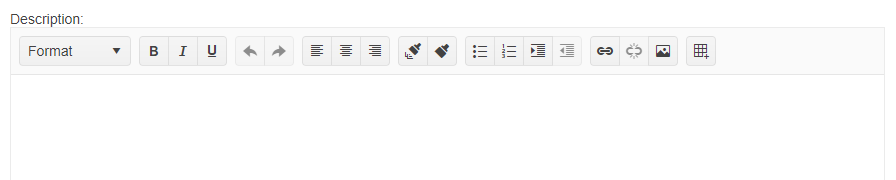

# Getting Started with the Editor

This tutorial explains how to set up a basic Telerik UI for {{ site.framework }} Editor and highlights the major steps in the configuration of the component.

You will initialize a Editor component and load it with data. Finally, you can run the sample code in [Telerik REPL](https://netcorerepl.telerik.com/) and continue exploring the components.

 

@[template](/_contentTemplates/core/getting-started-prerequisites.md#repl-component-gs-prerequisites)

## 1. Prepare the CSHTML File

@[template](/_contentTemplates/core/getting-started-directives.md#gs-adding-directives)

Optionally, you can structure the document by adding the desired HTML elements like headings, divs, paragraphs, and others. In this tutorial, you add a label Html element for the Editor.

```HtmlHelper
@using Kendo.Mvc.UI

<div>
    <label for="description">Description:</label>

</div>
```

```TagHelper
@addTagHelper *, Kendo.Mvc

<div>
    <label for="description">Description:</label>

</div>
```


## 2. Initialize the Editor

Use the Editor HtmlHelper or TagHelper to add the component to a page. The `Name()` configuration method is mandatory as its value is used for the `id` and the `name` attributes of the Editor element.

```HtmlHelper
@using Kendo.Mvc.UI

<div>
    <label for="description">Description:</label>

    @(Html.Kendo().Editor()
        .Name("description")
    )
</div>
```

```TagHelper
@addTagHelper *, Kendo.Mvc

<div>
    <label for="description">Description:</label>

    <kendo-editor name="description">
    </kendo-editor>
</div>
```


>Do not set the `Name()` option when using `EditorFor`. The `[ComponentName]For` method automatically sets the control's `Name()` to the field it is bound to. For more information, see the [Fundamentals]()() article.

## 3. Add HTML Content to the Editor

You can display arbitrary HTML in the Editor. In this tutorial, you will use the `.Value()` configuration option to set the value of the control.

```HtmlHelper
@using Kendo.Mvc.UI

<div>
    <label for="description">Description:</label>

    @(Html.Kendo().Editor()
        .Name("description")
        .HtmlAttributes(new { style = "width: 100%; height:470px" })
        .Value(@<text>
            <br />
            <p style="text-align:center;">
                <span style="font-size:large;">
                    <strong>One of the Most Beautiful Islands on Earth - Tenerife</strong>
                </span>
            </p>
            <p>
                <strong>Tenerife </strong>is the largest and most populated island of the eight <a href="https://en.wikipedia.org/wiki/Canary_Islands" target="_blank"> Canary Islands</a>
            </p>
        </text>)
    )
</div>
```

```TagHelper
@addTagHelper *, Kendo.Mvc

<div>
    <label for="description">Description:</label>

    <kendo-editor name="description" style="width: 100%; height:470px" value="@{<text>
        <br />
        <p style="text-align:center;">
            <span style="font-size:large;">
                <strong>One of the Most Beautiful Islands on Earth - Tenerife</strong>
            </span>
        </p>
        <p>
            <strong>Tenerife </strong>is the largest and most populated island of the eight <a href="https://en.wikipedia.org/wiki/Canary_Islands" target="_blank"> Canary Islands</a>
        </p>
        </text> }">
    </kendo-editor>
</div>
```


## 4. Handle an Editor Event

The Editor component exposes convenient events for implementing your desired logic. In this example, you will use the `Change()` event to log the value of Editor in the browser's console. You will also handle the `Paste()` event and log the content the user pastes within the Editor. 

```HtmlHelper
    @using Kendo.Mvc.UI

    <div>
        <label for="description">Description:</label>

        <script>
            function onChange(e) {
                console.log("Change :: " + this.value());
            }

            function onPaste(e) {
                console.log(e.html);
            }
        </script>

        @(Html.Kendo().Editor()
            .Name("description")
            .HtmlAttributes(new { style = "width: 100%; height:470px" })
            .Events(e => e // Configure the client-side events.
                .Change("onChange")
                .Paste("onPaste")
            )
        )
    </div>
```

```TagHelper
    @addTagHelper *, Kendo.Mvc

    <script>
        function onChange(e) {
            console.log("Change :: " + this.value());
        }

        function onPaste(e) {
            console.log(e.html);
        }
    </script>

    <div>
        <label for="description">Description:</label>

        <kendo-editor name="description" style="width: 100%; height:470px"
            on-change="onChange"
            on-paste="onPaste">
        </kendo-editor>
    </div>
```



## 5. (Optional) Reference Existing Editor Instances

To use the client-side API of the Editor and build on top of its initial configuration, you need a reference to the Editor instance. Once you get a valid reference, you can call the respective API methods:

1. Use the `.Name()` (id attribute) of the component instance to get a reference.

    ```script
        <script>
            $(document).ready(function() {
                var editorReference = $("#editor").data("kendoEditor"); // editorReference is a reference to the existing Editor instance of the helper.
            })
        </script>
    ```

1. Use the [Editor client-side API](https://docs.telerik.com/kendo-ui/api/javascript/ui/editor#methods) to control the behavior of the control. In this example, you will use the `value` method to select an item.

    ```script
        <script>
            $(document).ready(function() {
                var editorReference = $("#editor").data("kendoEditor"); // editorReference is a reference to the existing Editor instance of the helper.
                editorReference.value("<p>New content</p>"); 
            })
        </script>
    ```


## Explore this Tutorial in REPL

You can continue experimenting with the code sample above by running it in the Telerik REPL server playground:

* [Sample code with the Editor HtmlHelper](https://netcorerepl.telerik.com/mHuvvUFo36cVpu9i57)
* [Sample code with the Editor TagHelper](https://netcorerepl.telerik.com/mHOvPAvy36iuKjda24)



## Next Steps

* [Editor Tools]()
* [Styling the Content of the Editor]()
* [PDF Export of the Editor]()

## See Also

* [Using the API of the Editor for {{ site.framework }} (Demo)](https://demos.telerik.com/{{ site.platform }}/editor/api)
* [Client-Side API of the Editor](https://docs.telerik.com/kendo-ui/api/javascript/ui/editor)
* [Server-Side API of the Editor](/api/editor)
* [Knowledge Base Section](/knowledge-base)
