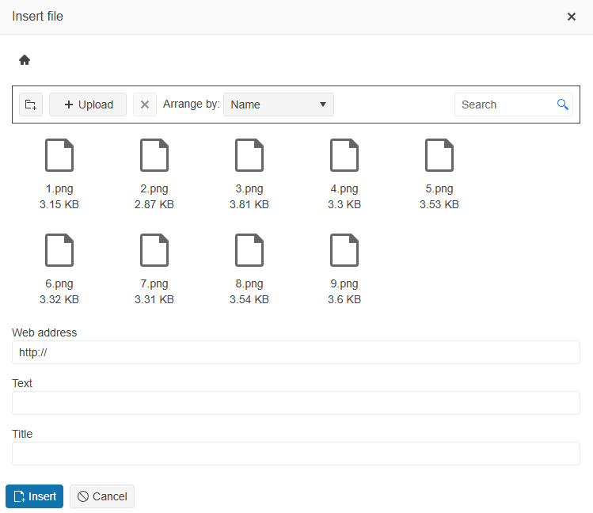

# Image and File Browser

The Editor provides image and file browsing functionality that enhances content creation by enabling users to select and manage images and files directly within the Editor's interface.

## Overview

The [image](#image-browser) and [file browser](#file-browser) tools of the Editor provide the following features:

* **Visual File Browsing**&mdash;Users can navigate through folder structures and preview images before selection.
* **File Upload Capabilities**&mdash;Direct upload of files and images to the server from within the Editor.
* **Thumbnail Generation**&mdash;Automatic creation of image previews for faster browsing.
* **File Management Operations**&mdash;Create folders, delete folders and files, and organize content.
* **Security Controls**&mdash;Server-side authorization and path validation to ensure secure file access.

For a live example, visit the [Editor File and Image Browser Demo](https://demos.telerik.com/{{ site.platform }}/editor/imagebrowser).

## Image Browser

The **Insert image** tool is enabled by default in the toolbar and provides two distinct modes for adding images to the Editor's content:

* [Basic Image Dialog](#basic-image-dialog)
* [Advanced Image Browser](#advanced-image-browser)

### Basic Image Dialog

By default, clicking the **Insert image** tool opens a simple dialog that allows you to:

* Type or paste the URL of an image
* Optionally specify tooltip text (`alt` attribute)
* Set image dimensions in pixels (width and height)

This basic mode is suitable when you know the exact image URL or want to reference external images.


When you configure the [Editor tools](#default-tools) through the `Tools()` configuration, enable the **Insert image** tool by including the `InsertImage()` option:

```HtmlHelper
@(Html.Kendo().Editor()
    .Name("editor")
    .Tools(tools => tools
        .Clear()
        .InsertImage()
    )
)
```

```TagHelper
    <kendo-editor name="editor">
        <tools>
            <tool name="insertImage"></tool>
        </tools>
    </kendo-editor>
```


### Advanced Image Browser

You can configure the image browser dialog to display a list of predefined images that are loaded from a remote endpoint. Users can browse the configured root directory and all its subdirectories, organize and access images for content creation, without leaving the Editor environment.

When the image browser functionality is configured with server-side support, the **Insert image** tool expands to provide a comprehensive file management interface. This advanced mode includes:

* **Directory Navigation**&mdash;Browse through directories and files.
* **Image Extensions**&mdash;Define the allowed image extensions.
* **Image Thumbnails**&mdash;Preview images before selection with automatically generated thumbnails.
* **Upload Functionality**&mdash;Upload new images directly from your local machine.
* **Folder Management**&mdash;Create new folders and delete the selected images and folders.
* **File Operations**&mdash;Filter and sort the uploaded images.


To enable the above listed features in the **Insert image** tool, you need to specify the remote endpoints that will handle the file operations, such as `Read`, `Create`, `Upload`, and more, in the `ImageBrowser()` configuration:

* [`Image()`](/api/kendo.mvc.ui.fluent/editorimagebrowsersettingsbuilder#imagesystemstringsystemstring)&mdash;The URL or Action method responsible for serving the original image. When the user selects an image and clicks the **Insert** button, the browser initiates a `GET` request using the specified URL in the `Image()` option. The URL can point to a file system or to a service and is parameterized&mdash;the `{0}` placeholder denotes the `path` and `fileName` as received from the `Read()` action. The Editor generates the `src` attribute of the original image when the image is inserted.
* [`Read()`](/api/kendo.mvc.ui.fluent/editorimagebrowsersettingsbuilder#readsystemstringsystemstring)&mdash;The URL or Action method that retrieves the predefined list of images and folders when the image browser dialog opens. The **Read** action triggers a `POST` request that contains the `path` parameter, which specifies the browsed file path and expects a file listing in the following format:

    ```JSON
    [
        { "Path": "foo.png", "Name": "foo.png", "Size": 73289, "EntryType": 0  },
        { "Path": "MyFolder/bar.png", "Name": "bar.png", "Size": 15289, "EntryType": 0  },
        ...
    ]
    ```

    * `Path` holds the file path.
    * `Name` is the name of the file or directory.
    * `Size` is the file size (optional).
    * `EntryType` is either an `0` for a file or a `1` for a directory.

* [`Create()`](/api/kendo.mvc.ui.fluent/editorimagebrowsersettingsbuilder#createsystemstringsystemstring)&mdash;The URL or Action method that handles the directory creation. If not specified, the **Create folder** button is not displayed. The **Create** action triggers a `POST` request with the following `FormData` payload:

    ```JSON FormData_Payload
        "Name": "New folder"
        "Size": 
        "EntryType": 1
        "path":
    ```
    ```JSON Request_Response
        {"Name":"New folder","Size":0,"EntryType":1}
    ```

* [`Destroy()`](/api/kendo.mvc.ui.fluent/editorimagebrowsersettingsbuilder#destroysystemstringsystemstring)&mdash;The URL or Action method that handles the image or directory deletion. If not specified, the **Delete** button is not displayed. The **Delete** action triggers a `POST` request with the following `FormData` payload and expects an empty content result as a response:

    ```JSON FormData_Payload
        "Name": "New folder"
        "Size": 0
        "EntryType": 1
        "path":
    ```
    ```JSON Request_Response
        []
    ```

* [`Upload()`](/api/kendo.mvc.ui.fluent/editorimagebrowsersettingsbuilder#uploadsystemstringsystemstring)&mdash;The URL or Action method that handles the uploading of new images. If not specified, the **Upload** button is not displayed. The **Upload** action triggers a `POST` request that includes `FormData` with the upload path and the uploaded file (binary). The expected response is a `file` object:

    ```JSON FormData_Payload
        "path":
        "file": (binary)
    ```
    ```JSON Request_Response
        {
            "Path": "foo.png",
            "Name": "foo.png",
            "Size": 90802,
            "EntryType": 0
        }
    ```

* [`Thumbnail()`](/api/kendo.mvc.ui.fluent/editorimagebrowsersettingsbuilder#thumbnailsystemstringsystemstring)&mdash;The URL or Action method that retrieves the thumbnail version of the image. If not specified, a default image icon is displayed. The action makes a `GET` request for each individual image to display its thumbnail in the image browser dialog. The single request parameter is the `path` to the image. The service is expected to respond with the actual image file for the thumbnail.

The following example shows the Editor configuration with image browser with enabled CRUD operations and thumbnail generation.

* Editor Configuration

    ```HtmlHelper
    @(Html.Kendo().Editor()
        .Name("editor")
        .Tools(tools => tools
            .Clear()
            .InsertImage()
        )
        .ImageBrowser(imageBrowser => imageBrowser
            .Image("GetFile", "ImageBrowser", new { path = "{0}" }) // The placeholder will be replaced with the current virtual path and selected file name.
            .Read("Read", "ImageBrowser")
            .Create("Create", "ImageBrowser")
            .Destroy("Destroy", "ImageBrowser")
            .Upload("Upload", "ImageBrowser")
            .Thumbnail("Thumbnail", "ImageBrowser")
        )
    )
    ```
    
    ```TagHelper
        <kendo-editor name="editor">
            <tools>
                <tool name="insertImage"></tool>
            </tools>
            <image-browser file-types="*.png,*.gif,*.jpg,*.jpeg">
                <image-browser-transport 
                    image-url="/ImageBrowser/GetFile?path={0}"
                    upload-url="@Url.Action("Upload", "ImageBrowser")"
                    thumbnail-url="@Url.Action("Thumbnail", "ImageBrowser")">
                    <create url="@Url.Action("Create", "ImageBrowser")" />
                    <read url="@Url.Action("Read", "ImageBrowser")" />
                    <destroy url="@Url.Action("Destroy", "ImageBrowser")" />
                </image-browser-transport>
            </image-browser>
        </kendo-editor>
    ```
    

* Server-side Configuration

    
    ```C# ImageBrowserController
        /// <summary>
        /// Serves the actual file content to the client when a file is inserted into the Editor.
        /// This method demonstrates the general approach for serving files from your chosen storage mechanism.
        /// </summary>
        /// <param name="path">The virtual path to the requested file</param>
        /// <returns>The file content with appropriate content type</returns>
        [AcceptVerbs("GET")]
        public virtual ActionResult GetFile(string path)
        {
            // Step 1: Retrieve your file directory/catalog from your chosen storage (for example, file system, database, session, and more).
            // var fileDirectory = GetFileDirectoryFromStorage();
            
            // Step 2: Normalize the requested path.
            // var normalizedPath = NormalizePath(path);
            
            // Step 3: Find the file entry in your directory/catalog.
            // var fileEntry = fileDirectory.FirstOrDefault(f => f.Path == normalizedPath);
            // if (fileEntry == null) return NotFound();

            // Step 4: Retrieve the actual file content from your storage (for example, file system, database, session, and more).
            // var fileContent = GetFileContentFromStorage(fileEntry);
            // if (fileContent == null) return NotFound();

            // Step 5: Determine the appropriate MIME type for the file.
            // string fileExtension = Path.GetExtension(fileEntry.Name);
            // string contentType = GetContentType(fileExtension);
            
            // Step 6: Return the file with correct content type for proper browser handling.
            // return File(fileContent, contentType, fileEntry.Name);
            
            // Placeholder return for documentation purposes.
            return null;
        }

        /// <summary>
        /// Returns the list of files and directories for the specified path.
        /// This method demonstrates the general approach for retrieving directory listings from your storage.
        /// </summary>
        /// <param name="path">The directory path to read</param>
        /// <returns>JSON array of files and directories</returns>
        public virtual JsonResult Read(string path)
        {
            // Step 1: Normalize the requested path
            // var normalizedPath = NormalizePath(path);

            // Step 2: Check user authorization for reading this path
            // if (!AuthorizeRead(normalizedPath)) return Forbid("Access denied");

            // Step 3: Retrieve your directory listing from your chosen storage mechanism
            // var directoryListing = GetDirectoryListingFromStorage(normalizedPath);

            try
            {
                // Step 4: Initialize or load directory data if needed (first-time setup)
                // if (directoryListing == null || directoryListing.Count == 0)
                // {
                //     // Load initial directory structure from your source
                //     // File system approach:
                //     // directoryListing = LoadFromFileSystem(contentRootPath);
                //     
                //     // Database approach:
                //     // directoryListing = await fileRepository.GetAllFilesAsync();
                //     
                //     // For file system implementations, optionally cache file contents:
                //     // foreach (var file in directoryListing.Where(f => f.EntryType == FileBrowserEntryType.File))
                //     // {
                //     //     var fileBytes = File.ReadAllBytes(file.PhysicalPath);
                //     //     StoreFileContent(file.Path, fileBytes); // Store in your chosen cache/storage
                //     // }
                //     
                //     // Save the directory listing for future requests
                //     // SaveDirectoryListing(directoryListing);
                // }

                // Step 5: Filter results for the requested path and prepare for client
                // var filteredResults = directoryListing
                //     .Where(entry => IsInRequestedPath(normalizedPath, entry.Path))
                //     .Select(entry => VirtualizePathForClient(entry))
                //     .ToList();

                // Step 6: Return JSON response in the expected format:
                // [{ "Path": "file.jpg", "Name": "file.jpg", "Size": 12345, "EntryType": 0 }, ...]
                // return Json(filteredResults.ToArray());
                
                // Placeholder return for documentation purposes
                return Json(new object[0]);
            }
            catch (Exception ex)
            {
                // Handle common exceptions appropriately:
                // DirectoryNotFoundException, UnauthorizedAccessException, and more.
                // return StatusCode(404, "Directory not found");
                return Json(new { error = ex.Message });
            }
        }

        /// <summary>
        /// Creates a folder.
        /// This method demonstrates the general approach for creating directories in your storage system.
        /// </summary>
        /// <param name="path">The path to the parent folder, where the folder must be created.</param>
        /// <param name="entry">The entry containing folder details (name, etc.)</param>
        /// <returns>JSON result containing the created folder information</returns>
        /// <exception cref="Exception">Forbidden</exception>
        [AcceptVerbs("POST")]
        public virtual ActionResult Create(string path, FileViewModel entry)
        {
            // Step 1: Validate input parameters
            // if (entry == null || string.IsNullOrWhiteSpace(entry.Name)) 
            //     return BadRequest("Invalid folder name");

            // Step 2: Normalize and validate the target path
            // var normalizedPath = NormalizePath(path);
            // if (!IsValidPath(normalizedPath)) 
            //     return BadRequest("Invalid path");

            // Step 3: Extract and validate the folder name
            // var folderName = SanitizeFolderName(entry.Name);
            // if (!IsValidFolderName(folderName)) 
            //     return BadRequest("Invalid folder name");

            // Step 4: Check user authorization for creating directories
            // if (!AuthorizeCreateDirectory(normalizedPath, folderName)) 
            //     return Forbid("Insufficient permissions to create folder");

            // Step 5: Check if folder already exists and handle accordingly
            // var targetPath = CombinePaths(normalizedPath, folderName);
            // if (DirectoryExists(targetPath)) 
            //     return Conflict("Folder already exists");

            // Step 6: Create the directory in your chosen storage system

            // Step 7: Prepare response object for the client
            // var responseEntry = new FileViewModel
            // {
            //     Name = folderName,
            //     Path = VirtualizePath(targetPath),
            //     EntryType = FileBrowserEntryType.Directory,
            //     Size = 0
            // };

            // Step 8: Return the created folder information in the expected format:
            // { "Name": "New Folder", "Path": "path/to/folder", "Size": 0, "EntryType": 1 }
            // return Json(responseEntry);

            // Placeholder return for documentation purposes
            return Json(new { Name = "New Folder", Path = path + "/New Folder", Size = 0, EntryType = 1 });
        }

        /// <summary>
        /// Deletes files or directories from your chosen storage system.
        /// This method demonstrates the general approach for safe deletion with proper validation and authorization.
        /// </summary>
        /// <param name="path">The path to the parent directory containing the entry to delete</param>
        /// <param name="entry">The entry object containing details about the file or directory to delete</param>
        /// <returns>Empty JSON array to indicate successful deletion</returns>
        /// <exception cref="Exception">File Not Found, Forbidden, or other deletion errors</exception>
        [AcceptVerbs("POST")]
        public virtual ActionResult Destroy(string path, FileViewModel entry)
        {
            // Step 1: Validate input parameters and extract entry details
            // if (entry == null || string.IsNullOrWhiteSpace(entry.Name))
            //     return BadRequest("Invalid entry specified");
            // var entryName = SanitizeFileName(entry.Name);
            // var entryType = entry.EntryType; // File (0) or Directory (1)

            // Step 2: Normalize and validate the target path for deletion
            // var normalizedPath = NormalizePath(path);
            // var fullEntryPath = CombinePaths(normalizedPath, entryName);
            // if (!IsValidPath(fullEntryPath))
            //     return BadRequest("Invalid path specified");

            // Step 3: Check user authorization for deletion operations
            // if (!AuthorizeDelete(normalizedPath, entryName, entryType))
            //     return Forbid("Insufficient permissions to delete this item");

            // Step 4: Verify the entry exists before attempting deletion
            // var entryExists = CheckEntryExists(fullEntryPath, entryType);
            // if (!entryExists)
            //     return NotFound("File or directory not found");

            // Step 5: Execute deletion based on your storage mechanism
            
            // Step 6: Return success response in the expected format
            // The Editor expects an empty array to indicate successful deletion
            // return Json(new object[0]);

            // Placeholder return for documentation purposes
            return Json(new object[0]);
        }

        /// <summary>
        /// Processes file uploads.
        /// This method demonstrates the general approach for secure file upload handling across different storage systems.
        /// </summary>
        /// <param name="path">The target directory path where the file must be uploaded</param>
        /// <param name="file">The uploaded file</param>
        /// <returns>JSON result containing the uploaded file's metadata in the expected format</returns>
        /// <exception cref="Exception">Forbidden, Invalid File, Upload Error, or other upload-related errors</exception>
        [AcceptVerbs("POST")]
        public virtual ActionResult Upload(string path, IFormFile file)
        {
            // Step 1: Validate the uploaded file and basic parameters
            // if (file == null || file.Length == 0)
            //     return BadRequest("No file uploaded or file is empty");
            // if (string.IsNullOrWhiteSpace(file.FileName))
            //     return BadRequest("Invalid filename");

            // Step 2: Normalize and validate the target upload path
            // var normalizedPath = NormalizePath(path);
            // if (!IsValidPath(normalizedPath))
            //     return BadRequest("Invalid upload path");

            // Step 3: Extract and sanitize the filename
            // var originalFileName = Path.GetFileName(file.FileName);
            // var sanitizedFileName = SanitizeFileName(originalFileName);
            // var fileExtension = Path.GetExtension(sanitizedFileName).ToLower();

            // Step 4: Check user authorization and upload permissions
            // if (!AuthorizeUpload(normalizedPath, file))
            //     return Forbid("Insufficient permissions to upload files to this location");

            // Step 5: Process and store the file based on your storage mechanism
            
            // Step 6: Create the file metadata entry for the response
            // var fileEntry = new FileViewModel
            // {
            //     Name = sanitizedFileName,
            //     Path = VirtualizePath(targetFilePath),
            //     Size = file.Length,
            //     EntryType = FileBrowserEntryType.File
            // };

            // Step 7: Return the file entry in the expected format for the Editor:
            // { "Path": "file.jpg", "Name": "file.jpg", "Size": 12345, "EntryType": 0 }
            // return Json(fileEntry);

            // Placeholder return for documentation purposes
            var result = new { 
                Path = path + "/" + (file?.FileName ?? "uploaded-file.jpg"), 
                Name = file?.FileName ?? "uploaded-file.jpg", 
                Size = file?.Length ?? 0, 
                EntryType = 0 
            };
            return Json(result);
        }

        /// <summary>
        /// Processes the image thumbnails.
        /// You can use a third-party library to create thumbnails.
        /// </summary>
        /// <param name="path">The path to the image for which the thumbnail must be returned</param>
        /// <returns>The file content with appropriate content type</returns>
        [AcceptVerbs("GET")]
        public virtual IActionResult Thumbnail(string path)
        {
            return null;
        }
    ```
    
    ```C# ImageBrowserController
        /// <summary>
        /// Serves the actual file content to the client when a file is inserted into the Editor.
        /// This method demonstrates the general approach for serving files from your chosen storage mechanism.
        /// </summary>
        /// <param name="path">The virtual path to the requested file</param>
        /// <returns>The file content with appropriate content type</returns>
        [AcceptVerbs(HttpVerbs.Get)]
        public virtual ActionResult GetFile(string path)
        {
            // Step 1: Retrieve your file directory/catalog from your chosen storage (for example, file system, database, session, and more).
            // var fileDirectory = GetFileDirectoryFromStorage();
            
            // Step 2: Normalize the requested path.
            // var normalizedPath = NormalizePath(path);
            
            // Step 3: Find the file entry in your directory/catalog.
            // var fileEntry = fileDirectory.FirstOrDefault(f => f.Path == normalizedPath);
            // if (fileEntry == null) throw new HttpException(404, "File Not Found");

            // Step 4: Retrieve the actual file content from your storage (for example, file system, database, session, and more).
            // var fileContent = GetFileContentFromStorage(fileEntry);
            // if (fileContent == null) throw new HttpException(404, "File Not Found");

            // Step 5: Determine the appropriate MIME type for the file.
            // string fileExtension = Path.GetExtension(fileEntry.Name);
            // string contentType = GetContentType(fileExtension);
            
            // Step 6: Return the file with correct content type for proper browser handling.
            // return File(fileContent, contentType, fileEntry.Name);
            
            // Placeholder return for documentation purposes.
            return null;
        }

        /// <summary>
        /// Returns the list of files and directories for the specified path.
        /// This method demonstrates the general approach for retrieving directory listings from your storage.
        /// </summary>
        /// <param name="path">The directory path to read</param>
        /// <returns>JSON array of files and directories</returns>
        public virtual JsonResult Read(string path)
        {
            // Step 1: Normalize the requested path
            // var normalizedPath = NormalizePath(path);

            // Step 2: Check user authorization for reading this path
            // if (!AuthorizeRead(normalizedPath)) throw new HttpException(403, "Forbidden");

            // Step 3: Retrieve your directory listing from your chosen storage mechanism
            // var directoryListing = GetDirectoryListingFromStorage(normalizedPath);

            try
            {
                // Step 4: Initialize or load directory data if needed (first-time setup)
                // if (directoryListing == null || directoryListing.Count == 0)
                // {
                //     // Load initial directory structure from your source
                //     // File system approach:
                //     // directoryListing = LoadFromFileSystem(contentRootPath);
                //     
                //     // Database approach:
                //     // directoryListing = fileRepository.GetAllFiles();
                //     
                //     // For file system implementations, optionally cache file contents:
                //     // foreach (var file in directoryListing.Where(f => f.EntryType == FileBrowserEntryType.File))
                //     // {
                //     //     var fileBytes = File.ReadAllBytes(file.PhysicalPath);
                //     //     StoreFileContent(file.Path, fileBytes); // Store in your chosen cache/storage
                //     // }
                //     
                //     // Save the directory listing for future requests
                //     // SaveDirectoryListing(directoryListing);
                // }

                // Step 5: Filter results for the requested path and prepare for client
                // var filteredResults = directoryListing
                //     .Where(entry => IsInRequestedPath(normalizedPath, entry.Path))
                //     .Select(entry => VirtualizePathForClient(entry))
                //     .ToList();

                // Step 6: Return JSON response in the expected format:
                // [{ "Path": "file.jpg", "Name": "file.jpg", "Size": 12345, "EntryType": 0 }, ...]
                // return Json(filteredResults.ToArray(), JsonRequestBehavior.AllowGet);
                
                // Placeholder return for documentation purposes
                return Json(new object[0], JsonRequestBehavior.AllowGet);
            }
            catch (Exception ex)
            {
                // Handle common exceptions appropriately:
                // DirectoryNotFoundException, UnauthorizedAccessException, and more.
                // throw new HttpException(404, "Directory not found");
                return Json(new { error = ex.Message }, JsonRequestBehavior.AllowGet);
            }
        }

        /// <summary>
        /// Creates a folder.
        /// This method demonstrates the general approach for creating directories in your storage system.
        /// </summary>
        /// <param name="path">The path to the parent folder, where the folder must be created.</param>
        /// <param name="entry">The entry containing folder details (name, etc.)</param>
        /// <returns>JSON result containing the created folder information</returns>
        /// <exception cref="HttpException">Forbidden</exception>
        [AcceptVerbs(HttpVerbs.Post)]
        public virtual ActionResult Create(string path, FileViewModel entry)
        {
            // Step 1: Validate input parameters
            // if (entry == null || string.IsNullOrWhiteSpace(entry.Name)) 
            //     throw new HttpException(400, "Invalid folder name");

            // Step 2: Normalize and validate the target path
            // var normalizedPath = NormalizePath(path);
            // if (!IsValidPath(normalizedPath)) 
            //     throw new HttpException(400, "Invalid path");

            // Step 3: Extract and validate the folder name
            // var folderName = SanitizeFolderName(entry.Name);
            // if (!IsValidFolderName(folderName)) 
            //     throw new HttpException(400, "Invalid folder name");

            // Step 4: Check user authorization for creating directories
            // if (!AuthorizeCreateDirectory(normalizedPath, folderName)) 
            //     throw new HttpException(403, "Insufficient permissions to create folder");

            // Step 5: Check if folder already exists and handle accordingly
            // var targetPath = CombinePaths(normalizedPath, folderName);
            // if (DirectoryExists(targetPath)) 
            //     throw new HttpException(409, "Folder already exists");

            // Step 6: Create the directory in your chosen storage system

            // Step 7: Prepare response object for the client
            // var responseEntry = new FileViewModel
            // {
            //     Name = folderName,
            //     Path = VirtualizePath(targetPath),
            //     EntryType = FileBrowserEntryType.Directory,
            //     Size = 0
            // };

            // Step 8: Return the created folder information in the expected format:
            // { "Name": "New Folder", "Path": "path/to/folder", "Size": 0, "EntryType": 1 }
            // return Json(responseEntry, JsonRequestBehavior.AllowGet);

            // Placeholder return for documentation purposes
            return Json(new { Name = "New Folder", Path = path + "/New Folder", Size = 0, EntryType = 1 }, JsonRequestBehavior.AllowGet);
        }

        /// <summary>
        /// Deletes files or directories from your chosen storage system.
        /// This method demonstrates the general approach for safe deletion with proper validation and authorization.
        /// </summary>
        /// <param name="path">The path to the parent directory containing the entry to delete</param>
        /// <param name="entry">The entry object containing details about the file or directory to delete</param>
        /// <returns>Empty JSON array to indicate successful deletion</returns>
        /// <exception cref="HttpException">File Not Found, Forbidden, or other deletion errors</exception>
        [AcceptVerbs(HttpVerbs.Post)]
        public virtual ActionResult Destroy(string path, FileViewModel entry)
        {
            // Step 1: Validate input parameters and extract entry details
            // if (entry == null || string.IsNullOrWhiteSpace(entry.Name))
            //     throw new HttpException(400, "Invalid entry specified");
            // var entryName = SanitizeFileName(entry.Name);
            // var entryType = entry.EntryType; // File (0) or Directory (1)

            // Step 2: Normalize and validate the target path for deletion
            // var normalizedPath = NormalizePath(path);
            // var fullEntryPath = CombinePaths(normalizedPath, entryName);
            // if (!IsValidPath(fullEntryPath))
            //     throw new HttpException(400, "Invalid path specified");

            // Step 3: Check user authorization for deletion operations
            // if (!AuthorizeDelete(normalizedPath, entryName, entryType))
            //     throw new HttpException(403, "Insufficient permissions to delete this item");

            // Step 4: Verify the entry exists before attempting deletion
            // var entryExists = CheckEntryExists(fullEntryPath, entryType);
            // if (!entryExists)
            //     throw new HttpException(404, "File or directory not found");

            // Step 5: Execute deletion based on your storage mechanism

            // Step 6: Return success response in the expected format
            // The Editor expects an empty array to indicate successful deletion
            // return Json(new object[0], JsonRequestBehavior.AllowGet);

            // Placeholder return for documentation purposes
            return Json(new object[0], JsonRequestBehavior.AllowGet);
        }

        /// <summary>
        /// Processes file uploads.
        /// This method demonstrates the general approach for secure file upload handling across different storage systems.
        /// </summary>
        /// <param name="path">The target directory path where the file must be uploaded</param>
        /// <param name="file">The uploaded file</param>
        /// <returns>JSON result containing the uploaded file's metadata in the expected format</returns>
        /// <exception cref="HttpException">Forbidden, Invalid File, Upload Error, or other upload-related errors</exception>
        [AcceptVerbs(HttpVerbs.Post)]
        public virtual ActionResult Upload(string path, HttpPostedFileBase file)
        {
            // Step 1: Validate the uploaded file and basic parameters
            // if (file == null || file.ContentLength == 0)
            //     throw new HttpException(400, "No file uploaded or file is empty");
            // if (string.IsNullOrWhiteSpace(file.FileName))
            //     throw new HttpException(400, "Invalid filename");

            // Step 2: Normalize and validate the target upload path
            // var normalizedPath = NormalizePath(path);
            // if (!IsValidPath(normalizedPath))
            //     throw new HttpException(400, "Invalid upload path");

            // Step 3: Extract and sanitize the filename
            // var originalFileName = Path.GetFileName(file.FileName);
            // var sanitizedFileName = SanitizeFileName(originalFileName);
            // var fileExtension = Path.GetExtension(sanitizedFileName).ToLower();

            // Step 4: Check user authorization and upload permissions
            // if (!AuthorizeUpload(normalizedPath, file))
            //     throw new HttpException(403, "Insufficient permissions to upload files to this location");

            // Step 5: Process and store the file based on your storage mechanism

            // Step 6: Create the file metadata entry for the response
            // var fileEntry = new FileViewModel
            // {
            //     Name = sanitizedFileName,
            //     Path = VirtualizePath(targetFilePath),
            //     Size = file.ContentLength,
            //     EntryType = FileBrowserEntryType.File
            // };

            // Step 7: Return the file entry in the expected format for the Editor:
            // { "Path": "file.jpg", "Name": "file.jpg", "Size": 12345, "EntryType": 0 }
            // return Json(fileEntry, JsonRequestBehavior.AllowGet);

            // Placeholder return for documentation purposes
            var result = new { 
                Path = path + "/" + (file?.FileName ?? "uploaded-file.jpg"), 
                Name = file?.FileName ?? "uploaded-file.jpg", 
                Size = file?.ContentLength ?? 0, 
                EntryType = 0 
            };
            return Json(result, JsonRequestBehavior.AllowGet);
        }

        /// <summary>
        /// Processes the image thumbnails.
        /// You can use a third-party library to create thumbnails.
        /// </summary>
        /// <param name="path">The path to the image for which the thumbnail must be returned</param>
        /// <returns>The file content with appropriate content type</returns>
        [AcceptVerbs(HttpVerbs.Get)]
        public virtual ActionResult Thumbnail(string path)
        {
            return null;
        }
    ```
    

## File Browser

The **Insert file** tool provides functionality similar to the image browsing but is designed for handling general file types beyond images. To insert a hyperlink ([an anchor element](https://developer.mozilla.org/en-US/docs/Web/HTML/Reference/Elements/a)) to a specified file in the Editor's content, you can enable any of the following modes:

* [Basic File Dialog](#basic-file-dialog)
* [Advanced File Browser](#advanced-file-browser)

### Basic File Dialog

By default, clicking the **Insert file** tool opens a simple dialog that allows you to:

* Type or paste the URL of a file (the `href` attribute)
* Optionally specify link text or tooltip text (`title` attribute)

This basic mode is suitable when you know the exact file URL or want to reference external files.


To enable the **Insert file** tool, configure the [Editor tools](#default-tools) through the `Tools()` configuration, and include the `InsertFile()` option:

```HtmlHelper
@(Html.Kendo().Editor()
    .Name("editor")
    .Tools(tools => tools
        .Clear()
        .InsertFile()
    )
)
```

```TagHelper
    <kendo-editor name="editor">
        <tools>
            <tool name="insertFile"></tool>
        </tools>
    </kendo-editor>
```


### Advanced File Browser

You can configure the file browser dialog to display a list of predefined files that are loaded from a remote endpoint. Users can browse the configured root directory and all its subdirectories, organize and access files, without leaving the Editor environment.

The file browser tool supports the same file management interface as the [image browser tool](#advanced-image-browser):

* **Directory Navigation**&mdash;Browse through directories and files.
* **File Extensions**&mdash;Define the allowed file extensions.
* **Upload Functionality**&mdash;Upload new files directly from your local machine.
* **Folder Management**&mdash;Create new folders and delete the selected files and folders.
* **File Operations**&mdash;Filter and sort the uploaded files.



To enable the above listed features in the **Insert file** tool, you need to specify the remote endpoints that will handle the file operations, such as `Read`, `Create`, `Upload`, and more, in the `FileBrowser()` configuration. The file browser supports the same CRUD operations as described in the [Advanced Image Browser](#advanced-image-browser) section except the `Thumbnail()` option since general files do not require image previews:

* [`File()`](/api/kendo.mvc.ui.fluent/editorfilebrowsersettingsbuilder#filesystemstringsystemstring)&mdash;The URL or Action method responsible for serving the original file. The URL can point to a file system or to a service and is parameterized&mdash;the `{0}` placeholder denotes the `path` and `fileName` as received from the `Read()` action. The Editor generates the `href` attribute of the original file when the file is inserted.
* [`Read()`](/api/kendo.mvc.ui.fluent/editorfilebrowsersettingsbuilder#readsystemstringsystemstring)&mdash;The URL or Action method that retrieves the predefined list of files and folders when the file browser dialog opens.
* [`Create()`](/api/kendo.mvc.ui.fluent/editorfilebrowsersettingsbuilder#createsystemstringsystemstring)&mdash;The URL or Action method that handles the directory creation. If not specified, the **Create folder** button is not displayed.
* [`Destroy()`](/api/kendo.mvc.ui.fluent/editorfilebrowsersettingsbuilder#destroysystemstringsystemstring)&mdash;The URL or Action method that handles the file or directory deletion. If not specified, the **Delete** button is not displayed.
* [`Upload()`](/api/kendo.mvc.ui.fluent/editorfilebrowsersettingsbuilder#uploadsystemstringsystemstring)&mdash;The URL or Action method that handles the uploading of new files. If not specified, the **Upload** button is not displayed.

For more information on the request and response formats of each CRUD operation, refer to the [Advanced Image Browser](#advanced-image-browser) section.

The following example shows the Editor configuration with file browser with enabled CRUD operations.

```HtmlHelper
@(Html.Kendo().Editor()
    .Name("editor")
    .Tools(tools => tools
        .Clear()
        .InsertFile()
    )
    .FileBrowser(fileBrowser => fileBrowser
        .File("GetFile", "FileBrowser", new { path = "{0}" }) // The placeholder will be replaced with the current virtual path and selected file name.
        .Read("Read", "FileBrowser")
        .Create("Create", "FileBrowser")
        .Destroy("Destroy", "FileBrowser")
        .Upload("Upload", "FileBrowser")
    )
)
```

```TagHelper
<kendo-editor name="editor">
    <tools>
        <tool name="insertFile"></tool>
    </tools>
    <file-browser>
        <file-browser-transport 
            file-url="/FileBrowser/GetFile?path={0}"
            upload-url="@Url.Action("Upload", "FileBrowser")">
            <create url="@Url.Action("Create", "FileBrowser")" />
            <read url="@Url.Action("Read", "FileBrowser")" />
            <destroy url="@Url.Action("Destroy", "FileBrowser")" />
        </file-browser-transport>
    </file-browser>
</kendo-editor>
```


The server-side controller methods for the file browser are identical to those used for the [Advanced Image Browser](#advanced-image-browser) section.

## Common Helper Methods

To ensure that the files and directories are processed correctly not only within the boundaries of the Editor but also the existing physical file system layer, you can use the following helper methods.

### Path and Authorization Methods

* `CombinePaths()`&mdash;Combines a base and relative file paths.

    ```C#
    private string CombinePaths(string path, params string[] paths)
    {
        if (path == null)
        {
            throw new ArgumentNullException("path1");
        }
        if (paths == null)
        {
            throw new ArgumentNullException("paths");
        }
        return paths.Aggregate(path, (acc, p) => Path.Combine(acc, p));
    }
    ```

* `NormalizePath()`&mdash;Uses the `CombinePaths()` method to normalize file paths.

    
    ```C#
    /// <summary>
    /// Gets the base path from which content will be served.
    /// </summary>
    public abstract string ContentPath
    {
        get;
    }

    public string NormalizePath(string path)
    {
        if (string.IsNullOrEmpty(path))
        {
            return ContentPath;
        }
        else
        {
            return CombinePaths(ContentPath, path.Split("/"));
        }
    }
    ```
    
    ```C#
    /// <summary>
    /// Gets the base path from which content will be served.
    /// </summary>
    public abstract string ContentPath
    {
        get;
    }

    public string NormalizePath(string path)
    {
        if (string.IsNullOrEmpty(path))
        {
            return ContentPath;
        }
        else
        {
            return CombinePaths(ContentPath, path.Split(new[] { '/' }, StringSplitOptions.RemoveEmptyEntries));
        }
    }
    ```
    

* `CanAccess()`&mdash;Determines if the file path can be accessed.

    ```C#
    /// <summary>
    /// Gets the base path from which content will be served.
    /// </summary>
    public abstract string ContentPath
    {
        get;
    }

    protected virtual bool CanAccess(string path)
    {
        var rootPath = Path.GetFullPath(ContentPath);
        return path.StartsWith(rootPath, StringComparison.OrdinalIgnoreCase);
    }
    ```

* `Authorize()`&mdash;Determines if the content of a given path can be browsed.

    ```C#
    public bool Authorize(string path)
    {
        return CanAccess(path);
    }
    ```

* `AuthorizeUpload()`&mdash;Determines if a file can be uploaded to a given path.

    
    ```C#
    /// <summary>
    /// Gets the valid file extensions by which served files will be filtered.
    /// </summary>
    public virtual string Filter
    {
        get
        {
            return "*.*";
        }
    }

    public virtual bool AuthorizeUpload(string path, IFormFile file)
    {
        return CanAccess(path) && IsValidFile(GetFileName(file));
    }

    private bool IsValidFile(string fileName)
    {
        var extension = Path.GetExtension(fileName);
        var allowedExtensions = Filter.Split(',');

        return allowedExtensions.Any(e => e.Equals("*.*") || e.EndsWith(extension, StringComparison.OrdinalIgnoreCase));
    }

    public virtual string GetFileName(IFormFile file)
    {
        var fileContent = ContentDispositionHeaderValue.Parse(file.ContentDisposition);
        return Path.GetFileName(fileContent.FileName.ToString().Trim('"'));
    }
    ```
    
    ```C#
    /// <summary>
    /// Gets the valid file extensions by which served files will be filtered.
    /// </summary>
    public virtual string Filter
    {
        get
        {
            return "*.*";
        }
    }

    public virtual bool AuthorizeUpload(string path, HttpPostedFileBase file)
    {
        return CanAccess(path) && IsValidFile(file.FileName);
    }

    private bool IsValidFile(string fileName)
    {
        var extension = Path.GetExtension(fileName);
        var allowedExtensions = Filter.Split(',');

        return allowedExtensions.Any(e => e.Equals("*.*") || e.EndsWith(extension, StringComparison.InvariantCultureIgnoreCase));
    }
    ```
    

* `VirtualizePath()`&mdash;Transposes an absolute to relative file path.

    ```C#
    using Kendo.Mvc.UI;

    /// <summary>
    /// Gets the base path from which content will be served.
    /// </summary>
    public abstract string ContentPath
    {
        get;
    }

    protected virtual FileViewModel VirtualizePath(FileViewModel entry)
    {
        return new FileViewModel
        {
            EntryType = entry.EntryType,
            Name = entry.Name,
            Size = entry.Size,
            Path = entry.Path.Replace(ContentPath + Path.DirectorySeparatorChar, "").Replace(@"\", "/")
        };
    }

    public class FileViewModel : FileBrowserEntry
    {
        public string Path { get; set; }
    }
    ```

### File Management Methods

* `CopyFolder()`&mdash;Has the main responsibility of copying folders and files onto a given destination by using the [`System.IO.File.Copy()`](https://learn.microsoft.com/en-us/dotnet/api/system.io.file.copy?view=net-8.0) method.

    ```C#
    private void CopyFolder(string source, string destination)
    {
        if (!Directory.Exists(destination))
        {
            Directory.CreateDirectory(destination);
        }

        foreach (var file in Directory.EnumerateFiles(source))
        {
            var dest = Path.Combine(destination, Path.GetFileName(file));
            System.IO.File.Copy(file, dest);
        }

        foreach (var folder in Directory.EnumerateDirectories(source))
        {
            var dest = Path.Combine(destination, Path.GetFileName(folder));
            CopyFolder(folder, dest);
        }
    }
    ```

* `CreateUserFolder()`&mdash;Has the main responsibility for re-creating folders by using the [`System.IO.DirectoryInfo.CreateDirectory()`](https://learn.microsoft.com/en-us/dotnet/api/system.io.directory.createdirectory?view=net-8.0) method.

    
    ```C#
    private const string contentFolderRoot = "shared";
    private const string folderName = "Images";
    protected readonly IWebHostEnvironment HostingEnvironment;

    private string CreateUserFolder()
    {
        var virtualPath = Path.Combine(contentFolderRoot, "UserFiles", folderName);
        var path = Path.Combine(HostingEnvironment.WebRootPath, virtualPath);

        if (!Directory.Exists(path))
        {
            Directory.CreateDirectory(path);
            foreach (var sourceFolder in foldersToCopy)
            {
                CopyFolder(HostingEnvironment.WebRootFileProvider.GetFileInfo(sourceFolder).PhysicalPath, path);
            }
        }
        return virtualPath;
    }
    ```
    
    ```C#
    private const string contentFolderRoot = "~/Content/shared/";
    private const string prettyName = "Images/";
    protected readonly IWebHostEnvironment HostingEnvironment;

    private string CreateUserFolder()
    {
        var virtualPath = Path.Combine(contentFolderRoot, "UserFiles", prettyName);
        var path = Server.MapPath(virtualPath);

        if (!Directory.Exists(path))
        {
            Directory.CreateDirectory(path);
            foreach (var sourceFolder in foldersToCopy)
            {
                CopyFolder(Server.MapPath(sourceFolder), path);
            }
        }
        return virtualPath;
    }
    ```
    

* `CreateNewFolder()`&mdash; Has the main responsibility of creating a purely new folder.

    ```C#
    using Kendo.Mvc.UI;

    public FileViewModel CreateNewFolder(string target, FileViewModel entry)
    {
        var path = NormalizePath(target);
        string physicalPath = EnsureUniqueName(path, entry);
        entry.Path = physicalPath;

        Directory.CreateDirectory(physicalPath);
        
        return entry;
    }

    public class FileViewModel : FileBrowserEntry
    {
        public string Path { get; set; }
    }
    ```

* `EnsureUniqueName()`&mdash;Ensures that the file target directory is unique.

    ```C#
    protected virtual string EnsureUniqueName(string target, FileViewModel entry)
    {
        var tempName = entry.Name;
        int sequence = 0;
        var physicalTarget = Path.Combine(NormalizePath(target), tempName);

        if (!Authorize(NormalizePath(physicalTarget), tempName))
        {
            throw new Exception("Forbidden");
        }

        if (entry.EntryType == FileBrowserEntryType.Directory)
        {
            while (Directory.Exists(physicalTarget))
            {
                tempName = entry.Name + String.Format("({0})", ++sequence);
                physicalTarget = Path.Combine(NormalizePath(target), tempName);
            }
        }
        else
        {
            while (System.IO.File.Exists(physicalTarget))
            {
                tempName = entry.Name + String.Format("({0})", ++sequence);
                physicalTarget = Path.Combine(NormalizePath(target), tempName);
            }
        }

        return physicalTarget;
    }
    ```

* `GetContentType()`&mdash;Maps file extensions to their corresponding MIME content types to ensure proper browser handling when serving files.

    ```C#
    private string GetContentType(string fileExtension)
    {
        switch (fileExtension.ToLower())
        {
            case ".jpg":
            case ".jpeg":
                return MediaTypeNames.Image.Jpeg;
            case ".gif":
                return MediaTypeNames.Image.Gif;
            case ".png":
                return MediaTypeNames.Image.Png;
            case ".txt":
                return MediaTypeNames.Text.Plain;
            case ".xls":
                return "application/vnd.ms-excel";
            case ".xlsx":
                return "application/vnd.openxmlformats-officedocument.spreadsheetml.sheet";
            case ".ppt":
                return "application/vnd.ms-powerpoint";
            case ".pptx":
                return "application/vnd.openxmlformats-officedocument.presentationml.presentation";
            case ".doc":    
                return "application/msword";
            case ".docx":
                return "application/vnd.openxmlformats-officedocument.wordprocessingml.document";
            case ".zip":
                return MediaTypeNames.Application.Zip;
            case ".rar":
                return "application/vnd.rar";
            default:
                return MediaTypeNames.Application.Octet;
        }
    }
    ```


## Image and File Browser in Razor Pages

To set up the image and file browser tools when using the Editor component in a Razor Pages application, follow the next steps:

1. Specify the `Read`, `Create`, `Destroy`, and `UploadUrl` options of the `ImageBrowser` and `FileBrowser` configurations. The URL in each of these options must refer to the respective method name in the `PageModel`.

    ```Razor Index.cshtml_HtmlHelper
    @page
    @model IndexModel
    @using Kendo.Mvc.UI

    @(Html.Kendo().Editor()
        .Name("editor")
        .Tools(tools => tools
            .Clear()
            .InsertImage()
            .InsertFile()
        )
        .ImageBrowser(imageBrowser => imageBrowser
            .Transport(t => {
                t.Read(r=>r.Url("/Index?handler=Read").Data("forgeryToken"));
                t.Create(c => c.Url("/Index?handler=Create").Data("forgeryToken"));
                t.Destroy(d=>d.Url("/Index?handler=Destroy").Data("forgeryToken"));
                t.UploadUrl("/Index?handler=Upload");  
                t.ImageUrl("/Images/{0}");               
            })
            .Schema(schema => schema
                .Model(model => model.Fields(fields =>
                {
                    fields.Name(name => name.Field("Name"));
                    fields.Size(size => size.Field("Size"));
                    fields.Type(type => type.Field("EntryType"));
                })
            ))
        )
        .FileBrowser(fileBrowser => fileBrowser
            .Transport(t => {
                t.Read(r=>r.Url("/Index?handler=Read").Data("forgeryToken"));
                t.Create(c => c.Url("/Index?handler=Create").Data("forgeryToken"));
                t.Destroy(d=>d.Url("/Index?handler=Destroy").Data("forgeryToken"));
                t.UploadUrl("/Index?handler=Upload"); 
                t.FileUrl("/Files/{0}");       
            })
            .Schema(schema => schema
                .Model(model => model.Fields(fields =>
                {
                    fields.Name(name => name.Field("Name"));
                    fields.Size(size => size.Field("Size"));
                    fields.Type(type => type.Field("EntryType"));
                })
            ))
        )
    )
    ```
    ```Razor Index.cshtml_TagHelper
    <kendo-editor name="editor">
        <image-browser>
            <image-browser-transport upload-url="/Index?handler=Upload" image-url="/Images/{0}">
                <create url="/Index?handler=Create" data="forgeryToken"/>
                <read url="/Index?handler=Read" data="forgeryToken"/>
                <destroy url="/Index?handler=Destroy" data="forgeryToken"/>
            </image-browser-transport>
            <schema>
                <image-browser-model>
                    <fields>
                        <name field="Name" />
                        <size field="Size" />
                        <type field="EntryType" />
                    </fields>
                </image-browser-model>
            </schema>
        </image-browser>
        <file-browser>
            <file-browser-transport file-url="/Files/{0}" upload-url="/Index?handler=Upload">
                <create url="/Index?handler=Create" data="forgeryToken"/>
                <read url="/Index?handler=Read" data="forgeryToken"/>
                <destroy url="/Index?handler=Destroy" data="forgeryToken"/>
            </file-browser-transport>
            <schema>
                <file-browser-model>
                    <fields>
                        <name field="Name" />
                        <size field="Size" />
                        <type field="EntryType" />
                    </fields>
                </file-browser-model>
            </schema>
        </file-browser>
    </kendo-editor>
    ```

1. Add an `AntiForgeryToken` at the top of the page.

    ```
        @inject Microsoft.AspNetCore.Antiforgery.IAntiforgery Xsrf
        @Html.AntiForgeryToken()
    ```

1. Send the `AntiForgeryToken` with the CRUD requests.

    ```JavaScript
        <script>
            function forgeryToken() {
                return kendo.antiForgeryTokens();
            }
        </script>
    ```

    Additional parameters can also be supplied.

    ```JavaScript
        <script>
            function forgeryToken() {
                return {
                    __RequestVerificationToken: kendo.antiForgeryTokens().__RequestVerificationToken,
                    additionalParameter: "test"
                }
            }
        </script>
    ```
    
1. Within the `cshtml.cs` file, add a handler method for each data operation.

    ```C# Index.cshtml.cs
        public JsonResult OnPostRead(string path)
        {
            var fullPath = NormalizePath(path);

            if (AuthorizeRead(fullPath))
            {
                try
                {
                    var files = directoryBrowser.GetFiles(fullPath, Filter);
                    var directories = directoryBrowser.GetDirectories(fullPath);
                    var result = files.Concat(directories);

                    return new JsonResult(result.ToArray());
                }
                catch (DirectoryNotFoundException)
                {
                    throw new Exception("File Not Found");
                }
            }

            throw new Exception("Forbidden");
        }

        public JsonResult OnPostCreate(string path, FileBrowserEntry entry)
        {
            var fullPath = NormalizePath(path);
            var name = entry.Name;

            if (name.HasValue() && AuthorizeCreateDirectory(fullPath, name))
            {
                var physicalPath = Path.Combine(fullPath, name);

                if (!Directory.Exists(physicalPath))
                {
                    Directory.CreateDirectory(physicalPath);
                }

                return new JsonResult(entry);
            }

            throw new Exception("Forbidden");
        }

        public JsonResult OnPostDestroy(string path, FileBrowserEntry entry)
        {
            var fullPath = NormalizePath(path);

            if (entry != null)
            {
                fullPath = Path.Combine(fullPath, entry.Name);

                if (entry.EntryType == "f")
                {
                    DeleteFile(fullPath);
                }
                else
                {
                    DeleteDirectory(fullPath);
                }

                return new JsonResult(new object[0]);
            }

            throw new Exception("File Not Found");
        }

        public virtual ActionResult OnPostUpload(string path, IFormFile file)
        {
            var fullPath = NormalizePath(path);

            if (AuthorizeUpload(fullPath, file))
            {
                SaveFile(file, fullPath);

                var result = new FileBrowserEntry
                {
                    Size = file.Length,
                    Name = GetFileName(file)
                };

                return new JsonResult(result);
            }

            throw new Exception("Forbidden");
        }
    ```

For the complete implementation, refer to the [Editor in Razor Pages example](https://github.com/telerik/ui-for-aspnet-core-examples/blob/master/Telerik.Examples.RazorPages/Telerik.Examples.RazorPages/Pages/Editor/ImageBrowser.cshtml).



## See Also

* [File and Image Browser by the Editor for {{ site.framework }} (Demo)](https://demos.telerik.com/{{ site.platform }}/editor/imagebrowser)
* [Server-Side API](/api/editor)