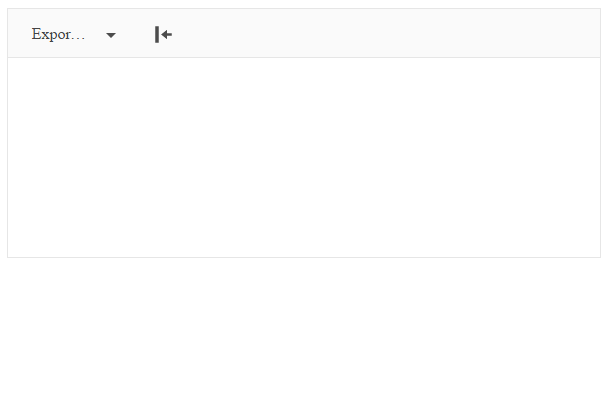

# Import and Export of Documents

As of the R1 2017 release, the Telerik UI Editor for ASP.NET MVC enables you to import and export various types of documents through the dedicated `Kendo.Mvc.Export` assembly.

Along with the server-side integration of the [Telerik Document Processing](https://docs.telerik.com/devtools/document-processing/introduction) suite, the new `ExportAs` and `Import` tools which utilize the import and export functionality are available.



## Requirements

The import and export capabilities are bundled as part of the [UI for ASP.NET MVC suite](). You can get the required assemblies from the `telerik.ui.for.aspnetmvc.<version>.zip` archive that contains a `Kendo.MVC.Export` folder with the assemblies for both .NET 4.0 and .NET 4.5 versions.

To start using the import and export functionality:

1. Add a reference in your project to the `Kendo.MVC.Export` assembly.
1. Add references in your project to the required [Telerik Document Processing libraries](https://docs.telerik.com/devtools/document-processing/introduction#libraries).

## Exporting Content from the Editor

1. Add the `ExportAs` tool.

    ```Razor
    @(Html.Kendo().Editor()
        .Name("Editor")
        .Tools(tools => tools
            .ExportAs()
        )
    )
    ```

    Alternatively, you can refine the options by configuring the `ExportAs` tool.

    ```Razor
    @(Html.Kendo().Editor()
        .Name("Editor")
        .Tools(tools => tools
            .ExportAs(export => export
                .Add("DOCX", "docx")
                .Add("RTF", "rtf")
                .Add("PDF", "pdf")
                .Add("HTML", "html")
                .Add("TXT", "txt")
            )
        )
    )
    ```

1. To enable the tool to contact the server and export a file, configure the `Proxy` method and, optionally, set up the name of the exported file through the `FileName` method.

    ```Razor
    @(Html.Kendo().Editor()
        .Name("Editor")
        .Tools(tools => tools
            .ExportAs()
        )
        .ExportAs(exportAs => exportAs
            .FileName("Export")
            .Proxy("Export", "Editor")
        )
    )
    ```

1. Implement the action method in the corresponding controller.

    ```
    using Kendo.Mvc.Export;
    ...
        [HttpPost]
        public ActionResult Export(EditorExportData data)
        {
            return EditorExport.Export(data);
        }
    ...
    ```

## Importing Content from Files

1. Add the `Import` tool.

    ```Razor
    @(Html.Kendo().Editor()
        .Name("Editor")
        .Tools(tools => tools
            .Import()
        )
    )
    ```

1. Configure the `Import` by using the `Proxy` and `AllowedExtensions` methods.

    > To send a file to the server, the `Import` tool integrates the [Telerik UI Upload HtmlHelper](). You can configure it through the following exposed helper methods:
    >
    > * [`AllowedExtensions()`](/api/Kendo.Mvc.UI.Fluent/UploadValidationSettingsBuilder#allowedextensionssystemstring)
    > * [`MaxFileSize()`](/api/Kendo.Mvc.UI.Fluent/UploadValidationSettingsBuilder#maxfilesizesystemnullablesystemdouble)
    > * [`Complete()`](/api/Kendo.Mvc.UI.Fluent/UploadEventBuilder#completesystemstring)
    > * [`Progress()`](/api/Kendo.Mvc.UI.Fluent/UploadEventBuilder#progresssystemstring)
    > * [`Select()`](/api/Kendo.Mvc.UI.Fluent/UploadEventBuilder#selectsystemstring)
    > * [`Success()`](/api/Kendo.Mvc.UI.Fluent/UploadEventBuilder#successsystemstring)

    ```Razor
    @(Html.Kendo().Editor()
        .Name("Editor")
        .Tools(tools => tools
            .Import()
        )
        .Import(import => import
            .AllowedExtensions(new[] { "docx", "rtf", "html", "txt" })
            .Proxy("Import","Editor")
        )
    )
    ```

1. Implement the action method in the corresponding controller.

    ```
    using Kendo.Mvc.Export;
    ...
        public ActionResult Import(HttpPostedFileBase file)
        {
            var settings = new EditorImportSettings();
            string htmlResult;
            switch (Path.GetExtension(file.FileName))
            {
                case ".docx":
                    htmlResult = EditorImport.ToDocxImportResult(file, settings);
                    break;
                case ".rtf":
                    htmlResult = EditorImport.ToRtfImportResult(file, settings);
                    break;
                default:
                    htmlResult = EditorImport.GetTextContent(file);
                    break;
            }

            return Json(new { html = htmlResult });
        }
    ...
    ```

## Changing Import and Export Settings

The Document Processing Library provides settings for the import and export which enables you to fine-tune the way the content is handled in the supported document types. The following example demonstrates how to use [`HtmlImportSettings`](https://docs.telerik.com/devtools/document-processing/libraries/radwordsprocessing/formats-and-conversion/html/settings) so that you can process HTML images before they are exported to `RadFlowDocument`.

```
using Kendo.Mvc.Export;
using Telerik.Windows.Documents.Flow.FormatProviders.Html;
...
    [HttpPost]
    public ActionResult Export(EditorExportData data)
    {
        var settings = new EditorDocumentsSettings();
        settings.HtmlImportSettings.LoadFromUri += HtmlImportSettings_LoadFromUri;

        return EditorExport.Export(data);
    }

    private void HtmlImportSettings_LoadFromUri(object sender, LoadFromUriEventArgs e)
    {
        var uri = e.Uri;
        var absoluteUrl = uri.StartsWith("http://") || uri.StartsWith("www.");
        if (!absoluteUrl)
        {
            var filePath = Server.MapPath(uri);
            using (var fileStream = System.IO.File.OpenRead(filePath))
            {
                using (var memoryStream = new MemoryStream())
                {
                    fileStream.CopyTo(memoryStream);
                    e.SetData(memoryStream.ToArray());
                }
            }
        }
    }
...
```

The following example demonstrates how to configure the import capabilities so that images are generated with inline base64 data in the HTML `` tag. For more information on each setting that is supported by `EditorImportSettings`, refer to the [documentation on HTML export settings](https://docs.telerik.com/devtools/document-processing/libraries/radwordsprocessing/formats-and-conversion/html/settings#export-settings).

```
using Kendo.Mvc.Export;
using Telerik.Windows.Documents.Flow.FormatProviders.Html;
...
    public ActionResult Import(HttpPostedFileBase file)
    {
        var settings = new EditorImportSettings();
        settings.ImagesImportMode = ImagesExportMode.Embedded;
        string htmlResult = EditorImport.ToDocxImportResult(file, settings);

        return Json(new { html = htmlResult });
    }
...
```

## See Also

* [Document Import and Export by the Editor HtmlHelper for ASP.NET MVC (Demo)](https://demos.telerik.com/aspnet-mvc/editor/import-export)
* [EditorBuilder Server-Side API](https://docs.telerik.com/aspnet-mvc/api/Kendo.Mvc.UI.Fluent/EditorBuilder)
* [Editor Server-Side API](/api/editor)
