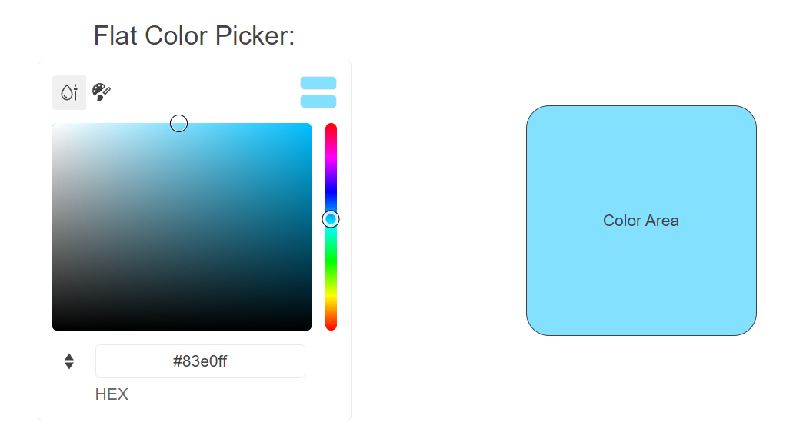

# Getting Started with the FlatColorPicker

This tutorial explains how to set up a basic Telerik UI for {{ site.framework }} FlatColorPicker and highlights the major steps in the configuration of the component.

You will initialize a FlatColorPicker component with predefined `gradient` and `palette` view types, and then change its appearance. Finally, you will learn how to handle the Change event of the FlatColorPicker in order to color an arbitrary container.

 

@[template](/_contentTemplates/core/getting-started-prerequisites.md#repl-component-gs-prerequisites)

## 1. Prepare the CSHTML File

@[template](/_contentTemplates/core/getting-started-directives.md#gs-adding-directives)

Optionally, you can structure the document by adding the desired HTML elements like headings, divs, and paragraphs.

```HtmlHelper
    @using Kendo.Mvc.UI
    <h4>FlatColorPicker with a placeholder</h4>
    <div>
    
    </div>
```

```TagHelper
    @addTagHelper *, Kendo.Mvc
    <h4>FlatColorPicker with a placeholder</h4>
    <div>
    
    </div>
```



## 2. Initialize the FlatColorPicker

Use the FlatColorPicker HtmlHelper or TagHelper to add the component to a page.

The `Name()` configuration method is mandatory as its value is used for the `id` and the `name` attributes of the  FlatColorPicker element.

```HtmlHelper
    @(Html.Kendo().FlatColorPicker()
        .Name("flatColorPicker")
    )
```

```TagHelper
    <kendo-flatcolorpicker name="flatColorPicker">
    </kendo-flatcolorpicker>
```



## 3. Configure the Views

The next step is to explicitly declare the Views configuration. The following example will configure the `gradient` and `palette` view types whilst providing a default view as the primary source of coloring.


```HtmlHelper
    @(Html.Kendo().FlatColorPicker()
        .Name("flatColorPicker")
        .View("gradient")
        .Views(new string[] { "palette", "gradient"})
    )
```


```TagHelper
    @{
        string[] views = new string[] { "gradient", "palette" };
    }

    <kendo-flatcolorpicker name="flatColorPicker" 
                       view="gradient"
                       views="views">
    </kendo-flatcolorpicker>
```


## 4. Handle the FlatColorPicker Events

The FlatColorPicker component exposes the Change [event](https://docs.telerik.com/{{ site.platform }}/api/kendo.mvc.ui.fluent/colorpickerbuilder#eventssystemaction) that you can handle and further customize the functionality of the component or other proprietary HTML elements. In this tutorial, you will change the color of another container.

```HtmlHelper
    @(Html.Kendo().FlatColorPicker()
        .Name("flatColorPicker")
        .View("gradient")
        .Views(new string[] { "palette", "gradient"})
        .Events(events => events.Change("onChange"))
    )

    <script>
        function onChange(e) {
            $("#background").css("background-color", e.value);
        }
    </script>
```

```TagHelper
    @{
        string[] views = new string[] { "gradient", "palette" };
    }

    <kendo-flatcolorpicker name="flatColorPicker" 
                       view="gradient"
                       views="views"
                       on-change="onChange">
    </kendo-flatcolorpicker>

    <script>
        function onChange(e) {
            $("#background").css("background-color", e.value);
        }
    </script>
```


## 5. (Optional) Reference Existing FlatColorPicker Instances

You can reference the FlatColorPicker instances that you have created and build on top of their existing configuration:

1. Use the `.Name()` (`id` attribute) of the component instance to get a reference.

    ```script
         <script>
             $(document).ready(function() {
                 var flatColorPickerReference = $("#flatColorPicker").data("kendoFlatColorPicker"); // flatColorPickerReference is a reference to the existing FlatColorPicker instance of the helper.
             })
         </script>
    ```
1. Toggle the state of the component by using the [`enable()`](https://docs.telerik.com/kendo-ui/api/javascript/ui/flatcolorpicker/methods/enable) client-side method.

    ```script
        <script>
            $(document).ready(function() {
               var flatColorPickerReference = $("#flatColorPicker").data("kendoColorPicker"); // flatColorPickerReference is a reference to the existing FlatColorPicker instance of the helper.
               flatColorPickerReference.enable(false); // Toggle the state of the component.
            })
        </script>
    ```




## Explore this Tutorial in REPL

You can continue experimenting with the code sample above by running it in the Telerik REPL server playground:

* [Sample code with the FlatColorPicker HtmlHelper](https://netcorerepl.telerik.com/wdPbnuEU25aHrUCg00)
* [Sample code with the FlatColorPicker TagHelper](https://netcorerepl.telerik.com/wdFPHOuA27ajhRQh31)




## Next Steps


* [Configuring the Contrast Tool]()


## See Also

* [Using the API of the FlatColorPicker for {{ site.framework }} (Demo)](https://demos.telerik.com/{{ site.platform }}/flatcolorpicker/api)
* [Client-Side API of the FlatColorPicker](https://docs.telerik.com/kendo-ui/api/javascript/ui/flatcolorpicker)
* [Server-Side API of the FlatColorPicker for {{ site.framework }}](/api/flatcolorpicker)
* [Knowledge Base Section](/knowledge-base)