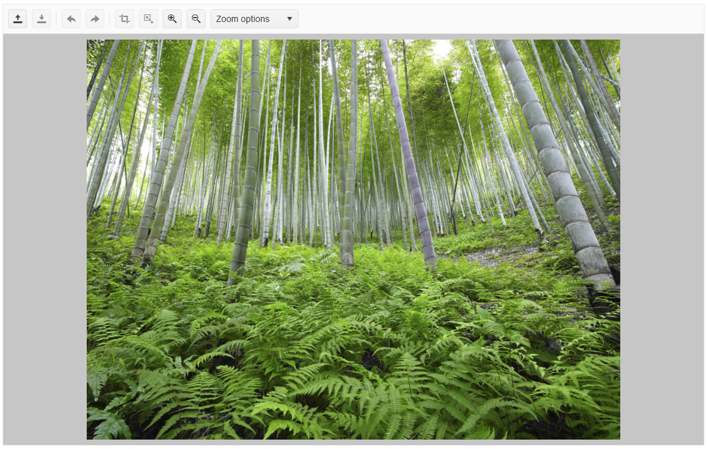

# Getting Started with the ImageEditor

This tutorial explains how to set up a basic Telerik UI for {{ site.framework }} ImageEditor and highlights the major steps in the configuration of the component.

You will initialize an ImageEditor and configure some of its options. You can run the sample code in [Telerik REPL](https://netcorerepl.telerik.com/) and continue exploring the components.

After completing this guide, you will achieve the following result:

 

@[template](/_contentTemplates/core/getting-started-prerequisites.md#repl-component-gs-prerequisites)

## 1. Initialize the ImageEditor

Use the ImageEditor HtmlHelper or TagHelper to add the component to a page:

* The `Name()` configuration method is mandatory as its value is used for the `id` and the `name` attributes of the ImageEditor element.
* The `SaveAs()` configuration allows you to set the name of the saved image file. You can also use it to configure a server proxy, which will stream the file to the end user.
* The `ImageUrl()` option enables you to load an initial image in the component.

```HtmlHelper
@using Kendo.Mvc.UI

<h4>ImageEditor</h4>
@(Html.Kendo().ImageEditor()
    .Name("imageEditor")
    .Height(700)
    .SaveAs(s => s.FileName("image_edited.png"))
    .ImageUrl(@Url.Content("~/shared/images/photos/sample.jpg"))
)
```

```TagHelper
@addTagHelper *, Kendo.Mvc

<h4>ImageEditor</h4>
<kendo-imageeditor name="imageEditor" height="700" image-url="@Url.Content("~/shared/images/photos/sample.jpg")">
    <save-as file-name="image_edited.png" />
</kendo-imageeditor>
```


## 2. (Optional) Configure the Toolbar

The ImageEditor comes with a set of default tools in its toolbar, but you can use the `.Toolbar()` configuration to declare only the tools you want. 

The following example shows how to prevent the `open` and `crop` tools from appearing in the toolbar by excluding them from the list of declared tools. 

```HtmlHelper
@using Kendo.Mvc.UI

<h4>ImageEditor</h4>
@(Html.Kendo().ImageEditor()
    .Name("imageEditor")
    .Height(700)
    .SaveAs(s => s.FileName("image_edited.png"))
    .ImageUrl(@Url.Content("~/shared/images/photos/sample.jpg"))
    .Toolbar(toolbar=>toolbar.Items(i=> {
        i.Add().Name("save");
        i.Add().Name("resize");
        i.Add().Name("undo");
        i.Add().Name("redo");
        i.Add().Name("zoomIn");
        i.Add().Name("zoomOut");
        i.Add().Name("zoomDropdown");
    }))
)
```

```TagHelper
@addTagHelper *, Kendo.Mvc

<h4>ImageEditor</h4>
<kendo-imageeditor name="imageEditor" height="700" image-url="@Url.Content("~/shared/images/photos/sample.jpg")">
    <save-as file-name="image_edited.png" />
    <toolbar>
        <items>
            <item name="save"/>
            <item name="resize"/>
            <item name="undo"/>
            <item name="redo"/>
            <item name="zoomIn"/>
            <item name="zoomOut"/>
            <item name="zoomDropdown"/>
        </items>
    </toolbar>
</kendo-imageeditor>
```


## 3. Handle the ImageEditor Events
The ImageEditor exposes various [events](/api/kendo.mvc.ui.fluent/imageeditoreventbuilder) that you can handle and further customize the functionality of the component. In this example, you will use the `Error` event. This event helps you detect a failed attempt to load an image in the ImageEditor.   

```HtmlHelper
@using Kendo.Mvc.UI

<h4>ImageEditor</h4>
@(Html.Kendo().ImageEditor()
    .Name("imageEditor")
    .Height(700)
    .SaveAs(s => s.FileName("image_edited.png"))
    .ImageUrl(@Url.Content("~/shared/images/photos/sample.jpg"))
    .Events(ev => {
        ev.Error("onError");
    })
)
```

```TagHelper
@addTagHelper *, Kendo.Mvc

<h4>ImageEditor</h4>
<kendo-imageeditor name="imageEditor" height="700" image-url="@Url.Content("~/shared/images/photos/sample.jpg")"
    on-error="onError">
    <save-as file-name="image_edited.png" />
</kendo-imageeditor>
```

```JS script
<script>	
	function onError(e) {
		console.log("error");
	}
</script>
```

## 4. (Optional) Reference Existing ImageEditor Instances

Referencing existing instances allows you to build on top of their configuration. To reference an existing Gantt instance, use the [`jQuery.data()`](http://api.jquery.com/jQuery.data/) method:

1. Use the `id` attribute of the component instance to establish a reference.

    ```JS script
    <script>
        var imageEditorReference = $("#imageEditor").data("kendoImageEditor"); // imageEditorReference is a reference to the existing instance of the helper.
    </script>
    ```

1. Use the [ImageEditor client-side API](https://docs.telerik.com/kendo-ui/api/javascript/ui/imageeditor#methods) to control the behavior of the widget. In this example, you will programmatically execute the `ZoomImageEditorCommand` by using the `executeCommand` method.

    ```JS script
    <script>
        var imageEditorReference = $("#imageEditor").data("kendoImageEditor"); // imageEditorReference is a reference to the existing instance of the helper.
        imageEditorReference.executeCommand({ command: "ZoomImageEditorCommand", options: imageEditorReference.getZoomLevel() - 0.3 });
    </script>
    ```

For more information on referencing specific helper instances, see the [Methods and Events]() article.


## Explore this Tutorial in REPL

You can continue experimenting with the code sample above by running it in the Telerik REPL server playground:

* [Sample code with the ImageEditor HtmlHelper](https://netcorerepl.telerik.com/wRYTEvPA16MTLSkw07)
* [Sample code with the ImageEditor TagHelper](https://netcorerepl.telerik.com/GHYJuFFK164B7CiT41)



## Next Steps

* [Configure the ImageEditor's Tools]()

* [Use the ImageEditor in a Razor Page]()


## See Also

* [Using the API of the ImageEditor for {{ site.framework }} (Demo)](https://demos.telerik.com/{{ site.platform }}/imageeditor/api)
* [ImageEditor Client-Side API](https://docs.telerik.com/kendo-ui/api/javascript/ui/imageeditor)
* [Server-Side API of the ImageEditor](/api/imageeditor)
* [Knowledge Base Section](/knowledge-base)
