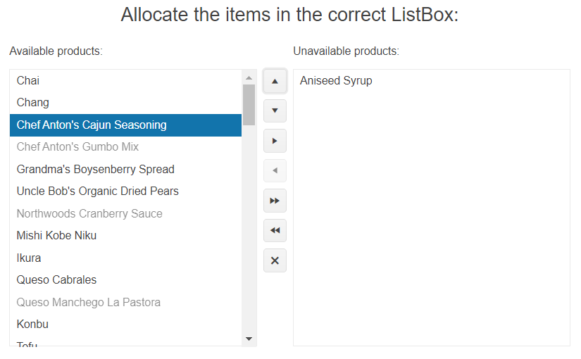

# Getting Started with the ListBox

This tutorial explains how to set up a basic Telerik UI for {{ site.framework }} ListBox and highlights the major steps in the configuration of the component.

You will initialize two connected ListBoxes that are bound to remote data, and multiple items can be transferred between the components. By using the client-side API methods, you will select and disable specified items during the ListBox initialization. These items will be sent from the server to the View through the Model. Next, you will handle the ListBox events and display the event data in the browser console. Finally, you can run the sample code in [Telerik REPL](https://netcorerepl.telerik.com/) and continue exploring the components.

 

@[template](/_contentTemplates/core/getting-started-prerequisites.md#repl-component-gs-prerequisites)

## 1. Prepare the CSHTML File

@[template](/_contentTemplates/core/getting-started-directives.md#gs-adding-directives)

Optionally, you can structure the View content by adding the desired HTML elements like headings, divs, paragraphs, and others.

```HtmlHelper
    @using Kendo.Mvc.UI

    <h4>Allocate the items in the correct ListBox:</h4>
    <div>

    </div>
```

```TagHelper
    @addTagHelper *, Kendo.Mvc

    <h4>Allocate the items in the correct ListBox:</h4>
    <div>

    </div>
```


## 2. Initialize the ListBox

Use the ListBox HtmlHelper or TagHelper to add the component to a page:

* The `Name()` configuration method is mandatory as its value is used for the `id` and the name attributes of the ListBox element.
* The `DataValueField` and `DataTextField` options specify the names of the Model properties that provide the value and text content for each ListBox item.
* The `DataSource()` configuration sets the endpoint of the `Read` data operation.
* The `Selectable()` property enables the multiple items selection.
* The `ConnectWith` configuration method specifies the `Name()` of the target ListBox to which the items can be moved and vice versa.
* The `Toolbar` configuration defines the toolbar commands.


```HtmlHelper
@using Kendo.Mvc.UI

<div class="listbox1">
    <p>Available products:</p>
    @(Html.Kendo().ListBox()
        .Name("availableProducts")
        .DataValueField("ProductID")
        .DataTextField("ProductName")
        .DataSource(source => source
            .Read(read => read.Action("GetProducts", "ListBox"))
        )
        .Selectable(ListBoxSelectable.Multiple)
        .ConnectWith("unavailableProducts")
        .Toolbar(toolbar =>
        {
            toolbar.Position(ListBoxToolbarPosition.Right);
            toolbar.Tools(tools => tools
                .MoveUp()
                .MoveDown()
                .TransferTo()
                .TransferFrom()
                .TransferAllTo()
                .TransferAllFrom()
                .Remove());
        })
        .BindTo(new List<ProductViewModel>())
    )
</div>
<div class="listbox2">
    <p>Unavailable products:</p>
    @(Html.Kendo().ListBox()
        .Name("unavailableProducts")
        .DataValueField("ProductID")
        .DataTextField("ProductName")
        .ConnectWith("availableProducts")
        .BindTo(new List<ProductViewModel>())
    )
</div>
```

```TagHelper
@addTagHelper *, Kendo.Mvc

@{
    var products = new List<ProductViewModel>();
    var tools = new string[] { "moveUp", "moveDown", "transferTo", "transferFrom", "transferAllTo", "transferAllFrom", "remove" };
}

<div class="listbox1">
    <p>Available products:</p>
    <kendo-listbox name="availableProducts"
        datavaluefield="ProductID"
        datatextfield="ProductName"
        selectable="ListBoxSelectable.Multiple"
        connect-with="unavailableProducts"
        bind-to="products">
        <datasource>
            <transport>
                <read url="@Url.Action("GetProducts", "ListBox")"/>
            </transport>
        </datasource>
        <toolbar position="ListBoxToolbarPosition.Right" tools="tools"/>
    </kendo-listbox>
</div>
<div class="listbox2">
    <p>Unavailable products:</p>
    <kendo-listbox name="unavailableProducts"
        datavaluefield="ProductID"
        datatextfield="ProductName"
        selectable="ListBoxSelectable.Multiple"
        connect-with="availableProducts"
        bind-to="products">
    </kendo-listbox>
</div>
```

```Controller

    public IActionResult GetProducts()
    {
        var products = Enumerable.Empty<ProductViewModel>();

        using (var northwind = GetContext())
        {
            products = northwind.Products.Select(product => new ProductViewModel
            {
                ProductID = product.ProductID,
                ProductName = product.ProductName
            }).ToList();
        }
        return Json(products);
    }
```

## 3. Configure the Initially Selected and Disabled Items

The next step is to get a couple of lists with Model (`ProductViewModel`) IDs passed from the Controller to the View. The first list contains IDs of ListBox items that must be selected (`SelectedProductIDs`) when the component is loaded. The second collection contains the IDs that must be initially disabled (`DisabledProductIDs`).

Convert each `List<ProductViewModel>` Model property into a comma-separated string and store it in a hidden input element on the page. As a result, there will be two hidden inputs on the page that will contain the product IDs, which must be selected or disabled in the ListBox.

Handle the `DataBound` event of the ListBox, which fires when the data is received from the remote service, and use the [ListBox client-side API](https://docs.telerik.com/kendo-ui/api/javascript/ui/listbox#methods) to select and disable the specified items programmatically.


```HtmlHelper
@using Kendo.Mvc.UI
@model ListBoxViewModel

@{  
    string selectedProductIds = string.Join(",", Model.SelectedProductIDs.Select(x=>x.ProductID).ToArray());
    <input type="hidden" id="selected-server-products" value=@selectedProductIds />
}

@{  
    string disabledProductIds = string.Join(",", Model.DisabledProductIDs.Select(x=>x.ProductID).ToArray());
    <input type="hidden" id="disabled-server-products" value=@disabledProductIds />
}

<div class="listbox1">
    <p>Available products:</p>
    @(Html.Kendo().ListBox()
        .Name("availableProducts")
        .Events(ev => ev.DataBound("onDataBound"))
        .DataValueField("ProductID")
        .DataTextField("ProductName")
        .DataSource(source => source
            .Read(read => read.Action("GetProducts", "ListBox"))
        )
        .Selectable(ListBoxSelectable.Multiple)
        .ConnectWith("unavailableProducts")
        .Toolbar(toolbar =>
        {
            toolbar.Position(ListBoxToolbarPosition.Right);
            toolbar.Tools(tools => tools
                .MoveUp()
                .MoveDown()
                .TransferTo()
                .TransferFrom()
                .TransferAllTo()
                .TransferAllFrom()
                .Remove());
        })
        .BindTo(new List<ProductViewModel>())
    )
</div>
<div class="listbox2">
    <p>Unavailable products:</p>
    @(Html.Kendo().ListBox()
        .Name("unavailableProducts")
        .DataValueField("ProductID")
        .DataTextField("ProductName")
        .ConnectWith("availableProducts")
        .BindTo(new List<ProductViewModel>())
    )
</div>
```

```TagHelper
@addTagHelper *, Kendo.Mvc
@model ListBoxViewModel

@{
    var products = new List<ProductViewModel>();
    var tools = new string[] { "moveUp", "moveDown", "transferTo", "transferFrom", "transferAllTo", "transferAllFrom", "remove" };
}

@{  
    string selectedProductIds = string.Join(",", Model.SelectedProductIDs.Select(x=>x.ProductID).ToArray());
    <input type="hidden" id="selected-server-products" value=@selectedProductIds />
}

@{  
    string disabledProductIds = string.Join(",", Model.DisabledProductIDs.Select(x=>x.ProductID).ToArray());
    <input type="hidden" id="disabled-server-products" value=@disabledProductIds />
}

<div class="listbox1">
    <p>Available products:</p>
    <kendo-listbox name="availableProducts" on-data-bound="onDataBound"
        datavaluefield="ProductID"
        datatextfield="ProductName"
        selectable="ListBoxSelectable.Multiple"
        connect-with="unavailableProducts"
        bind-to="products">
        <datasource>
            <transport>
                <read url="@Url.Action("GetProducts", "ListBox")"/>
            </transport>
        </datasource>
        <toolbar position="ListBoxToolbarPosition.Right" tools="tools"/>
    </kendo-listbox>
</div>
<div class="listbox2">
    <p>Unavailable products:</p>
    <kendo-listbox name="unavailableProducts"
        datavaluefield="ProductID"
        datatextfield="ProductName"
        selectable="ListBoxSelectable.Multiple"
        connect-with="availableProducts"
        bind-to="products">
    </kendo-listbox>
</div>
```

```Scripts
    <script>
        function onDataBound(e) {
            let listBoxReference = e.sender;
            //Convert the value of the "selected-server-products" input into array of strings
            let idsToSelect = $("#selected-server-products").val().split(',');
            //Loop throught the ids that should be selected in the ListBox
            $.each(idsToSelect, function(index, id) {
                //Get the "uid" of the data item based on the array value
                let listBoxItemUID = listBoxReference.dataItems().filter(f => f.ProductID == parseInt(id))[0].uid;
                //Get the HTML element of the item that should be selected based on the "uid"
                let listBoxElement = listBoxReference.items().filter(function(){ 
                    return $(this).attr("data-uid") == listBoxItemUID; 
                });
                //Select the respective item
                listBoxReference.select(listBoxElement);
            });

            //Follow the same logic to disable the ids from the hidden "disabled-server-products" input element
            let idsToDisable = $("#disabled-server-products").val().split(',');
            $.each(idsToDisable, function(index, id) {
                let listBoxItemUID = listBoxReference.dataItems().filter(f => f.ProductID == parseInt(id))[0].uid;
                let listBoxElement = listBoxReference.items().filter(function(){ 
                    return $(this).attr("data-uid") == listBoxItemUID; 
                });
                listBoxReference.enable(listBoxElement, false);
            });
        }
    </script>
```
```Controller
    public class HomeController : Controller {
        public IActionResult Index()
        {
            ListBoxViewModel productItems = new ListBoxViewModel()
            {
                SelectedProductIDs = new List<ProductViewModel>()
                {
                    new ProductViewModel() { ProductID = 2 }, 
                    new ProductViewModel() { ProductID = 10 }, 
                    new ProductViewModel() { ProductID = 15 }
                },
                DisabledProductIDs = new List<ProductViewModel>()
                {
                    new ProductViewModel() { ProductID = 5 }, 
                    new ProductViewModel() { ProductID = 8 }, 
                    new ProductViewModel() { ProductID = 12 }
                }
            };

            return View("Index", productItems);
        }
    }

```
```ListBoxViewModel
    public class ListBoxViewModel {
        public List<ProductViewModel> SelectedProductIDs { get; set; }   
        public List<ProductViewModel> DisabledProductIDs { get; set; }      
    }
```
```ProductViewModel
    public class ProductViewModel {
        public int ProductID { get; set; }     
        public string ProductName { get; set; }  
    }
```

## 4. Handle the ListBox Events

The ListBox exposes various [events](/api/Kendo.Mvc.UI.Fluent/ListBoxEventBuilder) that you can handle and further customize the functionality of the component. In this tutorial, you will use the `Reorder` event to track when the items are reordered.


```HtmlHelper
@using Kendo.Mvc.UI

    @(Html.Kendo().ListBox()
        .Name("availableProducts")
        .Events(events => events.Reorder("onReorder"))
        .DataValueField("ProductID")
        .DataTextField("ProductName")
        .DataSource(source => source
            .Read(read => read.Action("GetProducts", "ListBox"))
        )
        .Selectable(ListBoxSelectable.Multiple)
        .Toolbar(toolbar =>
        {
            toolbar.Position(ListBoxToolbarPosition.Right);
            toolbar.Tools(tools => tools
                .MoveUp()
                .MoveDown()
            );
        })
        .BindTo(new List<ProductViewModel>())
    )

    <script>
        function onReorder(e) {
            //Loop through the data items of the moved items
            $.each(e.dataItems, function(index, value) {
                 console.log("Moved item: " + value.ProductName);
            });
        }
    </script>
```

```TagHelper
   @addTagHelper *, Kendo.Mvc

   @{
        var products = new List<ProductViewModel>();
        var tools = new string[] { "moveUp", "moveDown" };
    }

    <kendo-listbox name="availableProducts" on-reorder="onReorder"
        datavaluefield="ProductID"
        datatextfield="ProductName"
        selectable="ListBoxSelectable.Multiple"
        bind-to="products">
        <datasource>
            <transport>
                <read url="@Url.Action("GetProducts", "ListBox")"/>
            </transport>
        </datasource>
        <toolbar position="ListBoxToolbarPosition.Right" tools="tools"/>
    </kendo-listbox>

    <script>
        function onReorder(e) {
            //Loop through the data items of the moved items
            $.each(e.dataItems, function(index, value) {
                 console.log("Moved item: " + value.ProductName);
            });
        }
    </script>
```


## 5. (Optional) Reference Existing ListBox Instances

You can reference the ListBox instances that you have created and build on top of their existing configuration:

1. Use the value of the `Name()` option of the component to establish a reference.

   ```script
        <script>
            $(document).ready(function() {
                var listBoxReference = $("#availableProducts").data("kendoListBox"); // listBoxReference is a reference to the existing ListBox instance of the helper.
            });
        </script>
   ```

1. Use the [ListBox client-side API](https://docs.telerik.com/kendo-ui/api/javascript/ui/listbox#methods) to control the behavior of the control. In this example, you will use the following methods:

* The `dataItems` method to get all data items to which the control is bound.
* The `items` method to obtain the `DOM` elements that correspond to the data items.
* The `reorder` method to change the position of a specified item.

   ```script
        <script>
            $(document).ready(function() {
                var listBoxReference = $("#availableProducts").data("kendoListBox");
                //Get the "uid" of the item with ProductName "Queso Cabrales".
                var itemUID = listBoxReference.dataItems().filter(f => f.ProductName == "Queso Cabrales")[0].uid;
                //Get the element of the "Queso Cabrales" item by using its "uid".
                var itemElement = listBoxReference.items().filter(function(){ 
                    return $(this).attr("data-uid") == itemUID 
                });
                //Move the item at the first position.
                listBoxReference.reorder(itemElement, 0);
            });
        </script>
   ```

For more information on referencing specific helper instances, see the [Methods and Events]() article.


## Explore this Tutorial in REPL

You can continue experimenting with the code sample above by running it in the Telerik REPL server playground:

* [Sample code with the ListBox HtmlHelper](https://netcorerepl.telerik.com/mdkGQAlH0405wz5v57)
* [Sample code with the ListBox TagHelper](https://netcorerepl.telerik.com/wnYwcKFR04gM07si23)


## Next Steps

* [Binding the ListBox to Data]()
* [Using the ListBox Item Templates]()

## See Also

* [Using the API of the ListBox for {{ site.framework }} (Demo)](https://demos.telerik.com/{{ site.platform }}/listbox/api)
* [Client-Side API of the ListBox](https://docs.telerik.com/kendo-ui/api/javascript/ui/listbox)
* [Server-Side API of the ListBox](/api/listbox)
* [Knowledge Base Section](/knowledge-base)
