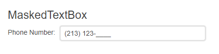

# Getting Started with the MaskedTextBox

This tutorial explains how to set up a basic Telerik UI for {{ site.framework }} MaskedTextBox and highlights the major steps in the configuration of the component.

You will initialize a MaskedTextBox component. Then you'll configure the mask and the label for the input. Finally, you can run the sample code in [Telerik REPL](https://netcorerepl.telerik.com/) and continue exploring the components.

 

@[template](/_contentTemplates/core/getting-started-prerequisites.md#repl-component-gs-prerequisites)

## 1. Prepare the CSHTML File

@[template](/_contentTemplates/core/getting-started-directives.md#gs-adding-directives)

Optionally, you can structure the document by adding the desired HTML elements like headings, divs, paragraphs, and others.

```HtmlHelper
    @using Kendo.Mvc.UI

    <h4>MaskedTextBox</h4>
    <div>

    </div>
```

```TagHelper
    @addTagHelper *, Kendo.Mvc

    <h4>MaskedTextBox</h4>
    <div>

    </div>
```


## 2. Initialize the MaskedTextBox

Use the MaskedTextBox HtmlHelper or TagHelper to add the component to a page:

* The `Name()` configuration method is mandatory as its value is used for the `id` and the `name` attributes of the MaskedTextBox element.
* The `Mask()` configuration specifies the input mask that constraints the format and the type of characters entered by the user. 

```HtmlHelper
@using Kendo.Mvc.UI

<h4>MaskedTextBox</h4>
<div>
    @(Html.Kendo().MaskedTextBox()
        .Name("maskedtextbox")
        .Mask("(000) 000-0000")
        .HtmlAttributes(new { style = "width: 300px;" })
    )
</div>
```

```TagHelper
@addTagHelper *, Kendo.Mvc

<h4>MaskedTextBox</h4>
<div>
    <kendo-maskedtextbox name="maskedtextbox" style="width: 300px;"
    mask="(000) 000-0000">
    </kendo-maskedtextbox>
</div>
```


## 3. Define a Label Text

The next step is to present a description in front of the MaskedTextBox component by using the `Label()` property.

```HtmlHelper
@using Kendo.Mvc.UI

<h4>MaskedTextBox</h4>
<div>
    @(Html.Kendo().MaskedTextBox()
        .Name("maskedtextbox")
        .Mask("(000) 000-0000")
        .Label(label=>label.Content("Phone Number:"))
        .HtmlAttributes(new { style = "width: 300px;" })
    )
</div>
```

```TagHelper
 @addTagHelper *, Kendo.Mvc

<h4>MaskedTextBox</h4>
<div>
    <kendo-maskedtextbox name="maskedtextbox" style="width: 300px;"
    mask="(000) 000-0000">
         <maskedtextbox-label content="Phone Number:"/>
         </kendo-maskedtextbox>
</div>
```


## 4. Handle a MaskedTextBox Event

The MaskedTextBox component provides convenient events for implementing your desired logic. In this tutorial, you will use the exposed `Change()` event to log a new entry in the browser's console.

```HtmlHelper
@using Kendo.Mvc.UI

<h4>MaskedTextBox</h4>
<div>
    <script>
       function change(e) {
          console.log("Change :: " + this.value());
       }
    </script>

    @(Html.Kendo().MaskedTextBox()
        .Name("maskedtextbox")
        .Mask("(000) 000-0000")
        .Label(l => l.Content("Phone Number:"))
        .Events(e => e.Change("change"))
        .HtmlAttributes(new { style = "width: 300px;" })
    )
</div>
```

```TagHelper
@addTagHelper *, Kendo.Mvc

<h4>MaskedTextBox</h4>
<div>
    <script>
       function change(e) {
          console.log("Change :: " + this.value());
       }
    </script>

    <kendo-maskedtextbox name="maskedtextbox" style="width: 300px;" 
    mask="(000) 000-0000" on-change="change">
       <maskedtextbox-label content="Phone Number:"/>
    </kendo-maskedtextbox>
</div>
```


## 5. (Optional) Reference Existing MaskedTextBox Instances

You can reference the MaskedTextBox instances that you have created and build on top of their existing configuration:

1. Use the `id` attribute of the component instance to establish a reference.

    ```JS script
    <script>
        var maskedtextboxReference = $("#maskedtextbox").data("kendoMaskedTextBox"); // maskedtextboxReference is a reference to the existing MaskedTextBox instance of the helper.
    </script>
    ```

1. Use the [MaskedTextBox client-side API](https://docs.telerik.com/kendo-ui/api/javascript/ui/maskedtextbox#methods) to control the behavior of the widget. In this example, you will use the `value` method to select an item.

    ```JS script
    <script>
        var maskedtextboxReference = $("#maskedtextbox").data("kendoMaskedTextBox"); // maskedtextboxReference is a reference to the existing MaskedTextBox instance of the helper.
        maskedtextboxReference.value("Sample text"); 
    </script>
    ```


## Explore this Tutorial in REPL

You can continue experimenting with the code sample above by running it in the Telerik REPL server playground:

* [Sample code with the MaskedTextBox HtmlHelper](https://netcorerepl.telerik.com/mHuzaJFK05VH4pdR04)
* [Sample code with the MaskedTextBox TagHelper](https://netcorerepl.telerik.com/GHapuJPg06Jyk6BD37)



## Next Steps

* [Define Mask Rules]()
* [Set Labels to the MaskedTextBox]()
* [Customize the Appearance of the MaskedTextBox]()

## See Also

* [Using the API of the MaskedTextBox for {{ site.framework }} (Demo)](https://demos.telerik.com/{{ site.platform }}/maskedtextbox/api)
* [Client-Side API of the MaskedTextBox](https://docs.telerik.com/kendo-ui/api/javascript/ui/maskedtextbox)
* [Server-Side API of the MaskedTextBox](/api/maskedtextbox)
* [Knowledge Base Section](/knowledge-base)
