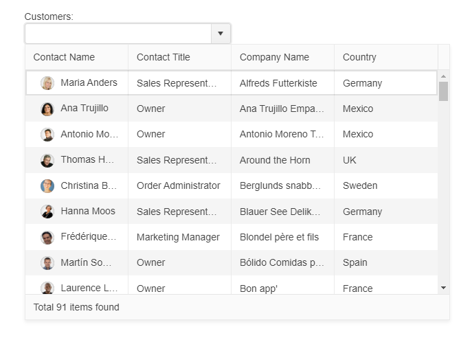

# Getting Started with the MultiColumnComboBox

This tutorial explains how to set up a basic Telerik UI for {{ site.framework }} MultiColumnComboBox and highlights the major steps in the configuration of the component.

You will initialize a MultiColumnComboBox control with a number of tools. Next, you will handle some of the MultiColumnComboBox events. Finally, you can run the sample code in [Telerik REPL](https://netcorerepl.telerik.com/) and continue exploring the components.

 

@[template](/_contentTemplates/core/getting-started-prerequisites.md#repl-component-gs-prerequisites)

## 1. Prepare the CSHTML File

@[template](/_contentTemplates/core/getting-started-directives.md#gs-adding-directives)

Optionally, you can structure the document by adding the desired HTML elements like headings, divs, paragraphs, and apply some basic styles.

## 2. Initialize the MultiColumnComboBox

Use the MultiColumnComboBox HtmlHelper or TagHelper to add the component to a page:

* The `Name()` configuration method is mandatory as its value is used for the `id` and the `name` attributes of the MultiColumnComboBox element.

* The `DataTextField()` configuration method provides the text content of the list items. The component will filter the data source based on this field.

* The `DataValueField()` configuration method provides the value of the component.

* The [`DataSource`](https://docs.telerik.com/aspnet-core/api/kendo.mvc.ui.fluent/multicolumncomboboxbuilder#datasourcesystemaction) of the component which is used to display a list of values. Can be a JavaScript object which represents a valid data source configuration, a JavaScript array or an existing kendo.data.DataSource instance.

* The `Columns` configuration array defines the columns rendered in the table of the MultiColumnComboBox.

```HtmlHelper

@using Kendo.Mvc.UI

 <label for="customers">Customers:</label>
    @(Html.Kendo().MultiColumnComboBox()
                .Name("customers")
                .DataTextField("ContactName")
                .DataValueField("CustomerID")
                .Columns(columns =>
                {
                    columns.Add().Field("ContactName").Title("Contact Name").Template("<div class=\"customer-photo\" style=\"background-image: url(" + Url.Content("~/shared/web/Customers/") + "#:data.CustomerID#.jpg" + ");\"\"></div><span class=\"customer-name\">#: ContactName #</span>").Width("150px");
                    columns.Add().Field("ContactTitle").Title("Contact Title").Width("150px");
                    columns.Add().Field("CompanyName").Title("Company Name").Width("150px");
                    columns.Add().Field("Country").Title("Country").Width("150px");
                })
                .FooterTemplate("Total #: instance.dataSource.total() # items found")
                .HtmlAttributes(new { style = "width:100%;" })
                .DataSource(source => source
                    .Custom()
                    .Transport(transport => transport
                    .Read(read =>
                    {
                        read.Action("BasicUsage_Customers_Read", "MultiColumnComboBox");
                    }))
                )
    )
```


```TagHelper

@addTagHelper *, Kendo.Mvc

        <label for="customers">Customers:</label>
        <kendo-multicolumncombobox datatextfield="ContactName" datavaluefield="CustomerID"
                                   footer-template="Total #: instance.dataSource.total() # items found">
            <multicolumncombobox-columns>
                <column field="ContactName" title="Contact Name" template='<div class="customer-photo" style="background-image: url(/shared/web/Customers/#:data.CustomerID#.jpg);""></div><span class="customer-name">#: ContactName #</span>' width="150px">
                </column>
                <column field="ContactTitle" title="Contact Title" width="150px">
                </column>
                <column field="CompanyName" title="Company Name" width="150px">
                </column>
                <column field="Country" title="Country" width="150px">
                </column>
            </multicolumncombobox-columns>
            <datasource type="DataSourceTagHelperType.Custom">
                <transport>
                    <read url="@Url.Action("BasicUsage_Customers_Read", "MultiColumnComboBox")" />
                </transport>
            </datasource>
        </kendo-multicolumncombobox>
```


## 3. Handle the MultiColumnComboBox Events

The MultiColumnComboBox [exposes various events](/api/kendo.mvc.ui.fluent/multicolumncomboboxeventbuilder) that you can handle and further customize the functionality of the component. In this tutorial, you will use the `Open`, `Close`, and `Select` events of the MultiColumnComboBox.

```HtmlHelper

@using Kendo.Mvc.UI

 <label for="customers">Customers:</label>
    @(Html.Kendo().MultiColumnComboBox()
                .Name("customers")
                .DataTextField("ContactName")
                .DataValueField("CustomerID")
                .Columns(columns =>
                {
                    columns.Add().Field("ContactName").Title("Contact Name").Template("<div class=\"customer-photo\" style=\"background-image: url(" + Url.Content("~/shared/web/Customers/") + "#:data.CustomerID#.jpg" + ");\"\"></div><span class=\"customer-name\">#: ContactName #</span>").Width("150px");
                    columns.Add().Field("ContactTitle").Title("Contact Title").Width("150px");
                    columns.Add().Field("CompanyName").Title("Company Name").Width("150px");
                    columns.Add().Field("Country").Title("Country").Width("150px");
                })
                .FooterTemplate("Total #: instance.dataSource.total() # items found")
                .HtmlAttributes(new { style = "width:100%;" })
                .DataSource(source => source
                    .Custom()
                    .Transport(transport => transport
                    .Read(read =>
                    {
                        read.Action("BasicUsage_Customers_Read", "MultiColumnComboBox");
                    }))
                )
                .Events(e =>
                {
                    e.Select("onSelect").Open("onOpen").Close("onClose");
                })
    )

    <script>
        function onOpen() {
            console.log("event: open");
        }

        function onClose() {
            console.log("event: close");
        }

        function onSelect(e) {
        	if ("kendoConsole" in window) {
        		if (e.item) {
        			var dataItem = this.dataItem(e.item.index());
        			console.log("event :: select (" + dataItem.Text + " : " + dataItem.Value + ")");
        		} else {
        			console.log("event :: select");
        		}
            }
        }
    </script>
```

```TagHelper

@addTagHelper *, Kendo.Mvc

        <label for="customers">Customers:</label>
        <kendo-multicolumncombobox datatextfield="ContactName" datavaluefield="CustomerID"
                                   footer-template="Total #: instance.dataSource.total() # items found"
                                   name="customers"
                                   on-select="onSelect"
                                   on-open="onOpen"
                                   on-close="onClose" >
            <multicolumncombobox-columns>
                <column field="ContactName" title="Contact Name" template='<div class="customer-photo" style="background-image: url(/shared/web/Customers/#:data.CustomerID#.jpg);""></div><span class="customer-name">#: ContactName #</span>' width="150px">
                </column>
                <column field="ContactTitle" title="Contact Title" width="150px">
                </column>
                <column field="CompanyName" title="Company Name" width="150px">
                </column>
                <column field="Country" title="Country" width="150px">
                </column>
            </multicolumncombobox-columns>
            <datasource type="DataSourceTagHelperType.Custom">
                <transport>
                    <read url="@Url.Action("BasicUsage_Customers_Read", "MultiColumnComboBox")" />
                </transport>
            </datasource>
        </kendo-multicolumncombobox>

    <script>
        function onOpen() {
            console.log("event: open");
        }

        function onClose() {
            console.log("event: close");
        }

        function onSelect(e) {
            if ("kendoConsole" in window) {
                if (e.item) {
                    var dataItem = this.dataItem(e.item.index());
                    console.log("event :: select (" + dataItem.Text + " : " + dataItem.Value + ")");
                } else {
                    console.log("event :: select");
                }
            }
        }
    </script>
```


For more examples, refer to the [demo on using the events of the MultiColumnComboBox](https://demos.telerik.com/{{ site.platform }}/multicolumncombobox/events).

## 4. (Optional) Reference Existing MultiColumnComboBox Instances

To use the [client-side API of the MultiColumnComboBox](https://docs.telerik.com/kendo-ui/api/javascript/ui/multicolumncombobox) and build on top of its initial configuration, you need a reference to the MultiColumnComboBox instance. Once you get a valid reference, you can call the respective API methods:

1. Use the `.Name()` (`id` attribute) of the component instance to get a reference.

    ```JS script
        <script>
            var multicolumnComboBox = $("#customers").data("kendoMultiColumnComboBox"); // MultiColumnComboBox Reference is a reference to the existing instance of the helper.
        </script>
    ```

1. Use the [client-side API of the MultiColumnComboBox](https://docs.telerik.com/kendo-ui/api/javascript/ui/multicolumncombobox) to control the behavior of the widget. In this example, you will use the [`enable`](https://docs.telerik.com/kendo-ui/api/javascript/ui/multicolumncombobox/methods/enable) method to disable the MultiColumnComboBox.

    ```JS script
        <script>
            $(document).ready(function () {
            var multicolumnComboBox = $("#customers").data("kendoMultiColumnComboBox");

            multicolumnComboBox.enable(false);
        })
        </script>
    ```

For more information on referencing specific helper instances, see the [Methods and Events]() article.



## Explore this Tutorial in REPL

You can continue experimenting with the code sample above by running it in the Telerik REPL server playground:

* [Sample code with the MultiColumnComboBox HtmlHelper](https://netcorerepl.telerik.com/GdYTaeFQ26j0FUBQ52)

* [Sample code with the MultiColumnComboBox TagHelper](https://netcorerepl.telerik.com/mHETYSFQ27syeok138)


## Next Steps

* [Using a Cascading MultiColumnComboBox]()
* [Changing the Appearance of the MultiColumnComboBox]()
* [Configuring the Columns of the MultiColumnComboBox]()

## See Also

* [Using the API of the MultiColumnComboBox for {{ site.framework }} (Demo)](https://demos.telerik.com/{{ site.platform }}/multicolumncombobox/api)
* [Client-Side API of the MultiColumnComboBox](https://docs.telerik.com/kendo-ui/api/javascript/ui/multicolumncombobox)
* [Server-Side API of the MultiColumnComboBox](/api/multicolumncombobox)
* [Knowledge Base Section](/knowledge-base)
